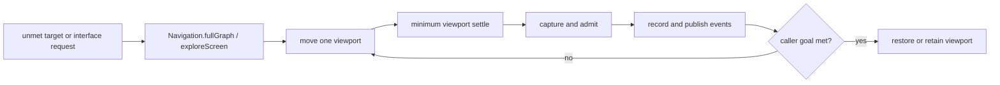

# Canonical observation migration

## Status

| Item | State |
|---|---|
| Parent branch | `alex/nightly-watchdog-correctness` |
| Fork point | `d3d5a03f3` |
| Completion branch | `alex/tick-migration-completion` |
| Phase A | Complete: transaction-shaped delivery removed |
| Phase B | Complete: one authored-order consumer; project builds |
| Parent responsibility | Finish the near-green A/B test stabilization and land |
| Completion-branch responsibility | Implement Phase C onward |
| Integration rule | Rebase onto the landed parent before final CI |

This document is the execution plan. It replaces the earlier implementation
diary and its duplicate phase lists.

## Goal

One vault operation captures accessibility truth, admits it, records one ordered
event per fact, and publishes those exact events. Settlement evaluates those
events in authored order. Results retain a bounded window from the same log.
Evidence and presentation project that window without reconstructing changes.

The migration succeeds by deleting parallel currencies and owners. It is not an
invitation to add a new observation framework beside the current one.

## Current checkpoint

**Done**

- The vault emits ordered ticks from one read.
- The stream has one settlement receiver.
- Settlement consumes one tick at a time in authored predicate order.
- Reconciliation and subscriber transaction machinery are gone.
- `TickStep` and the old diff API are gone.
- The project builds at the A/B checkpoint.

**Next**

- Make the vault log store and replay the exact emitted fact.
- Replace hash-based predicate readings with typed semantic readings.
- Make one command deadline cover baseline acquisition through terminal result.
- Replace the settlement-owned `TickLog` with a bounded window from the vault log.

**Merge boundary**

- The parent branch may land as soon as its tests pass.
- This branch does not modify the parent's stabilization tests.
- This branch rebases onto the parent's landed squash before final verification.

## Canonical flow

```mermaid
flowchart LR
    UIKit["UIKit accessibility state"] --> Capture["capture visible snapshot"]
    Capture --> Admit["Vault.Store admit"]
    Admit --> Mint["mint Observation.Event"]
    Mint --> Log["Observation.Log record"]
    Log --> Stream["Observation.Stream publish"]
    Stream --> Fold["Expectation consume one event"]
    Fold --> Decision{"terminal?"}
    Decision -->|no| Capture
    Decision -->|yes| Window["Observation.Window"]
    Window --> Result["Settlement.Result"]
    Result --> Report["canonical report projection"]
    Report --> Render["JSON / compact / human / JUnit"]
```



Exploration is a caller-requested effect around this flow:



Exploration does not sit between the facts of a screen boundary. Every page it
captures enters through the same vault operation as every other observation.

## Canonical vocabulary

The migration name `Tick` becomes the canonical `Observation.Fact`. A tick is a
fact, not a second architectural shape.

```swift
enum Observation {
    enum Fact: Codable, Sendable, Equatable {
        case elementsChanged(AccessibilityTrace.ElementsChangeFact)
        case screenChanged(ScreenFacts)
        case announcement(CapturedAnnouncement)
        case noChange
    }

    struct Event: Sendable, Equatable {
        let cursor: Cursor
        let fact: Fact
        let snapshot: SnapshotEvent?
    }

    struct Window: Codable, Sendable, Equatable {
        let baseline: AccessibilityTrace.Capture?
        let current: AccessibilityTrace.Capture?
        let facts: [Fact]
        let completeness: Completeness
    }
}
```

The exact access levels follow use:

- `Observation.Fact` and `Observation.Window` live in `TheScore` because
  predicates, durable results, replay, and evidence share them.
- Live `Store`, `Log`, and `SnapshotEvent` remain inside `TheInsideJob`.
- `Observation.Event` is the live ordered envelope. The durable window stores
  facts and admitted captures, not live UIKit state.
- `CapturedAnnouncement` remains intact. Do not reduce it to `String` and create
  a metadata side channel.

No compatibility alias for `Tick` remains after the migration. Client and server
are version-locked.

## Invariants

1. `Observation.Log` is the only retained runtime observation history.
2. The vault store is the only component that constructs observed facts.
3. An event is recorded before it is delivered.
4. Replay delivers the exact recorded event; it never derives a new fact.
5. One event causes one expectation reduction and at most one terminal decision.
6. Arrays may cross an actor boundary as transport. Their events are still
   recorded, published, and reduced individually in order. Atomic batch folding
   is forbidden.
7. Authored predicate order is law:
   - `indifferent`: continue with the next authored predicate for this event.
   - `matched`: consume it and continue with the remaining predicates.
   - `unmatched`: stop evaluating this event; later predicates cannot overtake it.
8. `.noChange` is an observed stability fact. It is not a claim that cached UI
   state can never become outdated.
9. After a tripwire or screen signal, the system never serves a known-outdated
   current tree. Historical log entries remain immutable.
10. A screen replacement emits, in order:
    - departure element transition,
    - screen appearance,
    - arrival element transition.
11. Element updates are constructible only from captures in the same screen
    generation. Screen boundaries can express disappearance and appearance, not
    cross-screen property updates.
12. Full discovery is one bounded traversal effect. It is not an observation
    fact and it is not hidden inside screen-boundary emission.
13. One command deadline covers admission, baseline capture, dispatch,
    observation, restoration, and terminal projection.
14. `Date` timestamps may be captured as evidence. Behavioral timeout decisions
    use the monotonic runtime clock and the one command deadline.
15. Results, evidence, JSON, compact output, human output, and JUnit derive from
    the same admitted result/window currency.

## Screen-boundary semantics

One admitted replacement reading produces three consecutive events:

1. `elementsChanged(departure)` removes every element from the departing tree.
2. `screenChanged(screenFacts)` records the new screen appearance.
3. `elementsChanged(arrival)` introduces every element in the arriving capture.

The events share one screen-boundary identity and preserve their own cursors.
The arrival event establishes the new current snapshot. Departure and screen
events do not pretend to carry the completed new tree.

`Navigation.fullGraph()` is deliberately absent from this sequence. If a wait
or interface request needs discovery after arrival, its command schedules one
bounded exploration. Each exploration page emits later events through the same
vault store. This prevents screen identity, scroll effects, and graph inflation
from becoming one reentrant operation.

## Cursor and generation

These values are related but not interchangeable:

- `Observation.Cursor` locates an event in one ordered log.
- `ScreenGeneration` identifies the epoch across which element property updates
  are valid.
- `SettledObservationSequence` is durable capture ordering used by the wire.

The log owns the current screen generation and advances it when it records a
screen boundary. It must not recover the generation by counting retained screen
events because the log evicts old entries. Cursor ordering must also survive
retention without renumbering.

Delete duplicate generation/sequence fields only when their semantic use is
proven identical. A mechanical rename is not admission.

## Predicate readings

`Expectation.ReadingScope` currently projects semantic truth through Swift
`Hasher` and only reads matched elements. That is not an admitted comparison
currency and it excludes container targets.

Replace it with typed, equatable readings:

```swift
enum PredicateReading: Sendable, Equatable {
    case screen(ScreenReading)
    case target(TargetMatchReading)
    case property(ElementPropertyReading)
    case announcement(CapturedAnnouncement)
    case still
}
```

`TargetMatchReading` contains canonical semantic values for both matched
elements and matched containers in deterministic order. It does not contain
UIKit object identity and is never reduced to `Int` for correctness.

Property-update declarations accept an element target. Container update
predicates remain unconstructible until containers have a real modeled property
transition. Existence, appearance, and disappearance continue to accept the
shared accessibility target language.

## Deadline ownership

The executor arms one monotonic command deadline when it admits the command.
That same value flows through baseline acquisition, action dispatch, active
settlement, viewport restoration, and result projection.

`deadlineReached` is terminal in every settlement phase, including
`awaitingBaseline` and `armed`. There is no second timer and no separate
`TheTimeout` namespace in this workstream. Existing deadline types may collapse
when doing so deletes code, but the deadline remains a value owned by the
command/executor, not a global subsystem.

## Durable result boundary

Active settlement owns:

- the current expectation accumulator,
- a starting log cursor,
- the protected retention boundary,
- command state needed for terminal classification.

It does not own a second mutable observation log.

At terminal, settlement asks `Observation.Log` for one admitted
`Observation.Window`. The window is complete only when its protected start and
terminal cursor are both present. A retention gap cannot produce `noChange` or a
successful temporal result.

The result stores this window. Replay evaluates its facts in order. Evidence
projects the facts directly. No result path reconstructs change by diffing
endpoint captures.

## Execution phases

### A. Delete delivery transactions - complete

Owners:

- `SemanticObservationStream`
- `Settlement`

Acceptance already met:

- One settlement receiver.
- No subscriber transaction or reader reconciliation path.
- No alternate delivery spelling.

### B. Consume authored order - complete

Owners:

- `TheScore/Core/Expectation.swift`
- `TheInsideJob/Settlement/Settlement+Reducer.swift`

Acceptance already met:

- One fact enters one reducer call.
- `indifferent`, `matched`, and `unmatched` preserve authored order.
- The project builds at `d3d5a03f3`.

Parent branch exit:

- Finish its current test stabilization.
- Land without taking Phase C+ changes.

### C. Make event and log canonical

Primary files:

- `TheScore/Core/Expectation.swift`
- `TheInsideJob/TheVault/SemanticObservationHistory.swift`
- `TheInsideJob/TheVault/SemanticObservationStore.swift`
- `TheInsideJob/TheVault/SemanticObservationStoreOwner.swift`
- `TheInsideJob/TheVault/SemanticObservationStream+Settlement.swift`

Work:

1. Move the `Observation` namespace and canonical `Fact` shape into `TheScore`.
2. Replace `Tick` with `Observation.Fact` without an alias.
3. Make `Observation.Log.record` accept and retain exact events.
4. Make the store mint cursor, generation, fact, and snapshot provenance.
5. Return ordered `[Observation.Event]` across the actor boundary.
6. Publish each event individually.
7. Replay the exact retained event.
8. Delete `SnapshotEvent.derivedTick`, `.read/.replayed`, and every downstream
   fact constructor.
9. Keep full discovery outside the boundary sequence.

Acceptance:

- A replacement capture records exactly departure, screen, arrival.
- Recorded order equals delivered order.
- Live delivery and replay compare equal.
- Announcements retain their full captured value.
- No production fact constructor exists outside the vault admission path.
- Build passes.

Tests added in this phase:

- same-screen changed and no-change emission,
- exact three-event screen boundary,
- announcement ordering,
- record-before-deliver,
- replay identity,
- one event per reducer pass,
- transport batches cannot be folded atomically.

Deletion gate:

- Delete the old `Tick` type.
- Delete `derivedTick`.
- Delete replay reconstruction.
- Delete obsolete event cases and delivery adapters.

### D. Admit typed predicate readings

Primary files:

- `TheScore/Core/Expectation.swift`
- `TheScore/Core/ElementPredicate+HeistElement.swift`
- predicate admission files in `ThePlans`

Work:

1. Replace `ReadingScope` hashes with `PredicateReading`.
2. Project matched elements and containers through one deterministic operation.
3. Restrict property updates to element targets in the type system.
4. Remove hash/collision-based temporal decisions.
5. Make `remaining` linear without copying `dropFirst()` arrays while preserving
   authored order.

Acceptance:

- Element and container exists/missing/appeared/disappeared use one evaluator.
- Container temporal predicates can complete.
- Property updates cannot be constructed for containers.
- Reordering equivalent matches does not invent a change.
- No Swift `Hasher` value participates in a correctness decision.
- Build and focused predicate tests pass.

Deletion gate:

- Delete `ReadingScope` and its integer hashes.
- Delete duplicated element-only reading projections.
- Delete tests that encode hash implementation details.

### E. Enforce one end-to-end deadline

Primary files:

- settlement command/executor and reducer files,
- `SemanticObservationStream+Settlement.swift`,
- viewport restoration call sites.

Work:

1. Arm the deadline at command admission.
2. Carry it through every phase.
3. Make expiry terminal before, during, and after baseline acquisition.
4. Remove phase-local timers that duplicate the command deadline.

Acceptance:

- A stalled baseline cannot exceed the authored timeout.
- One timer source produces the terminal timeout event.
- Deadline classification does not depend on main-thread wall-clock progress.
- Restoration receives the remaining command budget.
- Zero additional timeout owners are introduced.

Tests:

- expiry while awaiting baseline,
- expiry while armed,
- expiry while active,
- success before expiry cancels further work,
- timeout result retains complete observed evidence or reports a gap.

### F. Replace TickLog with Observation.Window

Primary files:

- `TheScore/Core/TickLog.swift`
- settlement state/result files,
- `SemanticObservationHistory.swift`

Work:

1. Add cursor-bounded log reads and `Observation.Window` admission.
2. Protect an active settlement boundary from eviction.
3. Store only expectation state and cursors during execution.
4. Read one terminal window.
5. Delete mutable `TickLog`.

Acceptance:

- There is one retained runtime history.
- A terminal result contains the exact ordered facts it evaluated.
- Eviction cannot silently turn an incomplete window into success/no-change.
- Consecutive no-change compaction, if retained, is a log storage policy that
  preserves predicate semantics and cursor completeness.

Tests:

- protected boundary retention,
- admitted complete window,
- explicit incomplete window after an unavoidable gap,
- terminal result and live evaluation use the same facts,
- no second mutable log.

### G. Move evidence and wire to facts

Primary files:

- `TheScore/Evidence/AccessibilityTraceDiff.swift`
- `TheScore/Evidence/AccessibilityTrace+ChangeFacts.swift`
- result Codable and public JSON projection files.

Work:

1. Persist the admitted observation window in the result contract.
2. Project element, screen, announcement, and no-change evidence from facts.
3. Evaluate stored/replayed results from the same fact sequence.
4. Remove endpoint-diff reconstruction and obsolete lineage only after the new
   wire has exact ordering and completeness admission.
5. Use one canonical Codable spelling. No adapters or old keys.

Acceptance:

- Live, stored, and replayed evaluation produce identical outcomes.
- Evidence performs no capture diff to recover already-observed facts.
- Unknown/contradictory JSON is rejected at decode.
- Parent lineage remains only if it carries contract information not present in
  the window.
- Wire fixtures cover every fact and completeness case.

Deletion gate:

- Delete `AccessibilityObservationChangeReducer`.
- Delete stored-trace tick reconstruction.
- Delete redundant `parentHash`/transition fields proven subsumed by the window.
- Delete old JSON keys and compatibility paths.

### H. Compress result and coordination projections

Primary files:

- settlement result projector,
- terminal logging,
- public result/JSON/compact renderers,
- interaction coordinator wrappers.

Work:

1. Derive one `Settlement.Report` from `Settlement.Result`.
2. Render public result, JSON, compact text, human text, and JUnit from that
   report.
3. Remove result/diagnosis currencies that contain no unique facts.
4. Remove forwarding coordinators that own no state or policy.
5. Keep exploration as a caller-visible command effect with restore/retain exit
   policy.

Acceptance:

- Outcome classification has one switch owner.
- Renderers do not reinterpret settlement.
- A type that only forwards or renames another value is deleted.
- Source delta for this phase is negative.

### I. Documentation, architecture rules, and green

Work:

1. Update architecture and wire diagrams to the final owner graph.
2. Update factual README API examples only where the shipped contract changed.
3. Add Bumper rules for source-shaped invariants that are mechanically stable:
   - no `Tick` declaration,
   - no production fact construction outside the vault,
   - no mutable settlement observation log,
   - no `Hasher` in predicate truth,
   - no downstream diff reconstruction.
4. Remove obsolete tests and documents only after replacement behavior coverage
   is present.
5. Rebase onto the landed parent branch.
6. Run canonical suites and CI on the exact rebased SHA.

Acceptance:

- `scripts/test-runner.py` canonical suites pass.
- SwiftLint, strict concurrency, Bumper, release contract, and CI pass.
- Architecture docs describe the code that shipped.
- No generated projects or simulator artifacts are committed.
- Dedicated simulators are cleaned up.
- Final production source delta across C-I is negative.

## Test ownership

Tests are added with the owner they protect, not in a final catch-all phase.

Keep:

- public/wire contract tests,
- pure expectation/reducer tests,
- adversarial ordering and retention tests,
- hosted integration tests proving UIKit capture and exploration behavior.

Delete:

- tests for removed transaction/reconciliation mechanics,
- tests for hash values or obsolete internal representations,
- duplicate fixtures that prove the same projection at multiple layers,
- compile-negative nonsense already made unconstructible by Swift.

Coverage may move down to a purer owner, but behavioral coverage may not
disappear.

## Commit and verification discipline

Each phase is one coherent commit or a small pair of owner/deletion commits.
Every phase ends with:

1. `git diff --check`
2. project build through the canonical generated workspace
3. focused owner tests
4. deletion verification with `rg`

Do not run the full hosted matrix after every line. Run it after coherent phases,
then once on the final rebased branch.

## Definition of done

The workstream is done when:

- accessibility truth has one producer, one ordered log, and one delivery path;
- settlement consumes exact recorded facts in authored order;
- temporal correctness uses typed readings, including containers;
- one deadline bounds the entire command;
- results retain an admitted observation window;
- evidence and every renderer project that result without re-diffing;
- exploration remains one bounded effect on the same capture pipeline;
- predecessor types and tests are deleted in the phase that replaces them;
- the branch is rebased onto landed A/B and exact-head CI is green.
