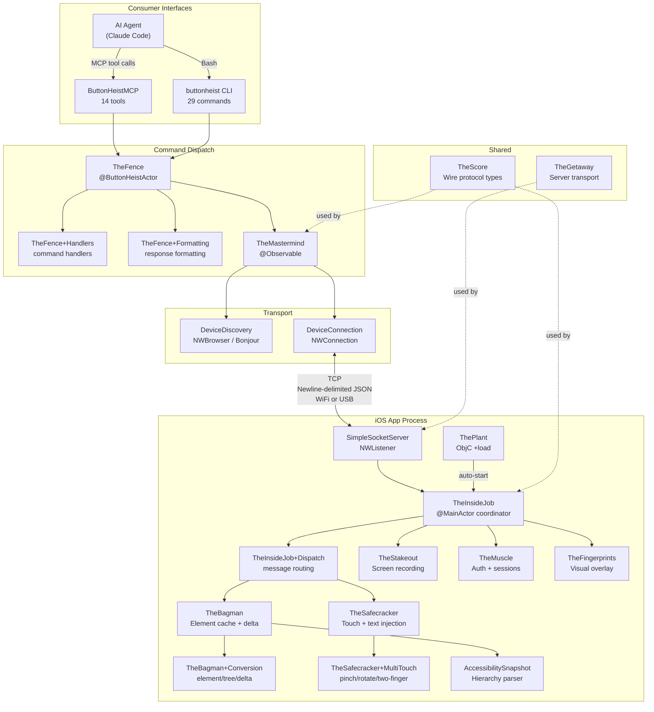

# ButtonHeist - Architecture

> Generated: 2025-03-10 | Commit: ee2a60b | Strategy: parallel-map-reduce (incremental)

## Architecture Diagram

## Architectural Patterns

| Pattern | Description |
|---------|-------------|
| **Client-Server (Distributed)** | iOS framework embeds as TCP server; macOS tooling discovers, connects, and sends commands over newline-delimited JSON. |
| **Facade / Command Dispatch** | TheFence centralizes all 29 commands. CLI and MCP are thin wrappers over TheFence.execute(). Handlers extracted to TheFence+Handlers.swift. |
| **Observer Pattern (Reactive)** | TheMastermind uses @Observable for SwiftUI. iOS server uses polling-and-broadcast for hierarchy changes. |
| **Layered Architecture** | Strict dependency direction: TheScore -> TheGetaway -> TheInsideJob / TheButtonHeist -> TheFence -> CLI/MCP. |
| **Heist Crew Metaphor** | Domain-driven naming where each component is a heist crew role with clear responsibility. |
| **Extension-Based File Organization** | Large types decomposed into focused Swift extensions using Type+Concern.swift naming. Each extension file owns a single responsibility. Keeps files under ~350 lines while preserving public API. |
| **Warnings-as-Errors Build Policy** | All SPM targets treat warnings as errors (`-warnings-as-errors`), enforcing a zero-warning policy as a build quality gate. |

## Layers

### 1. Shared Protocol Layer
- **Components**: TheScore
- **Purpose**: Cross-platform wire protocol types, message definitions, data models
- **Dependencies**: None

### 2. Transport Layer
- **Components**: TheGetaway (SimpleSocketServer, ServerTransport), DeviceConnection, DeviceDiscovery
- **Purpose**: TCP server/client networking, Bonjour discovery, connection management
- **Dependencies**: Shared Protocol Layer

### 3. iOS Server Layer
- **Components**: TheInsideJob + TheInsideJob+Dispatch, TheBagman + TheBagman+Conversion, TheSafecracker (7 files incl. +MultiTouch), TheStakeout, TheMuscle, TheFingerprints, ThePlant
- **Purpose**: In-app server for UI hierarchy capture, gesture simulation, screen recording, auth
- **Dependencies**: Shared Protocol Layer, Transport Layer, AccessibilitySnapshotParser

### 4. macOS Client Layer
- **Components**: ButtonHeist framework, TheMastermind (@Observable)
- **Purpose**: Observable client API wrapping discovery, connection, and state management
- **Dependencies**: Shared Protocol Layer, Transport Layer

### 5. Command Dispatch Layer
- **Components**: TheFence + TheFence+Handlers + TheFence+Formatting, CommandCatalog
- **Purpose**: Centralized command routing, session management, auto-reconnect
- **Dependencies**: macOS Client Layer

### 6. Consumer Interface Layer
- **Components**: ButtonHeistCLI, ButtonHeistMCP
- **Purpose**: User-facing CLI and AI agent MCP tool interfaces
- **Dependencies**: Command Dispatch Layer

## Key Interaction Flows

### Command Execution (activate element)
1. CLI/MCP calls `TheFence.execute(request:)` with command dictionary
2. TheFence auto-connects via TheMastermind if needed (discovery + TCP + auth)
3. TheFence dispatches to handler in TheFence+Handlers.swift, sends ClientMessage over TCP
4. TheInsideJob receives message, routes via TheInsideJob+Dispatch.swift (three-stage dispatch)
5. TheBagman refreshes accessibility data, TheSafecracker executes action
6. TheInsideJob computes interface delta via TheBagman+Conversion and returns ActionResult
7. Response propagates back: TCP -> TheMastermind -> TheFence -> TheFence+Formatting -> CLI/MCP

### Device Discovery
1. TheInsideJob starts SimpleSocketServer on OS-assigned port
2. TheInsideJob publishes Bonjour service (`_buttonheist._tcp`) with TXT record
3. TheMastermind starts NWBrowser for `_buttonheist._tcp`
4. NWBrowser discovers service, extracts TXT record metadata
5. Device added to discoveredDevices array

### Authentication
1. TCP connection established
2. Server sends `authRequired` challenge
3. Client sends `authenticate(token)` or `watch(token)`
4. TheMuscle validates token or presents UI approval dialog
5. On success: server sends `info(ServerInfo)`, client subscribes
6. On failure: server sends `authFailed`, disconnects after 100ms

### Interface Polling & Broadcasting
1. Polling timer fires (default 1.0s interval)
2. TheBagman parses accessibility hierarchy via elementVisitor
3. Elements flattened via TheBagman+Conversion and hashed
4. If hash changed: broadcast interface + screen to all subscribed clients
5. Debounced by 300ms for UI notification coalescing

### Touch Dispatch Pipeline
1. TheInsideJob+Dispatch receives ClientMessage
2. Routes through dispatchAccessibilityInteraction, dispatchTouchInteraction, or dispatchTextAndScrollInteraction
3. Each dispatcher delegates to TheSafecracker methods
4. Multi-touch gestures (pinch, rotate, two-finger tap) handled by TheSafecracker+MultiTouch

## Data Flow

### State Management
- **Strategy**: In-memory state with network synchronization
- **iOS**: TheInsideJob singleton holds element cache (TheBagman), auth state (TheMuscle), recording state (TheStakeout)
- **macOS**: TheMastermind (@Observable) holds client-side state
- **Lifecycle**: Server state = app process lifetime; client state = connection duration; session locks released after 30s timeout

### Data Pipelines

| Pipeline | Input | Processing | Output |
|----------|-------|-----------|--------|
| UI Element Extraction | Live view hierarchy | AccessibilityHierarchyParser -> elementVisitor -> TheBagman+Conversion -> flatten -> hash | Interface (JSON) broadcast |
| Screen Capture | Window hierarchy | drawHierarchy -> PNG -> base64 | ScreenPayload broadcast |
| Action Execution | ClientMessage + target | TheInsideJob+Dispatch routes -> TheSafecracker executes -> TheBagman+Conversion.computeDelta | ActionResult with InterfaceDelta |
| Response Formatting | FenceResponse enum | TheFence+Formatting: humanFormatted() or jsonDict() | Text or JSON for CLI/MCP |
| Screen Recording | startRecording config | Frame capture loop -> AVAssetWriter H.264 -> interaction log | RecordingPayload (base64 MP4) |

## Technology Stack

| Category | Technologies |
|----------|-------------|
| **Languages** | Swift 6.0 (strict concurrency), Objective-C (ThePlant, touch synthesis) |
| **Platforms** | iOS 17.0+, macOS 14.0 |
| **Build Tools** | Tuist (Xcode project gen), SPM (CLI, MCP), SwiftLint |
| **Build Policy** | `-warnings-as-errors` on all SPM targets (zero-warning gate) |
| **Networking** | Network.framework (TCP, Bonjour), custom wire protocol v4.0 (NDJSON) |
| **Media** | AVFoundation (AVAssetWriter for H.264/MP4), UIGraphicsImageRenderer (screenshots) |
| **Touch** | IOKit (HID events via private API), UIKeyboardImpl (text input) |
| **Concurrency** | @MainActor (iOS), @ButtonHeistActor (macOS), async/await, GCD (socket I/O) |
| **Protocols** | Custom wire protocol v4.0, Bonjour/mDNS, MCP (Model Context Protocol) |

## Deployment Model

- **Type**: Local development tooling (framework + CLI + MCP server)
- **iOS**: Embed TheInsideJob framework in target app (auto-starts via ObjC +load, DEBUG only)
- **macOS CLI**: Build with `cd ButtonHeistCLI && swift build -c release`
- **macOS MCP**: Build with `cd ButtonHeistMCP && swift build -c release`, configure `.mcp.json`
- **Distribution**: Source code with Tuist project generation
- **Versioning**: SemVer via `scripts/release.sh` (updates 5 version references)

## External Integrations

| Integration | Type | Details |
|------------|------|---------|
| AccessibilitySnapshot | Git submodule (fork) | Hierarchy parsing with elementVisitor closure + Hashable |
| Apple Network Framework | System | NWListener, NWConnection, NWBrowser for TCP + Bonjour |
| AVFoundation | System | AVAssetWriter for H.264/MP4 screen recording |
| IOKit (Private) | System (dlsym) | Multi-finger HID event creation for touch synthesis |
| MCP Swift SDK | SPM (0.11.0+) | Model Context Protocol server for AI agent tools |
| Swift Argument Parser | SPM (1.3.0+) | CLI command/option parsing |
| Tuist | Build tooling | Xcode project generation and dependency management |
