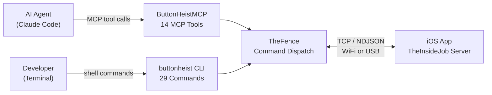
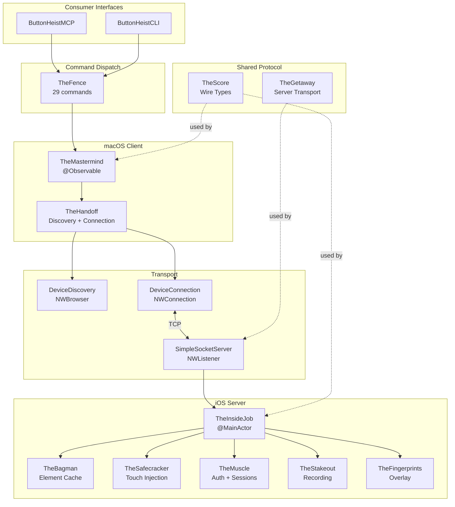
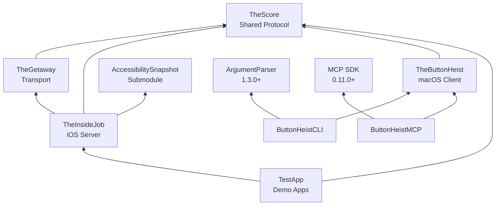
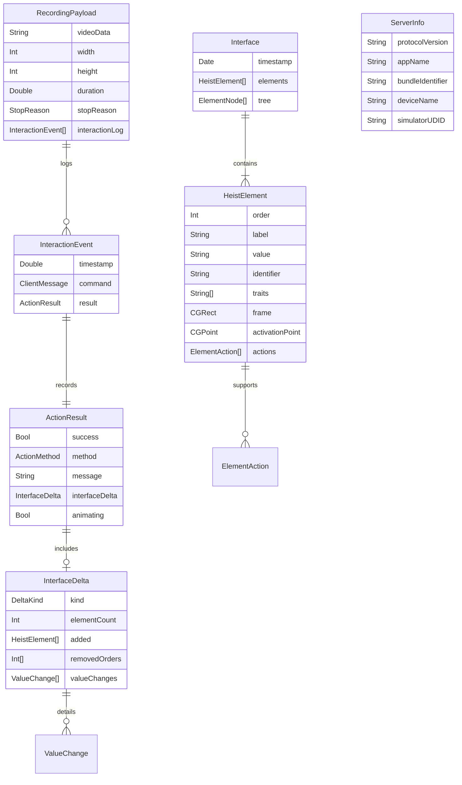
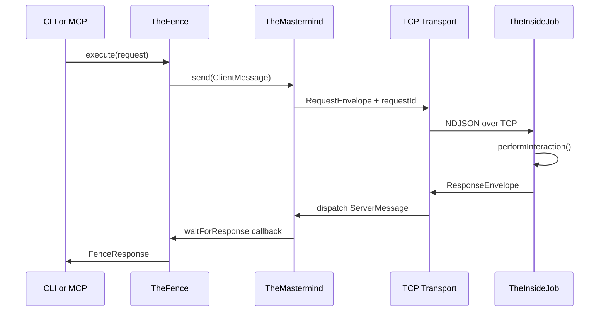
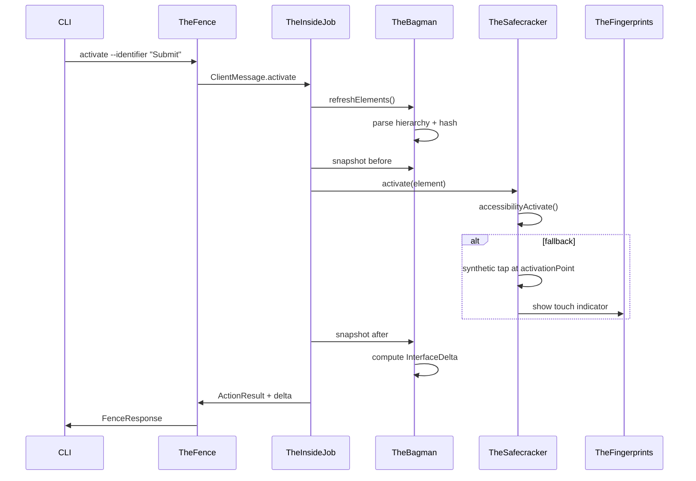
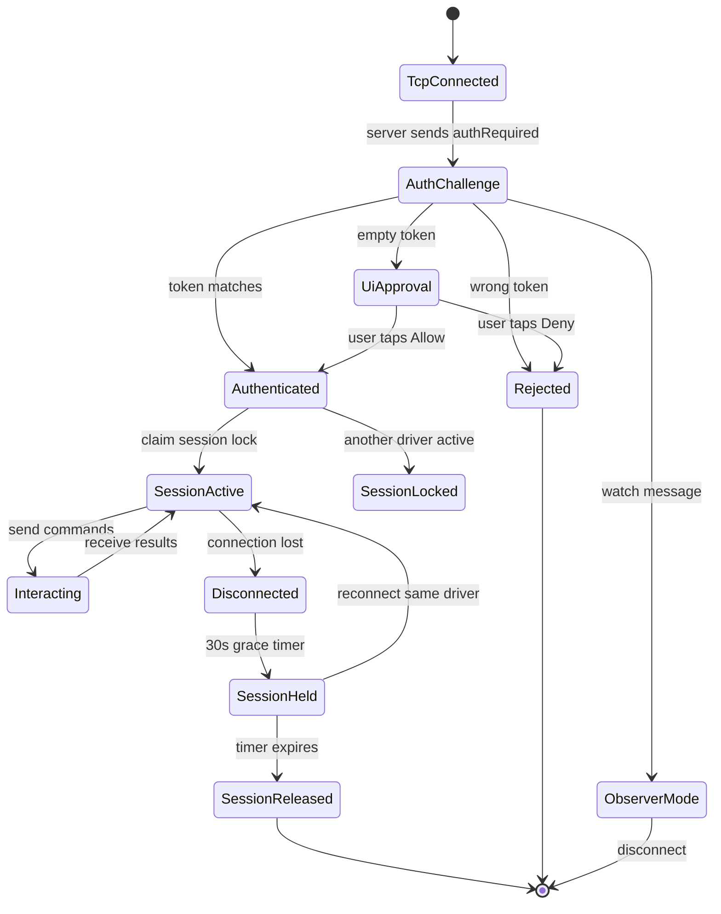
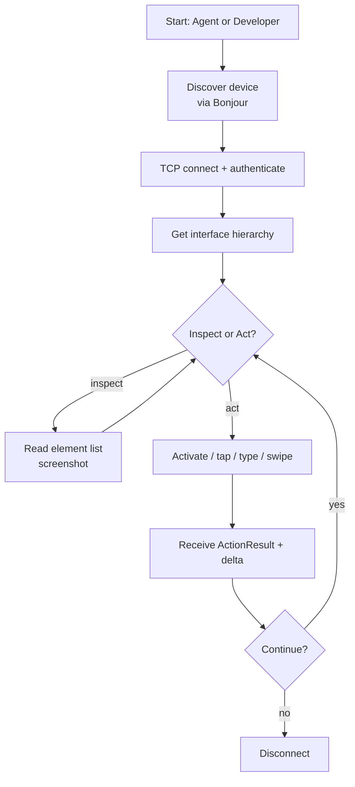
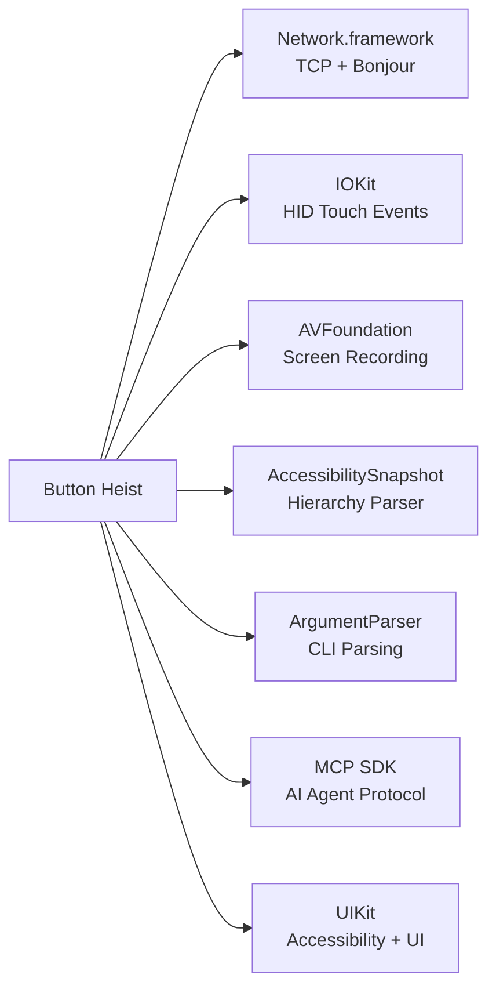

# Button Heist -- Bird's-Eye View

> Generated: 2026-03-10 | Commit: 1693db0 | Branch: RoyalPineapple/tallinn-v1

## 1) Summary

Button Heist gives AI agents and humans full programmatic control over iOS apps by embedding a TCP server framework (TheInsideJob) inside the target app and connecting from macOS via an MCP server or CLI. It exposes the accessibility hierarchy, executes gestures via synthetic touch injection, captures screenshots and screen recordings, and returns compact UI diffs after every interaction -- enabling fully automated, agent-driven iOS testing and exploration.

- Domain: `iOS UI Automation` | Tech stack: `Swift 6.0 (strict concurrency), Obj-C, iOS 17.0+, macOS 14.0` | Repos: `RoyalPineapple/TheButtonHeist`
- Wire protocol: `Newline-delimited JSON over TCP v4.0` | Discovery: `Bonjour (_buttonheist._tcp)` | Build: `Tuist + SPM`
- Version: `0.0.1` | License: `Apache 2.0`

## 2) System Context

Button Heist operates as a client-server system where the iOS app hosts a TCP server discovered via Bonjour, and macOS tooling (CLI or MCP server) connects to send commands and receive UI state. AI agents interact through the MCP server's 14 tools, while humans use the CLI's 29 commands -- both dispatch through a single command facade (`TheFence`).

## 3) Architecture Overview (components and layers)

The system is layered into six tiers: a shared protocol layer (TheScore), a transport layer (TheGetaway), an iOS server layer (TheInsideJob and crew), a macOS client layer (TheMastermind), a command dispatch layer (TheFence), and consumer interfaces (CLI/MCP). All component names follow a heist crew metaphor where each member has a single, well-defined responsibility.

## 4) Module and Package Relationships

The project comprises 8 modules with a strict, acyclic dependency graph. TheScore sits at the foundation with zero dependencies, TheGetaway adds transport on top of it, and the iOS and macOS sides branch from there. CLI and MCP are thin wrappers that depend only on TheButtonHeist (which re-exports TheScore).

- `TheScore` (4 files, 1107 LOC) -- shared wire protocol, no dependencies
- `TheGetaway` (2 files, 565 LOC) -- TCP server + Bonjour, imports TheScore
- `TheInsideJob` (16 files, 4324 LOC) -- iOS server, imports TheScore + TheGetaway + AccessibilitySnapshotParser
- `TheButtonHeist` (10 files, 2609 LOC) -- macOS client, @_exported import TheScore
- `ButtonHeistCLI` (21 files, 1925 LOC) -- CLI, imports TheButtonHeist + ArgumentParser
- `ButtonHeistMCP` (2 files, 454 LOC) -- MCP server, imports TheButtonHeist + MCP SDK

## 5) Data Model (key entities)

The wire protocol centers on `HeistElement` as the atomic UI element representation, grouped into an `Interface` snapshot with optional tree structure. Actions produce `ActionResult` with an `InterfaceDelta` diff, and recordings bundle an `InteractionEvent` log with the video payload. All types are `Codable + Sendable`.

## 6) API Surface (public endpoints to owning components)

The system exposes two consumer interfaces: a CLI with 29 commands and an MCP server with 14 tools. Both dispatch through `TheFence.execute(request:)` which routes to the appropriate handler. The wire protocol defines 29 `ClientMessage` cases (client-to-server) and 15 `ServerMessage` cases (server-to-client).

- `activate --identifier ID` | `activate` MCP tool --> TheFence --> `ClientMessage.activate(ActionTarget)`
- `type --text "hello"` | `type_text` MCP tool --> TheFence --> `ClientMessage.typeText(TypeTextTarget)`
- `screenshot` | `get_screen` MCP tool --> TheFence --> `ClientMessage.requestScreen`
- `list` | `get_interface` MCP tool --> TheFence --> `ClientMessage.requestInterface`
- `session` (CLI only) --> TheFence --> auto-connect + REPL loop

## 7) End-to-End Data Flow (hot path)

The hot path is the "activate element" flow: the client sends an activation command, TheInsideJob refreshes the accessibility hierarchy, resolves the target element, takes a before snapshot, executes the action (trying `accessibilityActivate()` first, falling back to synthetic tap), waits briefly for animations, takes an after snapshot, computes an `InterfaceDelta`, and returns the `ActionResult`. This performInteraction pipeline is shared by all action commands.

## 8) State Model (session lifecycle)

Each TCP connection progresses through authentication, session locking, active interaction, and eventual disconnection. The session lock enforces single-driver exclusivity -- only one driver identity controls the app at a time. Observers bypass the session lock and receive read-only broadcasts. Sessions auto-release after 30 seconds of inactivity post-disconnect.

## 9) User Flows (top 2 tasks)

The two most common workflows are (1) an AI agent using MCP tools to explore and interact with an iOS app, and (2) a developer using the CLI for rapid iteration during development. Both follow the same pattern: discover device via Bonjour, authenticate, get the UI hierarchy, perform actions, and inspect results through deltas.

## 10) Key Components and Responsibilities

The system has 12 named components ("crew members"), each with a single focused responsibility. The heist metaphor maps naturally to the domain: TheInsideJob is the operative embedded inside the app, TheFence is the dealer who routes stolen goods (commands), TheMastermind plans the operation from outside.

- `TheScore` -- wire protocol types: 29 client messages, 15 server messages, `HeistElement`, `Interface`, `InterfaceDelta`, `ActionResult`
- `TheInsideJob` -- iOS server singleton (@MainActor): TCP server, Bonjour, command routing, performInteraction pipeline, app lifecycle
- `TheSafecracker` -- synthetic touch engine: IOKit HID events for tap, swipe, drag, pinch, rotate, draw-path; text input via UIKeyboardImpl
- `TheBagman` -- element cache and UI observer: accessibility hierarchy parsing, weak NSObject refs, delta computation, screenshot capture
- `TheMuscle` -- auth and session management: token validation, UI approval dialog, session lock (one driver, 30s timeout), observer tracking
- `TheStakeout` -- screen recording: H.264/MP4 via AVAssetWriter, configurable FPS/scale, inactivity timeout, interaction event log
- `TheFingerprints` -- visual touch overlay: translucent circles on a passthrough window for debugging touch locations
- `ThePlant` -- ObjC +load hook that auto-starts TheInsideJob in DEBUG builds before Swift code runs
- `TheMastermind` -- macOS observable coordinator: @Observable state, async `waitForResponse<T>`, requestId correlation
- `TheFence` -- command dispatch facade: routes 29 commands, auto-discovery/connection/reconnect, `sendAndAwait<T>` pattern
- `TheHandoff` -- connection lifecycle: Bonjour discovery, TCP connect, keepalive (ping 3s), auto-reconnect (60 attempts at 1s)
- `TheGetaway` -- TCP transport: `SimpleSocketServer` (NWListener, max 5 connections, 30 msg/s rate limit, 10MB buffer, NDJSON framing)

## 11) Integrations and External Systems

Button Heist integrates with Apple system frameworks for networking, touch synthesis, and media capture, plus two SPM dependencies for CLI parsing and MCP protocol support. The AccessibilitySnapshot submodule (forked from cashapp) provides the core hierarchy parsing capability. All external integrations are system-level or build-time; there are no cloud services or external APIs.

- `Network.framework` -- NWListener (TCP server), NWConnection (TCP client), NWBrowser (Bonjour discovery)
- `IOKit` (private) -- HID event synthesis via dlsym for multi-finger touch injection
- `AVFoundation` -- AVAssetWriter for H.264/MP4 screen recording
- `AccessibilitySnapshot` -- forked submodule (RoyalPineapple/AccessibilitySnapshot, buttonheist branch) for accessibility hierarchy parsing
- `swift-argument-parser 1.3.0+` -- CLI command and option parsing
- `MCP swift-sdk 0.11.0+` -- Model Context Protocol server for AI agent tool integration

## 12) Assumptions and Gaps

This overview is generated from the project knowledge base, source code, and documentation. The core architecture, data model, and interaction flows are well-documented. A few areas remain underspecified or would benefit from deeper investigation.

- TBD: `Exact error recovery behavior when IOKit dlsym fails on physical devices vs. simulator`
- TBD: `Full list of Info.plist configuration keys and their interaction with environment variable overrides`
- TBD: `Performance characteristics under load (max elements in hierarchy, recording memory pressure)`
- Next reads: `ButtonHeist/Sources/TheInsideJob/TheInsideJob.swift` (command routing), `ButtonHeist/Sources/TheButtonHeist/TheFence.swift` (dispatch logic)
- Next reads: `docs/AUTH.md` (full auth flow details), `docs/dossiers/` (per-component design rationale)
- Risks to verify: `Session lock race conditions with multiple rapid connect/disconnect cycles`
- Risks to verify: `AccessibilitySnapshot submodule compatibility when upstream cashapp/AccessibilitySnapshot updates`
