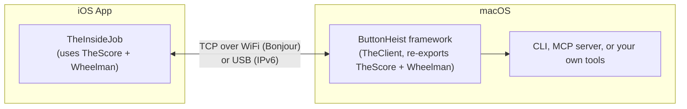

# ButtonHeist Frameworks

The core frameworks that power ButtonHeist. Four modules spanning iOS and macOS — from shared wire types to synthetic multi-touch injection.

## Modules

| Module | Platform | What It Does |
|--------|----------|-------------|
| **TheScore** (shared types) | iOS + macOS | Wire protocol messages, UI element models, constants |
| **TheInsideJob** (iOS server) | iOS | Embeds in your app. Parses accessibility hierarchy, executes gestures, serves it all over TCP |
| **Wheelman** (networking) | iOS + macOS | TCP server/client, Bonjour discovery, BSD socket transport |
| **ButtonHeist** (macOS client) | macOS | `TheClient` class for macOS consumers. Re-exports TheScore + Wheelman |

## How They Connect



---

## TheScore — Shared Types

**Location**: `Sources/TheScore/`

The cross-platform type library. No UIKit or AppKit imports — just pure `Codable` + `Sendable` types.

- **`Messages.swift`** — All wire protocol types:
  - `ClientMessage` (22 cases — auth, interface queries, gestures, text, screen capture)
  - `ServerMessage` (8 cases — auth challenge, info, interface, action results, screen, errors)
  - Target structs: `ActionTarget`, `TouchTapTarget`, `SwipeTarget`, `PinchTarget`, `DrawBezierTarget`, etc.
  - Response types: `ServerInfo`, `Interface`, `HeistElement`, `ActionResult`, `InterfaceDelta`, `ScreenPayload`
  - Constants: `buttonHeistServiceType` (`"_buttonheist._tcp"`), `protocolVersion` (`"3.1"`)
## TheInsideJob — iOS Server

**Location**: `Sources/TheInsideJob/`

The server that runs inside the iOS app. A `@MainActor` singleton that auto-starts, parses the accessibility tree, and handles remote commands.

| File | What It Does |
|------|-------------|
| `TheInsideJob.swift` | Main server singleton. Starts TCP server, advertises via Bonjour, polls for UI changes, dispatches all client messages |
| `TheSafecracker.swift` | Gesture simulation engine — tap, long press, swipe, drag, pinch, rotate, two-finger tap, draw path. Also handles text input via UIKeyboardImpl |
| `SyntheticTouchFactory.swift` | Creates `UITouch` instances by calling private UIKit methods via direct IMP invocation |
| `SyntheticEventFactory.swift` | Creates fresh `UIEvent` objects per touch phase (iOS 26 compatible) |
| `IOHIDEventBuilder.swift` | Low-level IOKit HID event creation via `dlsym`-loaded C function pointers |
| `Fingerprints.swift` | Visual interaction feedback — fingerprint circles for taps and continuous gesture tracking (multi-finger) |
| `BezierSampler.swift` | Converts cubic bezier curves into polyline point arrays for the `touchDrawBezier` command |

### Auto-Start

TheInsideJob starts automatically when the framework loads — no code changes needed in your app.

1. **`ThePlantAutoStart.m`** (in `Sources/ThePlant/`) implements ObjC `+load`
2. `+load` dispatches to the main queue and calls `TheInsideJob_autoStartFromLoad()`
3. That function reads config from environment variables (highest priority) or Info.plist
4. Creates the server on the configured port, starts Bonjour advertisement, begins polling

Only active in `#if DEBUG` builds — never ships in production.

### Configuration

| Env Var | Info.plist Key | Default | Description |
|---------|----------------|---------|-------------|
| `INSIDEJOB_TOKEN` | `InsideJobToken` | Auto-generated UUID | Auth token for client connections |
| `INSIDEJOB_ID` | `InsideJobInstanceId` | Short UUID prefix | Human-readable instance identifier |
| `INSIDEJOB_POLLING_INTERVAL` | `InsideJobPollingInterval` | `1.0` | UI change polling interval (min 0.5s) |
| `INSIDEJOB_DISABLE` | `InsideJobDisableAutoStart` | Not set | Set to `true` to prevent auto-start |

### TheSafecracker — Touch Injection Pipeline

TheSafecracker synthesizes touch events through a 4-layer stack:

```
TheSafecracker (gesture logic — timing, interpolation, multi-finger coordination)
    ↓
SyntheticTouchFactory (UITouch creation via private API IMP invocation)
    ↓
IOHIDEventBuilder (IOKit HID events via dlsym — hand + per-finger child events)
    ↓
SyntheticEventFactory (fresh UIEvent per phase) → UIApplication.sendEvent()
```

Private APIs are called via `method(for:)` + `unsafeBitCast` to `@convention(c)` typed function pointers. This avoids `perform(_:with:)` which corrupts non-object parameter types (Int, Bool, Double, raw pointers).

Text input uses `UIKeyboardImpl.activeInstance` → `addInputString:` per character — the same approach as the KIF testing framework.

## Wheelman — Networking

**Location**: `Sources/Wheelman/`

Cross-platform networking used by both iOS (server-side) and macOS (client-side).

| File | What It Does |
|------|-------------|
| `SimpleSocketServer.swift` | TCP server (Network framework). IPv6 dual-stack, auth tracking, rate limiting (30 msg/sec), 5 max connections, 10 MB buffer limit |
| `DeviceConnection.swift` | TCP client. Connects to a `DiscoveredDevice`, handles auth handshake automatically |
| `DeviceDiscovery.swift` | Bonjour browser (`NWBrowser`). Discovers `_buttonheist._tcp` services, extracts TXT record metadata |
| `DiscoveredDevice.swift` | Device model — name, endpoint, shortId, simulatorUDID, vendorIdentifier. Supports flexible filter matching |

## ButtonHeist — macOS Client

**Location**: `Sources/ButtonHeist/`

Single-import macOS framework. `import ButtonHeist` gives you `TheClient` plus all types from TheScore and Wheelman.

| File | What It Does |
|------|-------------|
| `TheClient.swift` | `@Observable @MainActor` client. Discovery, connection, sending commands, receiving results. Three API styles: reactive (SwiftUI), callbacks, async/await |
| `Exports.swift` | `@_exported import TheScore` + `@_exported import Wheelman` |

## Further Reading

- [Architecture](../docs/ARCHITECTURE.md) — Full system design with data flow diagrams
- [API Reference](../docs/API.md) — Complete API documentation for all modules
- [Wire Protocol](../docs/WIRE-PROTOCOL.md) — Protocol v3.1 message format specification
- [Project Overview](../README.md) — Quick start and getting connected
