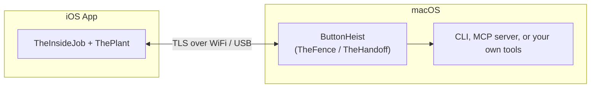

# ButtonHeist Frameworks

The crew behind the crew. These are the libraries that do the real work once the plan leaves the whiteboard.

## Public Modules

| Module | Platform | Purpose |
|--------|----------|---------|
| `TheScore` | iOS + macOS | Shared protocol types, messages, and constants |
| `TheInsideJob` | iOS | Embedded server, gesture injection, screen capture, TLS transport |
| `ButtonHeist` | macOS | Client framework exposing `TheFence` (command dispatch + request correlation) and `TheHandoff` (connection stack + state) |

`ThePlant` ships alongside `TheInsideJob` and handles the quiet entry: ObjC `+load` lights things up before your app code starts asking questions.

## How They Connect



---

## TheScore

Location: `Sources/TheScore/`

`TheScore` is the paper trail. It keeps both sides of the operation speaking the same language — no UIKit, no AppKit, just pure `Codable` + `Sendable` types that cross the wire cleanly.

- **`ClientMessage`** — 31 cases: auth, interface queries, gestures, text, screen capture, recording, watch, batch, session state
- **`ServerMessage`** — 18 cases: auth challenge/approved/failed, info, interface, action results, screen, recording lifecycle, interaction events, session status, protocol mismatch
- **Envelopes** — `RequestEnvelope` (client → server, optional `requestId`) and `ResponseEnvelope` (server → client, echoes `requestId`)
- **Wire format** — Newline-delimited JSON (`0x0A` separator)
- **Constants** — `buttonHeistServiceType` (`"_buttonheist._tcp"`), `protocolVersion` (`"6.1"`)

Key supporting types: `ActionTarget`, `TouchTapTarget`, `SwipeTarget`, `PinchTarget`, `DrawBezierTarget`, `Interface`, `HeistElement`, `ActionResult`, `InterfaceDelta`, `ScreenPayload`, `RecordingPayload`.

## TheInsideJob

Location: `Sources/TheInsideJob/`

`TheInsideJob` is the operative on the inside. A `@MainActor` singleton that auto-starts, parses the accessibility tree, and handles remote commands.

| File | What It Does |
|------|-------------|
| `TheInsideJob.swift` | Main server singleton. TLS server, Bonjour, lifecycle management, hierarchy debounce (300ms), polling |
| `TheInsideJob+Dispatch.swift` | Routes incoming `ClientMessage` cases to TheSafecracker and other handlers |
| `TheMuscle.swift` | Auth and session manager. Token resolution, per-connection state machine, session lock, watcher tracking, inactivity release timer |
| `TheStash.swift` | Element cache. Hierarchy parser, element lookup, animation detection (`layerTreeHasAnimations`), delta computation, screen capture |
| `TheStakeout.swift` | Screen recording engine. `AVAssetWriter` H.264/MP4, configurable fps (1–15), scale (0.25–1.0), inactivity timeout, max duration, 7MB file cap |
| `TheFingerprints.swift` | Visual touch indicators. Passthrough window at `.statusBar + 100`, 40pt semi-transparent white circles, multi-finger tracking |
| `ServerTransport.swift` | TLS listener + Bonjour advertisement. Builds TXT record with `simudid`, `installationid`, `instanceid`, `certfp`, `sessionactive`, etc. |
| `TLSIdentity.swift` | Runtime-generated self-signed ECDSA (P-256) certificate with Keychain persistence and SHA-256 fingerprint |
| `TheSafecracker/*.swift` | Touch injection engine — see pipeline below |

### Auto-Start

TheInsideJob starts automatically when the framework loads — no code changes needed in your app.

1. **`ThePlant/ThePlantAutoStart.m`** implements ObjC `+load`
2. `+load` dispatches to the main queue and calls `TheInsideJob_autoStartFromLoad()`
3. That function reads config from environment variables (highest priority) or Info.plist
4. Creates the server, starts Bonjour advertisement, begins polling

Only active in DEBUG builds — never ships in production.

### Configuration

| Env Var | Info.plist Key | Default | Description |
|---------|----------------|---------|-------------|
| `INSIDEJOB_TOKEN` | `InsideJobToken` | Auto-generated UUID | Auth token for client connections |
| `INSIDEJOB_ID` | `InsideJobInstanceId` | Short UUID prefix | Human-readable instance identifier |
| `INSIDEJOB_POLLING_INTERVAL` | `InsideJobPollingInterval` | `1.0` | UI change polling interval (min 0.5s) |
| `INSIDEJOB_DISABLE` | `InsideJobDisableAutoStart` | Not set | Set to `true` to prevent auto-start |
| `INSIDEJOB_SCOPE` | — | simulator + USB | Connection scope filter (comma-separated) |
| `INSIDEJOB_SESSION_TIMEOUT` | — | `30.0` | Session lock inactivity timeout (min 1.0s) |
| `INSIDEJOB_RESTRICT_WATCHERS` | `InsideJobRestrictWatchers` | `true` | Require token for watch connections |
| `INSIDEJOB_DISABLE_FINGERPRINTS` | `InsideJobDisableFingerprints` | `false` | Disable on-screen touch indicators |

### TheSafecracker — Touch Injection Pipeline

TheSafecracker cracks the UI. It synthesizes touch events through a 4-layer stack:

```
TheSafecracker (gesture logic — timing, interpolation, multi-finger coordination)
    ↓
SyntheticTouchFactory (UITouch creation via private API IMP invocation)
    ↓
IOHIDEventBuilder (IOKit HID events via dlsym — hand + per-finger child events)
    ↓
SyntheticEventFactory (fresh UIEvent per phase) → UIApplication.sendEvent()
```

Non-object parameter types (Int, Bool, Double, raw pointers) are called via `method(for:)` + `unsafeBitCast` to `@convention(c)` typed function pointers, avoiding `perform(_:with:)` which corrupts those types. Object-typed arguments use the standard `perform(_:with:)` path.

Text input uses `UIKeyboardImpl.activeInstance` → `addInputString:` per character — the same approach as the KIF testing framework.

The `activate` command is accessibility-first: it tries `accessibilityActivate()` on the live `NSObject` and only falls back to synthetic tap if that returns `false`.

### Networking

- Connection scope filtering: rejects connections at `.ready` using typed host classification (loopback = simulator, `anpi` interface = USB, other = network). Controlled by `INSIDEJOB_SCOPE`.
- Max 5 concurrent connections, 30 messages/second rate limit, 10 MB buffer limit
- Token-based authentication with session locking, envelope correlation, watch mode, and TLS transport metadata (v6.1)

## ButtonHeist

Location: `Sources/TheButtonHeist/`

`import ButtonHeist` gives the outside crew their line back into the target:

- `TheFence` for command dispatch, request-response correlation, and async wait methods — used by CLI and MCP server
- `TheHandoff` for device discovery, connection lifecycle, session state, and message routing
- `TheScore` types via `@_exported import TheScore`

| Path | Purpose |
|------|---------|
| `TheFence.swift` | Command dispatch, request-response correlation, async waits. 35 commands via `TheFence.Command` enum |
| `TheHandoff/TheHandoff.swift` | Client-side session manager. Injectable discovery/connection closures, persistent driver ID, keepalive pings, auto-reconnect (60 attempts at 1s) |
| `TheHandoff/DeviceDiscovery.swift` | `NWBrowser`-based Bonjour browsing with deduplication registry and periodic reachability validation |
| `TheHandoff/USBDeviceDiscovery.swift` | USB tunnel discovery via `xcrun devicectl` + `lsof` for CoreDevice IPv6 addresses |
| `TheHandoff/DeviceConnection.swift` | TLS-only client (TLS 1.3 minimum) with SHA-256 fingerprint verification via `sec_protocol_verify_block`. Newline-delimited JSON, 10MB buffer limit |
| `TheHandoff/DiscoveredDevice.swift` | Device metadata, flexible filter matching, parallel reachability probing (default 1.5s timeout) |
| `TheHandoff/DeviceProtocols.swift` | `DeviceConnecting` and `DeviceDiscovering` protocols — the mock boundary for unit tests |
| `Exports.swift` | `@_exported import TheScore` |

## See Also

- [Project Overview](../README.md)
- [Architecture](../docs/ARCHITECTURE.md) — Full system design with data flow diagrams
- [API Reference](../docs/API.md) — Complete API documentation for all modules
- [Wire Protocol](../docs/WIRE-PROTOCOL.md) — Protocol v6.1 message format specification
