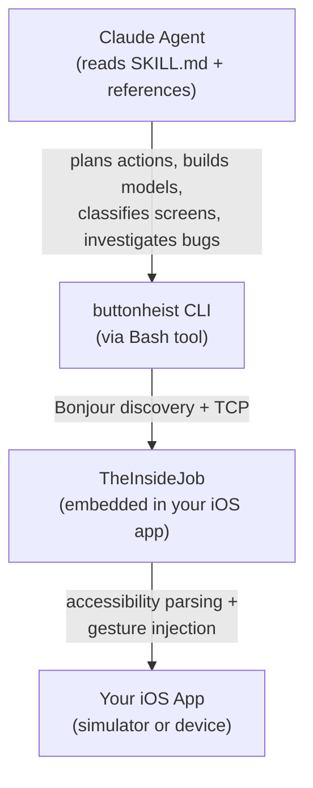

# AI Fuzzer

A fully autonomous iOS app fuzzer — built entirely with prompt engineering on top of [Button Heist](../README.md).

There is no traditional code here. No Swift, no Python, no scripts. The entire fuzzer is **6,000+ lines of markdown** that teach a Claude agent how to systematically explore iOS apps, discover bugs, and report findings. The infrastructure — gesture injection, accessibility parsing, screen recording — comes from Button Heist. The intelligence comes from prompts.

This is a demonstration of what you can build when AI agents have reliable, programmatic control over iOS apps.

## What Makes This Different

Traditional fuzzers are compiled programs that generate random inputs. This fuzzer is an AI agent that **reasons about what it sees**.

It reads the accessibility hierarchy, classifies a screen as a form or a list or a settings page, builds a behavioral model ("tapping Add should increment the count from 3 to 4 and clear the text field"), executes the action, and checks if reality matches the prediction. When it doesn't, the agent investigates — reproducing the issue, varying the input, scoping the impact. That's not something you can write as a for-loop.

The prompt engineering handles:
- **Screen intent recognition** — identifying what a screen *is* (form, list, settings, navigation hub) and testing it accordingly
- **Behavioral modeling** — building testable hypotheses about how the UI should behave, then validating them
- **Investigation workflows** — when something unexpected happens, probing deeper instead of just logging it
- **Cross-session knowledge** — accumulating a persistent knowledge base of app behavior, coverage gaps, and known issues
- **Strategy selection** — choosing between six exploration strategies based on what's already been tested
- **Opus/Haiku delegation** — splitting planning (Opus) from mechanical execution (Haiku) to manage context limits

Button Heist provides the hands. The prompts provide the brain.

## The Anatomy of a Prompt-Engineered Fuzzer

```
ai-fuzzer/
├── SKILL.md                        # Core agent specification (561 lines)
│                                    # The predict-validate-investigate loop,
│                                    # behavioral modeling, navigation, coverage
│
├── commands/                        # Slash commands — each is a complete workflow
│   ├── fuzz.md                      # /fuzz — autonomous exploration loop
│   ├── fuzz-explore.md              # /fuzz-explore — single-screen deep dive
│   ├── fuzz-validate.md             # /fuzz-validate — targeted feature testing
│   ├── fuzz-map-screens.md          # /fuzz-map-screens — navigation graph builder
│   ├── fuzz-stress-test.md          # /fuzz-stress-test — rapid-fire stability testing
│   ├── fuzz-report.md               # /fuzz-report — structured findings report
│   ├── fuzz-reproduce.md            # /fuzz-reproduce — crash replay
│   └── fuzz-demo.md                 # /fuzz-demo — record demo videos of findings
│
├── references/                      # On-demand knowledge — loaded when needed
│   ├── screen-intent.md             # 9 screen categories with test playbooks
│   ├── interesting-values.md        # Context-aware adversarial inputs by field type
│   ├── action-patterns.md           # Composable interaction sequences
│   ├── execution-protocol.md        # Opus↔Haiku delegation format
│   ├── session-notes-format.md      # External memory format (survives compaction)
│   ├── app-knowledge.md             # Persistent cross-session knowledge base
│   ├── nav-graph.md                 # Cross-session navigation map
│   ├── navigation-planning.md       # BFS route planning through the app
│   ├── trace-format.md              # Action trace format for deterministic replay
│   ├── recording-guide.md           # Screen recording workflow
│   ├── troubleshooting.md           # Error recovery procedures
│   ├── simulator-lifecycle.md       # Simulator management
│   ├── simulator-snapshots.md       # Snapshot-based testing
│   ├── examples.md                  # Annotated CLI response examples
│   └── strategies/                  # Exploration strategies
│       ├── systematic-traversal.md  # Breadth-first, every element (default)
│       ├── boundary-testing.md      # Edge coordinates, extreme values
│       ├── gesture-fuzzing.md       # Unexpected gestures on elements
│       ├── state-exploration.md     # Deep navigation, dead ends, state leaks
│       ├── swarm-testing.md         # Randomly restrict action types per session
│       └── invariant-testing.md     # Verify 6 observable behavioral invariants
│
└── .fuzzer-data/                    # Runtime data (gitignored)
    ├── sessions/                    # Per-session notes and traces
    └── reports/                     # Generated findings reports
```

Every file is markdown. Every file is a prompt. The agent loads them on demand — SKILL.md at startup, screen-intent.md when it lands on a new screen, interesting-values.md when it encounters a text field. This is a modular prompt architecture where each file teaches a specific skill.

## How It Works



The core loop — defined entirely in SKILL.md:

```
OBSERVE → IDENTIFY INTENT → BUILD MODEL → PREDICT + ACT → VALIDATE → INVESTIGATE → RECORD
```

1. **Observe** — read the accessibility hierarchy via `buttonheist watch`
2. **Identify intent** — classify the screen (form? list? settings?) using patterns from `screen-intent.md`
3. **Build model** — hypothesize state variables, element relationships, and coupling rules
4. **Predict + act** — state explicit expectations, then execute via `buttonheist action` / `buttonheist touch`
5. **Validate** — compare the returned delta against the prediction
6. **Investigate** — on mismatch: reproduce, vary, scope, reduce, find boundaries (up to 5 probes)
7. **Record** — write findings, update coverage, merge into persistent knowledge base

The agent uses Button Heist's delta responses (`noChange`, `valuesChanged`, `elementsChanged`, `screenChanged`) to understand exactly what each action did — no screenshots needed for routine exploration. Screenshots are reserved for investigating actual findings.

## What Button Heist Provides

The fuzzer contributes zero infrastructure. It relies entirely on Button Heist for:

- **Accessibility hierarchy** — `buttonheist watch` returns the full element tree with identifiers, labels, traits, frames, and available actions
- **Gesture injection** — tap, long press, swipe, drag, pinch, rotate, text entry, accessibility actions — all via `buttonheist action` and `buttonheist touch`
- **Delta responses** — every action returns a structured diff of what changed in the UI, so the agent doesn't need to poll
- **Screen recording** — H.264/MP4 with fingerprint overlays for reproducing findings
- **Device discovery** — Bonjour auto-discovery of simulators and USB devices
- **Auth and sessions** — token-based auth with session locking

This separation is the point. Button Heist is a general-purpose iOS automation framework. The fuzzer shows that with good enough infrastructure, you can build sophisticated testing tools purely through prompt engineering.

## Prerequisites

- [Button Heist CLI](../ButtonHeistCLI/) built and on PATH
- An iOS app with [TheInsideJob](../README.md#1-add-theinsidejob-to-your-ios-app) embedded, running in a simulator or on a USB device
- [Claude Code](https://claude.ai/download)

## Quick Start

### 1. Build the CLI and launch your app

```bash
cd ButtonHeistCLI && swift build -c release && cd ..
export PATH="$PWD/ButtonHeistCLI/.build/release:$PATH"
```

Launch your iOS app in a simulator. TheInsideJob auto-starts on framework load.

### 2. Start fuzzing

```bash
cd ai-fuzzer
claude
```

```
> /fuzz
```

That's it. The agent reads SKILL.md, connects to your app via the `buttonheist` CLI, and begins autonomous exploration. It will:
1. Read the interface hierarchy and classify each screen
2. Build behavioral models and generate testable predictions
3. Execute actions and validate predictions against actual deltas
4. Investigate mismatches — reproducing, varying, and scoping each one
5. Navigate through the app, mapping the screen graph
6. Generate a findings report when done

### Targeting a specific device

```bash
buttonheist list                              # See all available devices
buttonheist watch --once --device "iPad Pro"  # Target a specific device
```

Add `--device FILTER` to any CLI command when multiple simulators or devices are running.

## Commands

| Command | Description |
|---------|-------------|
| `/fuzz` | Autonomous fuzzing loop — the full predict-validate-investigate cycle |
| `/fuzz-validate <feature>` | Targeted testing of a specific feature with regression checks |
| `/fuzz-explore` | Deep-dive on the current screen — every element, every action |
| `/fuzz-map-screens` | Build a navigation graph of all reachable screens |
| `/fuzz-stress-test` | Rapid-fire stability testing — hammers elements with repeated gestures |
| `/fuzz-report` | Generate a structured findings report from session data |
| `/fuzz-reproduce` | Replay a crash sequence to verify it's reproducible |
| `/fuzz-demo` | Record a polished demo video of a finding |

### Examples

```
> /fuzz                                       # Full autonomous exploration
> /fuzz boundary-testing                      # Explore with boundary-testing strategy
> /fuzz-validate todo list                    # Test the todo list feature specifically
> /fuzz-validate settings focus on cross-screen effects
> /fuzz-explore                               # Deep-dive on whatever screen is showing
> /fuzz-stress-test                           # Rapid-fire interaction testing
```

## Strategies

Strategy files in `references/strategies/` define exploration approaches. Each is a prompt that shapes how the agent selects elements, orders actions, and decides when to move on.

| Strategy | Focus |
|----------|-------|
| `systematic-traversal` | Every element, every action, breadth-first (default) |
| `boundary-testing` | Edge coordinates, extreme values, out-of-bounds interactions |
| `gesture-fuzzing` | Unexpected gestures on elements that don't handle them |
| `state-exploration` | Deep navigation mapping, dead ends, state leaks |
| `swarm-testing` | Randomly restrict action types per session for diversity |
| `invariant-testing` | Verify 6 observable behavioral invariants (reversibility, idempotency, consistency, persistence, completeness, stability) |

## Findings

Findings are classified by severity:

| Severity | Meaning |
|----------|---------|
| **CRASH** | App died — connection lost after an action |
| **ERROR** | Action failed unexpectedly (element was visible but interaction failed) |
| **ANOMALY** | Prediction violated — unexpected state change, missing element, broken invariant |
| **INFO** | Interesting behavior worth noting (dead-end screens, inert elements) |

Reports are saved to `.fuzzer-data/reports/` as timestamped markdown files.

## The Prompt Engineering

The techniques used here generalize beyond fuzzing. A few worth highlighting:

**Predict-validate loops.** The agent doesn't just act and observe — it states explicit predictions before each action, then checks reality against them. This turns a passive observer into an active hypothesis tester. Mismatches become investigation triggers, not just log entries.

**Screen intent recognition.** Instead of treating every screen as a flat bag of elements, the agent classifies screens by purpose (form, list, settings, etc.) and runs intent-specific test playbooks. A form gets fill-and-submit workflows. A list gets add-edit-delete lifecycles. This mirrors how a human tester thinks about UI.

**Modular on-demand loading.** Reference files are loaded when relevant, not all at once. The agent reads `interesting-values.md` when it encounters a text field, `navigation-planning.md` when it needs to plan a route. This keeps the context window focused.

**External memory.** Session notes files act as external memory that survives context compaction. The agent writes state to disk continuously, then reads it back when context is compressed. A persistent knowledge base (`app-knowledge.md`) accumulates across sessions.

**Delegation.** Planning (Opus) and execution (Haiku) are split across model tiers. Opus designs action batches and investigates findings. Haiku mechanically executes MCP tool calls and classifies deltas. This manages context limits while keeping the expensive reasoning where it matters.

**Novelty injection.** The prompts explicitly require the agent to vary element order, action order, and test values across sessions. Without this, deterministic prompt execution produces identical sessions every time.

## Works With Any App

The fuzzer is app-agnostic. It discovers the UI dynamically through the accessibility hierarchy and doesn't rely on hard-coded identifiers or screen layouts. Any iOS app with TheInsideJob embedded can be fuzzed — the agent figures out the rest.
