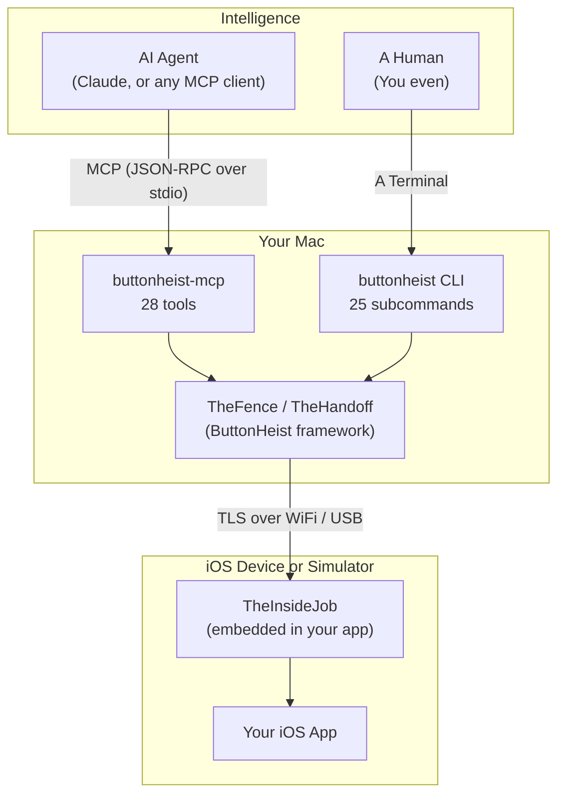

[](https://github.com/RoyalPineapple/TheButtonHeist/actions/workflows/ci.yml)
[](https://github.com/RoyalPineapple/TheButtonHeist/releases/latest)
[](LICENSE)

# Interface out. Agents in. Clean escape.

There's a second interface running underneath every iOS app. Built for VoiceOver and the millions of blind and low-vision people who depend on it daily, the accessibility layer runs like plumbing beneath the UI. Invisible but essential, quietly connecting every control, every action, every state. A complete semantic map of the app, maintained by the developer. Like the best infrastructure, essential to some, unnoticed by most.

Button Heist lets AI agents in through those pipes. Link one framework into your debug build and the agent works the interface from the inside. No coordinate math, no screenshot parsing. It activates a login button by name, calls `increment` on a stepper, triggers a "Delete" custom action directly, because the accessibility layer already says what everything is and does.

Every interaction doubles as an accessibility audit: if the agent can't find a control, neither can VoiceOver.

The heist works because the infrastructure was already in place. Apple built the tunnels, developers maintain them. Once the agent is inside, everything else follows.

<!-- TODO: terminal GIF showing run_batch with delta response -->

## Quick Start

### 1. Get the crew inside

Link TheInsideJob to your debug target. It starts a local TCP server via ObjC `+load`. No setup code. DEBUG only, stripped from release builds.

```swift
import SwiftUI
import TheInsideJob

@main
struct MyApp: App {
    var body: some Scene {
        WindowGroup { ContentView() }
    }
}
```

Same embed pattern as [Reveal](https://revealapp.com) or [FLEX](https://github.com/FLEXTool/FLEX). Add the Info.plist entries so Bonjour can advertise:

```xml
<key>NSLocalNetworkUsageDescription</key>
<string>This app uses local network to communicate with the element inspector.</string>
<key>NSBonjourServices</key>
<array>
    <string>_buttonheist._tcp</string>
</array>
```

### 2. Give the agent eyes and hands

Install the CLI and MCP server:

```bash
brew install RoyalPineapple/tap/buttonheist
```

Then add the MCP server to your project's `.mcp.json`:

```json
{
  "mcpServers": {
    "buttonheist": {
      "command": "buttonheist-mcp",
      "args": []
    }
  }
}
```

This exposes 28 tools to your agent: `get_interface`, `activate`, `type_text`, `run_batch`, `get_screen`, and more. The agent discovers your app via Bonjour automatically:

```
Agent: "I need to log the user in"
→ get_interface → sees button_login, textfield_email, textfield_password
→ run_batch([type email, tap login])
← each step confirmed, login screen gone, dashboard appeared. Agent already
  knows what's on screen and what to do next
```

The agent stays focused on the task, not on driving the app.

### 3. Or drive it yourself

The CLI is the canonical test client, and every feature is available from the command line.

```bash
cd ButtonHeistCLI && swift build -c release && cd ..
BH=./ButtonHeistCLI/.build/release/buttonheist

$BH list                                                  # Discover devices (WiFi + USB)
$BH session                                               # Interactive REPL
$BH activate --identifier loginButton                     # Activate an element
$BH action --name "Delete" --identifier cell_row_3        # Named custom action
$BH type --text "Hello" --identifier nameField            # Type into a field
$BH scroll --direction down --identifier scrollView       # Scroll one page
$BH scroll_to_visible --identifier targetElement          # Scroll until visible
$BH screenshot --output screen.png                        # Capture screenshot
$BH record --output demo.mp4 --fps 8 --scale 0.5         # Record with touch overlay
```

The session REPL accepts both JSON and shorthand: `tap loginButton`, `type "hello"`, `scroll down list`, `screen`.

## What It Can Do

### Interact

The agent works the controls the way VoiceOver does, by meaning, not by pixel.

- **Accessibility-first activation.** `activate` calls `accessibilityActivate()` first, falls back to synthetic tap. Works on custom controls that swallow raw touch events
- **Full gesture suite.** Long press, swipe, drag, pinch, rotate, two-finger tap, bezier paths via IOHIDEvent
- **Text input.** Type, delete, clear, read back values. Edit actions: copy, paste, cut, select, selectAll. Pasteboard read/write without triggering the system paste dialog
- **Scroll semantics.** `scroll` (one page), `scroll_to_visible` (find element), `scroll_to_edge` (jump to boundary)
- **Accessibility actions.** Increment/decrement, named custom actions, dismiss keyboard

### Inspect

Every element has a stable identity and every action has a structured receipt.

- **Full accessibility tree.** Labels, values, 43 named traits, frames, activation points, custom content, available actions
- **Stable identifiers.** `heistId` derived from trait + label (`button_login`, `header_settings`), developer identifier takes priority
- **Screenshots.** PNG capture, inline base64 or saved to file
- **Animation idle detection.** Blocks until `CALayer` animations settle

### Record

Capture what the agent does, for debugging, demos, or audit trails.

- **H.264/MP4 screen recording.** Configurable FPS (1-15), resolution scale (0.25-1.0)
- **Touch overlay.** Finger position indicators baked into the video
- **Auto-stop.** On inactivity timeout or max duration
- **Interaction log.** Timestamped JSON of all actions during the session

### Connect

Multiple paths in, one API out.

- **WiFi.** Bonjour auto-discovery on `_buttonheist._tcp`
- **USB.** CoreDevice IPv6 tunnel discovery. Same API as WiFi
- **Security.** TLS 1.3 with SHA-256 fingerprint pinning. Token auth with on-device Allow/Deny
- **Multi-device.** Many instances, many simulators. Session locking (one driver at a time)

## How It Works

Most iOS automation tools work from the outside: read the accessibility tree across a process boundary, extract element frames, compute tap coordinates, inject touch events at those coordinates. The agent never touches the real interface — it works with a coordinate-level approximation of it. Every action requires re-reading the full tree to know what happened.

Button Heist works from the inside. The framework lives in the app process, with direct access to the live accessibility hierarchy. When a control is a stepper, the agent calls `increment` — the same API path VoiceOver uses. When a row has a "Delete" custom action, the agent calls it by name. No coordinate math, no frame extraction, no re-reading the tree after every tap. This produces measurable gains — see [Benchmarks](docs/BENCHMARKS.md) for competitive data.

Three things follow from this:

### 1. Every action tells the agent what changed

After every command, Button Heist diffs the accessibility hierarchy and returns what moved: an **interface delta**. Tap "Login" and the response carries exactly which elements disappeared and which appeared:

```json
{
  "success": true,
  "method": "activate",
  "interfaceDelta": {
    "kind": "elementsChanged",
    "elementCount": 14,
    "removed": ["button_login", "textfield_password", "textfield_email"],
    "added": [
      {"heistId": "header_dashboard", "label": "Dashboard", "traits": ["header"]},
      {"heistId": "button_settings", "label": "Settings", "traits": ["button"]}
    ]
  }
}
```

Login screen gone, dashboard appeared, new elements ready to target. Value updates carry the property change inline: old value, new value, which element. When nothing changes, the delta says `"noChange"` and the agent pivots immediately.

The agent doesn't need to re-read the screen. The next decision starts from where the last one landed.

### 2. Every action can verify itself

Each command can carry an `expect`, a declaration of what *should* happen. The framework checks the delta against the expectation and reports pass/fail inline:

```json
{
  "command": "activate",
  "target": {"heistId": "button_login"},
  "expect": "screen_changed"
}
```

Response: `{"expectation": {"met": true, "expectation": "screenChanged"}}`.

Three tiers: `screen_changed` (new view controller), `elements_changed` (anything in the hierarchy shifted), or `element_updated` with specific property checks. When an expectation fails, the response carries what *actually* happened.

The agent says what it expects. The framework says whether that happened.

### 3. Confidence unlocks batching

An agent that trusts its feedback loop can commit to a whole sequence at once. `run_batch` sends ordered steps in a single round trip. Each one gets its own delta and expectation check. If a step fails, the batch stops. The agent never pushes forward with bad state:

```json
{
  "command": "run_batch",
  "steps": [
    {"command": "type_text", "target": {"heistId": "textfield_email"}, "text": "user@example.com",
     "expect": {"element_updated": {"heistId": "textfield_email", "property": "value", "newValue": "user@example.com"}}},
    {"command": "activate", "target": {"heistId": "button_submit"}, "expect": "screen_changed"}
  ]
}
```

Two actions, two assertions, one round trip. If the email field doesn't update, the batch stops there.

Deltas, expectations, and batching, each one enabling the next. That's the compound advantage.

## Meet the Crew

Every heist needs a team.

### The Score

| Name | Role |
|------|------|
| **TheScore** | The shared playbook. Wire protocol types, messages, and constants. The contract both sides speak |

### The Inside Team (iOS)

| Name | Role |
|------|------|
| **TheInsideJob** | The whole operation. Runs in your app: TCP server, Bonjour, accessibility hierarchy, command dispatch to the crew |
| **TheSafecracker** | Cracks the UI. Taps, swipes, drags, pinch, rotate, text entry, edit actions. Gets past any control via IOHIDEvent |
| **TheBagman** | Handles the goods. Element cache, hierarchy capture, heistId assignment, delta computation. Live view pointers never leave TheBagman |
| **TheMuscle** | Keeps the door. Token validation, Allow/Deny UI, session lock. Only one driver at a time |
| **TheStakeout** | The lookout. H.264 screen recording with frame timing and inactivity detection |
| **TheFingerprints** | Evidence. Touch indicators on screen during gestures, visible live and baked into TheStakeout's recordings |
| **TheTripwire** | Timing coordinator. Gates all "is the UI ready?" decisions: animation detection, presentation layer fingerprinting, settle waits |
| **ThePlant** | Runs the advance. ObjC `+load` hook boots TheInsideJob before any Swift runs. Link the framework, no app code |

### The Outside Team (macOS)

| Name | Role |
|------|------|
| **TheFence** | Runs the show. 38 commands dispatched from CLI and MCP, request-response correlation, async waits |
| **TheHandoff** | Gets everyone in position. Bonjour + USB discovery, TLS connection, session state, injectable closures for testing |

### The Legitimate Front

| Name | Role |
|------|------|
| **ButtonHeistCLI** | Your orders. `list`, `session`, `activate`, `touch`, `type`, `screenshot`, `record`, and more |
| **ButtonHeistMCP** | Agent interface. 28 tools that call through TheFence so AI agents can run the job natively |

## Architecture



### Modules

| Module | Platform | What it does |
|--------|----------|-------------|
| **TheScore** | iOS + macOS | Wire protocol: `HeistElement`, `InterfaceDelta`, `ElementMatcher`. The contract both sides speak |
| **TheInsideJob** | iOS | In-app server: TCP + Bonjour, accessibility capture, touch injection, recording, auth. Auto-starts via ObjC `+load` (DEBUG only) |
| **ButtonHeist** | macOS | Client framework: TheFence (command dispatch + request correlation), TheHandoff (discovery + connection + state) |
| **ButtonHeistMCP** | macOS | MCP server: 28 tools dispatching through TheFence |
| **buttonheist** | macOS | CLI: interactive session REPL with auto-reconnect and three output formats (human/json/compact) |

## Development

### Prerequisites

- Xcode with Swift 6 package support
- iOS 17+ / macOS 14+
- `git submodule update --init --recursive`
- [Tuist](https://tuist.io)

### Building

```bash
git submodule update --init --recursive
tuist generate
open ButtonHeist.xcworkspace
```

### Project Structure

```
ButtonHeist/
├── ButtonHeist/Sources/          # Core frameworks (TheScore, TheInsideJob, ButtonHeist)
├── ButtonHeistMCP/               # MCP server (Swift Package)
├── ButtonHeistCLI/               # CLI tool (Swift Package)
├── TestApp/                      # SwiftUI + UIKit test applications
├── AccessibilitySnapshotBH/      # Git submodule (hierarchy parsing)
├── docs/                         # Architecture, API, protocol, auth, USB docs
│   └── dossiers/                 # Per-module technical documentation
```

## Troubleshooting

### Device not appearing (WiFi)

1. Both devices on the same network
2. TheInsideJob framework linked to your target
3. Info.plist has the `_buttonheist._tcp` Bonjour service entry
4. iOS local network permission accepted

### USB connection refused

1. Device connected: `xcrun devicectl list devices`
2. App running on device
3. IPv6 tunnel visible: `lsof -i -P -n | grep CoreDev`

### Empty hierarchy

- App has visible UI on screen
- Root view is accessible to UIAccessibility
- Run `buttonheist get_interface` and check the element count

## Documentation

**Integrating into your app?** Start with the [API Reference](docs/API.md) and [Quick Start above](#quick-start).

**Connecting an agent?** See the [Wire Protocol](docs/WIRE-PROTOCOL.md) and [MCP Server](ButtonHeistMCP/).

**Understanding the architecture?** Read [Architecture](docs/ARCHITECTURE.md) and [Crew Dossiers](docs/dossiers/).

All docs: [API](docs/API.md) ・ [Architecture](docs/ARCHITECTURE.md) ・ [Wire Protocol](docs/WIRE-PROTOCOL.md) ・ [Auth](docs/AUTH.md) ・ [USB](docs/USB_DEVICE_CONNECTIVITY.md) ・ [Bonjour Troubleshooting](docs/BONJOUR_TROUBLESHOOTING.md) ・ [Reviewer's Guide](docs/REVIEWERS-GUIDE.md) ・ [Crew Dossiers](docs/dossiers/)

## License

Apache License 2.0. See `LICENSE`.

## Acknowledgments

- [KIF (Keep It Functional)](https://github.com/kif-framework/KIF). TheSafecracker's touch synthesis is built on KIF's pioneering work in programmatic iOS UI interaction.
- [AccessibilitySnapshot](https://github.com/cashapp/AccessibilitySnapshot). Used for parsing UIKit accessibility hierarchies (via our fork [AccessibilitySnapshotBH](https://github.com/RoyalPineapple/AccessibilitySnapshotBH)).
