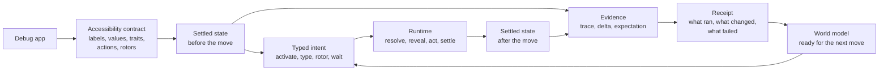

[](https://github.com/RoyalPineapple/TheButtonHeist/actions/workflows/ci.yml)
[](https://github.com/RoyalPineapple/TheButtonHeist/releases/latest)
[](LICENSE)

# The Button Heist

ButtonHeist lets agents and tests drive iOS apps by accessibility intent instead
of screen coordinates, then returns receipts that say what changed.

It turns the app's accessibility contract into a live world model: ButtonHeist's
current settled view of controls, roles, values, actions, and evidence after
each move.

The goal is not "I tapped something." The goal is "the app accepted the intent,
and here is the evidence."

When an iOS app exposes accessibility well, it already explains itself. Labels
name things. Traits describe controls. Values and state say what changed.
Actions and rotors say what can happen next. VoiceOver renders that contract
through speech and gesture; ButtonHeist renders it as structured text, typed
intent, and receipts.

The core trick is small:

```text
capture settled accessibility state
-> perform typed intent
-> capture settled accessibility state
-> compute evidence
-> return receipt
```

Everything else in ButtonHeist is built from this core unit. A direct command is
one loop. A heist is a reusable set of ButtonHeist instructions: do these actions,
wait for these facts, and keep the receipt. The DSL gives heists a readable
form, and product capabilities name them in the app's language.

Each piece unlocks the next: observation makes targeting possible, targeting
makes actions reliable, action receipts unlock expectations, expectations make
heists reliable, the DSL makes them readable, product capabilities name them in
the app's language.

The heist is clean: read the contract, make the move, bring back the evidence.

## The Core Loop

Agents should not spend their context budget remembering coordinates, guessing
scroll offsets, or maintaining a private model of what the app might look like.
ButtonHeist gives them the interface as a readable action space: the controls
on a screen, their roles, their values, the actions they accept, and what
changed after the last move.



A simple action asks for meaning, not a point:

```bash
buttonheist activate --label "Settings" --traits button
```

ButtonHeist resolves the target, makes it actionable, performs the accessibility
operation, waits for the app to settle, and returns a receipt with the new state
and evidence. The receipt is the handoff: the next command, assertion, audit, or
test reads from it.

## The Contract

ButtonHeist treats accessibility as the control plane.

For normal controls, callers speak in the app's accessibility language:
activate this button, type into this field, run this custom action, move through
this rotor, wait until this predicate is true. ButtonHeist manages ordinary
viewport setup: it resolves the target, reveals it through the owning
scroll/container path when needed, acquires fresh live geometry, performs the
operation, waits for settled semantic evidence, and reports the result.

Common command families are deliberately separate:

| Family | Use it for | Examples |
|---|---|---|
| Semantic actions | Act on controls the app exposes through accessibility | `activate`, `type_text`, custom actions, rotors |
| Assertions | Wait for settled accessibility facts | `wait`, expectations |
| Observations | Read state or pixels without changing the app | `get_interface`, `get_screen` |
| Viewport/debug | Deliberately inspect or move the visible viewport | `scroll`, `scroll_to_visible`, `scroll_to_edge` |
| Spatial gestures | Interact where the gesture shape is the product | maps, canvases, drawing, games, custom spatial controls |
| Heists | Run composed jobs through the same action/wait runtime | `run_heist` |

Use accessibility when the app exposes the thing you want. Use observations
when you need to inspect. Use viewport/debug commands when the visible viewport
is the subject. Use spatial gestures when the gesture itself is the intent.

## Screenshots And Accessibility

Screenshots are visual evidence. They show the visual interface in all its
glory, and ButtonHeist can capture them when pixels are the right evidence.

They are not the normal control plane. Pixels show what the interface looked
like; accessibility says what each control is called, what role it has, what
value it reports, which actions it accepts, and how the app says it changed.

ButtonHeist targets controls by meaning, not by any specific field. A target can
use labels, values, identifiers, required or excluded traits, and ordinal
disambiguation. Hierarchy, state, and available actions remain observable facts
and assertion evidence, not durable target identity. For durable heists, the
best target is the smallest accessibility predicate that names the intended
control in its screen context.

String predicates are exact by default. Every element string field accepts
explicit non-exact `StringMatch` modes: `.contains(...)`, `.prefix(...)`, or
`.suffix(...)` on `.label(...)`, `.identifier(...)`, `.value(...)`, or the
corresponding `.element(label: ..., identifier: ..., value: ...)` fields.
When one string property needs multiple checks, use the repeated-check form:
`.element(.label(.prefix("foo")), .label(.contains("bar")), .label(.suffix("baz")))`.
All checks against that property must pass. Traits stay as the `traits` and
`excludeTraits` collections.
Property-update `from` and `to` filters use the same exact-by-default matching
model. For KIF migrations that previously used a selector such as
`usingLabelContaining("Search")`, write the looseness explicitly with
`.label(.contains("Search"))` or `.element(label: .contains("Search"))`;
prefer an exact label, identifier, value, or trait when one names the intended
control clearly.

The difference shows up in what the next step can trust. Coordinate-first tools
often give the agent a raw translated accessibility object plus geometry. This
simplified example shows the kind of object the caller must still turn into an
action:

```json
{
  "AXFrame": "{{16, 165}, {361, 51}}",
  "AXUniqueId": null,
  "frame": {"y": 165, "x": 16, "width": 361, "height": 51},
  "role_description": "button",
  "AXLabel": "Controls Demo",
  "custom_actions": [],
  "AXValue": null,
  "enabled": true,
  "role": "AXButton"
}
```

That is useful, but the next step is still mechanical: compute a point from the
frame and tap the point.

```text
center_x = x + width / 2
center_y = y + height / 2
ui_tap(center_x, center_y)
```

After the tap, the caller still has to ask for the interface again, compare the
new dump to the old dump, decide what changed, and remember that decision.
ButtonHeist keeps that work in the runtime receipt, so the language model
chooses the next intent instead of diffing interface state, calculating frames,
managing viewport position, or asking pixels to do the job of the app's
accessibility contract. ButtonHeist can serve screenshots when visual evidence
matters; it does not make pixels the default world model.

ButtonHeist normalizes the same control into the facts the agent needs to act.
In compact form, that shape is closer to:

```json
{
  "label": "Controls Demo",
  "identifier": "buttonheist.root.controlsDemo",
  "traits": ["button"],
  "actions": ["activate"]
}
```

In the Swift DSL, the action stays in the accessibility language:

```swift
Activate(.element(label: "Controls Demo", traits: [.button]))
```

## From One Move To A Runtime

The runtime owns the hard parts that agents and tests should not reimplement:

1. Resolve semantic targets against the current world model.
2. Reveal targets through the owning scroll or container path when needed.
3. Acquire fresh live geometry at the moment of interaction.
4. Perform the requested action.
5. Refresh and wait for settled accessibility state.
6. Compare before and after state.
7. Return a receipt with evidence and diagnostics.

CLI and MCP commands enter through `TheFence`. In-app `Heist` tests execute
inside `TheInsideJob` through `TheBrains`. Executable UI actions and `wait`
share the one-step heist executor; observation, session, and screen commands use
dedicated handlers. In-app heists and `run_heist` expose `HeistExecutionResult`.
There is no separate automation track hiding underneath the direct commands.

## Receipts

A receipt is the durable answer to "what happened?"

It records the step path, the kind of step, the intent, the timing, child
results, warnings, failure details, and the best available action or wait
evidence. A successful receipt proves the flow shape. A failed receipt keeps the
heist frame intact so a test can say where the contract failed and why.

A simplified compact report can say exactly where a heist stopped:

```json
{
  "path": "$.body[0]",
  "kind": "fail",
  "status": "failed",
  "message": "Unknown screen"
}
```

Receipts are intentionally plain. They are not live handles, replay objects, or
private runtime state. They carry evidence you can assert against, print,
report, or use to compose the next heist.

## Expectations

Action receipts unlock expectations. When an action returns settled before and
after evidence, the action can say what must be true after it runs:

```swift
Activate(.label("Sign In"))
    .expect(.present(.label("Home")), timeout: .seconds(5))
```

If the expectation fails, the action fails with the receipt attached. That is
the difference between "I tapped something" and "the app accepted the intent."
Expectations are what make a heist reliable: it can keep moving only while the
app keeps satisfying the contract.

## Heists

A heist is a reusable set of ButtonHeist instructions: do these actions, wait
for these facts, and keep the receipt.

Humans can author heists in checked-in Swift files. Agents author runtime
heists as canonical ButtonHeist source sent through `run_heist(plan:)`. Both
forms lower to the same `HeistPlan`; Swift is an authoring frontend, not the
runtime language boundary. At first it just looks like ordered instructions:

```swift
import ThePlans

let login = try HeistPlan("login") {
    TypeText("agent@example.com", into: .label("Email"))
        .expect(.present(.element(label: "Email", value: "agent@example.com")), timeout: .seconds(2))

    Activate(.label("Sign In"))
        .expect(.present(.label("Home")), timeout: .seconds(5))
}
```

Each instruction still runs through the same action/wait runtime. The heist
rolls those step receipts into one receipt tree, so a report can show the whole
job or point to the exact instruction where the contract failed.

## The Shape Of A Job

Once jobs need more than straight-line instructions, the DSL adds a small set of
control primitives:

- `WaitFor` is an assertion: a predicate must become true before the timeout,
  unless an explicit timeout branch handles the miss.
- `If` is a decision: inspect settled current state and choose a branch.
- `ForEach` is the loop: repeat over a finite list of strings or a finite set of
  semantic targets.
- `RunHeist` is composition: call another product capability with no argument,
  one string, or one element target.
- Actions, `Warn`, and `Fail` are the effects.

```swift
let search = try HeistPlan("searchFlow") {
    TypeText("milk", into: .label("Search"))
        .expect(.present(.element(label: "Search", value: "milk")), timeout: .seconds(2))

    Activate(.label("Search"))
        .expect(.changed(.screen()), timeout: .seconds(5))

    WaitFor(.present(.label("Results")), timeout: .seconds(5))
        .else {
            Fail("Search did not settle")
        }

    If(.present(.label("Results"))) {
        Warn("Search results loaded")
    }
}
```

Heists stay deliberately finite and inspectable: values, predicates,
assertions, decisions, bounded loops, composition, and explicit effects.

## Product Capabilities

Heists can wrap raw accessibility semantics in product language:

```swift
RunHeist("SearchScreen.search", "milk")
RunHeist("LibraryScreen.addToCart", "Milk")
RunHeist("CartScreen.checkout")
```

This is where accessibility semantics become product semantics. The reusable
piece is still grounded in predicates and receipts, but the agent or test can
operate at the level of the product: search, add to cart, confirm, checkout.

The same shape works inside app tests:

```swift
import TheInsideJob

let heist = try await Heist("milk") { query in
    TypeText(query, into: .label("Search"))
    Activate(.label("Search"))
}

heist.result
```

or with an explicit named Swift/test runner boundary:

```swift
let heist = try await RunHeist("search", argument: "milk") { query in
    TypeText(query, into: .label("Search"))
    Activate(.label("Search"))
}

heist.result
```

Outside `RunHeist(...) { ... }` is Swift test code. Inside the closure is
ButtonHeist DSL that lowers to a validated `HeistPlan` and runs through the
same receipt-producing runtime as MCP `run_heist`.

## Why It Works

ButtonHeist narrows the problem the agent has to solve. The agent sees the
interface in language, chooses intent in language, and receives evidence in
language. It does not need coordinate math, viewport bookkeeping, private state
diffs, or a shadow model of the app before asking for a button.

Accessibility is what makes that possible. When the app exposes a complete
accessibility contract, it names controls, describes roles, exposes values,
offers actions, and reports state. ButtonHeist keeps that contract live as a
world model and runs ordinary semantic interactions through it.

For maps, canvases, drawing surfaces, games, and spatial products, explicit
mechanical gestures stay available. Those are intentional spatial interactions,
not the normal path for buttons, fields, menus, actions, rotors, waits, and
product flows.

That division of labor is the product: the app publishes meaning, ButtonHeist
keeps the world model and receipts, and the agent chooses what should happen
next.

## Quick Start

### 1. Add TheInsideJob

Link `TheInsideJob` to your debug target. It starts a local TCP server via ObjC
`+load`; no app setup code is required. Release builds do not start the server.

```swift
import SwiftUI
import TheInsideJob

@main
struct MyApp: App {
    var body: some Scene {
        WindowGroup { ContentView() }
    }
}
```

By default the server accepts simulator loopback and USB-scoped connections. It
does not publish Bonjour on the LAN unless you opt into network scope with
`INSIDEJOB_SCOPE=simulator,usb,network` or `InsideJobScope`.

If you enable network scope, add the Bonjour permissions:

```xml
<key>NSLocalNetworkUsageDescription</key>
<string>This app uses local network to communicate with The Button Heist.</string>
<key>NSBonjourServices</key>
<array>
    <string>_buttonheist._tcp</string>
</array>
```

### 2. Install the tools

```bash
brew install RoyalPineapple/tap/buttonheist
```

The Homebrew distribution currently supports Apple Silicon macOS only.

Add the MCP server to your project's `.mcp.json`:

```json
{
  "mcpServers": {
    "buttonheist": {
      "command": "buttonheist-mcp",
      "args": []
    }
  }
}
```

Agents usually start with `get_interface`, then act with commands such as
`activate`, `type_text`, `rotor`, `wait`, and `run_heist`.

### 3. Use the CLI directly

```bash
cd ButtonHeistCLI
swift build -c release

BH=.build/release/buttonheist

$BH list_devices
$BH get_interface
$BH activate --identifier loginButton
$BH type_text --text "Hello" --identifier nameField
$BH get_screen --output screen.png
```

`json_lines` keeps one connection open and accepts canonical machine JSON
objects. Direct CLI commands and MCP tools project from the same Fence command
contract.

```bash
printf '%s\n' '{"command":"get_interface"}' | buttonheist json_lines
```

## The Crew

The Button Heist is a distributed system: a debug iOS framework inside the app, a
macOS client outside it, and CLI/MCP fronts for humans and agents.

### Inside the app

| Name | Job |
|---|---|
| `TheInsideJob` | Embedded debug framework and server startup |
| `TheStash` | Live semantic world model, target resolution, matching, wire conversion |
| `TheBurglar` | Accessibility hierarchy parsing and screen/container structure |
| `TheBrains` | Action execution, waits, heist execution, and result evidence |
| `TheSafecracker` | Explicit mechanical input: touch, gesture, keyboard, edit, scroll mechanics |
| `TheTripwire` | UI readiness, window signals, and settle support |
| `TheMuscle` | Token validation, approval UI, and session locking |
| `TheGetaway` | Message dispatch and response transport |

### Outside the app

| Name | Job |
|---|---|
| `TheFence` | Shared command contract for CLI and MCP |
| `TheHandoff` | Device discovery, target resolution, TLS connection, and session state |
| `ThePlans` | Pure heist language: plan AST, Swift DSL, JSON, validation, canonical rendering, and source compilation |
| `TheScore` | Wire models, traces, predicates, and results shared across boundaries |
| `ButtonHeistCLI` | Command-line adapter |
| `ButtonHeistMCP` | MCP adapter for agents |
| `HeistArtifactCodec` / `ScreenshotArtifactWriter` | Deterministic heist and screenshot artifacts |

## Development

### Prerequisites

- Xcode with Swift 6 package support
- iOS 17+ / macOS 14+
- [Tuist](https://tuist.io)

### Build locally

```bash
git submodule update --init --recursive
tuist generate
open ButtonHeist.xcworkspace
```

### Project structure

```text
ButtonHeist/
+-- ButtonHeist/Sources/          # Core frameworks
+-- ButtonHeistCLI/               # CLI tool
+-- ButtonHeistMCP/               # MCP server
+-- TestApp/                      # SwiftUI + UIKit test apps
+-- submodules/AccessibilitySnapshotBH/
+-- docs/                         # Architecture, contracts, API, connectivity
+-- examples/                     # Canonical semantic examples
```

## Troubleshooting

### Device not appearing

Check that:

1. `TheInsideJob` is linked to the debug target.
2. The app is running in the foreground.
3. The connection scope allows simulator, USB, network, or the direct target you
   are using.
4. Bonjour/LAN discovery, if enabled, has the `_buttonheist._tcp` Info.plist
   entry.

### USB connection refused

Check:

```bash
xcrun devicectl list devices
lsof -i -P -n | grep CoreDev
```

The app must be running on the device.

### Empty hierarchy

Make sure the app has an interface on a screen and that the root view exposes an
accessibility hierarchy. Then run:

```bash
buttonheist get_interface
```

## Documentation

| Start here | Read |
|---|---|
| Integrate a debug app | [Quick Start](#quick-start), [API](docs/API.md) |
| Connect an agent | [ButtonHeistMCP](ButtonHeistMCP/), [MCP Tool Reference](docs/reference/mcp-tools.md) |
| Use the CLI | [ButtonHeistCLI](ButtonHeistCLI/), [Command Reference](docs/reference/commands.md) |
| Understand the runtime | [Accessibility Contract](docs/ACCESSIBILITY-CONTRACT.md), [Architecture](docs/ARCHITECTURE.md) |

All docs: [API](docs/API.md) / [Command Reference](docs/reference/commands.md) /
[MCP Tool Reference](docs/reference/mcp-tools.md) /
[Architecture](docs/ARCHITECTURE.md) /
[Wire Protocol](docs/WIRE-PROTOCOL.md) / [Auth](docs/AUTH.md) /
[USB](docs/USB_DEVICE_CONNECTIVITY.md) /
[Bonjour Troubleshooting](docs/BONJOUR_TROUBLESHOOTING.md) /
[Reviewer's Guide](docs/REVIEWERS-GUIDE.md)

## Acknowledgments

- [KIF (Keep It Functional)](https://github.com/kif-framework/KIF). The Button
  Heist builds on KIF's long proof that semantic accessibility is a stable base
  for iOS testing, while moving the model toward accessibility actions, settled
  evidence, and agent-readable contracts.
- [AccessibilitySnapshot](https://github.com/cashapp/AccessibilitySnapshot).
  Used for parsing UIKit accessibility hierarchies via
  [AccessibilitySnapshotBH](https://github.com/RoyalPineapple/AccessibilitySnapshotBH).

## License

Apache License 2.0. See [LICENSE](LICENSE).
