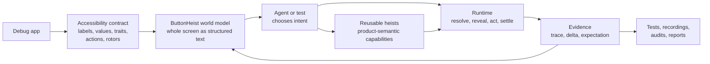
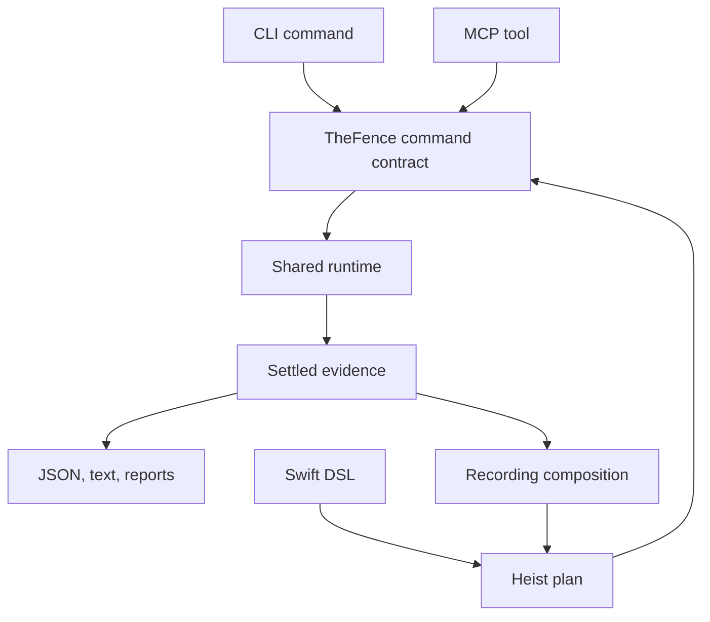

[](https://github.com/RoyalPineapple/TheButtonHeist/actions/workflows/ci.yml)
[](https://github.com/RoyalPineapple/TheButtonHeist/releases/latest)
[](LICENSE)

# The Button Heist

ButtonHeist lets agents and tests use an app's accessibility contract as a
programmable world model, with reusable product-semantic capabilities and
evidence.

An iOS app already describes itself through accessibility. Labels name things.
Traits describe controls. Values and state say what changed. Actions and rotors
say what can happen next. VoiceOver renders that contract as speech and
gestures; ButtonHeist renders it as structured text, typed intent, and receipts.

Agents read the whole screen like a document or menu. Tests and heists wrap the
same accessibility facts in product language: search for this item, add it to
cart, confirm settings changed. ButtonHeist keeps the world model ready for
action: resolve the target, perform the interaction, wait for settle, and return
evidence.

The heist is clean: read the contract, make the move, keep the receipt.



A benchmark trace shows the loop. The agent asks for a target by name and trait:

```text
-> activate(label: "Settings", traits: ["button"])

<- appearance | activate: screen changed
   23 elements
   [0] appearance_header "Appearance" header
   [1] system_button "System" button | selected
   [2] dark_button "Dark" button
   [3] purple_button "Purple" button
   ...
```

The receipt is the next screen as readable state, ready for the next command,
assertion, recording step, or audit.

## What You Can Do

Use The Button Heist to:

- Drive a debug iOS app from an agent over MCP.
- Run semantic UI commands from a CLI.
- Package product flows as reusable heists agents can run or compose.
- Compose multi-step heist plans with waits, branches, inputs, and expectations.
- Compose successful interactions into generated `.heist` artifacts.
- Replay those tests in CI with failure diagnostics and JUnit output.
- Validate complete app flows through the accessibility contract.

Direct commands, authored heists, recorded heists, replay, reports, and audits
all use the same runtime. A single command is just the smallest heist; larger
heists are saved product intent.



## The Shape Of A Job

A direct command:

```bash
buttonheist get_interface

buttonheist activate \
  --label "Continue" \
  --traits button
```

A recording that becomes a replayable test:

```bash
buttonheist start_heist --app com.buttonheist.testapp

buttonheist get_interface

buttonheist type_text --text "milk" \
  --label "Search"

buttonheist activate \
  --label "Search" \
  --traits button

buttonheist stop_heist --output search-flow.heist
buttonheist run_heist --path search-flow.heist --junit search-flow.xml
```

A Swift-authored heist:

```swift
import ThePlans

let heist = try HeistPlan("searchFlow") {
    TypeText("milk", into: .label("Search"))
        .expect(.present(.element(label: "Search", value: "milk")), timeout: .seconds(2))

    Activate(.label("Search"))
        .expect(.changed(.screen()), timeout: .seconds(5))

    WaitFor(timeout: .seconds(5)) {
        Case(.present(.label("Results"))) {
            Warn("Search results loaded")
        }

        Else {
            Fail("Search did not settle")
        }
    }
}
```

The examples live in [examples/](examples/). The generated command and MCP
surfaces live in [docs/reference/commands.md](docs/reference/commands.md) and
[docs/reference/mcp-tools.md](docs/reference/mcp-tools.md).

## The Contract

The Button Heist treats accessibility as the control plane.

For normal controls, callers speak in the app's accessibility language:
activate this button, type into this field, run this custom action, move through
this rotor, wait until this predicate is true. The Button Heist manages ordinary
viewport setup: it resolves the target, reveals it through the owning
scroll/container path when needed, acquires fresh live geometry, performs the
operation, waits for settled semantic evidence, and reports the result.

For viewport work, callers use viewport commands. `get_screen`, `get_interface`,
`scroll`, `scroll_to_edge`, and `scroll_to_visible` are for cases where the
viewport itself is the subject.

For physical gestures, callers use mechanical commands. `one_finger_tap`,
`long_press`, `swipe`, and `drag` are for maps, canvases, drawing surfaces,
games, custom gesture regions, and other places where the gesture is the intent.

The split is simple:

- Use the accessibility language when the app exposes the thing you want:
  buttons, fields, links, menus, custom actions, rotors, and waits. These steps
  survive layout changes because they name app meaning.
- Use viewport commands when the viewport itself is the question: inspect the
  hierarchy, capture a screenshot, or deliberately move a scroll view. These
  commands describe what is visible now.
- Use mechanical gestures when the gesture is the product: maps, canvases,
  drawing, games, sliders, and spatial controls. These commands preserve the
  point, unit point, direction, or gesture shape.

The formal runtime contract is in
[docs/ACCESSIBILITY-CONTRACT.md](docs/ACCESSIBILITY-CONTRACT.md). Recording and
element inflation have focused contracts in
[docs/RECORDING-CONTRACT.md](docs/RECORDING-CONTRACT.md) and
[docs/ELEMENT-INFLATION.md](docs/ELEMENT-INFLATION.md).

## Heists

A heist is a semantic program against the app's accessibility contract.

Heists are useful because a UI flow is rarely one action. A real flow says:

- put text in this field
- activate that control
- wait until this state appears
- branch if the app reports an error
- fail with a useful reason if the contract is not satisfied

`run_heist` executes a typed `HeistPlan` through the same runtime used by direct
commands. Each action can carry an expectation. Each wait evaluates settled
semantic state. If a step fails, the heist stops at the point where the contract
failed.

Swift DSL source is the authoring form. Raw `HeistPlan` JSON is explicit
`.json` IR for debug, import, and export. `.heist` is a generated package
artifact containing `manifest.json` and canonical `plan.json`. See
[docs/HEIST-FORMAT.md](docs/HEIST-FORMAT.md) and
[docs/SWIFT-HEIST-AUTHORING.md](docs/SWIFT-HEIST-AUTHORING.md).

### The heist language

The language is intentionally small. Heists pass product meaning around as one
of two values: a string or an element target. Everything else is a predicate, a
control step, a composition step, or an effect.

- `WaitFor` is an assertion: the predicate must become true, or the heist fails
  unless an explicit timeout branch handles it.
- `If` is a decision: inspect settled current state and choose a branch.
- `ForEach` is the loop: repeat behavior over a finite list of strings or a
  finite set of semantic targets.
- `RunHeist` is composition: call another product capability with no argument,
  one string, or one element target.
- Actions, `Warn`, and `Fail` are the effects.

That is the whole shape. A direct command is a one-step heist. A recorded flow is
a heist written from settled evidence. A product robot is a named heist that
wraps the accessibility contract in app language. If a feature cannot be
expressed as a value, predicate, assertion, decision, loop, composition, or
effect, it probably does not belong in the heist language.

## Recordings

Recording turns receipts into heist plans.

During a recording, Button Heist observes successful runtime evidence and stores
durable semantic steps. It skips reads, failed actions, and viewport setup for a
later semantic action. Runtime IDs, capture IDs, live object handles, and screen
geometry stay out of durable semantic identity.

A good recorded step reads like intent:

> activate the Delete button and expect it to disappear

The coordinate diary stays out of the plan:

> scroll down, tap at this coordinate, hope the same thing is there tomorrow

That is why a recorded heist can survive layout movement and device changes. It
fails when the app's accessible contract changes, which is the failure you want
a durable UI test to surface.

## Why It Works

ButtonHeist narrows the problem the agent has to solve. Instead of handing it
pixels, coordinates, and remembered guesses, ButtonHeist presents the interface
as a readable action space: the controls on a screen, their roles, their current
values, the actions they accept, and the evidence produced by the last move.

Accessibility is the source of that action space. ButtonHeist keeps it live as a
world model, then owns the mechanical work: resolve the target, reveal it if
needed, act, wait for settle, refresh the state, and return evidence.

The agent works from those facts. It chooses the next intent, then reads the
receipt. It does not need coordinate math, viewport bookkeeping, private state
diffs, or a shadow model of the app before asking for a button.

For maps, canvases, drawing surfaces, games, and spatial products, explicit
mechanical gestures stay available. Those are intentional spatial interactions,
not the normal path for buttons, fields, menus, actions, rotors, waits, and
product flows.

The benchmark suite compares that loop with coordinate-first MCP automation
across 96 trials and 16 UI tasks.

|  | The Button Heist | Coordinate-based |
|---|---:|---:|
| Avg wall time | 134s | 235s |
| Avg turns | 14 | 43 |
| Avg cost | $0.46 | $1.42 |
| Tasks completed | 16/16 | 16/16 |

Average result: **2.4x faster, 3.1x fewer turns, 3.1x lower cost.**

Full methodology: [docs/BENCHMARKS.md](docs/BENCHMARKS.md).

## Quick Start

### 1. Add TheInsideJob

Link `TheInsideJob` to your debug target. It starts a local TCP server via ObjC
`+load`; no app setup code is required. Release builds do not start the server.

```swift
import SwiftUI
import TheInsideJob

@main
struct MyApp: App {
    var body: some Scene {
        WindowGroup { ContentView() }
    }
}
```

By default the server accepts simulator loopback and USB-scoped connections. It
does not publish Bonjour on the LAN unless you opt into network scope with
`INSIDEJOB_SCOPE=simulator,usb,network` or `InsideJobScope`.

If you enable network scope, add the Bonjour permissions:

```xml
<key>NSLocalNetworkUsageDescription</key>
<string>This app uses local network to communicate with The Button Heist.</string>
<key>NSBonjourServices</key>
<array>
    <string>_buttonheist._tcp</string>
</array>
```

### 2. Install the tools

```bash
brew install RoyalPineapple/tap/buttonheist
```

Add the MCP server to your project's `.mcp.json`:

```json
{
  "mcpServers": {
    "buttonheist": {
      "command": "buttonheist-mcp",
      "args": []
    }
  }
}
```

Agents usually start with `get_interface`, then act with commands such as
`activate`, `type_text`, `rotor`, `wait`, and `run_heist`.

### 3. Use the CLI directly

```bash
cd ButtonHeistCLI
swift build -c release

BH=.build/release/buttonheist

$BH list_devices
$BH get_interface
$BH activate --identifier loginButton
$BH type_text --text "Hello" --identifier nameField
$BH get_screen --output screen.png
```

`json_lines` keeps one connection open and accepts canonical machine JSON
objects. Direct CLI commands and MCP tools project from the same Fence command
contract.

```bash
printf '%s\n' '{"command":"get_interface"}' | buttonheist json_lines
```

## The Crew

The Button Heist is a distributed system: a debug iOS framework inside the app, a
macOS client outside it, and CLI/MCP fronts for humans and agents.

### Inside the app

| Name | Job |
|---|---|
| `TheInsideJob` | Embedded debug framework and server startup |
| `TheStash` | Live semantic world model, target resolution, matching, wire conversion |
| `TheBurglar` | Accessibility hierarchy parsing and screen/container structure |
| `TheBrains` | Action execution, waits, heist execution, and result evidence |
| `TheSafecracker` | Explicit mechanical input: touch, gesture, keyboard, edit, scroll mechanics |
| `TheTripwire` | UI readiness, window signals, and settle support |
| `TheMuscle` | Token validation, approval UI, and session locking |
| `TheGetaway` | Message dispatch and response transport |

### Outside the app

| Name | Job |
|---|---|
| `TheFence` | Shared command contract for CLI and MCP |
| `TheHandoff` | Device discovery, target resolution, TLS connection, and session state |
| `ThePlans` | Pure heist language: plan AST, Swift DSL, JSON, validation, canonical rendering, and source compilation |
| `TheScore` | Wire models, traces, predicates, and results shared across boundaries |
| `ButtonHeistCLI` | Command-line adapter |
| `ButtonHeistMCP` | MCP adapter for agents |
| `HeistStore` / `ScreenshotStore` | Deterministic heist and screenshot artifacts |

## Development

### Prerequisites

- Xcode with Swift 6 package support
- iOS 17+ / macOS 14+
- [Tuist](https://tuist.io)

### Build locally

```bash
git submodule update --init --recursive
tuist generate
open ButtonHeist.xcworkspace
```

### Project structure

```text
ButtonHeist/
+-- ButtonHeist/Sources/          # Core frameworks
+-- ButtonHeistCLI/               # CLI tool
+-- ButtonHeistMCP/               # MCP server
+-- TestApp/                      # SwiftUI + UIKit test apps
+-- submodules/AccessibilitySnapshotBH/
+-- docs/                         # Architecture, contracts, API, connectivity
+-- examples/                     # Canonical semantic examples
```

## Troubleshooting

### Device not appearing

Check that:

1. `TheInsideJob` is linked to the debug target.
2. The app is running in the foreground.
3. The connection scope allows simulator, USB, network, or the direct target you
   are using.
4. Bonjour/LAN discovery, if enabled, has the `_buttonheist._tcp` Info.plist
   entry.

### USB connection refused

Check:

```bash
xcrun devicectl list devices
lsof -i -P -n | grep CoreDev
```

The app must be running on the device.

### Empty hierarchy

Make sure the app has an interface on a screen and that the root view exposes an
accessibility hierarchy. Then run:

```bash
buttonheist get_interface
```

## Documentation

| Start here | Read |
|---|---|
| Integrate a debug app | [Quick Start](#quick-start), [API](docs/API.md) |
| Connect an agent | [ButtonHeistMCP](ButtonHeistMCP/), [MCP Tool Reference](docs/reference/mcp-tools.md) |
| Use the CLI | [ButtonHeistCLI](ButtonHeistCLI/), [Command Reference](docs/reference/commands.md) |
| Record and replay tests | [Recording Contract](docs/RECORDING-CONTRACT.md), [Heist Format](docs/HEIST-FORMAT.md) |
| Understand the runtime | [Accessibility Contract](docs/ACCESSIBILITY-CONTRACT.md), [Architecture](docs/ARCHITECTURE.md) |
| Compare the approach | [Benchmarks](docs/BENCHMARKS.md) |

All docs: [API](docs/API.md) / [Command Reference](docs/reference/commands.md) /
[MCP Tool Reference](docs/reference/mcp-tools.md) /
[Architecture](docs/ARCHITECTURE.md) /
[Wire Protocol](docs/WIRE-PROTOCOL.md) / [Auth](docs/AUTH.md) /
[USB](docs/USB_DEVICE_CONNECTIVITY.md) /
[Bonjour Troubleshooting](docs/BONJOUR_TROUBLESHOOTING.md) /
[Reviewer's Guide](docs/REVIEWERS-GUIDE.md)

## Acknowledgments

- [KIF (Keep It Functional)](https://github.com/kif-framework/KIF). The Button
  Heist builds on KIF's long proof that semantic accessibility is a stable base
  for iOS testing, while moving the model toward accessibility actions, settled
  evidence, and agent-readable contracts.
- [AccessibilitySnapshot](https://github.com/cashapp/AccessibilitySnapshot).
  Used for parsing UIKit accessibility hierarchies via
  [AccessibilitySnapshotBH](https://github.com/RoyalPineapple/AccessibilitySnapshotBH).

## License

Apache License 2.0. See [LICENSE](LICENSE).
