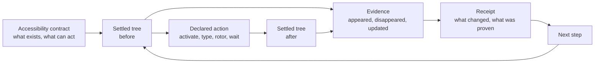

[](https://github.com/RoyalPineapple/TheButtonHeist/actions/workflows/ci.yml)
[](https://github.com/RoyalPineapple/TheButtonHeist/releases/latest)
[](LICENSE)

# The Button Heist

The Button Heist turns an app's accessibility interface into an executable contract.

Accessibility is the interface. Strip an app of rendering and the accessibility tree is what remains: labels, values, traits, hierarchy, state, and actions. The app declares what is true now and what can happen next. An operator reads that declaration, acts on it, and reads back what changed.

That makes accessibility the app's command surface: named objects, declared verbs, and read-back state. A visual interface asks an operator to infer what can be done from pixels. The accessibility interface says what exists, what actions it supports, and what changed after the action.

VoiceOver is one client for that command surface. The Button Heist is another: a way for agents and tests to operate the same interface and bring back evidence.

## One move

The Button Heist lets agents and tests drive iOS apps by accessibility intent instead of screen coordinates.

```swift
Activate(.label("Pay"))
    .expect(.change(.appeared(.label("Payment Complete"))))
```

In the syntax, `.change(...)` says the step must prove a before/after transition. `.appeared(...)` names the evidence the transition must contain.

This is not "tap Pay." It means:

1. Read the settled accessibility tree.
2. Resolve the control the app declares as `Pay`.
3. Perform the activation exposed by that interface.
4. Wait for the app to settle.
5. Re-read the accessibility tree.
6. Prove that `Payment Complete` appeared.
7. Return evidence of the transition.

The important question is not whether an event was delivered. The important question is whether the interface contract was fulfilled.

## The contract

A contract reduces uncertainty. It makes three things explicit:

- what the app declares
- what can be acted on
- what the contract requires after the action

Bugs live in ambiguity. Accessibility bugs often hide in the gap between the screen and the accessibility interface. A control can be visible but not exposed. A label can be close enough for a person to infer, but too vague for assistive technology or an agent to trust. State can change on screen while semantic state stays stale. A tap can work even though the accessibility action is missing.

The Button Heist makes those gaps testable. It executes the accessibility contract and requires evidence that the contract changed as expected.

## The core loop

Every heist step follows the same loop:

```text
read settled accessibility tree
-> resolve semantic target
-> perform declared action
-> wait for settled tree
-> compute delta
-> assert evidence
-> return receipt
```

Most UI automation treats interaction as an input event. The Button Heist treats interaction as an asserted transition in the accessibility contract.



A direct command is one loop:

```bash
buttonheist activate --label "Settings" --traits button
```

The runtime resolves the target, makes it actionable, performs the accessibility operation, waits for the app to settle, and returns a receipt with the new state and evidence. The next command, assertion, audit, or test reads from that receipt.

The normal path is semantic: activate named controls, type into fields, run accessibility actions, move through rotors, and wait on settled predicates. Screenshots, viewport commands, and spatial gestures still exist, but they are supporting tools. For ordinary app flows, the durable control surface is the accessibility contract.

## Receipts

A receipt is the durable answer to "what happened?"

```text
step: Activate(label: "Pay")
status: passed
before: Checkout
after: Payment
delta: screen changed
evidence:
  appeared: "Payment" [header]
  appeared: "Total $41.00" [staticText]
```

When a step cannot satisfy the contract, the same evidence matters more:

```text
activate -> error[elementNotFound]
No match for: label="Calamari Fritti"
near miss:
  "Calamari Fritti, $14.00, Calamari Fritti" [button]
known elements:
  "Start drawer" [header]
  "Save" [button]
```

Because The Button Heist acts from a settled tree and reads another settled tree afterward, diagnosis starts from facts. The diagnostic can show what the accessibility contract actually contained.

Receipts are intentionally plain. They are not live handles, replay objects, or private runtime state. They carry evidence you can assert against, print, report, or use to compose the next heist.

## Heists

A heist is how a product capability is defined: do these actions, wait for these facts, and keep the receipt.

Humans can author heists in checked-in Swift files. Agents can author runtime heists as canonical source sent through `run_heist(plan:)`. Both forms lower to the same `HeistPlan` and run through the same receipt-producing runtime.

```swift
import ThePlans

let login = try HeistPlan("login") {
    TypeText("agent@example.com", into: .label("Email"))
        .expect(.updated(
            element: .label("Email"),
            .value(after: "agent@example.com")
        ))

    Activate(.label("Sign In"))
        .expect(.appeared(.label("Home")))
}
```

Each instruction runs through the same action/wait runtime. The heist rolls those step receipts into one receipt tree, so a report can show the whole job or point to the exact instruction where the contract was not fulfilled.

## Product capabilities

Once a heist has a name, callers can use it as a product capability:

```swift
RunHeist("SearchScreen.search", "milk")
RunHeist("LibraryScreen.addToCart", "Milk")
RunHeist("CartScreen.checkout")
```

This is where accessibility semantics become product semantics. The reusable piece is still grounded in predicates and receipts, but the agent or test can operate at the level of the product: search, add to cart, confirm, checkout.

## The shape of a job

Once jobs need more than straight-line instructions, the heist language adds a small set of control primitives.

Action expectations usually assert deltas: something appeared, changed, or updated after the step. Standalone waits and branches inspect current settled state.

- `WaitFor` is an assertion: a predicate must become true before the timeout, unless an explicit timeout branch handles the miss.
- `If` is a decision: inspect settled current state and choose a branch.
- `ForEach` is the loop: repeat over a finite list of strings or semantic targets.
- `RunHeist` is composition: call another product capability with no argument, one string, or one element target.
- Actions, `Warn`, and `Fail` are the effects.

```swift
let search = try HeistPlan("searchFlow") {
    TypeText("milk", into: .label("Search"))
        .expect(.updated(
            element: .label("Search"),
            .value(after: "milk")
        ))

    Activate(.label("Search"))
        .expect(.change(.screen()))

    WaitFor(.label("Results"), timeout: .seconds(5))
        .else {
            Fail("Search did not settle")
        }

    If(.label("Results")) {
        Warn("Search results loaded")
    }
}
```

Heists stay deliberately finite and inspectable: values, predicates, assertions, decisions, bounded loops, composition, and explicit effects.

The same shape works inside app tests:

```swift
import TheInsideJob

let heist = try await RunHeist("search", argument: "milk") { query in
    TypeText(query, into: .label("Search"))
        .expect(.change(.updated(element: .label("Search"))))

    Activate(.label("Search"))
        .expect(.change(.screen()))
}

heist.result
```

Outside `RunHeist(...) { ... }` is Swift test code. Inside the closure is the heist language that lowers to a validated `HeistPlan` and runs through the same runtime as MCP `run_heist`.

## Why it works

The Button Heist narrows the problem the agent has to solve. The agent sees the interface in language, chooses intent in language, and receives evidence in language. It does not need coordinate math, viewport bookkeeping, private state diffs, or a shadow model of the app before asking for a button.

Accessibility makes that possible. When the app exposes a complete accessibility contract, it names controls, describes roles, exposes values, offers actions, and reports state. The Button Heist keeps that contract live and runs ordinary semantic interactions through it.

For maps, canvases, drawing surfaces, games, and spatial products, explicit mechanical gestures stay available. Those are intentional spatial interactions, not the normal path for buttons, fields, menus, actions, rotors, waits, and product flows.

That division of labor is the product: the app publishes product semantics, The Button Heist keeps the settled contract and receipts, and the agent chooses what should happen next.

## Screenshots and accessibility

Screenshots are visual evidence. They show the visual interface, and The Button Heist can capture them when pixels are the right evidence.

They are not the normal control plane. Pixels show what the interface looked like. Accessibility says what each control is called, what role it has, what value it reports, which actions it accepts, and how the app says it changed.

The Button Heist targets controls by product semantics, not by any one field. A target can use labels, values, identifiers, required traits, excluded traits, and ordinal disambiguation. Hierarchy, state, and available actions remain observable facts and assertion evidence, not durable target identity.

For durable heists, the best target is the smallest accessibility predicate that names the intended control in its screen context.

String predicates are exact by default. When you need looseness, ask for it explicitly:

```swift
.label(.contains("Search"))
.label(.prefix("Total"))
.identifier(.contains("cart"))
.element(.label(.prefix("Milk")), .traits([.button]))
```

All checks must pass. Use `.traits([...])` for required traits and `.excludeTraits([...])` for rejected traits.

## Quick start

### 1. Add `TheInsideJob`

Link `TheInsideJob` to your debug target. It starts a local TCP server via ObjC `+load`; no app setup code is required. Release builds do not start the server.

```swift
import SwiftUI
import TheInsideJob

@main
struct MyApp: App {
    var body: some Scene {
        WindowGroup { ContentView() }
    }
}
```

By default the server accepts simulator loopback and USB-scoped connections. It does not publish Bonjour on the LAN unless you opt into network scope with `INSIDEJOB_SCOPE=simulator,usb,network` or `InsideJobScope`.

If you enable network scope, add the Bonjour permissions:

```xml
<key>NSLocalNetworkUsageDescription</key>
<string>This app uses local network to communicate with The Button Heist.</string>
<key>NSBonjourServices</key>
<array>
    <string>_buttonheist._tcp</string>
</array>
```

### 2. Install the tools

```bash
brew install RoyalPineapple/tap/buttonheist
```

The Homebrew distribution currently supports Apple Silicon macOS only.

Add the MCP server to your project's `.mcp.json`:

```json
{
  "mcpServers": {
    "buttonheist": {
      "command": "buttonheist-mcp",
      "args": []
    }
  }
}
```

Agents usually start with `get_interface`, then act with commands such as `activate`, `type_text`, `rotor`, `wait`, and `run_heist`.

### 3. Use the CLI directly

```bash
cd ButtonHeistCLI
swift build -c release

BH=.build/release/buttonheist

$BH list_devices
$BH get_interface
$BH activate --identifier loginButton
$BH type_text --text "Hello" --identifier nameField
$BH get_screen --output screen.png
```

`json_lines` keeps one connection open and accepts canonical machine JSON objects. Direct CLI commands and MCP tools project from the same Fence command contract.

```bash
printf '%s\n' '{"command":"get_interface"}' | buttonheist json_lines
```

## The crew

The Button Heist is a distributed system: a debug iOS framework inside the app, a macOS client outside it, and CLI/MCP fronts for humans and agents.

### Inside the app

| Name | Job |
|---|---|
| `TheInsideJob` | Embedded debug framework and server startup |
| `TheStash` | Settled accessibility snapshots, target resolution, matching, wire conversion |
| `TheBurglar` | Accessibility hierarchy parsing and screen/container structure |
| `TheBrains` | Action execution, waits, heist execution, and result evidence |
| `TheSafecracker` | Explicit mechanical input: touch, gesture, keyboard, edit, scroll mechanics |
| `TheTripwire` | UI readiness, window signals, and settle support |
| `TheMuscle` | Token validation, approval UI, and session locking |
| `TheGetaway` | Message dispatch and response transport |

### Outside the app

| Name | Job |
|---|---|
| `TheFence` | Shared command contract for CLI and MCP |
| `TheHandoff` | Device discovery, target resolution, TLS connection, and session state |
| `ThePlans` | Pure heist language: plan AST, Swift authoring, JSON, validation, canonical rendering, and source compilation |
| `TheScore` | Wire models, traces, predicates, and results shared across boundaries |
| `ButtonHeistCLI` | Command-line adapter |
| `ButtonHeistMCP` | MCP adapter for agents |
| `HeistArtifactCodec` / `ScreenshotArtifactWriter` | Deterministic heist and screenshot artifacts |

## Development

### Prerequisites

- Xcode with Swift 6 package support
- iOS 17+ / macOS 14+
- [Tuist](https://tuist.io)

### Build locally

```bash
git submodule update --init --recursive
tuist generate
open ButtonHeist.xcworkspace
```

### Project structure

```text
ButtonHeist/
+-- ButtonHeist/Sources/          # Core frameworks
+-- ButtonHeistCLI/               # CLI tool
+-- ButtonHeistMCP/               # MCP server
+-- TestApp/                      # SwiftUI + UIKit test apps
+-- submodules/AccessibilitySnapshotBH/
+-- docs/                         # Architecture, contracts, API, connectivity
+-- examples/                     # Canonical semantic examples
```

## Troubleshooting

### Device not appearing

Check that:

1. `TheInsideJob` is linked to the debug target.
2. The app is running in the foreground.
3. The connection scope allows simulator, USB, network, or the direct target you are using.
4. Bonjour/LAN discovery, if enabled, has the `_buttonheist._tcp` Info.plist entry.

### USB connection refused

Check:

```bash
xcrun devicectl list devices
lsof -i -P -n | grep CoreDev
```

The app must be running on the device.

### Empty hierarchy

Make sure the app has an interface on a screen and that the root view exposes an accessibility hierarchy. Then run:

```bash
buttonheist get_interface
```

## Documentation

| Start here | Read |
|---|---|
| Integrate a debug app | [Quick start](#quick-start), [API](docs/API.md) |
| Connect an agent | [ButtonHeistMCP](ButtonHeistMCP/), [MCP tool reference](docs/reference/mcp-tools.md) |
| Use the CLI | [ButtonHeistCLI](ButtonHeistCLI/), [Command reference](docs/reference/commands.md) |
| Understand the runtime | [Accessibility contract](docs/ACCESSIBILITY-CONTRACT.md), [Architecture](docs/ARCHITECTURE.md) |

All docs: [API](docs/API.md) / [Command reference](docs/reference/commands.md) / [MCP tool reference](docs/reference/mcp-tools.md) / [Architecture](docs/ARCHITECTURE.md) / [Wire protocol](docs/WIRE-PROTOCOL.md) / [Auth](docs/AUTH.md) / [USB](docs/USB_DEVICE_CONNECTIVITY.md) / [Bonjour troubleshooting](docs/BONJOUR_TROUBLESHOOTING.md) / [Reviewer's guide](docs/REVIEWERS-GUIDE.md)

## Acknowledgments

- [KIF (Keep It Functional)](https://github.com/kif-framework/KIF). The Button Heist builds on KIF's long proof that semantic accessibility is a stable base for iOS testing, while moving the model toward accessibility actions, settled evidence, and agent-readable contracts.
- [AccessibilitySnapshot](https://github.com/cashapp/AccessibilitySnapshot). Used for parsing UIKit accessibility hierarchies via [AccessibilitySnapshotBH](https://github.com/RoyalPineapple/AccessibilitySnapshotBH).

## License

Apache License 2.0. See [LICENSE](LICENSE).
