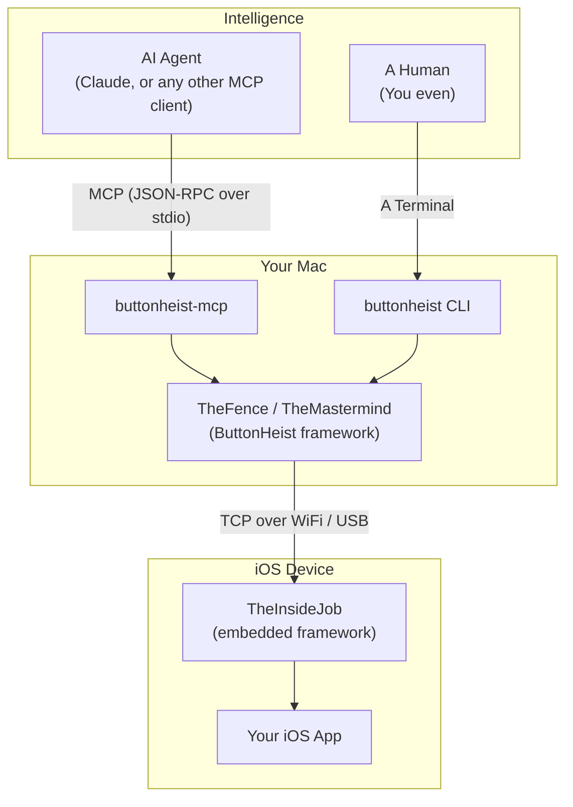

# Interface out. Agents in. Clean escape.

The Button Heist gives AI agents (and humans) full control over iOS apps. Embed TheInsideJob in your app, then connect with the MCP server to let the agent inspect UI, tap buttons, swipe, type, and navigate — all programmatically over a persistent connection.

## Features

- **MCP server** — AI agents like Claude or Codex drive any iOS app through native tool calls
- **Full gesture simulation** — Tap, long press, swipe, drag, pinch, rotate, two-finger tap, draw path, draw bezier
- **Multi-touch** — Simultaneous multi-finger gesture injection via IOKit HID events
- **Text input** — Type text, delete characters, read back values — via UIKeyboardImpl injection
- **Real-time inspection** — See UI elements and screenshots update as the app changes
- **Screen recording** — Record H.264/MP4 video of interaction sequences with auto-stop on inactivity
- **Fingerprint tracking** — Visual touch indicators track finger positions during gestures, visible on-device and in recordings
- **TLS encryption** — All traffic encrypted with TLS 1.2+. Self-signed ECDSA certificates generated at runtime, verified via SHA-256 fingerprint pinning through Bonjour
- **Token auth** — Token-based authentication with auto-generated or configured secrets, plus on-device Allow/Deny approval for new connections
- **Auto-start** — TheInsideJob starts automatically when your app launches (ObjC `+load`, DEBUG only)
- **Multi-device** — Run many instances on many simulators with stable identifiers
- **USB auto-discovery** — USB devices discovered automatically alongside WiFi via Bonjour
- **Multiple interfaces** — MCP server, CLI, or build your own

## Meet the Crew

Every heist needs a team. ButtonHeist is built around a crew of specialists.

### The Inside Team (iOS)

| Character | What they do |
|-----------|--------------|
| **TheInsideJob** | The whole operation. Runs in your iOS app: TCP server, Bonjour, accessibility hierarchy, command dispatch to the crew. |
| **TheMuscle** | Bouncer. Auth, session lock, on-device Allow/Deny. Keeps the door; only one driver at a time. |
| **TheSafecracker** | Cracks the UI. Taps, long press, swipe, drag, pinch, rotate, text entry, accessibility actions — gets past any control. |
| **TheStakeout** | Lookout. Captures H.264/MP4 screen recordings; the fingerprint overlay is included so every gesture shows in the tape. |
| **TheFingerprints** | Evidence. Touch indicators on screen during gestures; visible live and baked into TheStakeout’s recordings. |
| **TheBagman** | Handles the score. Element cache, hierarchy, animation detection; live view pointers never leave TheBagman. |
| **ThePlant** | Runs the advance, gets the team inside. ObjC `+load` hook that boots TheInsideJob before any Swift runs. Link the framework — no app code. |

### The Outside Team (macOS)

| Character | What they do |
|-----------|--------------|
| **TheMastermind** | Coordinator. @Observable over TheHandoff: discovery, connection, callbacks for SwiftUI and tools. |
| **TheFence** | Interface between the buyer and the team. Command dispatch for CLI and MCP. Takes orders and delivers goods; delegates connection to TheMastermind. |

### The Legitimate Front

Engage the team for your next job via MCP or CLI.

| Character | What they do |
|-----------|--------------|
| **ButtonHeistCLI** | Your orders. `list`, `session`, `activate`, `touch`, `type`, `screenshot`, `record`, and more. |
| **ButtonHeistMCP** | Agent interface. 16 tools that call through TheFence so AI agents can run the job natively, including `run_batch` and `get_session_state`. |

## Architecture



## Modules

| Module | Platform | Description | Details |
|--------|----------|-------------|---------|
| **TheScore** | iOS + macOS | Shared types, messages, and constants | [ButtonHeist/](ButtonHeist/) |
| **TheInsideJob** | iOS | Server + synthetic touch injection, embedded in your app | [ButtonHeist/](ButtonHeist/) |
| **ButtonHeist** | macOS | Client framework (TheMastermind, TheFence, TheHandoff); re-exports TheScore | [ButtonHeist/](ButtonHeist/) |
| **ButtonHeistMCP** | macOS | MCP server — 16 tools dispatching through TheFence, including `run_batch` and `get_session_state` | [ButtonHeistMCP/](ButtonHeistMCP/) |
| **buttonheist** | macOS | CLI tool for device discovery, sessions, actions, gestures, screenshots, recording, scrolling, and text/edit commands | [ButtonHeistCLI/](ButtonHeistCLI/) |

## Quick Start

### 1. Add TheInsideJob to Your iOS App

Get `TheInsideJob` inside the building by linking or embedding it in your iOS target, then import it somewhere on your app's startup path. Once the framework is loaded, ObjC `+load` starts the operation for you - no extra bootstrap code, no ceremony.

```swift
import SwiftUI
import TheInsideJob

@main
struct MyApp: App {
    // TheInsideJob auto-starts on framework load

    var body: some Scene {
        WindowGroup {
            ContentView()
        }
    }
}
```

Add the required Info.plist entries:

```xml
<!-- Network permissions -->
<key>NSLocalNetworkUsageDescription</key>
<string>This app uses local network to communicate with the element inspector.</string>
<key>NSBonjourServices</key>
<array>
    <string>_buttonheist._tcp</string>
</array>
```

### 2. Connect with an AI Agent (MCP)

Build the MCP server and drop a `.mcp.json` in your project root:

```bash
cd ButtonHeistMCP && swift build -c release
```

```json
{
  "mcpServers": {
    "buttonheist": {
      "command": "./ButtonHeistMCP/.build/release/buttonheist-mcp",
      "args": []
    }
  }
}
```

That's it. When Claude (or any MCP client) opens a session in your project, it spawns the server, discovers your iOS app via Bonjour, and the agent can interact naturally:

```
Agent: "Let me see what's on screen"
→ calls get_screen → sees the app as an image
→ calls get_interface → reads the UI hierarchy as structured data

Agent: "I'll tap the login button"
→ calls activate(identifier: "loginButton")
→ gets success/failure result with what changed in the UI

Agent: "Let me type an email address"
→ calls type_text(text: "user@example.com", identifier: "emailField")
→ gets the field's current value back

Agent: "Check whether I already have a live session"
→ calls get_session_state
→ gets connection state, device/app identity, timeouts, recording flag, and last-action summary

Agent: "Run the next three steps as one operation"
→ calls run_batch with an ordered `steps` array
→ gets per-step results plus `completedSteps`, `failedIndex`, and total timing
```
For device targeting, command reference, and internals: **[ButtonHeistMCP/](ButtonHeistMCP/)**

### 3. Connect with the CLI

If you want to work the job yourself instead of handing it to an agent, the CLI is the straight shot.

```bash
cd ButtonHeistCLI && swift build -c release && cd ..
BH=./ButtonHeistCLI/.build/release/buttonheist

$BH list                                                  # Discover devices
$BH session                                               # Persistent session (get_interface, activate, etc.)
printf '{"command":"get_session_state"}\n' | $BH session --format json
$BH activate --identifier loginButton                     # Activate a button
$BH touch one_finger_tap --x 100 --y 200                 # Tap coordinates
$BH touch swipe --identifier list --direction up         # Swipe a list
$BH type --text "Hello" --identifier nameField           # Type text
$BH screenshot --output screen.png                       # Capture screenshot
$BH record --output demo.mp4                             # Record screen (auto-stops on inactivity)
```

Full CLI reference: **[ButtonHeistCLI/](ButtonHeistCLI/)** 

### 4. Connect over USB

USB devices are discovered automatically alongside WiFi. `buttonheist list` verifies each candidate with a lightweight status probe before printing it, so stale Bonjour entries are filtered out:

```bash
$BH list
# [0] a1b2c3d4  AccessibilityTestApp  (WiFi)
# [1] usb-iPhone  iPhone (USB)
```

See [docs/USB_DEVICE_CONNECTIVITY.md](docs/USB_DEVICE_CONNECTIVITY.md) for details.

## Development

### Prerequisites

- Xcode with Swift 6 package support
- iOS 17+ / macOS 14+
- `git submodule update --init --recursive`
- [Tuist](https://tuist.io)

### Building

When you're setting up the hideout from a fresh clone, generate the workspace through Tuist and then open it in Xcode:

```bash
git submodule update --init --recursive
tuist generate
open ButtonHeist.xcworkspace
```

### Project Structure

```
ButtonHeist/
├── ButtonHeist/Sources/          # Core frameworks (TheScore, TheInsideJob, ButtonHeist)
├── ButtonHeistMCP/               # MCP server (Swift Package)
├── ButtonHeistCLI/               # CLI tool (Swift Package)
├── TestApp/                      # SwiftUI + UIKit test applications
├── AccessibilitySnapshot/        # Git submodule (hierarchy parsing)
├── docs/                         # Architecture, API, protocol, USB docs
└── ai-fuzzer/                    # Git submodule: autonomous AI app fuzzing framework
```

### ai-fuzzer submodule

The AI fuzzer lives in its own repository and is included here as a Git submodule at `ai-fuzzer/`.

- To initialize it in a fresh clone:

```bash
git submodule update --init --recursive
```

- To update it later (after pulling main):

```bash
git submodule update --remote ai-fuzzer
```

## Troubleshooting

### Device not appearing (WiFi)

1. Ensure both devices are on the same network
2. Check that TheInsideJob framework is linked
3. Verify Info.plist has the Bonjour service entry
4. On iOS, accept the local network permission prompt

### USB connection refused

1. Check device is connected: `xcrun devicectl list devices`
2. Verify app is running on device
3. Find IPv6 tunnel: `lsof -i -P -n | grep CoreDev`

### Empty hierarchy

- Ensure the app has visible UI on screen
- The root view must be accessible to UIAccessibility

## Documentation

**Frameworks and tools:**
- [ButtonHeist Frameworks](ButtonHeist/) — Core modules: TheScore, TheInsideJob, ButtonHeist client
- [MCP Server](ButtonHeistMCP/) — AI agent integration via Model Context Protocol
- [CLI Reference](ButtonHeistCLI/) — Full command-line documentation
- [Test Apps](TestApp/) — Sample iOS applications for testing

**Technical docs:**
- [Architecture](docs/ARCHITECTURE.md) — System design and data flow diagrams
- [API Reference](docs/API.md) — Complete API for all modules
- [Wire Protocol](docs/WIRE-PROTOCOL.md) — Protocol v6.0 specification
- [Authentication](docs/AUTH.md) — Token auth, session locking, UI approval
- [USB Connectivity](docs/USB_DEVICE_CONNECTIVITY.md) — CoreDevice tunnel deep dive

**Project:**
- [AI Fuzzer](ai-fuzzer/) — Autonomous iOS app fuzzer (separate repository, included here as a Git submodule) built entirely with prompt engineering on top of Button Heist (zero traditional code — 6,000+ lines of markdown)
- [Contributing](CONTRIBUTING.md) — Development setup and guidelines
## License

Apache License 2.0 — see `LICENSE`.

## Acknowledgments

- [KIF (Keep It Functional)](https://github.com/kif-framework/KIF) — TheSafecracker's touch synthesis and gesture simulation is heavily inspired by KIF's approach to programmatic UI interaction. KIF pioneered reliable techniques for tap, swipe, and text input injection on iOS that we built on.
- [AccessibilitySnapshot](https://github.com/cashapp/AccessibilitySnapshot) — Used for parsing UIKit accessibility hierarchies.
