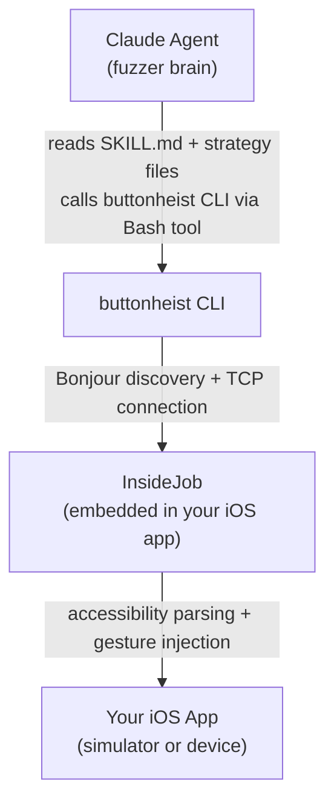

# AI Fuzzer

AI-powered iOS app fuzzing framework built on [ButtonHeist](../README.md). An autonomous Claude agent explores your app, interacts with every element, and discovers crashes, errors, and edge cases — all through the `buttonheist` CLI.

## How It Works

The Claude agent **is** the fuzzer. SKILL.md teaches it how to observe screens, reason about what to try, execute gestures, detect failures, and report findings. No scripts, no test harnesses — just an AI agent with eyes and hands for your iOS app.



## Prerequisites

- Xcode 15+
- An iOS app with InsideJob embedded (see [main README](../README.md#1-add-insidejob-to-your-ios-app))
- ButtonHeist CLI built

## Setup

### 1. Build the CLI

```bash
cd ../ButtonHeistCLI
swift build -c release
```

### 2. Run your iOS app

Launch your app in the iOS Simulator (or on a USB-connected device). InsideJob auto-starts when the app loads.

### 3. Start the fuzzer

```bash
cd ai-fuzzer
claude
```

Claude Code reads SKILL.md, uses the buttonheist CLI via Bash to connect to your running app.

### Targeting a specific device

When multiple simulators or devices are running, add `--device` to CLI commands to target a specific one. The value is matched against device name, app name, simulator UDID, or short ID:

```bash
buttonheist list                           # See all available devices
buttonheist watch --once --device "iPad Pro"  # Target a specific device
```

Use `buttonheist list` to see all available devices.

## Commands

| Command | Description |
|---------|-------------|
| `/fuzz` | Autonomous fuzzing loop — explores the app and finds bugs |
| `/fuzz-validate` | Validate a specific feature — targeted testing with regression checks |
| `/fuzz-explore` | Deep-dive on the current screen — catalogs every element and tries every action |
| `/fuzz-map-screens` | Builds a navigation graph of all reachable screens |
| `/fuzz-stress-test` | Rapid-fire interaction testing on elements |
| `/fuzz-report` | Generates a structured findings report |

### Quick Start

```
> /fuzz
```

This starts the default fuzzing strategy (systematic traversal). The agent will:
1. Capture the screen and read the interface hierarchy
2. Try every interactive element
3. Navigate to new screens when discovered
4. Detect crashes, errors, and anomalies
5. Generate a report when done

### Feature Validation

```
> /fuzz-validate todo list
```

Navigates directly to the Todo List screen, checks known findings (regressions), runs workflow tests (add/edit/delete lifecycle, persistence), and reports results scoped to that feature.

```
> /fuzz-validate settings focus on cross-screen effects
```

Validates the Settings screen with extra focus on how settings changes affect other screens.

### Targeted Exploration

```
> /fuzz-explore
```

Deep-dives on whatever screen is currently showing. Catalogs every element, tries every action, and reports what it finds.

### Stress Testing

```
> /fuzz-stress-test
```

Rapidly hammers elements with repeated taps, swipes, pinches, and rotations to find stability issues.

## Strategies

Strategy files in `references/strategies/` define how the agent explores:

| Strategy | Focus |
|----------|-------|
| `systematic-traversal` | Every element, every action, breadth-first (default) |
| `boundary-testing` | Edge coordinates, extreme values, out-of-bounds taps |
| `gesture-fuzzing` | Unusual gestures on elements that don't expect them |
| `state-exploration` | Deep navigation, back-navigation, path coverage |

Pass a strategy to `/fuzz`:
```
> /fuzz boundary-testing
```

## Findings

Findings are categorized by severity:

| Severity | Meaning |
|----------|---------|
| **CRASH** | App died — connection lost after an action |
| **ERROR** | Action failed unexpectedly (not just "element not found") |
| **ANOMALY** | Unexpected state change, visual glitch, or missing element |
| **INFO** | Interesting behavior worth noting |

Reports are saved to `.fuzzer-data/reports/` as timestamped markdown files.

## Works With Any App

This fuzzer is **app-agnostic**. It discovers the UI dynamically via `buttonheist watch --once` and doesn't rely on hard-coded identifiers or screen layouts. Any iOS app with InsideJob embedded can be fuzzed.
