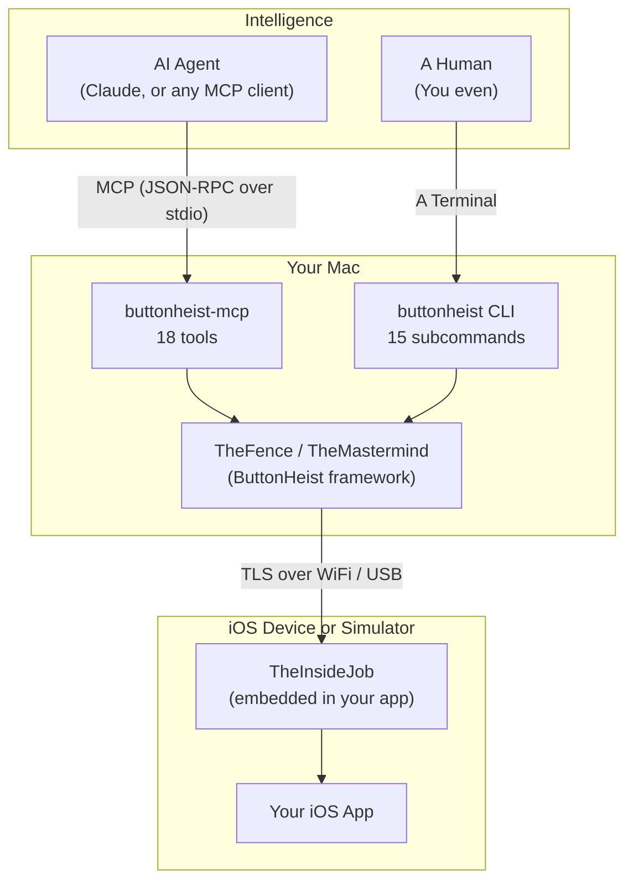

# Interface out. Agents in. Clean escape.

Button Heist gives AI agents (and humans) full programmatic control of iOS apps. Embed one framework, connect over MCP or CLI, and drive any screen — tap, swipe, type, scroll, inspect, record — all through a persistent TLS-encrypted connection.

## Why Button Heist

Most iOS automation tools operate outside the app process through XPC or screenshot parsing. Button Heist runs **inside** the app, reading live UIAccessibility objects and injecting real IOHIDEvent touches. This means:

- **Interface deltas, not re-fetches** — after every action, you get a structured diff (elements added/removed, values changed, or screen changed) instead of re-reading the full tree
- **Stable element identifiers** — `heistId` gives every element a deterministic ID derived from its traits and label, so agents can target `button_login` across screen transitions without fragile index math
- **Animation-aware idle detection** — `wait_for_idle` watches CALayer animations, not a fixed sleep timer
- **Real multi-touch** — pinch, rotate, two-finger tap, bezier paths, and arbitrary polyline gestures via IOHIDEvent injection. Not coordinate-based XCUITest synthetics
- **Full accessibility fidelity** — activation points, `respondsToUserInteraction`, custom content, named custom actions, custom rotors. Information that's lost at the process boundary external tools operate through
- **Action outcome expectations** — declare what you expect (`screen_changed`, `layout_changed`, or `{"value": "expected text"}`) and the framework reports whether it happened. The caller decides what to do
- **Batch execution** — `run_batch` sends multiple commands in one round trip with per-step expectations and short-circuit-on-failure semantics
- **Physical device support** — USB devices discovered automatically via CoreDevice tunnels alongside WiFi/Bonjour. Same TLS/auth handshake, same API

### Benchmarks

Same Claude Sonnet agent, same 11-step workflow (n=6):

| | Turns | Wall time | Tokens |
|---|-------|-----------|--------|
| Button Heist (base) | 31 | 123s | 1,137K |
| ios-simulator-mcp | 41 | 175s | 1,550K |
| Button Heist + batch + expect | **12** | **83s** | **381K** |

75% context reduction vs ios-simulator-mcp when using batch and expectations. Details in [benchmarks/README.md](benchmarks/README.md).

## Features

### Interaction

- **Accessibility-first activation** — `activate` calls `accessibilityActivate()` first, falls back to synthetic tap. Works on custom controls that swallow raw touch events
- **Full gesture suite** — tap, long press, swipe, drag, pinch, rotate, two-finger tap, draw arbitrary paths and bezier curves
- **Text input** — type characters, delete, clear fields, read back values — works with software and hardware keyboard modes. Edit actions: copy, paste, cut, select, selectAll. Pasteboard read/write without triggering the iOS "Allow Paste" dialog
- **Scroll semantics** — `scroll` (one page by direction), `scroll_to_visible` (minimal scroll until element is on screen), `scroll_to_edge` (jump to top/bottom/left/right)
- **Accessibility actions** — increment/decrement on adjustable elements, trigger named custom actions, dismiss keyboard

### Inspection

- **Structured UI hierarchy** — full accessibility tree with labels, values, traits (18 named mappings including private `backButton`), frames, activation points, custom content, and available actions
- **heistId stable identifiers** — developer `accessibilityIdentifier` takes priority; otherwise synthesized from trait + label (e.g., `button_login`, `header_settings`). Disambiguated with `_1`, `_2` suffixes when duplicated
- **Interface deltas** — four delta kinds: `screenChanged` (new view controller), `elementsChanged` (added/removed), `valuesChanged` (text updates), `noChange`. Returned after every action
- **Screenshots** — PNG capture, inline base64 or saved to file
- **Animation idle detection** — blocks until CALayer animations settle, no guessing

### Recording

- **H.264/MP4 screen recording** — configurable FPS (1–15), resolution scale (0.25–1.0)
- **Auto-stop** — on inactivity timeout (default 5s) or max duration (default 60s)
- **Touch overlay** — finger position indicators baked into the video via TheFingerprints
- **Interaction log** — timestamped JSON of all actions during a recording session

### Agent Integration

- **18 MCP tools** — purpose-built for AI agents. Video data stripped from context window (metadata only unless output path given)
- **Batch execution** — `run_batch` sends ordered steps in one call. Per-step expectations, `stop_on_error` or `continue_on_error` policy, aggregated timing
- **Session state** — `get_session_state` returns connection status, device identity, recording state, last-action summary
- **Outcome expectations** — `expect` on any action: `"screen_changed"`, `"layout_changed"`, or `{"value": "text"}`. Framework reports; caller decides

### Security

- **TLS 1.2+** — self-signed ECDSA certificates generated at runtime, verified via SHA-256 fingerprint pinning through Bonjour TXT records
- **Token auth** — auto-generated or configured secrets. On-device Allow/Deny approval UI for new connections
- **Session locking** — one driver at a time. Additional connections get `sessionLocked` with context

### Connectivity

- **WiFi** — Bonjour auto-discovery on `_buttonheist._tcp`
- **USB** — CoreDevice IPv6 tunnel discovery via `xcrun devicectl` + `lsof`. Same API as WiFi
- **Multi-device** — run many instances on many simulators. `buttonheist list` verifies each candidate with a status probe before reporting
- **Auto-reconnect** — session mode reconnects automatically on connection drop

## Architecture



### Modules

| Module | Platform | What it does |
|--------|----------|-------------|
| **TheScore** | iOS + macOS | Wire protocol: 33 client messages, 18 server messages, `HeistElement`, `InterfaceDelta`, protocol v6.1 |
| **TheInsideJob** | iOS | In-app server: TCP + Bonjour, accessibility capture, touch injection, recording, auth. Auto-starts via ObjC `+load` (DEBUG only) |
| **ButtonHeist** | macOS | Client framework: TheFence (33-command dispatch), TheMastermind (@Observable coordinator), TheHandoff (discovery + connection) |
| **ButtonHeistMCP** | macOS | MCP server: 18 tools dispatching through TheFence, including `run_batch` and `get_session_state` |
| **buttonheist** | macOS | CLI: 15 subcommands + interactive session REPL with auto-reconnect and three output formats (human/json/compact) |

### Meet the Crew

Every heist needs a team.

#### The Score

| Name | Role |
|------|------|
| **TheScore** | The shared playbook. Wire protocol types, messages, and constants used by both sides of the connection |

#### The Inside Team (iOS)

| Name | Role |
|------|------|
| **TheInsideJob** | The whole operation. TCP server, Bonjour, accessibility hierarchy, command dispatch to the crew |
| **TheSafecracker** | Cracks the UI. Taps, swipes, drags, pinch, rotate, text entry, edit actions — all via IOHIDEvent |
| **TheBagman** | Handles the goods. Accessibility hierarchy capture, heistId assignment, delta computation |
| **TheMuscle** | Keeps the door. Token validation, Allow/Deny UI, session lock, connection scoping |
| **TheStakeout** | The lookout. H.264 screen recording, frame timing, inactivity detection |
| **TheFingerprints** | Evidence. Touch indicators rendered on-device and baked into recordings |
| **TheTripwire** | Timing coordinator. Gates all "is the UI ready?" decisions — animation detection, presentation layer fingerprinting, settle waits |
| **ThePlant** | The advance. ObjC `+load` hook boots TheInsideJob before any Swift runs — link the framework, no app code |

#### The Outside Team (macOS)

| Name | Role |
|------|------|
| **TheMastermind** | Runs the show. @Observable coordinator over TheHandoff: discovery, connection, callbacks |
| **TheFence** | Moves the merchandise. 33 commands routed from CLI and MCP to the connected device |
| **TheHandoff** | Gets everyone in position. Bonjour + USB discovery, TLS setup, injectable closures for testing |

#### The Legitimate Front

| Name | Role |
|------|------|
| **ButtonHeistCLI** | Your orders. `list`, `session`, `activate`, `touch`, `type`, `screenshot`, `record`, and more |
| **ButtonHeistMCP** | Agent interface. 18 tools that call through TheFence so AI agents can run the job natively |

## Quick Start

### 1. Embed TheInsideJob in Your iOS App

Link or embed the framework in your iOS target and import it anywhere on the startup path. ObjC `+load` handles the rest.

```swift
import SwiftUI
import TheInsideJob

@main
struct MyApp: App {
    // TheInsideJob auto-starts on framework load (DEBUG only)
    var body: some Scene {
        WindowGroup { ContentView() }
    }
}
```

Add the required Info.plist entries:

```xml
<key>NSLocalNetworkUsageDescription</key>
<string>This app uses local network to communicate with the element inspector.</string>
<key>NSBonjourServices</key>
<array>
    <string>_buttonheist._tcp</string>
</array>
```

### 2. Connect with an AI Agent (MCP)

Build the MCP server and add it to your project's `.mcp.json`:

```bash
cd ButtonHeistMCP && swift build -c release
```

```json
{
  "mcpServers": {
    "buttonheist": {
      "command": "./ButtonHeistMCP/.build/release/buttonheist-mcp",
      "args": []
    }
  }
}
```

The agent discovers your app via Bonjour and can interact immediately:

```
Agent: "Let me see what's on screen"
→ get_screen → screenshot as inline image
→ get_interface → structured hierarchy with heistIds

Agent: "Tap the login button"
→ activate(heistId: "button_login")
→ result includes interface delta showing what changed

Agent: "Type credentials and submit"
→ run_batch(steps: [
    {command: "type_text", identifier: "emailField", text: "user@example.com"},
    {command: "type_text", identifier: "passwordField", text: "hunter2"},
    {command: "activate", identifier: "submitButton", expect: "screen_changed"}
  ])
→ 3 steps in one round trip, per-step results, short-circuits on failure
```

### 3. Connect with the CLI

If you want to run the job yourself instead of handing it to an agent, the CLI is the straight shot.

```bash
cd ButtonHeistCLI && swift build -c release && cd ..
BH=./ButtonHeistCLI/.build/release/buttonheist

$BH list                                                  # Discover devices (WiFi + USB)
$BH session                                               # Interactive REPL
$BH activate --identifier loginButton                     # Activate an element
$BH touch one_finger_tap --x 100 --y 200                 # Coordinate tap
$BH type --text "Hello" --identifier nameField            # Type into a field
$BH scroll --direction down --identifier scrollView       # Scroll one page
$BH scroll_to_visible --identifier targetElement          # Scroll until visible
$BH screenshot --output screen.png                        # Capture screenshot
$BH record --output demo.mp4 --fps 8 --scale 0.5         # Record with touch overlay
```

The session REPL accepts both JSON and shorthand: `tap loginButton`, `type "hello"`, `scroll down list`, `screen`.

### 4. USB Devices

USB devices appear alongside WiFi in `buttonheist list` — no extra configuration. Button Heist discovers them via CoreDevice IPv6 tunnels.

```bash
$BH list
# [0] a1b2c3d4  AccessibilityTestApp  (WiFi)
# [1] usb-iPhone  iPhone (USB)
```

See [USB Connectivity](docs/USB_DEVICE_CONNECTIVITY.md) for the deep dive.

## Development

### Prerequisites

- Xcode with Swift 6 package support
- iOS 17+ / macOS 14+
- `git submodule update --init --recursive`
- [Tuist](https://tuist.io)

### Building

Setting up from a fresh clone:

```bash
git submodule update --init --recursive
tuist generate
open ButtonHeist.xcworkspace
```

### Project Structure

```
ButtonHeist/
├── ButtonHeist/Sources/          # Core frameworks (TheScore, TheInsideJob, ButtonHeist)
├── ButtonHeistMCP/               # MCP server (Swift Package)
├── ButtonHeistCLI/               # CLI tool (Swift Package)
├── TestApp/                      # SwiftUI + UIKit test applications
├── AccessibilitySnapshot/        # Git submodule (hierarchy parsing)
├── docs/                         # Architecture, API, protocol, auth, USB docs
│   └── dossiers/                 # Per-module technical documentation
└── ai-fuzzer/                    # Git submodule: autonomous AI app fuzzer
```

### ai-fuzzer

The AI fuzzer is a separate repository included as a Git submodule at `ai-fuzzer/`. An autonomous iOS app fuzzer built entirely with prompt engineering on top of Button Heist — 6,000+ lines of markdown, zero traditional code.

```bash
git submodule update --init --recursive   # Initialize
git submodule update --remote ai-fuzzer   # Update later
```

## Troubleshooting

### Device not appearing (WiFi)

1. Both devices on the same network
2. TheInsideJob framework linked to your target
3. Info.plist has the `_buttonheist._tcp` Bonjour service entry
4. iOS local network permission accepted

### USB connection refused

1. Device connected: `xcrun devicectl list devices`
2. App running on device
3. IPv6 tunnel visible: `lsof -i -P -n | grep CoreDev`

### Empty hierarchy

- App has visible UI on screen
- Root view is accessible to UIAccessibility

## Documentation

**Frameworks and tools:**
- [ButtonHeist Frameworks](ButtonHeist/) — TheScore, TheInsideJob, ButtonHeist client
- [MCP Server](ButtonHeistMCP/) — 16-tool AI agent integration
- [CLI Reference](ButtonHeistCLI/) — Full command-line documentation
- [Test Apps](TestApp/) — Sample iOS applications

**Technical docs:**
- [Architecture](docs/ARCHITECTURE.md) — System design and data flow
- [API Reference](docs/API.md) — Complete API for all modules
- [Wire Protocol](docs/WIRE-PROTOCOL.md) — Protocol v6.1 specification
- [Authentication](docs/AUTH.md) — Token auth, session locking, UI approval
- [USB Connectivity](docs/USB_DEVICE_CONNECTIVITY.md) — CoreDevice tunnel deep dive
- [Versioning](docs/VERSIONING.md) — SemVer strategy and release workflow
- [Bonjour Troubleshooting](docs/BONJOUR_TROUBLESHOOTING.md) — MDM stealth mode workarounds
- [Reviewer's Guide](docs/REVIEWERS-GUIDE.md) — Quick orientation for new reviewers
- [Competitive Landscape](docs/competitive-landscape.md) — How Button Heist compares
- [The Argument](docs/the-argument.md) — Why this approach, why now
- [Benchmark Data](benchmarks/README.md) — Performance measurements
- [Crew Dossiers](docs/dossiers/) — Per-crew-member technical deep dives

**Project:**
- [AI Fuzzer](ai-fuzzer/) — Autonomous iOS app fuzzer built on Button Heist

## License

Apache License 2.0 — see `LICENSE`.

## Acknowledgments

- [KIF (Keep It Functional)](https://github.com/kif-framework/KIF) — TheSafecracker's touch synthesis is built on KIF's pioneering work in programmatic iOS UI interaction.
- [AccessibilitySnapshot](https://github.com/cashapp/AccessibilitySnapshot) — Used for parsing UIKit accessibility hierarchies.
