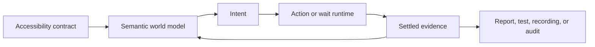

[](https://github.com/RoyalPineapple/TheButtonHeist/actions/workflows/ci.yml)
[](https://github.com/RoyalPineapple/TheButtonHeist/releases/latest)
[](LICENSE)

# Interface out. Agents in. Clean escape.

Button Heist turns the app's accessibility contract into a rich, programmable
world model: interactive, reliable, and durable.

Every iOS app already exposes a semantic control plane: the interface VoiceOver
uses. It is not a screenshot. It is not a pile of rectangles. It is labels,
roles, values, states, actions, focus, structure, and change.

That interface is the contract. If users can do something visually, the app
should expose the same intent semantically. Button Heist keeps that contract
live, acts through it, and returns settled evidence about what changed.
It makes the route VoiceOver proves real available to agents, tests, recordings,
and audits.

Agents already reason in intent. Tests need durable assertions. Recordings need
to remember purpose, not mechanics. Accessibility audits need proof that the
semantic interface works. Button Heist connects those jobs through one runtime.

Link `TheInsideJob` into a debug build, connect over MCP or CLI, and the agent
runs the job by intent. Activate the Login button. Type into the Email field.
Run a custom action. Move through a rotor. Assert that the screen changed.

No blind taps for ordinary controls. No screenshot parsing loops pretending to understand the app. Every job leaves evidence: what ran, what changed, and whether the expectation held.



Agent automation, integration tests, accessibility audits, recordings, and
replay are not separate systems. They are the same job at different times.
If a flow works through the accessibility contract, the app works and the
contract held. If it fails, the same evidence shows what broke and where the
contract failed.

## See The Job

One direct command:

```bash
buttonheist activate \
  --label "Continue" \
  --traits button \
  --expect '{"type":"screen_changed"}'
```

One heist plan:

```text
activate "Login"
expect screen changed
wait for "Dashboard"
```

One recording becoming a test:

```bash
buttonheist start_heist --identifier login-flow --app com.example.app
buttonheist type_text "user@example.com" \
  --label "Email" \
  --expect '{"type":"element_updated","element":{"label":"Email"},"property":"value","to":"user@example.com"}'
buttonheist activate \
  --label "Login" \
  --traits button \
  --expect '{"type":"screen_changed"}'
buttonheist stop_heist --output login-flow.heist
buttonheist play_heist --input login-flow.heist --junit login-flow.xml
```

All three routes enter the same runtime and come back with settled semantic
evidence. The full examples live in [examples/](examples/).

## The Take

A geometry-first route can tell the agent that a tap landed:

```
→ tap(x: 201, y: 456)
← "Tapped successfully"
```

Button Heist tells the agent what the app became after the move:

```
→ activate target={"label":"Sign In","traits":["button"]} expect={"type":"screen_changed"}
← account_home | activate: screen changed
  6 elements
  [0] "Account Home" header
  [1] "Checking balance":"$1,248.32" staticText
  [2] "Recent transfer":"Coffee Roasters, $6.42" staticText
  [3] "Send Money" button
  [4] "Deposit Check" button
  [5] "Settings" button
```

The first receipt says the move happened.

Button Heist brings back state. The agent starts the next step from the changed
interface, not from another round of guessing.

That is the line: accessibility is not metadata on the way to a tap. It is the
control plane. Button Heist acts through it, observes through it, records through
it, replays through it, and validates through it.

## Choose the Route

Button Heist gives the crew three routes in, and each has a job.

Semantic commands are the inside route. Use `activate`, `type_text`, custom actions, rotors, and element-targeted heist steps for ordinary app controls and accessible workflows. Name the target by label, identifier, matcher, or predicate. Button Heist handles the screen work: resolve the target, reveal it through the owning scroll or container path when needed, acquire fresh live geometry, perform the accessibility operation, wait for the interface to settle, and report what changed.

`activate` means accessibility activation. Button Heist asks the target element to perform its accessibility activation behavior. When UIKit exposes activation through a fresh activation point, delivering through that point is still part of `activate`. The command is "activate this accessible element." It is not a coordinate gesture.

Viewport commands are the lookout. Use `scroll`, `scroll_to_visible`, screenshots, and hierarchy inspection when the viewport itself is the subject: what is visible, where a scroll view sits, or what a human would see right now. They are directly executable debug commands, not durable heist primitives, and they are not setup steps for normal semantic actions.

Mechanical gestures are the lockpicks, not the front door. Use `one_finger_tap`, `long_press`, `swipe`, and `drag` for maps, canvases, drawing surfaces, games, custom controls, or any product behavior where the gesture itself is the intent. For standard buttons, fields, menus, and other accessible controls, prefer semantic commands.

Recordings are the getaway plan. A good heist records "activate the Delete button and expect it to disappear." It does not preserve pre-action viewport movement or coordinate mechanics when semantic intent is available. Recorded flows should survive layout movement and fail when the app's accessible contract changes.

## When Pixels Are The Job

Pixels are sometimes the product surface: maps, canvases, drawing tools, games,
and custom gesture regions. Button Heist has explicit routes for those jobs.

They stay explicit. The default path for buttons, fields, menus, toggles, links,
custom accessibility actions, rotors, and heist programs is semantic. If the app
exposes an accessibility contract, Button Heist acts through that contract.

## Quick Start

### 1. Add TheInsideJob

Link `TheInsideJob` to your debug target. It starts a local TCP server via ObjC `+load`; no app setup code is required. Release builds leave the server behind.

```swift
import SwiftUI
import TheInsideJob

@main
struct MyApp: App {
    var body: some Scene {
        WindowGroup { ContentView() }
    }
}
```

By default the server accepts simulator loopback and USB-scoped connections, but
does not publish Bonjour on the LAN. If you opt into network scope with
`INSIDEJOB_SCOPE=simulator,usb,network` or `InsideJobScope`, add the
Info.plist entries that allow Bonjour advertisement:

```xml
<key>NSLocalNetworkUsageDescription</key>
<string>This app uses local network to communicate with the element inspector.</string>
<key>NSBonjourServices</key>
<array>
    <string>_buttonheist._tcp</string>
</array>
```

### 2. Install the agent tools

Install the CLI and MCP server:

```bash
brew install RoyalPineapple/tap/buttonheist
```

Add the MCP server to your project's `.mcp.json`:

```json
{
  "mcpServers": {
    "buttonheist": {
      "command": "buttonheist-mcp",
      "args": []
    }
  }
}
```

The MCP adapter projects its tools from the Fence command contract; the
generated [MCP Tool Reference](docs/reference/mcp-tools.md) is the current tool
surface. Agents typically start with `get_interface`, then act with semantic
commands such as `activate`, `type_text`, and `run_heist`. Default connections
use loopback, USB, named targets, or direct `host:port` targets; Bonjour
discovery is available only when the app opts into network scope:

```
Agent: "I need to log the user in"

→ get_interface
  textfield_email, textfield_password, button_login (12 elements)

→ run_heist([type_text into textfield_email, activate button_login])
  step 1: value → "user@example.com" ✓
  step 2: screen changed: login gone, dashboard appeared ✓
```

The agent can work in terms of UI intent instead of coordinates.

### 3. Use the CLI directly

```bash
cd ButtonHeistCLI && swift build -c release && cd ..
BH=./ButtonHeistCLI/.build/release/buttonheist

$BH list_devices
$BH get_interface
$BH activate --identifier loginButton
$BH type_text "Hello" --identifier nameField
$BH get_screen --output screen.png
```

The `json_lines` command keeps one connection open and accepts canonical machine JSON
objects only. Direct CLI commands and MCP tools project from the same Fence
command contract.

For the complete generated CLI command surface, see the
[Command Reference](docs/reference/commands.md). For workflow context, see the
[CLI README](ButtonHeistCLI/README.md).

### First successful job

Use this path when proving a fresh integration or the included BH Demo app:

```bash
# 1. Run the debug app with TheInsideJob linked.
#    For BH Demo, launch the app from Xcode or a simulator build.

# 2. Connect and read the semantic interface.
$BH list_devices
$BH get_interface

# 3. Act through accessibility intent and declare the expected outcome.
$BH activate --label "Continue" --traits button --expect '{"type":"screen_changed"}'

# 4. Record a semantic heist test.
$BH start_heist --identifier first-flow --app com.buttonheist.testapp
$BH get_interface
$BH activate --label "Continue" --traits button --expect '{"type":"screen_changed"}'
$BH stop_heist --output first-flow.heist

# 5. Replay the durable test.
$BH play_heist --input first-flow.heist --junit first-flow.xml
```

The same shape works over MCP: call `get_interface`, perform semantic commands
with expectations, then use `start_heist` / `stop_heist` / `play_heist`. The
first useful response should show action evidence; the recorded heist should
contain semantic action intent and a semantic expectation.

## How the Job Runs

Button Heist treats each interaction as a transaction against the app's semantic
world model.

It resolves the target, performs the action through the accessibility contract,
waits for the interface to settle, and returns the semantic change that followed.

That changes the loop. Every action goes through the contract. Every result
comes back as evidence.

### 1. Results: trace-backed evidence after every action

After every command, Button Heist returns one typed result payload. Accessibility
traces are the source receipt; deltas are compact projections used for
expectations and formatting. Activate "Login" and the response carries the
capture chain plus derived screen context, not a second stored delta truth.

The agent does not need to re-read the screen to understand the result. Value updates include the element, property, old value, and new value. When nothing changes, the delta projection says `"noChange"`.

### 2. Expectations: assertions on the contract

Commands whose Fence contract includes `expect` can declare what should happen.
Button Heist checks the delta projection against that expectation and reports
pass/fail inline:

```json
{
  "command": "activate",
  "target": {"label": "Login", "traits": ["button"]},
  "expect": {"type": "screen_changed"}
}
```

Response: `{"expectation": {"met": true, "expectation": "screenChanged"}}`.

Expectations can check for `screen_changed`, `elements_changed`, or a specific `element_updated` result. When an expectation fails, the response still includes what actually happened.

The agent says what it expects. Button Heist says whether it happened.

### 3. Heists: typed multi-step plans

`run_heist` sends a typed `HeistPlan` in one round trip. Each step reports as a
tree node with path, kind, status, duration, action details when applicable,
expectation details when applicable, and selected branch or loop context when
applicable. If a step fails, the heist stops at that point.

The Swift authoring form should read like a small program against the app's
semantic contract:

```swift
try Heist("loginFlow") {
    Activate(.label("Login"))
        .expect(.changed(.screen()))

    WaitFor(timeout: .seconds(5)) {
        Case(.present(.label("Dashboard"))) {
            Warn("Login completed")
        }

        Case(.present(.label("Login Failed"))) {
            Fail("Login failed")
        }

        Else {
            Fail("Login did not settle")
        }
    }
}
```

The JSON transport is the same `HeistPlan` AST:

```json
{
  "command": "run_heist",
  "version": 2,
  "body": [
    {
      "type": "action",
      "action": {
        "command": {
          "type": "type_text",
          "payload": {
            "text": "user@example.com",
            "elementTarget": {"identifier": "textfield_email"}
          }
        },
        "expectation": {
          "predicate": {
            "type": "element_updated",
            "element": {"identifier": "textfield_email"},
            "property": "value",
            "to": "user@example.com"
          },
          "timeout": 2
        }
      }
    },
    {
      "type": "action",
      "action": {
        "command": {
          "type": "activate",
          "payload": {"identifier": "button_submit"}
        },
        "expectation": {
          "predicate": {"type": "screen_changed"},
          "timeout": 2
        }
      }
    }
  ]
}
```

Two actions, two assertions, one round trip. If the email field does not update, the submit step never runs.

### 4. Replay: the contract in CI

Button Heist can record a deterministic `.heist` fixture. Each step is stored as a semantic matcher: label, traits, stable identifiers, and ordinal only when disambiguation requires it. Capture-local annotations are recording evidence and diagnostics, not durable replay identity.

Replay uses the same action path as live automation. If a label changes, a trait disappears, or a custom action is removed, the replay fails and surfaces the broken contract. JUnit XML output (`--junit`) puts those failures into CI.

Because recordings are semantic, the same flow can run across device sizes and orientations. Coordinate recordings break when layout moves. Semantic recordings fail when the app's accessible interface changes, which is exactly the contract agents and VoiceOver users depend on.

The job does not disappear into tool-call history. It comes back as a replayable test.

## The Accessibility Contract

Button Heist does not treat accessibility as metadata to scrape and discard. It
makes the accessibility contract executable.

That matters. If the semantic interface is missing or wrong, Button Heist should
not paper over it with a lucky gesture. If an agent cannot find the control by
label, trait, value, state, or action, that is signal.

One contract. Many payoffs: agents move faster, tests get stronger, recordings
become durable, audits get evidence, and VoiceOver users get the interface they
were promised.

The formal product contract, boundary map, and conformance cases live in
[docs/ACCESSIBILITY-CONTRACT.md](docs/ACCESSIBILITY-CONTRACT.md). Recording and
semantic actionability have their own focused contracts:
[docs/RECORDING-CONTRACT.md](docs/RECORDING-CONTRACT.md) and
[docs/SEMANTIC-ACTIONABILITY.md](docs/SEMANTIC-ACTIONABILITY.md).

Canonical examples live in [examples/](examples/).

## What Breaks A Heist?

A command or heist fails when the accessibility contract fails or an explicit
viewport/debug command cannot be fulfilled. Common failures are:

- target missing
- target ambiguous
- accessibility action missing or wrong for the command
- expectation unmet
- semantic state cannot settle before timeout
- viewport state unavailable when the command explicitly asks about viewport

## Benchmarks

That contract shows up in the numbers. Button Heist was tested against a coordinate-based MCP server using the same model, app, tasks, and hardware. The suite covers 96 trials across 16 UI automation tasks: forms, navigation, lists, settings, custom actions, and long workflows.

Agents spend less time casing the screen, less time doing geometry, and more time acting through the contract.

|  | Button Heist | Coordinate-based |
|---|---|---|
| **Avg wall time** | 134s | 235s |
| **Avg turns** | 14 | 43 |
| **Avg cost** | $0.46 | $1.42 |
| **Tasks completed** | 16/16 | 16/16 |

Average result: **2.4x faster, 3.1x fewer turns, 3.1x lower cost.** The gap grows as workflows get longer:

| Task type | Advantage | Why |
|---|---|---|
| Scroll + select | **4–6x** | Semantic find vs read-tree-compute-tap loops |
| Custom actions (order, complete, delete) | **3–5x** | Direct invocation vs visual menu navigation |
| Multi-screen workflows | **2–3x** | Deltas eliminate redundant tree reads |
| Scale (50+ actions) | **2.6x** | Per-action overhead compounds with task length |
| Simple accessible controls | ~1x | Both approaches can operate on the simplest controls |

The gap comes from the loop shape. Every action without a delta often means another full tree read. Over a 50-action workflow, that becomes 50 extra round trips and a lot of context spent on observation instead of progress. In the longest benchmark, Button Heist finished in under 8 minutes; the coordinate-based tool needed 20.

Full methodology and per-task data: [docs/BENCHMARKS.md](docs/BENCHMARKS.md).

## Meet the Crew

Button Heist is a distributed system: an iOS framework inside the app, a macOS client outside it, and CLI/MCP fronts for humans and agents.

### The Inside Team (iOS)

| Name | Role |
|------|------|
| **TheInsideJob** | iOS framework embedded in the app. Hosts the TLS TCP server, optional Bonjour advertisement, accessibility hierarchy, and command dispatch |
| **TheSafecracker** | Touch, gesture, text-entry, and edit-action execution through synthetic events |
| **TheStash** | Semantic world model, target resolution, current capture annotations, and wire conversion. Live view pointers stay inside |
| **TheBurglar** | Accessibility hierarchy parsing, topology detection, and scroll-container discovery |
| **TheBrains** | Action execution, scroll orchestration, delta generation, waits, and exploration |
| **TheGetaway** | Message dispatch, encoding/decoding, transport wiring, and response state |
| **TheMuscle** | Token validation, approval UI, and session locking |
| **TheTripwire** | UI readiness checks: animation detection, presentation-layer fingerprints, and settle waits |
| **ThePlant** | ObjC `+load` hook that starts TheInsideJob when the framework loads |

### The Outside Team (macOS)

| Name | Role |
|------|------|
| **TheFence** | Command dispatch for CLI and MCP, request-response correlation, and async waits |
| **TheHandoff** | Scoped discovery, named/direct targets, TLS connection handling, session state, and testable connection hooks |
| **HeistStore / ScreenshotStore** | Deterministic heist storage and screenshot artifact storage |

### Interfaces

| Name | Role |
|------|------|
| **ButtonHeistCLI** | Command-line adapter over TheFence; generated command surface lives in [Command Reference](docs/reference/commands.md) |
| **ButtonHeistMCP** | MCP adapter over TheFence; generated tool surface lives in [MCP Tool Reference](docs/reference/mcp-tools.md) |

## Development

### Prerequisites

- Xcode with Swift 6 package support
- iOS 17+ / macOS 14+
- `git submodule update --init --recursive`
- [Tuist](https://tuist.io)

### Building

```bash
git submodule update --init --recursive
tuist generate
open ButtonHeist.xcworkspace
```

### Project Structure

```
ButtonHeist/
├── ButtonHeist/Sources/          # Core frameworks (TheScore, TheInsideJob, ButtonHeist)
├── ButtonHeistMCP/               # MCP server (Swift Package)
├── ButtonHeistCLI/               # CLI tool (Swift Package)
├── TestApp/                      # SwiftUI + UIKit test applications
├── AccessibilitySnapshotBH/      # Git submodule (hierarchy parsing)
├── docs/                         # Architecture, API, protocol, auth, connectivity docs
```

## Troubleshooting

### Device not appearing

1. TheInsideJob framework linked to your target
2. App running in the foreground
3. For Bonjour/LAN discovery only: Info.plist has the `_buttonheist._tcp` service entry
4. Scope allows the connection path. Defaults are simulator and USB; LAN exposure requires explicit network scope.

### USB connection refused

1. Device connected: `xcrun devicectl list devices`
2. App running on device
3. IPv6 tunnel visible: `lsof -i -P -n | grep CoreDev`

### Empty hierarchy

- App has visible UI on screen
- Root view is accessible to UIAccessibility
- Run `buttonheist get_interface` and check the element count

## Documentation

| Path | Start here |
|---|---|
| **iOS engineer** (instrument app + run locally) | [Quick Start](#quick-start) + [API](docs/API.md) |
| **QA / automation engineer** (record + replay in CI) | [Benchmarks](docs/BENCHMARKS.md) + [Heist Format](docs/HEIST-FORMAT.md) |
| **Agent builder** (MCP tools for Codex/Claude/Cursor) | [ButtonHeistMCP](ButtonHeistMCP/) + [MCP Tool Reference](docs/reference/mcp-tools.md) |

**Integrating into an app?** Start with the [Quick Start](#quick-start) and [API Reference](docs/API.md).

**Connecting an agent?** See [ButtonHeistMCP](ButtonHeistMCP/) and the [MCP Tool Reference](docs/reference/mcp-tools.md).

**Understanding the internals?** Read [Architecture](docs/ARCHITECTURE.md).

All docs: [API](docs/API.md) ・ [Command Reference](docs/reference/commands.md) ・ [MCP Tool Reference](docs/reference/mcp-tools.md) ・ [Architecture](docs/ARCHITECTURE.md) ・ [Wire Protocol](docs/WIRE-PROTOCOL.md) ・ [Auth](docs/AUTH.md) ・ [USB](docs/USB_DEVICE_CONNECTIVITY.md) ・ [Bonjour Troubleshooting](docs/BONJOUR_TROUBLESHOOTING.md) ・ [Reviewer's Guide](docs/REVIEWERS-GUIDE.md)

## License

Apache License 2.0. See `LICENSE`.

## Acknowledgments

- [KIF (Keep It Functional)](https://github.com/kif-framework/KIF). TheSafecracker's touch synthesis is built on KIF's pioneering work in programmatic iOS UI interaction.
- [AccessibilitySnapshot](https://github.com/cashapp/AccessibilitySnapshot). Used for parsing UIKit accessibility hierarchies (via our fork [AccessibilitySnapshotBH](https://github.com/RoyalPineapple/AccessibilitySnapshotBH)).
