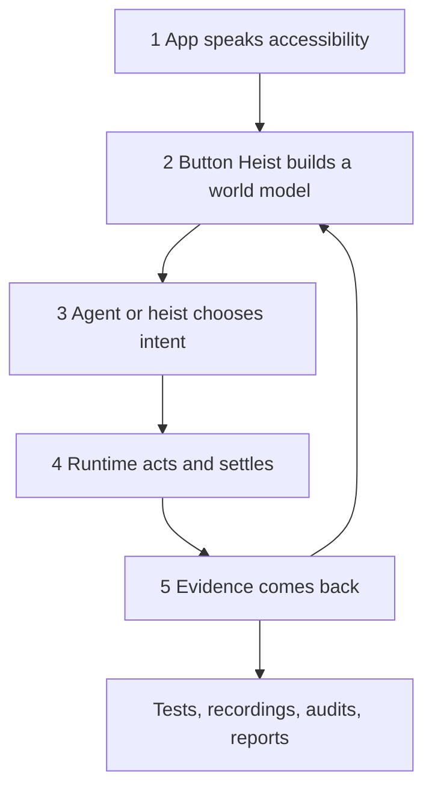
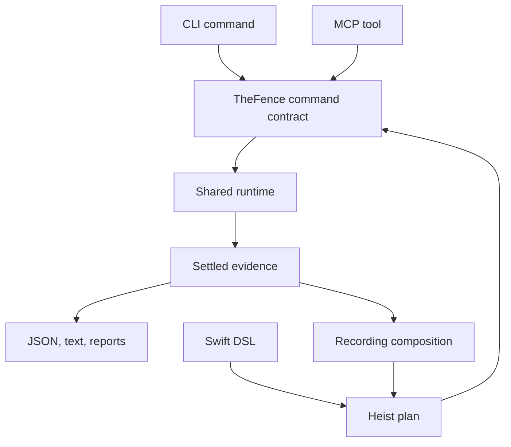

[](https://github.com/RoyalPineapple/TheButtonHeist/actions/workflows/ci.yml)
[](https://github.com/RoyalPineapple/TheButtonHeist/releases/latest)
[](LICENSE)

# Button Heist

Button Heist turns the app interface that VoiceOver reads into a live,
programmable world model: structured text for agents, real accessibility actions
for control, and settled evidence for tests.

An iOS app already describes itself through accessibility: labels, identifiers,
traits, values, states, actions, rotors, focus, and hierarchy. That description
is structured, textual, and actionable. It is not a screenshot and it is not a
pile of coordinates.

Button Heist keeps that interface live. An agent can read the current screen
like a structured document or menu, choose the next command from what the app
says is present, and act through the same accessibility contract a human-facing
assistive technology depends on.

The semantic part matters because the target is "the Continue button", "the
Search field", or "the selected row", not "tap at x:147 y:612". Button Heist
owns target resolution, reveal, live geometry, action execution, settling, and
the evidence of what changed.

It is not a screenshot parser. It is not coordinate playback with nicer names.
It is the inside route: operate the app through the accessibility interface it
already exposes, then leave with a receipt.



A benchmark trace shows the loop. The agent asks for a target by meaning:

```text
-> activate(label: "Settings", traits: ["button"])

<- appearance | activate: screen changed
   23 elements
   [0] appearance_header "Appearance" header
   [1] system_button "System" button | selected
   [2] dark_button "Dark" button
   [3] purple_button "Purple" button
   ...
```

The response is not just "tap succeeded." It is the next screen as readable
state, ready for the next command, assertion, recording step, or audit.

## What You Can Do

Use Button Heist to:

- Drive a debug iOS app from an agent over MCP.
- Run semantic UI commands from a CLI.
- Compose multi-step heist plans with waits and expectations.
- Record successful interactions as durable `.heist` tests.
- Replay those tests in CI with failure diagnostics and JUnit output.
- Validate that the accessibility contract actually supports the product flow.

These are not separate products bolted together. Direct commands, authored
heists, recorded heists, replay, reports, and audits all orbit the same runtime.



## The Shape Of A Job

A direct command:

```bash
buttonheist get_interface

buttonheist activate \
  --label "Continue" \
  --traits button
```

A recording that becomes a replayable test:

```bash
buttonheist start_heist --app com.buttonheist.testapp

buttonheist get_interface

buttonheist type_text --text "milk" \
  --label "Search"

buttonheist activate \
  --label "Search" \
  --traits button

buttonheist stop_heist --output search-flow.heist
buttonheist play_heist --input search-flow.heist --junit search-flow.xml
```

A Swift-authored heist:

```swift
import ButtonHeistDSL
import TheScore

let heist = try Heist("searchFlow") {
    TypeText("milk", into: .label("Search"))
        .expect(.present(.element(label: "Search", value: "milk")), timeout: .seconds(2))

    Activate(.label("Search"))
        .expect(.changed(.screen()), timeout: .seconds(5))

    WaitFor(timeout: .seconds(5)) {
        Case(.present(.label("Results"))) {
            Warn("Search results loaded")
        }

        Else {
            Fail("Search did not settle")
        }
    }
}
```

The examples live in [examples/](examples/). The generated command and MCP
surfaces live in [docs/reference/commands.md](docs/reference/commands.md) and
[docs/reference/mcp-tools.md](docs/reference/mcp-tools.md).

## The Contract

Button Heist treats accessibility as the control plane.

For normal controls, callers speak in the app's accessibility language:
activate this button, type into this field, run this custom action, move through
this rotor, wait until this predicate is true. The caller does not manage
ordinary viewport setup. Button Heist resolves the target, reveals it through
the owning scroll/container path when needed, acquires fresh live geometry,
performs the operation, waits for settled semantic evidence, and reports the
result.

For viewport work, callers use viewport commands. `get_screen`, `get_interface`,
`scroll`, `scroll_to_edge`, and `scroll_to_visible` are for cases where the
viewport itself is the subject.

For physical gestures, callers use mechanical commands. `one_finger_tap`,
`long_press`, `swipe`, and `drag` are for maps, canvases, drawing surfaces,
games, custom gesture regions, and other places where the gesture is the intent.

Those routes are explicit because the distinction matters:

| Route | Use it for | Durable identity |
|---|---|---|
| Semantic | Buttons, fields, links, menus, custom actions, rotors, waits | Accessibility predicates and expectations |
| Viewport | Screenshots, hierarchy inspection, explicit scrolling | Current visible state |
| Mechanical | Canvas/spatial gestures, maps, games, drawing | Points, unit points, gesture shape |

The formal runtime contract is in
[docs/ACCESSIBILITY-CONTRACT.md](docs/ACCESSIBILITY-CONTRACT.md). Recording and
element inflation have focused contracts in
[docs/RECORDING-CONTRACT.md](docs/RECORDING-CONTRACT.md) and
[docs/ELEMENT-INFLATION.md](docs/ELEMENT-INFLATION.md).

## Heists

A heist is a semantic program against the app's accessibility contract.

Heists are useful because a UI flow is rarely one action. A real flow says:

- put text in this field
- activate that control
- wait until this state appears
- branch if the app reports an error
- fail with a useful reason if the contract is not satisfied

`run_heist` executes a typed `HeistPlan` through the same runtime used by direct
commands. Each action can carry an expectation. Each wait evaluates settled
semantic state. If a step fails, the heist stops at the point where the contract
failed.

The `.heist` format is the durable wire form. Swift DSL source is the authoring
form. See [docs/HEIST-FORMAT.md](docs/HEIST-FORMAT.md) and
[docs/SWIFT-HEIST-AUTHORING.md](docs/SWIFT-HEIST-AUTHORING.md).

## Recordings

Recording is not a playback log.

During a recording, Button Heist observes successful runtime evidence and stores
durable semantic steps. Reads do not record. Failed actions do not record.
Viewport setup for a later semantic action does not become part of the heist.
Runtime IDs, capture IDs, live object handles, and screen geometry are not
durable semantic identity.

A good recorded step is:

> activate the Delete button and expect it to disappear

not:

> scroll down, tap at this coordinate, hope the same thing is there tomorrow

That is why a recorded heist can survive layout movement and device changes. It
fails when the app's accessible contract changes, which is the failure you want
a durable UI test to surface.

## Why This Is Different

Most UI automation tools use accessibility as a way to find coordinates. They
read the tree, compute a point, tap the screen, then read again.

Button Heist uses accessibility as the app's language.

It can still perform explicit mechanical gestures when that is the product
intent. But for ordinary controls, the primary path is semantic: target, action,
wait, evidence. The agent spends less time guessing about pixels and more time
making progress through the app's contract.

The benchmark suite compares that loop with coordinate-first MCP automation
across 96 trials and 16 UI tasks.

|  | Button Heist | Coordinate-based |
|---|---:|---:|
| Avg wall time | 134s | 235s |
| Avg turns | 14 | 43 |
| Avg cost | $0.46 | $1.42 |
| Tasks completed | 16/16 | 16/16 |

Average result: **2.4x faster, 3.1x fewer turns, 3.1x lower cost.**

Full methodology: [docs/BENCHMARKS.md](docs/BENCHMARKS.md).

## Quick Start

### 1. Add TheInsideJob

Link `TheInsideJob` to your debug target. It starts a local TCP server via ObjC
`+load`; no app setup code is required. Release builds leave the server behind.

```swift
import SwiftUI
import TheInsideJob

@main
struct MyApp: App {
    var body: some Scene {
        WindowGroup { ContentView() }
    }
}
```

By default the server accepts simulator loopback and USB-scoped connections. It
does not publish Bonjour on the LAN unless you opt into network scope with
`INSIDEJOB_SCOPE=simulator,usb,network` or `InsideJobScope`.

If you enable network scope, add the Bonjour permissions:

```xml
<key>NSLocalNetworkUsageDescription</key>
<string>This app uses local network to communicate with Button Heist.</string>
<key>NSBonjourServices</key>
<array>
    <string>_buttonheist._tcp</string>
</array>
```

### 2. Install the tools

```bash
brew install RoyalPineapple/tap/buttonheist
```

Add the MCP server to your project's `.mcp.json`:

```json
{
  "mcpServers": {
    "buttonheist": {
      "command": "buttonheist-mcp",
      "args": []
    }
  }
}
```

Agents usually start with `get_interface`, then act with commands such as
`activate`, `type_text`, `rotor`, `wait`, and `run_heist`.

### 3. Use the CLI directly

```bash
cd ButtonHeistCLI
swift build -c release

BH=.build/release/buttonheist

$BH list_devices
$BH get_interface
$BH activate --identifier loginButton
$BH type_text --text "Hello" --identifier nameField
$BH get_screen --output screen.png
```

`json_lines` keeps one connection open and accepts canonical machine JSON
objects. Direct CLI commands and MCP tools project from the same Fence command
contract.

```bash
buttonheist json_lines
echo '{"command":"get_interface"}' | buttonheist json_lines
```

## The Crew

Button Heist is a distributed system: a debug iOS framework inside the app, a
macOS client outside it, and CLI/MCP fronts for humans and agents.

### Inside the app

| Name | Job |
|---|---|
| `TheInsideJob` | Embedded debug framework and server startup |
| `TheStash` | Live semantic world model, target resolution, matching, wire conversion |
| `TheBurglar` | Accessibility hierarchy parsing and screen/container structure |
| `TheBrains` | Action execution, waits, heist execution, and result evidence |
| `TheSafecracker` | Explicit mechanical input: touch, gesture, keyboard, edit, scroll mechanics |
| `TheTripwire` | UI readiness, window signals, and settle support |
| `TheMuscle` | Token validation, approval UI, and session locking |
| `TheGetaway` | Message dispatch and response transport |

### Outside the app

| Name | Job |
|---|---|
| `TheFence` | Shared command contract for CLI and MCP |
| `TheHandoff` | Device discovery, target resolution, TLS connection, and session state |
| `TheScore` | Wire models, traces, predicates, results, and heist data shared across boundaries |
| `ButtonHeistCLI` | Command-line adapter |
| `ButtonHeistMCP` | MCP adapter for agents |
| `HeistStore` / `ScreenshotStore` | Deterministic heist and screenshot artifacts |

## Development

### Prerequisites

- Xcode with Swift 6 package support
- iOS 17+ / macOS 14+
- [Tuist](https://tuist.io)

### Build locally

```bash
git submodule update --init --recursive
tuist generate
open ButtonHeist.xcworkspace
```

### Project structure

```text
ButtonHeist/
+-- ButtonHeist/Sources/          # Core frameworks
+-- ButtonHeistCLI/               # CLI tool
+-- ButtonHeistMCP/               # MCP server
+-- TestApp/                      # SwiftUI + UIKit test apps
+-- submodules/AccessibilitySnapshotBH/
+-- docs/                         # Architecture, contracts, API, connectivity
+-- examples/                     # Canonical semantic examples
```

## Troubleshooting

### Device not appearing

Check that:

1. `TheInsideJob` is linked to the debug target.
2. The app is running in the foreground.
3. The connection scope allows simulator, USB, network, or the direct target you
   are using.
4. Bonjour/LAN discovery, if enabled, has the `_buttonheist._tcp` Info.plist
   entry.

### USB connection refused

Check:

```bash
xcrun devicectl list devices
lsof -i -P -n | grep CoreDev
```

The app must be running on the device.

### Empty hierarchy

Make sure the app has visible UI on screen and that the root view exposes an
accessibility hierarchy. Then run:

```bash
buttonheist get_interface
```

## Documentation

| Start here | Read |
|---|---|
| Integrate a debug app | [Quick Start](#quick-start), [API](docs/API.md) |
| Connect an agent | [ButtonHeistMCP](ButtonHeistMCP/), [MCP Tool Reference](docs/reference/mcp-tools.md) |
| Use the CLI | [ButtonHeistCLI](ButtonHeistCLI/), [Command Reference](docs/reference/commands.md) |
| Record and replay tests | [Recording Contract](docs/RECORDING-CONTRACT.md), [Heist Format](docs/HEIST-FORMAT.md) |
| Understand the runtime | [Accessibility Contract](docs/ACCESSIBILITY-CONTRACT.md), [Architecture](docs/ARCHITECTURE.md) |
| Compare the approach | [Benchmarks](docs/BENCHMARKS.md) |

All docs: [API](docs/API.md) / [Command Reference](docs/reference/commands.md) /
[MCP Tool Reference](docs/reference/mcp-tools.md) /
[Architecture](docs/ARCHITECTURE.md) /
[Wire Protocol](docs/WIRE-PROTOCOL.md) / [Auth](docs/AUTH.md) /
[USB](docs/USB_DEVICE_CONNECTIVITY.md) /
[Bonjour Troubleshooting](docs/BONJOUR_TROUBLESHOOTING.md) /
[Reviewer's Guide](docs/REVIEWERS-GUIDE.md)

## Acknowledgments

- [KIF (Keep It Functional)](https://github.com/kif-framework/KIF). Button
  Heist builds on KIF's long proof that semantic accessibility is a stable base
  for iOS testing, while moving the model toward accessibility actions, settled
  evidence, and agent-readable contracts.
- [AccessibilitySnapshot](https://github.com/cashapp/AccessibilitySnapshot).
  Used for parsing UIKit accessibility hierarchies via
  [AccessibilitySnapshotBH](https://github.com/RoyalPineapple/AccessibilitySnapshotBH).

## License

Apache License 2.0. See [LICENSE](LICENSE).
