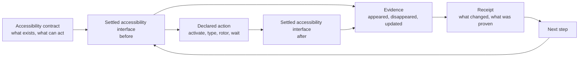

[](https://github.com/RoyalPineapple/TheButtonHeist/actions/workflows/ci.yml)
[](https://github.com/RoyalPineapple/TheButtonHeist/releases/latest)
[](LICENSE)

# The Button Heist

The Button Heist makes the settled accessibility interface executable. Agents and tests do not need to guess from pixels first. They act through the same contract assistive technologies depend on, wait for the app to settle, and bring back evidence that the contract changed as expected.

The familiar part is accessibility. The new part is the loop: settled interface, declared action, checked result, receipt. A UI snapshot becomes a contract you can run.

Accessibility is the interface. Strip an app of rendering and it is still talking: labels, values, traits, hierarchy, state, and actions. It says what is true now. It says what can happen next. It says what changed.

A visual interface asks an operator to infer what can be done from pixels. The accessibility interface publishes a command surface: named objects, declared verbs, and read-back state.

VoiceOver is one client for that surface. The Button Heist is another. It asks the app what it has promised, makes one declared move, waits for the machinery to stop, and keeps the receipt.

There is no second app behind the glass. The app has already published the contract. The Button Heist makes that contract executable.

## What it unlocks

The Button Heist changes the unit of automation. A command can be `Activate Pay`. A named heist can be `Cart.addItem("Milk")` or `Checkout.pay()`. Both run through the same settled accessibility contract. Both bring back proof.

It can:

- drive ordinary controls by label, value, identifier, traits, and declared action
- type into fields and prove the semantic value changed
- wait through async UI until a confirmation, result, or error state appears
- compose multi-step flows into named product capabilities
- let agents inspect those capabilities before they call them
- leave CI with a receipt that names the contract that broke

That is the face of the project: product semantics in, settled evidence out.

```swift
HeistDef<String>("Cart.addItem", parameter: "item") { item in
    TypeText(item, into: .label("Search Items"))
        .expect(.updated(element: .label("Search Items"), .value(after: item)))

    Activate(.label(item))
        .expect(.appeared(.element(
            .label(.prefix(item)),
            .identifier(.contains("cart"))
        )))
}
```

## One move

The whole machine is visible in one move:

```swift
Activate(.label("Pay"))
    .expect(.appeared(.label("Payment Complete")))
```

This looks like a tap. It is stricter than that.

`.appeared(...)` says the step must prove a before/after transition. The settled accessibility interface after the action must contain evidence that `Payment Complete` appeared.

This is not "tap Pay." It means:

1. Read the settled accessibility interface.
2. Resolve the control the app declares as `Pay`.
3. Perform the activation exposed by that interface.
4. Wait for the app to settle.
5. Re-read the settled accessibility interface.
6. Prove that `Payment Complete` appeared.
7. Return evidence of the transition.

The question is not whether an event was delivered. The question is whether the interface contract was fulfilled.

## The contract

A contract gives uncertainty a handle. It makes three things explicit:

- what the app declares
- what can be acted on
- what the contract requires after the action

Ambiguity becomes concrete in the accessibility interface. A control can be visible but silent. A label can be close enough for a person to infer, but too vague for assistive technology or an agent to trust. State can change on screen while semantic state stays stale. A tap can work even though the accessibility action is missing.

The Button Heist makes those gaps testable. It executes the accessibility contract and requires evidence that the contract changed as expected.

The machinery is small on purpose: read what the app declares, make one declared move, wait for the app to become still, keep the receipt.

## The core loop

Every heist step crosses the same checkpoint:

```text
read settled accessibility interface
-> resolve semantic target
-> perform declared action
-> wait for settled accessibility interface
-> compute delta
-> assert evidence
-> return receipt
```

Most UI automation treats interaction as an input event. The Button Heist treats interaction as an asserted transition in the accessibility contract. The event is not the interesting part. The settled change is.



A direct command is one loop:

```bash
buttonheist activate --label "Settings" --traits button
```

The runtime resolves the target, makes it actionable, performs the accessibility operation, waits for the app to settle, and returns a receipt with the new state and evidence. The next command, assertion, audit, or test starts from that receipt.

The normal path is semantic: activate named controls, type into fields, run accessibility actions, move through rotors, and wait on settled predicates. Screenshots, viewport commands, and spatial gestures still exist, but they are supporting tools. For ordinary app flows, the durable control surface is the contract the app already owes its users.

## Receipts

A receipt is the durable answer to "what happened?" Not a hunch. Not a tap log. The facts.

```text
step: Activate(label: "Pay")
status: passed
before: Checkout
after: Payment
delta: screen changed
evidence:
  appeared: "Payment" [header]
  appeared: "Total $41.00" [staticText]
```

When a step cannot satisfy the contract, the evidence matters more:

```text
activate -> error[elementNotFound]
No match for: label="Calamari Fritti"
near miss:
  "Calamari Fritti, $14.00, Calamari Fritti" [button]
known elements:
  "Start drawer" [header]
  "Save" [button]
```

Because The Button Heist acts from a settled accessibility interface and reads another settled accessibility interface afterward, diagnosis starts from facts. The diagnostic shows what the app actually exposed.

Receipts are intentionally plain. Boring in the useful way: they say what ran, what changed, and where the machine stopped. They are not live handles, replay objects, or private runtime state. They carry evidence you can assert against, print, report, or use to compose the next heist.

## Heists

A heist is a product capability with a paper trail: do these actions, wait for these facts, and keep the receipt.

Humans can author heists in checked-in Swift files. Agents can author runtime heists as canonical source sent through `run_heist(plan:)`. Both forms lower to the same `HeistPlan` and run through the same receipt-producing runtime.

```swift
import ThePlans

let login = try HeistPlan("login") {
    TypeText("agent@example.com", into: .label("Email"))
        .expect(.updated(
            element: .label("Email"),
            .value(after: "agent@example.com")
        ))

    Activate(.label("Sign In"))
        .expect(.appeared(.label("Home")))
}
```

Each instruction runs through the same action/wait runtime. The heist rolls those step receipts into one receipt tree. A report can show the whole job, or point to the exact instruction where the contract was not fulfilled.

## Product capabilities

Once a heist has a name, the unit of automation changes. Callers can use it as a product capability:

```swift
RunHeist("SearchScreen.search", "milk")
RunHeist("LibraryScreen.addToCart", "Milk")
RunHeist("CartScreen.checkout")
```

This is where accessibility semantics become product semantics. The reusable piece is still grounded in predicates and receipts, but the caller can operate at the level of the product: search, add to cart, confirm, checkout.

## The shape of a job

Once jobs need more than straight-line instructions, the heist language adds a small set of control primitives. Few parts. Bounded motion. No hidden loop carrying state into the dark.

Action expectations usually assert deltas: something appeared, changed, or updated after the step. Standalone waits and branches inspect current settled state.

- `WaitFor` is an assertion: a predicate must become true before the timeout, unless an explicit timeout branch handles the miss.
- `If` is a decision: inspect settled current state and choose a branch.
- `ForEach` is the loop: repeat over a finite list of strings or semantic targets.
- `RunHeist` is composition: call another product capability with no argument, one string, or one element target.
- Actions, `Warn`, and `Fail` are the effects.

```swift
let search = try HeistPlan("searchFlow") {
    TypeText("milk", into: .label("Search"))
        .expect(.updated(
            element: .label("Search"),
            .value(after: "milk")
        ))

    Activate(.label("Search"))
        .expect(.change(.screen()))

    WaitFor(.label("Results"), timeout: .seconds(5))
        .else {
            Fail("Search did not settle")
        }

    If(.label("Results")) {
        Warn("Search results loaded")
    }
}
```

Heists stay deliberately finite and inspectable: values, predicates, assertions, decisions, bounded loops, composition, and explicit effects. Enough language to do the job. Not enough to hide it.

The same shape works inside app tests:

```swift
import TheInsideJob

let heist = try await RunHeist("search", argument: "milk") { query in
    TypeText(query, into: .label("Search"))
        .expect(.updated(.value(query)))

    Activate(.label("Search"))
        .expect(.change(.screen()))
}

heist.result
```

Outside `RunHeist(...) { ... }` is Swift test code. Inside the closure is the heist language that lowers to a validated `HeistPlan` and runs through the same runtime as MCP `run_heist`.

## Why it works

The Button Heist narrows the problem the agent has to solve. The agent sees the interface in language, chooses intent in language, and receives evidence in language. It does not need to become a surveyor of rectangles before asking for a button.

Accessibility makes that possible. A good app already names controls, describes roles, exposes values, offers actions, and reports state. The Button Heist keeps that contract live and runs ordinary semantic interactions through it.

For maps, canvases, drawing surfaces, games, and spatial products, explicit mechanical gestures stay available. Those are intentional spatial interactions, not the normal path for buttons, fields, menus, actions, rotors, waits, and product flows.

That division of labor is the product: the app publishes product semantics, The Button Heist keeps the settled accessibility interface and receipts, and the agent chooses what should happen next.

## Screenshots and accessibility

Screenshots are visual evidence. They show the visual interface, and The Button Heist can capture them when pixels are the right evidence.

They are not the normal way to act. Pixels are good evidence. Poor instructions. Accessibility says what each control is called, what role it has, what value it reports, which actions it accepts, and how the app says it changed.

The Button Heist targets controls by product semantics, not by any one field. A target can use labels, values, identifiers, required traits, excluded traits, and ordinal disambiguation. Hierarchy, state, and available actions remain observable facts and assertion evidence, not durable target identity.

For durable heists, the best target is the smallest accessibility predicate that names the intended control in its screen context. Small names. Long lives.

String predicates are exact by default. When you need looseness, ask for it explicitly:

```swift
.label(.contains("Search"))
.label(.prefix("Total"))
.identifier(.contains("cart"))
.element(.label(.prefix("Milk")), .traits([.button]))
```

All checks must pass. Use `.traits([...])` for required traits and `.excludeTraits([...])` for rejected traits.

## Quick start

### 1. Add `TheInsideJob`

Link `TheInsideJob` to your debug target. It starts a local TCP server via ObjC `+load`; no app setup code is required. Release builds do not start the server.

```swift
import SwiftUI
import TheInsideJob

@main
struct MyApp: App {
    var body: some Scene {
        WindowGroup { ContentView() }
    }
}
```

By default the server accepts simulator loopback and USB-scoped connections. It does not publish Bonjour on the LAN unless you opt into network scope with `INSIDEJOB_SCOPE=simulator,usb,network` or `InsideJobScope`.

If you enable network scope, add the Bonjour permissions:

```xml
<key>NSLocalNetworkUsageDescription</key>
<string>This app uses local network to communicate with The Button Heist.</string>
<key>NSBonjourServices</key>
<array>
    <string>_buttonheist._tcp</string>
</array>
```

### 2. Install the tools

```bash
brew install RoyalPineapple/tap/buttonheist
```

The Homebrew distribution currently supports Apple Silicon macOS only.

Add the MCP server to your project's `.mcp.json`:

```json
{
  "mcpServers": {
    "buttonheist": {
      "command": "buttonheist-mcp",
      "args": []
    }
  }
}
```

Agents usually start with `get_interface`, then act with commands such as `activate`, `type_text`, `rotor`, `wait`, and `run_heist`.

### 3. Use the CLI directly

```bash
cd ButtonHeistCLI
swift build -c release

BH=.build/release/buttonheist

$BH list_devices
$BH get_interface
$BH activate --identifier loginButton
$BH type_text --text "Hello" --identifier nameField
$BH get_screen --output screen.png
```

`json_lines` keeps one connection open and accepts canonical machine JSON objects. Direct CLI commands and MCP tools project from the same Fence command contract.

```bash
printf '%s\n' '{"command":"get_interface"}' | buttonheist json_lines
```

## Documentation

| Need | Read |
|---|---|
| Understand the product contract | [Accessibility contract](docs/ACCESSIBILITY-CONTRACT.md), [Architecture](docs/ARCHITECTURE.md) |
| Connect an agent | [MCP agent guide](docs/MCP-AGENT-GUIDE.md), [ButtonHeistMCP](ButtonHeistMCP/) |
| Use the terminal | [ButtonHeistCLI](ButtonHeistCLI/), [Command reference](docs/reference/commands.md) |
| Author heists | [Swift heist authoring](docs/SWIFT-HEIST-AUTHORING.md), [Heist format](docs/HEIST-FORMAT.md) |
| Integrate an app | [Quick start](#quick-start), [API](docs/API.md), [Auth](docs/AUTH.md) |
| See evidence and experiments | [Benchmarks](docs/BENCHMARKS.md), [Heist Doctor](docs/HEIST-DOCTOR.md) |

All docs start at [docs/README.md](docs/README.md). Generated references live in [docs/reference](docs/reference/).

## Troubleshooting

### Device not appearing

Check that:

1. `TheInsideJob` is linked to the debug target.
2. The app is running in the foreground.
3. The connection scope allows simulator, USB, network, or the direct target you are using.
4. Bonjour/LAN discovery, if enabled, has the `_buttonheist._tcp` Info.plist entry.

### USB connection refused

Check:

```bash
xcrun devicectl list devices
lsof -i -P -n | grep CoreDev
```

The app must be running on the device.

### Empty hierarchy

Make sure the app has an interface on a screen and that the root view exposes an accessibility hierarchy. Then run:

```bash
buttonheist get_interface
```

## The crew

The Button Heist is a distributed system: a debug iOS framework inside the app, a macOS client outside it, and CLI/MCP fronts for humans and agents.

### Inside the app

| Name | Job |
|---|---|
| `TheInsideJob` | Embedded debug framework and server startup |
| `TheStash` | Settled accessibility snapshots, target resolution, matching, wire conversion |
| `TheBurglar` | Accessibility hierarchy parsing and screen/container structure |
| `TheBrains` | Action execution, waits, heist execution, and result evidence |
| `TheSafecracker` | Explicit mechanical input: touch, gesture, keyboard, edit, scroll mechanics |
| `TheTripwire` | UI readiness, window signals, and settle support |
| `TheMuscle` | Token validation, approval UI, and session locking |
| `TheGetaway` | Message dispatch and response transport |

### Outside the app

| Name | Job |
|---|---|
| `TheFence` | Shared command contract for CLI and MCP |
| `TheHandoff` | Device discovery, target resolution, TLS connection, and session state |
| `ThePlans` | Pure heist language: plan AST, Swift authoring, JSON, validation, canonical rendering, and source compilation |
| `TheScore` | Wire models, traces, predicates, and results shared across boundaries |
| `ButtonHeistCLI` | Command-line adapter |
| `ButtonHeistMCP` | MCP adapter for agents |
| `HeistArtifactCodec` / `ScreenshotArtifactWriter` | Deterministic heist and screenshot artifacts |

## Development

### Prerequisites

- Xcode with Swift 6 package support
- iOS 17+ / macOS 14+
- [Tuist](https://tuist.io)

### Build locally

```bash
git submodule update --init --recursive
tuist generate
open ButtonHeist.xcworkspace
```

### Test locally

```bash
tuist test TheScoreTests --no-selective-testing
tuist test ButtonHeistTests --no-selective-testing
tuist test TheInsideJobTests --platform ios --device "iPhone 16 Pro" --os 26.1 --no-selective-testing
```

### Project structure

```text
ButtonHeist/
+-- ButtonHeist/Sources/          # Core frameworks
+-- ButtonHeistCLI/               # CLI tool
+-- ButtonHeistMCP/               # MCP server
+-- TestApp/                      # SwiftUI + UIKit test apps
+-- submodules/AccessibilitySnapshotBH/
+-- docs/                         # Architecture, contracts, API, connectivity
+-- examples/                     # Canonical semantic examples
```

## Acknowledgments

- [KIF (Keep It Functional)](https://github.com/kif-framework/KIF). The Button Heist owes part of its lineage to KIF's long accessibility-first history on iOS.
- [AccessibilitySnapshot](https://github.com/cashapp/AccessibilitySnapshot). Used for parsing UIKit accessibility hierarchies via [AccessibilitySnapshotBH](https://github.com/RoyalPineapple/AccessibilitySnapshotBH).

## License

Apache License 2.0. See [LICENSE](LICENSE).
