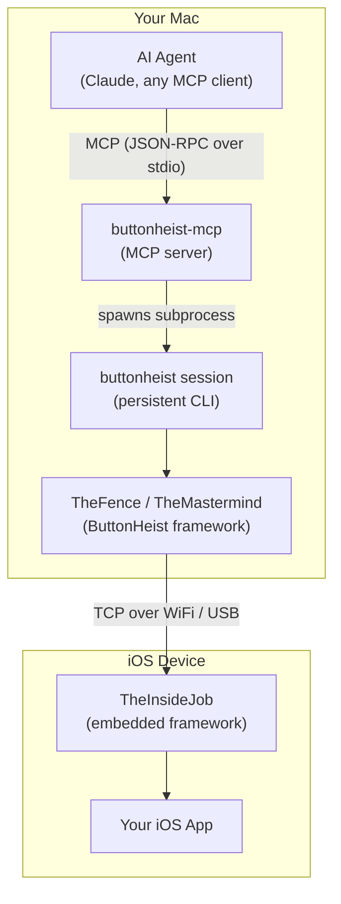

# ButtonHeist

**Let AI agents drive iOS apps.**

ButtonHeist gives AI agents (and humans) full control over iOS apps. Embed TheInsideJob in your app, then connect with the MCP server to let Claude inspect UI, tap buttons, swipe, type, and navigate — all programmatically over a persistent connection.

## Meet the Crew

Every heist needs a team. ButtonHeist is built around a crew of specialists.

### The Inside Team (iOS)

| Character | What they do |
|-----------|--------------|
| **TheInsideJob** | The whole operation. Runs in your iOS app: TCP server, Bonjour, accessibility hierarchy, command dispatch to the rest of the crew. |
| **TheMuscle** | Bouncer. Auth, session lock, on-device Allow/Deny. Keeps the door; only one driver at a time. |
| **TheSafecracker** | Cracks the UI. Taps, long press, swipe, drag, pinch, rotate, text entry, accessibility actions — gets past any control. |
| **TheStakeout** | Lookout. Captures H.264/MP4 screen recordings, composites fingerprint overlays so every gesture shows in the tape. |
| **TheFingerprints** | Evidence. Touch indicators on screen during gestures; visible live and baked into TheStakeout’s recordings. |
| **TheBagman** | Handles the score during TheInsideJob. Element cache, hierarchy, animation detection; live view pointers never leave TheBagman. |
| **ThePlant** | Runs the advance Advance, gets the team inside. ObjC `+load` hook that boots TheInsideJob before any Swift runs. Link the framework — no app code. |

### The Outside Team (macOS)

| Character | What they do |
|-----------|--------------|
| **TheMastermind** | Coordinator. @Observable over TheWheelman: discovery, connection, callbacks for SwiftUI and tools. |
| **TheFence** | Interface Between the buyer and the team. Command dispatch for CLI and MCP. Runs activate, gesture, get_interface, etc.; delegates connection to TheMastermind. |

### The Buyers 
Hire the team for your next job via MCP or CLI interfaces

| Character | What they do |
|-----------|--------------|
| **ButtonHeistCLI** | Your orders. `list`, `activate`, `touch`, `type`, `screenshot`, `session`, and more. |
| **ButtonHeistMCP** | Agent interface. Eleven tools that call through TheFence so AI agents can run the job. |

## Features

- **MCP server** — AI agents like Claude drive any iOS app through native tool calls
- **Screen recording** — Record H.264/MP4 video of interaction sequences with auto-stop on inactivity
- **Full gesture simulation** — Tap, long press, swipe, drag, pinch, rotate, two-finger tap, draw path, draw bezier
- **Multi-touch** — Simultaneous multi-finger gesture injection via IOKit HID events
- **Fingerprint tracking** — Visual touch indicators track finger positions during gestures, visible on-device and in recordings
- **Real-time inspection** — See UI elements and screenshots update as the app changes
- **Text input** — Type text, delete characters, read back values — via UIKeyboardImpl injection
- **Token auth** — Token-based authentication with auto-generated or configured secrets, plus on-device Allow/Deny approval for new connections
- **Auto-start** — TheInsideJob starts automatically when your app launches (ObjC `+load`, DEBUG only)
- **Multi-device** — Run many instances on many simulators with stable identifiers
- **USB auto-discovery** — USB devices discovered automatically alongside WiFi via Bonjour
- **Multiple interfaces** — MCP server, CLI, or build your own

## Architecture



**End-to-end:**
```
AI Agent → MCP (stdio) → buttonheist-mcp → buttonheist session → TheFence → TheMastermind → TCP → TheInsideJob
```

## Modules

| Module | Platform | Description | Details |
|--------|----------|-------------|---------|
| **TheScore** | iOS + macOS | Shared types, messages, and constants | [ButtonHeist/](ButtonHeist/) |
| **TheInsideJob** | iOS | Server + synthetic touch injection, embedded in your app | [ButtonHeist/](ButtonHeist/) |
| **Wheelman** | iOS + macOS | TCP server/client, Bonjour discovery | [ButtonHeist/](ButtonHeist/) |
| **ButtonHeist** | macOS | Client framework (TheMastermind, TheFence); re-exports TheScore + Wheelman | [ButtonHeist/](ButtonHeist/) |
| **ButtonHeistMCP** | macOS | MCP server — 11 tools dispatching through TheFence | [ButtonHeistMCP/](ButtonHeistMCP/) |
| **buttonheist** | macOS | CLI tool: list, activate, action, touch, type, screenshot, record, session, scroll, edit, dismiss-keyboard | [ButtonHeistCLI/](ButtonHeistCLI/) |

## Quick Start

### 1. Add TheInsideJob to Your iOS App

Import TheInsideJob. It auto-starts via ObjC `+load` — no code changes needed beyond the import.

```swift
import SwiftUI
import TheInsideJob

@main
struct MyApp: App {
    // TheInsideJob auto-starts on framework load

    var body: some Scene {
        WindowGroup {
            ContentView()
        }
    }
}
```

Add the required Info.plist entries:

```xml
<!-- Network permissions -->
<key>NSLocalNetworkUsageDescription</key>
<string>This app uses local network to communicate with the element inspector.</string>
<key>NSBonjourServices</key>
<array>
    <string>_buttonheist._tcp</string>
</array>
```

### 2. Connect with an AI Agent (MCP)

Build the MCP server and drop a `.mcp.json` in your project root:

```bash
cd ButtonHeistMCP && swift build -c release
```

```json
{
  "mcpServers": {
    "buttonheist": {
      "command": "./ButtonHeistMCP/.build/release/buttonheist-mcp",
      "args": []
    }
  }
}
```

That's it. When Claude (or any MCP client) opens a session in your project, it spawns the server, discovers your iOS app via Bonjour, and the agent can interact naturally:

```
Agent: "Let me see what's on screen"
→ calls run(command: "get_screen") → sees the app as an image
→ calls run(command: "get_interface") → reads the UI hierarchy as structured data

Agent: "I'll tap the login button"
→ calls run(command: "tap", identifier: "loginButton")
→ gets success/failure result with what changed in the UI

Agent: "Let me type an email address"
→ calls run(command: "type_text", text: "user@example.com", identifier: "emailField")
→ gets the field's current value back
```
For device targeting, command reference, and internals: **[ButtonHeistMCP/](ButtonHeistMCP/)**

### 3. Connect with the CLI

```bash
buttonheist list                                    # Discover devices
buttonheist session                                 # Persistent session (get_interface, activate, etc.)
buttonheist activate --identifier loginButton       # Activate a button
buttonheist touch tap --x 100 --y 200               # Tap coordinates
buttonheist touch swipe --identifier list --direction up  # Swipe a list
buttonheist type --text "Hello" --identifier nameField    # Type text
buttonheist screenshot --output screen.png          # Capture screenshot
buttonheist record --output demo.mp4                # Record screen (auto-stops on inactivity)
```

Full CLI reference: **[ButtonHeistCLI/](ButtonHeistCLI/)** 

### 4. Connect over USB

USB devices are discovered automatically alongside WiFi. Both appear in `buttonheist list`:

```bash
buttonheist list
# [0] a1b2c3d4  AccessibilityTestApp  (WiFi)
# [1] usb-iPhone  iPhone (USB)
```

See [docs/USB_DEVICE_CONNECTIVITY.md](docs/USB_DEVICE_CONNECTIVITY.md) for details.

## Development

### Prerequisites

- Xcode 15+
- iOS 17+ / macOS 14+

### Building

```bash
open ButtonHeist.xcworkspace
```

### Project Structure

```
ButtonHeist/
├── ButtonHeist/Sources/          # Core frameworks (TheScore, TheInsideJob, Wheelman, ButtonHeist)
├── ButtonHeistMCP/               # MCP server (Swift Package)
├── ButtonHeistCLI/               # CLI tool (Swift Package)
├── TestApp/                      # SwiftUI + UIKit test applications
├── AccessibilitySnapshot/        # Git submodule (hierarchy parsing)
├── docs/                         # Architecture, API, protocol, USB docs
└── ai-fuzzer/                    # Autonomous AI app fuzzing framework
```

## Troubleshooting

### Device not appearing (WiFi)

1. Ensure both devices are on the same network
2. Check that TheInsideJob framework is linked
3. Verify Info.plist has the Bonjour service entry
4. On iOS, accept the local network permission prompt

### USB connection refused

1. Check device is connected: `xcrun devicectl list devices`
2. Verify app is running on device
3. Find IPv6 tunnel: `lsof -i -P -n | grep CoreDev`

### Empty hierarchy

- Ensure the app has visible UI on screen
- The root view must be accessible to UIAccessibility

## Documentation

**Frameworks and tools:**
- [ButtonHeist Frameworks](ButtonHeist/) — Core modules: TheScore, TheInsideJob, Wheelman, client
- [MCP Server](ButtonHeistMCP/) — AI agent integration via Model Context Protocol
- [CLI Reference](ButtonHeistCLI/) — Full command-line documentation
- [Test Apps](TestApp/) — Sample iOS applications for testing

**Technical docs:**
- [Architecture](docs/ARCHITECTURE.md) — System design and data flow diagrams
- [API Reference](docs/API.md) — Complete API for all modules
- [Wire Protocol](docs/WIRE-PROTOCOL.md) — Protocol v3.1 specification
- [Authentication](docs/AUTH.md) — Token auth, session locking, UI approval
- [USB Connectivity](docs/USB_DEVICE_CONNECTIVITY.md) — CoreDevice tunnel deep dive

**Project:**
- [AI Fuzzer](ai-fuzzer/) — Autonomous iOS app testing framework
- [Contributing](CONTRIBUTING.md) — Development setup and guidelines
- [Changelog](CHANGELOG.md) — Version history

## License

MIT

## Acknowledgments

Built on [AccessibilitySnapshot](https://github.com/cashapp/AccessibilitySnapshot) for parsing UIKit accessibility hierarchies.
