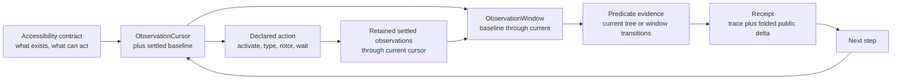

# Accessibility contract runtime

The Button Heist lets callers write programs against an app's accessibility
contract.

The accessibility contract is the semantic interface the app exposes to
assistive technologies: labels, identifiers, roles, values, states, and
actions. The Button Heist makes that contract executable for agents, tests, and
replay.

## Executable step

Most UI automation treats interaction as an input event. The Button Heist treats
interaction as an asserted transition in the accessibility contract. The event
is not the interesting part. The settled change is.

One action crosses the same checkpoint every time:

```text
read settled accessibility interface
-> resolve semantic target
-> perform declared action
-> wait for settled accessibility interface
-> append to the retained observation and notification logs
-> evaluate one cursor-backed observation window
-> assert evidence
-> fold public receipt summary
```

For example:

```swift
Activate(.label("Pay"))
    .expect(.changed(.elements([.appeared(.label("Payment Complete"))])))
```

This step resolves the control declared as `Pay`, performs the activation
exposed through the accessibility interface, waits for settlement, then proves
that `Payment Complete` appeared. The important question is not whether an
event was delivered. It is whether the interface contract was fulfilled.

## Runtime

Semantic intent enters the runtime. The Button Heist owns target resolution, reveal,
element inflation, action execution, settling, and evidence. The result is
settled semantic evidence, not a mechanical playback log.



What "settled" means — the tripwire, the fingerprint cycles, and the hard
timeout — is drawn in the [settle loop diagram](diagrams/settle-loop.md). The
activation decision tree, including the warn-but-proceed path and the
`ActivationTrace` receipt fields, is drawn in the
[activation policy diagram](diagrams/activation-policy.md).

## Receipts

A receipt is plain evidence about what happened. It names the step, the status,
the observed trace, and the facts that satisfied or broke the contract. Public
formatters may squash those ordered facts into a compact delta.

Receipts are not live handles, replay objects, or private runtime state. They
are reportable facts that callers can assert against, print, store, or use to
compose the next heist.

## Boundaries

| Boundary | Owns | Refuses to own |
|----------|------|----------------|
| `AccessibilityTarget` | One node-target language for actions, waits, expectations, CLI/MCP, and subtree queries | Live UIKit identity, geometry authority, alternate query projections |
| `AccessibilityPredicate` and `ChangeDeclaration` | Concrete conditions for waits, expectations, and control-flow cases | Target resolution, viewport movement, command execution |
| `SemanticObservationLog` | Retained settled entries, cursor lineage, and replayable observation sequences | Predicate-owned history, destructive reads, report formatting |
| `ObservationWindow` | One baseline-to-current temporal view with explicit completeness | Independent capture or notification ownership |
| `AccessibilityTrace` | Durable receipt evidence and derived ordered `ChangeFact` values | A second runtime observation pipeline |
| `InteractionObservation` | Before/body/after evidence coordination around one `ActionDispatchOutcome` | Command payload design and parallel result shapes |
| `ElementInflation` | Semantic target to inflated live target | Public viewport instructions, predicate evaluation, durable selector choice |
| `HeistPlan` | Durable semantic program AST | Arbitrary Swift source, native loop preservation, runtime state |
| `EvidenceMinimumMatcher` | Offline matcher suggestions from settled result evidence | Runtime execution, storage, or hidden test generation |

Adapters format product results for CLI, MCP, JSON, compact text, or JUnit. They
do not decide what a semantic action means or whether a predicate is true.

The ownership rules for the remaining evidence boundaries are explicit:

- `SettleLoopMachine` is the one settled AX reducer and `SettleLoopRunner` is
  its one runner. `SettlePolicy` selects sampling cadence and stability proof;
  it does not introduce another AX pipeline.
- `HeistExecutionResult` is the one admitted receipt execution tree.
  `HeistExecutionReport.project(_:)` purely reduces its shared summary and
  metrics, while output adapters traverse the receipt and read typed step
  evidence directly instead of assembling a parallel report graph.
- `ActionDispatchOutcome` is the one app-side dispatch result.
  `PostActionObservation` adds semantic evidence and constructs `ActionResult`,
  whose success and failure cases permit only their valid evidence.
- `AccessibilityNotificationBus` retains one bounded ingress log. Cursors and
  checkpoints select evidence without clearing or stealing it from another
  consumer.
- UIKit/ObjC `@unchecked Sendable` is confined to the TheInsideJob platform
  boundary, where each declaration documents its synchronization proof. Typed
  core and wire values remain checked `Sendable` values.

## Pipeline

All public executable routes enter the same machine:

1. A supported typed CLI/MCP command, ButtonHeist DSL source, trusted local
   Swift DSL authoring input, or generated `.heist` artifact produces either a
   single command or a `HeistPlan`.
2. The runtime observes settled before-state when the route performs an action
   or evaluates a wait.
3. Element inflation resolves the target, reveals it if needed, acquires fresh
   live inflation evidence, and executes the accessibility operation.
4. The runtime waits for settled semantic evidence.
5. The runtime appends the settled entry to one retained observation log and
   extends the applicable cursor-backed window.
6. Presence predicates evaluate the current delivered tree. Temporal
   predicates evaluate transitions in that window; screen boundaries become
   old-tree departures, a screen marker, then new-tree arrivals.
7. Reports, JSON, compact output, and later repair artifacts project from the
   resulting trace and execution result. Public delta is a one-way lossy fold,
   never evaluator input.

Raw generated JSON plan IR is internal/runtime tooling data. It is not a public
user-authored execution route.

No public route asks callers to manage ordinary viewport mechanics for semantic
commands. Viewport and mechanical commands are explicit when viewport state or
the physical gesture itself is the intent. Viewport/debug commands are directly
executable for inspection, but they are not durable heist primitives.

## Conformance cases

The product contract is healthy when these cases hold:

- A semantic activation can act on an offscreen accessible target without a
  caller-authored scroll step, for content the app has realized in the
  accessibility tree. Lazily instantiated content (collection view
  virtualization, lazy stacks) has no elements until it is realized; scroll
  exploration can realize it, but "offscreen" means realized and out of the
  viewport, not hypothetical. See [Scope and limits](SCOPE-AND-LIMITS.md).
- Duplicate labels produce the minimum matcher that disambiguates semantic
  intent.
- `wait` and action expectations use the same concrete
  `AccessibilityPredicate` evaluator.
- Actions, predicates, and `get_interface` subtree queries use the same
  `AccessibilityTarget` resolver over the delivered tree, including identifier-
  bearing containers of every parser type.
- `exists` and `missing` are current-tree checks in every valid predicate
  context; lifecycle and update checks require ordered facts.
- A complete fact-free observation window is the only proof of `noChange`.
- Screen, layout, value, and announcement notifications prevent `noChange`; a
  screen notification begins a new observation generation.
- Unknown JSON keys fail at the contract boundary.
- Timeout diagnostics say which contract was not satisfied and what command or
  target shape is valid next.
- One retained cursor-backed observation log is runtime temporal truth;
  `AccessibilityTrace` is its durable evidence form and public deltas are lossy
  output folds.
