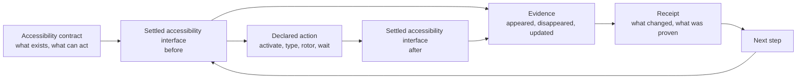

# Accessibility contract runtime

The Button Heist lets callers write programs against an app's accessibility
contract.

The accessibility contract is the semantic interface the app exposes to
assistive technologies: labels, identifiers, roles, values, states, and
actions. The Button Heist makes that contract executable for agents, tests, and
replay.

## Executable step

Most UI automation treats interaction as an input event. The Button Heist treats
interaction as an asserted transition in the accessibility contract. The event
is not the interesting part. The settled change is.

One action crosses the same checkpoint every time:

```text
read settled accessibility interface
-> resolve semantic target
-> perform declared action
-> wait for settled accessibility interface
-> compute delta
-> assert evidence
-> return receipt
```

For example:

```swift
Activate(.label("Pay"))
    .expect(.appeared(.label("Payment Complete")))
```

This step resolves the control declared as `Pay`, performs the activation
exposed through the accessibility interface, waits for settlement, then proves
that `Payment Complete` appeared. The important question is not whether an
event was delivered. It is whether the interface contract was fulfilled.

## Runtime

Semantic intent enters the runtime. The Button Heist owns target resolution, reveal,
element inflation, action execution, settling, and evidence. The result is
settled semantic evidence, not a mechanical playback log.



What "settled" means — the tripwire, the fingerprint cycles, and the hard
timeout — is drawn in the [settle loop diagram](diagrams/settle-loop.md). The
activation decision tree, including the warn-but-proceed path and the
`ActivationTrace` receipt fields, is drawn in the
[activation policy diagram](diagrams/activation-policy.md).

## Receipts

A receipt is plain evidence about what happened. It names the step, the status,
the before and after interface, the delta, and the facts that satisfied or broke
the contract.

Receipts are not live handles, replay objects, or private runtime state. They
are reportable facts that callers can assert against, print, store, or use to
compose the next heist.

## Boundaries

| Boundary | Owns | Refuses to own |
|----------|------|----------------|
| `AccessibilityPredicate` | Condition algebra for waits, expectations, and control-flow cases | Target resolution, viewport movement, command execution |
| `AccessibilityTrace` | Observed accessibility captures and capture-chain identity | Independent delta truth, repair policy, report formatting |
| `InteractionObservation` | Before/body/after evidence coordination for actions and waits | Command payload design and report adapters |
| `ElementInflation` | Semantic target to inflated live target | Public viewport instructions, predicate evaluation, durable selector choice |
| `HeistPlan` | Durable semantic program AST | Arbitrary Swift source, native loop preservation, runtime state |
| `EvidenceMinimumMatcher` | Offline matcher suggestions from settled result evidence | Runtime execution, storage, or hidden test generation |

Adapters format product results for CLI, MCP, JSON, compact text, or JUnit. They
do not decide what a semantic action means or whether a predicate is true.

## Pipeline

All public executable routes enter the same machine:

1. A supported typed CLI/MCP command, ButtonHeist DSL source, trusted local
   Swift DSL authoring input, or generated `.heist` artifact produces either a
   single command or a `HeistPlan`.
2. The runtime observes settled before-state when the route performs an action
   or evaluates a wait.
3. Element inflation resolves the target, reveals it if needed, acquires fresh
   live inflation evidence, and executes the accessibility operation.
4. The runtime waits for settled semantic evidence.
5. Reports, JSON, compact output, and later repair artifacts project
   from the resulting trace and execution result.

Raw generated JSON plan IR is internal/runtime tooling data. It is not a public
user-authored execution route.

No public route asks callers to manage ordinary viewport mechanics for semantic
commands. Viewport and mechanical commands are explicit when viewport state or
the physical gesture itself is the intent. Viewport/debug commands are directly
executable for inspection, but they are not durable heist primitives.

## Conformance cases

The product contract is healthy when these cases hold:

- A semantic activation can act on an offscreen accessible target without a
  caller-authored scroll step, for content the app has realized in the
  accessibility tree. Lazily instantiated content (collection view
  virtualization, lazy stacks) has no elements until it is realized; scroll
  exploration can realize it, but "offscreen" means realized and out of the
  viewport, not hypothetical. See [Scope and limits](SCOPE-AND-LIMITS.md).
- Duplicate labels produce the minimum matcher that disambiguates semantic
  intent.
- `wait` and action expectations use the same `AccessibilityPredicate`
  evaluator.
- Unknown JSON keys fail at the contract boundary.
- Timeout diagnostics say which contract was not satisfied and what command or
  target shape is valid next.
- `AccessibilityTrace` captures are the source of truth; deltas are projections.
