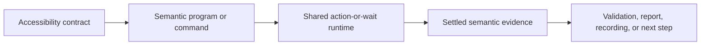

# Accessibility Contract Runtime

Button Heist lets callers write programs against an app's accessibility
contract.

The accessibility contract is the semantic interface the app exposes to
assistive technologies: labels, identifiers, roles, values, states, and
actions. Button Heist makes that contract executable for agents, tests,
recordings, and replay.

## Runtime Invariant

Semantic intent enters the runtime. Button Heist owns target resolution, reveal,
actionability, action execution, settling, and evidence. The result is settled
semantic evidence, not a mechanical playback log.

## Boundaries

| Boundary | Owns | Refuses to own |
|----------|------|----------------|
| `AccessibilityPredicate` | Condition algebra for waits, expectations, and control-flow cases | Target resolution, viewport movement, command execution |
| `AccessibilityTrace` | Observed accessibility captures and capture-chain identity | Independent delta truth, repair policy, report formatting |
| `InteractionObservation` | Before/body/after evidence coordination for actions and waits | Command payload design, report adapters, recording policy |
| `SemanticActionability` | Semantic target to actionable live target | Public viewport instructions, predicate evaluation, durable selector choice |
| `HeistPlan` | Durable semantic program AST | Arbitrary Swift source, native loop preservation, runtime state |
| `HeistRecordingComposition` | Successful interaction evidence to durable heist step | Dispatch, validation, target resolution, storage policy |

Adapters format product results for CLI, MCP, JSON, compact text, or JUnit. They
do not decide what a semantic action means, whether a predicate is true, or what
recording intent survived.

## Pipeline

All executable routes enter the same machine:

1. Direct CLI/MCP command, Swift DSL, `.heist` JSON, playback, or recording
   produces either a single command or a `HeistPlan`.
2. The runtime observes settled before-state when the route performs an action
   or evaluates a wait.
3. Semantic actionability resolves the target, reveals it if needed, acquires
   fresh live actionability evidence, and executes the accessibility operation.
4. The runtime waits for settled semantic evidence.
5. Reports, JSON, compact output, recordings, and later repair artifacts project
   from the resulting trace and execution result.

No public route asks callers to manage ordinary viewport mechanics for semantic
commands. Viewport and mechanical commands are explicit when viewport state or
the physical gesture itself is the intent.

## Conformance Cases

The product contract is healthy when these cases hold:

- A semantic activation can act on an offscreen accessible target without a
  caller-authored scroll step.
- Duplicate labels produce the minimum matcher that disambiguates semantic
  intent.
- Failed semantic actions do not leave partial viewport movement in recordings.
- `wait` and action expectations use the same `AccessibilityPredicate`
  evaluator.
- Recordings emit semantic actions plus expectations when evidence supports
  them, and omit reads or failed actions.
- Unknown JSON keys fail at the contract boundary.
- Timeout diagnostics say which contract was not satisfied and what command or
  target shape is valid next.
- `AccessibilityTrace` captures are the source of truth; deltas are projections.

