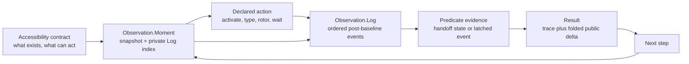

# Accessibility contract runtime

The Button Heist lets callers write programs against an app's accessibility
contract.

The accessibility contract is the semantic interface the app exposes to
assistive technologies: labels, identifiers, roles, values, states, and
actions. The Button Heist makes that contract executable for agents, tests, and
replay.

## Executable step

Most UI automation treats interaction as an input event. The Button Heist treats
interaction as an asserted transition in the accessibility contract. The event
is not the interesting part. The settled change is.

One action crosses the same checkpoint every time:

```text
parse and resolve typed action and predicate
-> capture and commit an Observation.Moment baseline
-> arm observation, announcement, readiness, and deadline delivery
-> dispatch the declared action exactly once
-> capture, admit, commit, publish, and evaluate observations
-> require predicate, readiness, and post-readiness handoff evidence
-> assert evidence
-> fold public result summary
```

For example:

```swift
Activate(.label("Pay"))
    .expect(.changed(.elements([.appeared(.label("Payment Complete"))])))
```

This step resolves the control declared as `Pay`, performs the activation
exposed through the accessibility interface, waits for settlement, then proves
that `Payment Complete` appeared. The important question is not whether an
event was delivered. It is whether the interface contract was fulfilled.

## Runtime

Semantic intent enters the runtime. The Button Heist owns target resolution, reveal,
element inflation, action execution, settling, and evidence. The result is
settled semantic evidence, not a touch playback log.



What "settled" means — the tripwire, the fingerprint cycles, and the hard
timeout — is drawn in the [settle loop diagram](diagrams/settle-loop.md). The
activation decision tree, including the warn-but-proceed path and the
`ActivationTrace` result fields, is drawn in the
[activation policy diagram](diagrams/activation-policy.md).

## Results

A result is plain evidence about what happened. It names the step, the status,
the observed trace, and the facts that satisfied or broke the contract. Public
formatters may squash those ordered facts into a compact delta.

Results are not live handles, replay objects, or private runtime state. They
are reportable facts that callers can assert against, print, store, or use to
compose the next heist.

## Boundaries

| Boundary | Owns | Refuses to own |
|----------|------|----------------|
| `AccessibilityTarget` | One node-target language for actions, waits, expectations, CLI/MCP, and subtree queries | Live UIKit identity, geometry authority, alternate query projections |
| `AccessibilityPredicate` and `ChangeDeclaration` | Concrete conditions for waits, expectations, and control-flow cases | Target resolution, viewport movement, command execution |
| `Observation.Store` and `Observation.Log` | Current semantic tree, ordered retained events, lineage, and admitted-read state committed together | Predicate-owned history, destructive reads, report formatting |
| `Observation.Moment` | Immutable snapshot and private Log position used by `events(since:)` | Public index manipulation or independent capture ownership |
| `AccessibilityTrace` | Durable result evidence and derived ordered `ChangeFact` values | A second runtime observation pipeline |
| `Settlement` | One reducer lifecycle for action/observation trigger, predicate, readiness, handoff, and deadline evidence | Fake no-op actions, post-action waits, or parallel result shapes |
| `ActionResult.Payload` | One semantic action payload whose cases determine method and legal command data | A wire-only payload model or method/payload repair path |
| `HeistReport` | One interpretation of `HeistResult`: nodes, summary, metrics, failures, warnings, and diagnostics | Execution ownership or formatter-specific traversal |
| `ElementInflation` | Semantic target to inflated live target | Public viewport instructions, predicate evaluation, durable selector choice |
| `HeistPlan` | Durable semantic program AST | Arbitrary Swift source, native loop preservation, runtime state |
| `EvidenceMinimumMatcher` | Offline matcher suggestions from settled result evidence | Runtime execution, storage, or hidden test generation |

Adapters format product results for CLI, MCP, JSON, compact text, or JUnit. They
do not decide what a semantic action means or whether a predicate is true.

The ownership rules for the remaining evidence boundaries are explicit:

- `Settlement.Reducer` is the one operation reducer and `Settlement.Executor`
  is its one effect runner. UIKit capture and action dispatch remain boundary
  effects; observation ownership and predicate truth remain typed values.
- `HeistResult` is the one admitted heist execution tree.
  `HeistReport.project(result:)` interprets it once; JSON, compact, human,
  JUnit, doctor, and metric adapters render the resulting report instead of
  independently traversing execution truth.
- `ActionDispatchResult` is the one app-side dispatch result.
  `Settlement.ResultProjector` combines it with canonical predicate, readiness,
  handoff, and deadline evidence to construct `ActionResult`, whose success and
  failure cases permit only their valid evidence.
  `ActionResult.Payload` is the only semantic payload, and custom `Codable`
  projects its method and optional command data directly to the wire.
- `AccessibilityNotificationBus` retains one bounded ingress log. Cursors and
  checkpoints select evidence without clearing or stealing it from another
  consumer.
- UIKit/ObjC `@unchecked Sendable` is confined to the TheInsideJob platform
  boundary, where each declaration documents its synchronization guarantee. Typed
  core and wire values remain checked `Sendable` values.

## Pipeline

All public executable routes enter the same machine:

1. A supported typed CLI/MCP command, ButtonHeist DSL source, trusted local
   Swift DSL authoring input, or generated `.heist` artifact produces either a
   single command or a `HeistPlan`.
2. The runtime resolves the action and optional predicate into one
   `Settlement.Command`.
3. Settlement commits a baseline Moment and arms all evidence channels before
   an action dispatch; observation-only waits skip dispatch structurally.
4. Each capture is admitted, committed to the Store and Log, published, and
   evaluated once.
5. Current-state predicates evaluate the eligible handoff snapshot. Temporal
   predicates evaluate post-baseline Log events; screen boundaries become
   old-tree departures, a screen marker, then new-tree arrivals.
6. The reducer completes when trigger, optional predicate, readiness, and
   post-readiness handoff evidence agree, or returns the independent evidence
   axes at the absolute deadline.
7. Reports, JSON, compact output, and later repair artifacts project from the
   resulting trace and execution result. Public delta is a one-way lossy fold,
   never evaluator input.

Raw generated JSON plan IR is internal/runtime tooling data. It is not a public
user-authored execution route.

No public route asks callers to manage ordinary viewport mechanics for semantic
commands. Viewport and spatial gesture commands are explicit when viewport state
or the physical gesture itself is the intent. Viewport/debug commands are
directly executable for inspection, but they are not durable heist primitives.

## Conformance cases

The product contract is healthy when these cases hold:

- A semantic activation can act on an offscreen accessible target without a
  caller-authored scroll step, for content the app has realized in the
  accessibility tree. Lazily instantiated content (collection view
  virtualization, lazy stacks) has no elements until it is realized; scroll
  exploration can realize it, but "offscreen" means realized and out of the
  viewport, not hypothetical. See [Scope and limits](SCOPE-AND-LIMITS.md).
- Duplicate labels produce the minimum matcher that disambiguates semantic
  intent.
- `wait` and action expectations use the same concrete
  `AccessibilityPredicate` evaluator.
- Actions, predicates, and `get_interface` subtree queries use the same
  `AccessibilityTarget` resolver over the delivered tree, including identifier-
  bearing containers of every parser type.
- `exists` and `missing` are current-tree checks in every valid predicate
  context; lifecycle and update checks require ordered facts.
- A complete fact-free observation window is the only evidence that admits `noChange`.
- Screen, layout, value, and announcement notifications prevent `noChange`; a
  screen notification begins a new observation generation.
- Unknown JSON keys fail at the contract boundary.
- Timeout diagnostics say which contract was not satisfied and what command or
  target shape is valid next.
- One retained cursor-backed observation log is runtime temporal truth;
  `AccessibilityTrace` is its durable evidence form and public deltas are lossy
  output folds.
