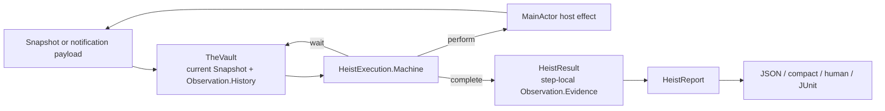

# Accessibility Contract Runtime

Button Heist executes programs against the semantic interface an app exposes to
assistive technologies: labels, identifiers, roles, values, states, geometry,
and actions. Live UIKit objects are boundary evidence. Durable execution uses
typed targets, snapshots, events, plans, and results.

## Executable Step

An action is an asserted accessibility transition, not merely an input event:

```text
resolve typed action and predicate
-> open a Vault history boundary
-> establish fresh readiness
-> dispatch the declared action once
-> capture and admit snapshots and notifications
-> fold ordered events through the predicate
-> prove noChange after the predicate is satisfied
-> form immutable evidence and a typed step result
```

For example:

```swift
Activate(.label("Pay"))
    .expect(.elementsChanged([.appeared(.label("Payment Complete"))]))
```

The runtime finds the accessible control named `Pay`, reveals it when needed,
performs its accessibility action, and proves that `Payment Complete` appeared.
The contract is fulfilled by observed semantic evidence, not by successful tap
delivery.

## Runtime


```mermaid
flowchart LR
    Input["Snapshot or notification payload"]
    Vault["TheVault<br/>current Snapshot + Observation.History"]
    Machine["HeistExecution.Machine"]
    Effect["MainActor host effect"]
    Result["HeistResult<br/>step-local Observation.Evidence"]
    Report["HeistReport"]
    Render["JSON / compact / human / JUnit"]

    Input --> Vault
    Vault --> Machine
    Machine -->|"perform"| Effect
    Effect --> Input
    Machine -->|"wait"| Vault
    Machine -->|"complete"| Result
    Result --> Report
    Report --> Render
```

The Vault owns current accessibility truth and one ordered event history. It
records every event before delivery. One pure `HeistExecution.Machine` owns the
entire plan's control flow, active leaf, expectation progress, and accumulated
step results. The MainActor host performs only the typed effects requested by
that machine.

The host owns the active leaf deadline, the whole-heist deadline, and one task
scheduled for the earlier absolute value. Expiry cancels the interaction in
flight and admits its terminal outcome. A leaf timeout may enter an authored
wait `else`; a whole-heist timeout permits no further authored interaction.
Deadlines never become accessibility events.

The complete execution state machine is drawn in the
[heist execution diagram](diagrams/heist-execution.md). The accessibility input
path is drawn in the
[observation pipeline diagram](diagrams/observation-pipeline.md).

## Boundaries

| Boundary | Owns | Refuses to own |
|----------|------|----------------|
| `AccessibilityTarget` | One target language for actions, waits, expectations, CLI/MCP, and subtree queries | Live UIKit identity or alternate query projections |
| `AccessibilityPredicate` | Current-state and temporal declarations resolved into event predicates | Viewport movement, capture, or command execution |
| `Observation.Snapshot` | Immutable semantic and geometry truth at one capture | History position or mutable UIKit identity |
| `Observation.Event` | One ordered admitted fact: elements changed, screen changed, notification, or no change | Generation fields, cursors, or report interpretation |
| `Observation.History` | The Vault-owned retained event array and its bounded read operations | Predicate-specific logs or destructive consumption |
| `Observation.Evidence` | A result's baseline, current snapshot, ordered events, and completeness | Live runtime ownership or a second trace |
| `HeistExecution.Machine` | One complete plan's deterministic progress and result accumulation | UIKit, clocks, subscriptions, or async tasks |
| `HeistExecution.Host` | MainActor effects, subscriptions, cancellation, and both deadline policies | Predicate truth or parallel execution state |
| `HeistResult` | One admitted durable execution tree | Presentation-specific models |
| `HeistReport` | One interpretation of execution truth | Runtime decisions or formatter-specific traversal |

Adapters render results for CLI, MCP, JSON, compact text, human text, or JUnit.
They do not decide what an action means or whether a predicate is true.

## Canonical Pipeline

1. Boundary syntax is parsed into one typed `HeistPlan`.
2. The app creates one machine and one host for the complete plan.
3. The machine resolves the next authored step and requests any MainActor
   effects it needs.
4. Capture and notification inputs enter the Vault's canonical admission path.
5. The Vault updates current truth, records ordered events, then delivers them.
6. The machine evaluates all graph predicates with one graph evaluator and all
   temporal predicates with one ordered event fold.
7. A matching predicate still waits for a fresh `noChange` event before the
   leaf completes.
8. The result retains immutable observation evidence; report and rendering
   layers only project it.

Screen replacement is normalized as old-tree departures, one screen marker,
then new-tree arrivals. Appeared and disappeared may cross that boundary.
Updated requires two matching semantic readings in the same screen generation.
The generation is derived from history, not stored on each event.

Every viewport movement captures and admits the resulting viewport. Discovery
is one pass through each reachable scroll boundary and restores its origin.
Inflation uses the same movement/capture machinery but may stop at the first
matching target and retain that viewport.

## Conformance

The contract is healthy when:

- Actions, predicates, and `get_interface` resolve the same
  `AccessibilityTarget` language over the same delivered tree.
- Identifier-bearing containers are queryable in every valid target context.
- `exists` and `missing` use the current admitted snapshot; temporal declarations use
  ordered events.
- One event cannot satisfy both sides of an appeared, disappeared, or updated
  predicate.
- `noChange` means complete observed equality, including coarse geometry.
- UIKit value notifications trigger a recapture; the accessibility value diff,
  not the notification code alone, proves change.
- Unknown JSON keys and invalid typed relationships fail at admission.
- Timeout diagnostics identify the unfinished contract and retain the complete
  execution receipt.
- Public deltas remain lossy result projections and are never evaluator input.
