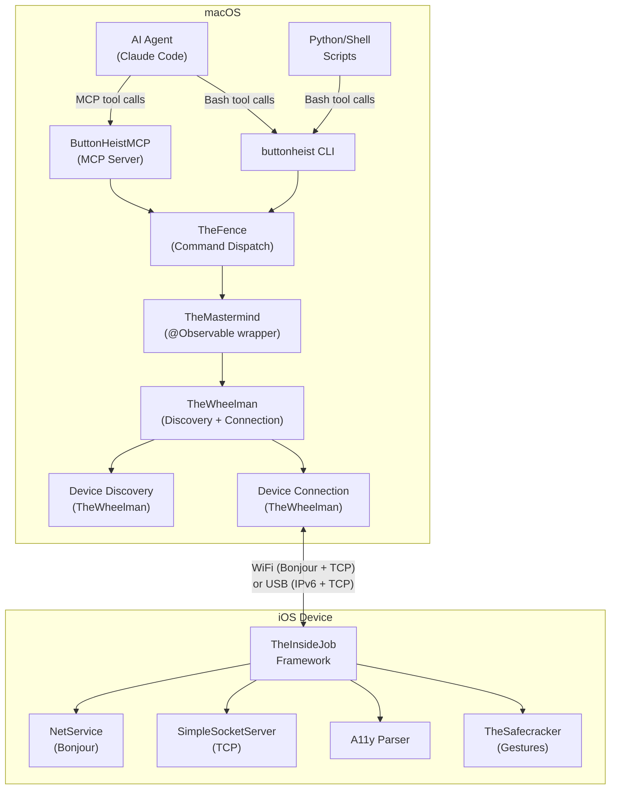
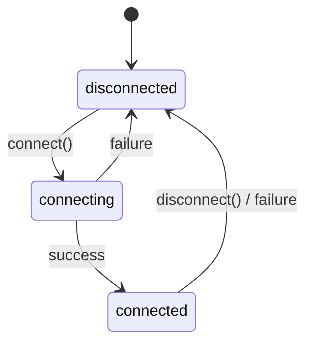
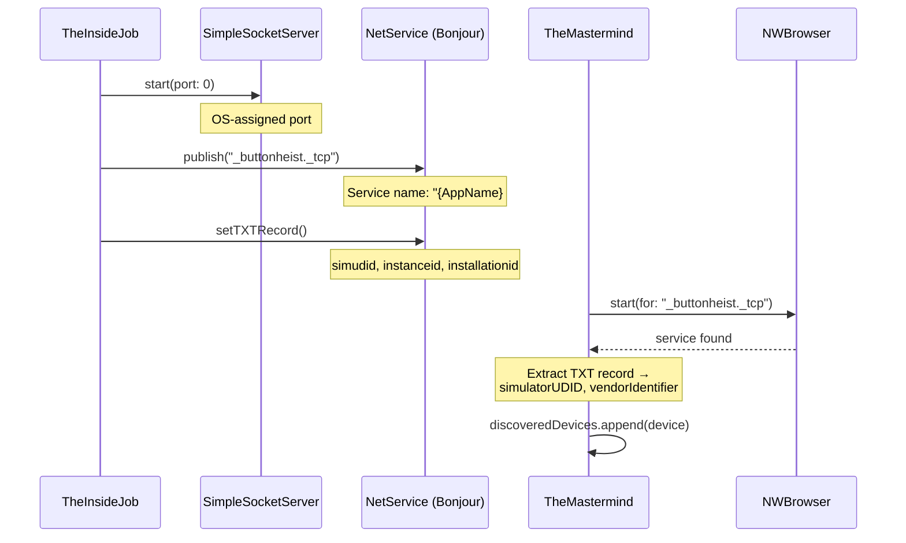
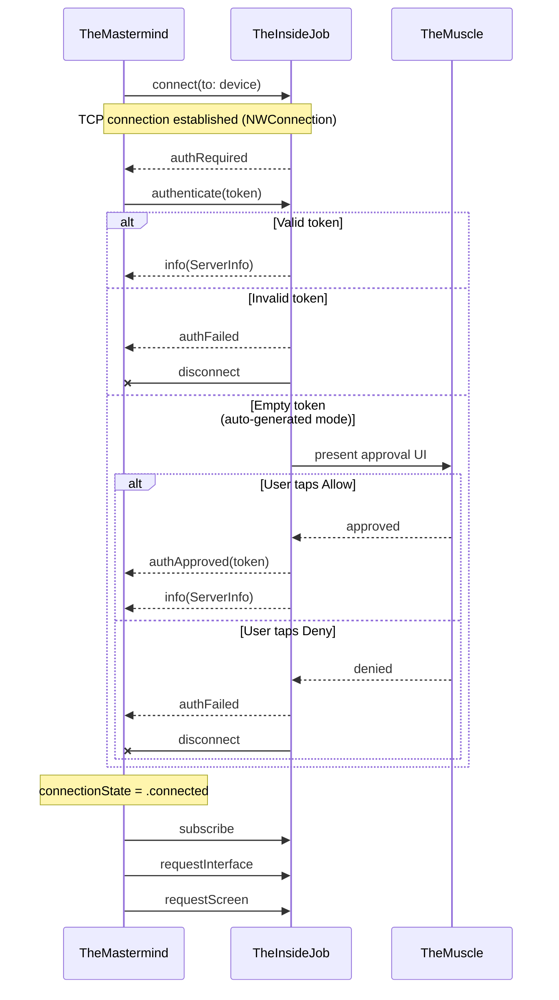
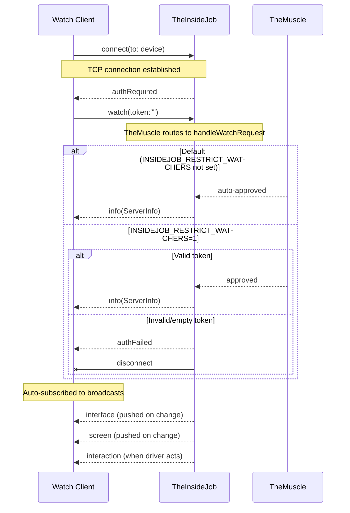
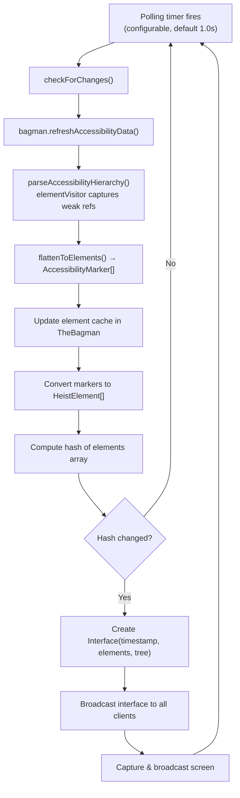
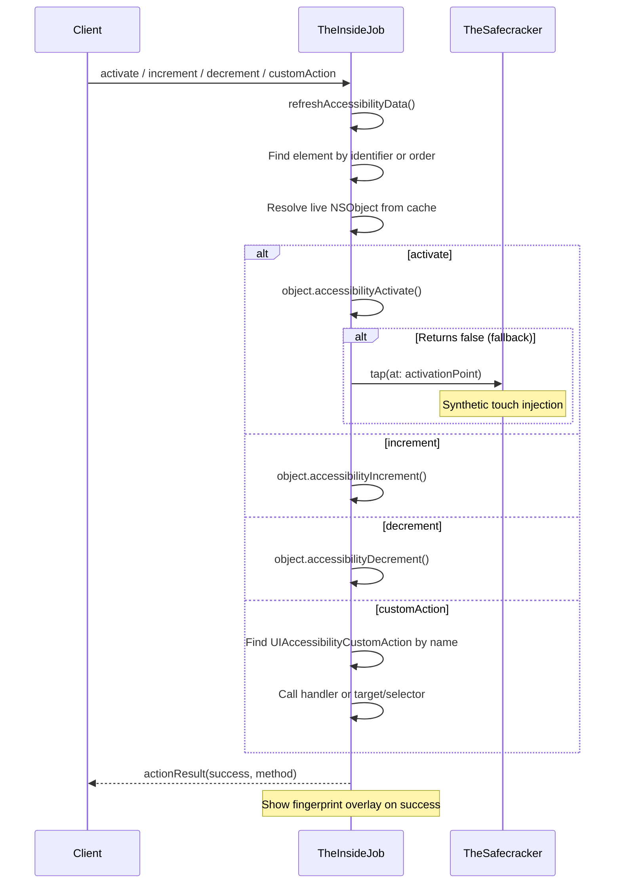

# ButtonHeist Architecture

This document describes the internal architecture of ButtonHeist and how its components interact.

## System Overview

ButtonHeist is a distributed system that lets AI agents (and humans) inspect and control iOS apps. Its main components are:

1. **TheScore** - Cross-platform shared types (messages, models)
2. **TheWheelman** - Cross-platform networking library (TCP server/client, Bonjour discovery)
3. **TheInsideJob** - iOS framework embedded in the app being inspected
4. **ButtonHeist** - macOS client framework (single import for Mac consumers), includes `TheMastermind` and `TheFence`
5. **TheFence** - Command dispatch layer for CLI and MCP (takes orders, delivers goods)
6. **buttonheist CLI** - Command-line tool for driving iOS apps (thin wrapper over TheFence)
7. **ButtonHeistMCP** - MCP server for AI agent tool use (thin wrapper over TheFence)



## Component Details

### TheScore

**Purpose**: Shared types and protocol definitions for cross-platform communication.

**Key Types**:
- `RequestEnvelope` - Wraps `ClientMessage` with an optional `requestId` for response correlation
- `ResponseEnvelope` - Wraps `ServerMessage` echoing the `requestId` back; push broadcasts use `requestId: nil`
- `ClientMessage` - Messages from client to server (29 cases including 9 touch gestures, 3 scroll commands, text input, edit actions, idle waiting, recording control, and watch)
- `ServerMessage` - Messages from server to client (15 cases including auth challenge/failure/approval, recording events, and interaction broadcasts)
- `HeistElement` - Flat UI element representation (with traits, hint, activation point, custom content)
- `ElementNode` - Recursive tree structure with containers
- `Group` - Container metadata (type, label, frame)
- `Interface` - Container for UI element interface data (flat list + optional tree)
- `ServerInfo` - Device and app metadata (incl. instanceId, listeningPort, simulatorUDID, vendorIdentifier)
- `ActionResult` - Action outcome with method, optional message, interface delta, and animation state
- `ScreenPayload` - Base64-encoded PNG with dimensions
- `RecordingConfig` - Recording configuration (fps, scale, inactivity timeout, max duration)
- `RecordingPayload` - Completed recording with base64 H.264/MP4 video, metadata, and optional interaction log
- `InteractionEvent` - Single recorded interaction with command, result, and optional interface delta (also broadcast live to observers)
- `WatchPayload` - Payload for watch (observer) connections with optional token

**Design Decisions**:
- All types are `Codable` and `Sendable` for JSON serialization and concurrency safety
- No platform-specific imports (UIKit/AppKit)
- Protocol version 4.0 with envelope correlation, watch mode, and session locking

### TheInsideJob

**Purpose**: iOS server that captures and broadcasts UI element interface and handles remote interaction.

**Architecture**:
```
TheInsideJob (singleton, @MainActor) — coordinator split across extension files:
│   TheInsideJob.swift              — core server lifecycle, client dispatch
│   TheBagman.swift                 — hierarchy parsing, element cache, delta computation, animation detection
│   Extensions/AutoStart.swift      — ObjC +load auto-start bridge
│   Extensions/Polling.swift        — polling loop, interface broadcasting
│   Extensions/Screen.swift         — screen capture, broadcasting, recording management
│
├── ServerTransport (from TheWheelman; wraps SimpleSocketServer + Bonjour via NetService)
│   └── Client connections (file descriptors)
├── NetService (Bonjour advertisement)
├── AccessibilityHierarchyParser (from AccessibilitySnapshot submodule)
│   └── elementVisitor closure (captures live NSObject references during parse)
├── TheBagman (element cache, hierarchy parsing, weak view references for TheSafecracker)
├── TheSafecracker (all interaction dispatch: actions, gestures, text entry)
│   │   TheSafecracker.swift             — touch primitives, keyboard helpers
│   │   TheSafecracker+Actions.swift     — execute* methods for actions and gestures
│   │   TheSafecracker+Bezier.swift      — bezier curve sampling
│   │   TheSafecracker+TextEntry.swift   — text typing and deletion
│   ├── SyntheticTouchFactory (UITouch creation via private APIs)
│   ├── SyntheticEventFactory (UIEvent manipulation)
│   ├── IOHIDEventBuilder (multi-finger HID event creation via IOKit)
│   └── UIKeyboardImpl (text injection via ObjC runtime, same approach as KIF)
├── TheStakeout (screen recording engine)
│   ├── AVAssetWriter (H.264/MP4 encoding)
│   ├── Frame capture via drawHierarchy (includes FingerprintWindow)
│   ├── Inactivity monitor (screen hash + command tracking)
│   ├── Interaction log (in-memory [InteractionEvent] array)
│   └── File size guard (7MB cap for wire protocol)
├── TheMuscle (authentication, connection approval UI, session locking)
├── TheFingerprints (FingerprintWindow overlay + TheSafecracker gesture tracking)
├── Polling Timer (interface change detection via hash comparison)
└── Debounce Timer (300ms debounce for UI notifications)
```

**Auto-Start Mechanism**:

TheInsideJob uses ObjC `+load` for automatic initialization:

```
ThePlant/
├── ThePlantAutoStart.h  (public header)
└── ThePlantAutoStart.m  (+load implementation → TheInsideJob_autoStartFromLoad)
```

When the framework loads:
1. `+load` is called automatically by the runtime
2. Reads configuration from environment variables or Info.plist:
   - `INSIDEJOB_DISABLE` / `InsideJobDisableAutoStart` - skip startup
   - `INSIDEJOB_POLLING_INTERVAL` / `InsideJobPollingInterval` - update interval (default: 1.0s, min: 0.5s)
3. Creates a Task on MainActor to configure and start TheInsideJob singleton
4. Begins polling for interface changes

**Threading Model**:
- Entire class marked `@MainActor`
- All UIKit operations on main thread
- Network callbacks dispatch to main actor
- Socket accept/read on dedicated GCD queues

**TCP Server (SimpleSocketServer)**:
- Network framework implementation using `NWListener` and `NWConnection`
- IPv6 dual-stack (accepts both IPv4 and IPv6)
- Binds to all interfaces (`::`) for Bonjour compatibility
- OS-assigned port (advertised via Bonjour)
- Newline-delimited JSON protocol (0x0A separator)
- Max 5 concurrent connections, 30 messages/second rate limit, 10 MB buffer limit
- Token-based authentication with session locking, envelope correlation, and watch mode (v4.0)

### TheSafecracker (Touch Gesture & Text Input System)

**Purpose**: Synthesize touch gestures and inject text on the iOS device to allow remote interaction. Supports single-finger gestures (tap, long press, swipe, drag), multi-touch gestures (pinch, rotate, two-finger tap), and text input via UIKeyboardImpl.

**Architecture**:
```
TheSafecracker (stateful, @MainActor)
│
├── Single-Finger Gestures
│   ├── tap(at:)           → touchDown + touchUp
│   ├── longPress(at:)     → touchDown + delay + touchUp
│   ├── swipe(from:to:)    → touchDown + interpolated moves + touchUp
│   └── drag(from:to:)     → touchDown + interpolated moves + touchUp (slower)
│
├── Multi-Touch Gestures
│   ├── pinch(center:scale:)    → 2-finger spread/squeeze
│   ├── rotate(center:angle:)   → 2-finger rotation
│   └── twoFingerTap(at:)       → 2-finger simultaneous tap
│
├── Text Input (via UIKeyboardImpl)
│   ├── typeText(_:)             → addInputString: per character
│   ├── deleteText(count:)       → deleteFromInput per character
│   └── isKeyboardVisible()      → UIInputSetHostView detection
│
├── N-Finger Primitives
│   ├── touchesDown(at: [CGPoint])  → Create N touches + HID event + sendEvent
│   ├── moveTouches(to: [CGPoint])  → Update all active touches
│   └── touchesUp()                 → End all active touches
│
└── Touch Stack
    ├── SyntheticTouchFactory     → UITouch creation via direct IMP invocation
    │   ├── performIntSelector    → setPhase:, setTapCount: (raw Int)
    │   ├── performBoolSelector   → _setIsFirstTouchForView:, setIsTap: (raw Bool)
    │   ├── performDoubleSelector → setTimestamp: (raw Double)
    │   └── setHIDEvent           → _setHidEvent: (raw pointer)
    ├── IOHIDEventBuilder         → Hand event with per-finger child events
    │   ├── @convention(c) typed function pointers via dlsym
    │   └── Finger identity/index for multi-touch tracking
    └── SyntheticEventFactory     → Fresh UIEvent per touch phase
```

**Text Input Design**:
- The iOS software keyboard is rendered by a separate remote process. Individual key views are not in the app's view hierarchy — only a `_UIRemoteKeyboardPlaceholderView` placeholder exists.
- TheSafecracker uses `UIKeyboardImpl.activeInstance` (via ObjC runtime) to get the keyboard controller, then calls `addInputString:` to inject text and `deleteFromInput` to delete — the same approach used by KIF (Keep It Functional).
- Keyboard visibility is detected by finding `UIInputSetHostView` (height > 100pt) in the window hierarchy.

**Key Design Decisions**:
- **Direct IMP invocation**: `perform(_:with:)` boxes non-object types (Int, Bool, Double, UnsafeMutableRawPointer) as NSNumber objects, corrupting values passed to private ObjC methods. All private API calls use `method(for:)` + `unsafeBitCast` to `@convention(c)` typed function pointers.
- **`@convention(c)` for dlsym**: C function pointers from `dlsym` are 8 bytes; Swift closures are 16 bytes. All IOKit function pointer variables use `@convention(c)` for `unsafeBitCast` compatibility.
- **Fresh UIEvent per phase**: iOS 26's stricter validation rejects reused event objects. Each touch phase (began, moved, ended) creates a new UIEvent.
- **Overlay window filtering**: `windowForPoint()` filters out `FingerprintWindow` instances by type to prevent touch injection into the overlay window.

### TheMuscle (Authentication & Connection Approval)

**Purpose**: Manages client authentication, token persistence, and UI-based connection approval. Extracted from TheInsideJob to isolate auth concerns.

**Token Resolution**: When an explicit token is provided via `INSIDEJOB_TOKEN` or `InsideJobToken` plist key, it is used directly. Otherwise a fresh UUID is generated each launch (ephemeral — not persisted).

**Token Invalidation**: `invalidateToken()` generates a new UUID in memory. All previously approved clients lose access and must re-authenticate.

**Responsibilities**:
- Token resolution: explicit (env var / plist) → generate UUID
- Token-based authentication (validate incoming tokens)
- UI approval flow (present UIAlertController, handle allow/deny)
- Track authenticated client count and IDs
- Manage pending approval state
- Session locking: single-driver exclusivity with release timer
  - **Release timer** (`INSIDEJOB_SESSION_TIMEOUT`, default 30s): starts when all TCP connections drop
- Track active session driver identity and connections
- **Observer support**: Track read-only observer connections (`observerClients`). Observers are auto-approved by default (no token required). Set `INSIDEJOB_RESTRICT_WATCHERS=1` (env) or `InsideJobRestrictWatchers=true` (Info.plist) to require a valid token for watch connections.

**Integration**: TheMuscle communicates back to TheInsideJob via closures for socket operations (send, disconnect, markAuthenticated) and post-auth handling (onClientAuthenticated).

### Screen Capture

TheInsideJob captures the screen using `UIGraphicsImageRenderer`:
1. Finds the foreground window scene
2. Uses `drawHierarchy(in:afterScreenUpdates:)` to capture the full visual hierarchy (including SwiftUI)
3. Encodes as PNG, then base64
4. Returns `ScreenPayload` with dimensions and timestamp
5. Screen captures are automatically broadcast alongside interface changes during polling

### Screen Recording (Stakeout)

The `Stakeout` class provides on-device screen recording as H.264/MP4:

1. Client sends `startRecording` with optional configuration (fps, scale, timeouts)
2. InsideJob creates a `Stakeout` instance with a frame capture closure
3. Stakeout uses `AVAssetWriter` with H.264 codec, encoding frames from `drawHierarchy` compositing
4. Unlike screenshots, recording captures **include** the `FingerprintWindow` so interaction indicators are visible in the video.
5. Frames are captured at the configured FPS (default 8, range 1-15) using `afterScreenUpdates: false` to reduce main thread impact
6. Action-triggered bonus frames are captured after each successful action completes
7. During recording, each interaction through `performInteraction` captures the `ClientMessage`, `ActionResult`, and optional `InterfaceDelta` as an `InteractionEvent`, appended to Stakeout's in-memory interaction log
8. An inactivity monitor checks every second — recording auto-stops when no screen changes and no real interactions (actions, touches, typing) are received for the configured timeout. Pings and keepalive messages do not reset the inactivity timer.
9. File size is capped at 7MB to stay within the wire protocol's 10MB buffer limit after base64 encoding
10. Default resolution is 1x point size (native pixels / screen scale), configurable from 0.25x to 1.0x native
11. On completion, the video is base64-encoded and the interaction log (if non-empty) is included in the `recording(RecordingPayload)` message

### TheWheelman

**Purpose**: Cross-platform (iOS+macOS) networking library. Provides TCP server, client connections, and Bonjour discovery.

**Key Types**:
- `SimpleSocketServer` - Network framework TCP/TLS server (NWListener, IPv6 dual-stack), used by TheInsideJob via ServerTransport. Supports optional TLS via `NWProtocolTLS` with self-signed certificates.
- `TLSIdentity` - Runtime-generated self-signed ECDSA (P-256) certificate management with Keychain persistence and SHA-256 fingerprint computation. Uses `swift-certificates` for X.509 generation.
- `DeviceConnection` - TLS/TCP client with NWConnection service resolution, data transport, and certificate fingerprint verification via `sec_protocol_verify_block`
- `DeviceDiscovery` - NWBrowser-based Bonjour browsing for `_buttonheist._tcp`, extracts TXT records including `certfp` for TLS fingerprint pinning
- `DiscoveredDevice` - Discovered device metadata (id, name, endpoint, simulatorUDID, installationId, instanceId, sessionActive, certFingerprint)

### TheFence (Command Dispatch Layer)

**Purpose**: Centralized command dispatch and session management. Both the CLI (`buttonheist session`) and the MCP server (`buttonheist-mcp`) are thin wrappers over TheFence.

**Location**: `ButtonHeist/Sources/TheButtonHeist/TheFence.swift`

**Architecture**:
```
TheFence (@ButtonHeistActor)
├── Configuration (deviceFilter, connectionTimeout, token, autoReconnect)
├── TheMastermind (private client instance)
├── Device discovery + connection with configurable timeouts
├── Auto-reconnect (up to 60 attempts, 1s interval)
├── Command dispatch via execute(request:) → FenceResponse
└── CommandCatalog.all (29 supported commands)
```

**Key Types**:
- `TheFence` - Main command dispatch class, `@ButtonHeistActor`-isolated
- `TheFence.Configuration` - Connection settings (device filter, timeout, token, auto-reconnect)
- `FenceResponse` - Typed enum for all response kinds (ok, error, help, status, devices, interface, action, screenshot, screenshotData, recording, recordingData) with `humanFormatted()` and `jsonDict()` serialization
- `FenceError` - Error enum with human-readable `LocalizedError` descriptions
- `TheFence.CommandCatalog` - Single source of truth for the 29 supported commands

**Command Flow**:
1. Consumer calls `execute(request:)` with a `[String: Any]` dictionary containing a `command` field
2. TheFence auto-connects if not already connected (via its private TheMastermind instance)
3. Dispatches to the appropriate command handler
4. Returns a typed `FenceResponse`

### ButtonHeistMCP (MCP Server)

**Purpose**: Standalone MCP server that exposes 14 purpose-built tools backed by TheFence. Allows AI agents to drive iOS apps via MCP tool calls.

**Location**: `ButtonHeistMCP/`

**Architecture**:
```
ButtonHeistMCP (Swift executable, macOS 14+)
├── main.swift — Server setup, tool handler, response rendering
├── ToolDefinitions.swift — 14 tool schemas (get_interface, activate, type_text, swipe, get_screen, wait_for_idle, start_recording, stop_recording, list_devices, gesture, accessibility_action, scroll, scroll_to_visible, scroll_to_edge)
└── Package.swift — Dependencies: ButtonHeist + swift-sdk (MCP)
```

**Key Behaviors**:
- 14 tools dispatch through `fence.execute(request:)`
- Screenshots are returned as inline MCP image content items
- Recording video data is replaced with a size summary to keep responses readable
- Environment variables: `BUTTONHEIST_DEVICE`, `BUTTONHEIST_TOKEN`, `BUTTONHEIST_SESSION_TIMEOUT`

### ButtonHeist (macOS Client Framework)

**Purpose**: Single-import macOS framework. Re-exports TheScore and TheWheelman, provides `TheMastermind` (client API) and `TheFence` (command dispatch).

**Usage**: `import ButtonHeist` gives access to all types (TheMastermind, TheFence, HeistElement, Interface, DiscoveredDevice, etc.)

**Architecture**:
```
TheMastermind (@Observable, @ButtonHeistActor)
├── TheWheelman (from TheWheelman)
│   ├── DeviceDiscovery (NWBrowser for "_buttonheist._tcp")
│   └── DeviceConnection (NWConnection + data transport)
└── Observable Properties
    ├── discoveredDevices: [DiscoveredDevice]
    ├── connectedDevice: DiscoveredDevice?
    ├── connectionState: ConnectionState
    ├── currentInterface: Interface?
    ├── currentScreen: ScreenPayload?
    ├── serverInfo: ServerInfo?
    ├── isRecording: Bool
    └── isDiscovering: Bool
```

**Dual API Design**:

1. **SwiftUI (Reactive)**: `@Observable` properties trigger view updates
2. **Callbacks (Imperative)**: Closures for CLI and non-SwiftUI usage
3. **Async/Await**: `waitForActionResult(timeout:)` and `waitForScreen(timeout:)` for scripting

**Auto-Subscribe on Connect**: When `autoSubscribe` is enabled, TheWheelman automatically sends `subscribe`, `requestInterface`, and `requestScreen` on connect. Note: TheFence explicitly disables `autoSubscribe` for CLI/MCP use. The `watch` command enables `autoSubscribe` for its read-only observer connection.

**Observe Mode**: When `observeMode` is set on TheWheelman, the client sends `watch(WatchPayload)` instead of `authenticate` in response to `authRequired`. This establishes a read-only observer connection that receives all broadcasts (interface updates, screen captures, interaction events) without claiming a session lock. Observers coexist with active driver sessions.

**Connection State Machine**:


## Data Flow

### Agent Flow (CLI and MCP)

AI agents can drive iOS apps via either the CLI (`buttonheist session`) or the MCP server (`buttonheist-mcp`). Both are thin wrappers over `TheFence`, which handles device discovery, connection, and command dispatch.

**Via MCP (preferred for AI agents)**:
```
Agent → MCP tool call: get_interface {}
  └── ButtonHeistMCP → TheFence → TheMastermind → TheWheelman → TheInsideJob
  └── Response: JSON interface with elements

Agent → MCP tool call: activate {identifier: "loginButton"}
  └── TheFence.execute() → activate → ActionResult with delta
  └── Response: JSON with delta (noChange, valuesChanged, elementsChanged, screenChanged)
```

**Via CLI (Bash tool calls)**:
```
1. Stateless commands (one-shot, reconnects each time)
   └── Bash: buttonheist session (or one-shot get_interface via session)
   └── Bash: buttonheist screenshot --output /tmp/screen.png
   └── Bash: buttonheist touch one_finger_tap --identifier loginButton

2. Session mode (persistent connection, JSON lines on stdin/stdout)
   └── Bash: buttonheist session --format json
   └── stdin: {"command":"get_interface"}  → stdout: JSON response
   └── stdin: {"command":"one_finger_tap","identifier":"loginButton"}  → stdout: JSON response
   └── TheFence maintains connection across commands
```

**Best practice for rapid interaction**: Use action `delta` responses and only call `get_interface` when context is stale.

### Discovery Flow



### Multi-Instance Discovery

When running multiple instances (e.g., multiple simulators), each instance has a unique identity:

- **Instance ID**: Configurable via `INSIDEJOB_ID` env var, or defaults to first 8 chars of a per-launch UUID. Appears in the Bonjour service name (e.g., `MyApp#a1b2c3d4`) and TXT record.
- **Simulator UDID**: The `SIMULATOR_UDID` environment variable, automatically set by the iOS Simulator. Published in the Bonjour TXT record under key `simudid`.
Clients (CLI, GUI, scripts) can filter devices by any of these identifiers. The matching logic is case-insensitive and supports prefix matching for IDs, allowing partial UDID matching (e.g., `--device DEADBEEF`).

### Connection Flow



### Watch (Observer) Connection Flow



Observers never claim a session lock and cannot send commands. They receive the same `interface`, `screen`, and `interaction` broadcasts as subscribed drivers.

### Interface Update Flow



### Action Flow (accessibility actions)



### Action Flow (touch gestures)


## Network Protocol

See [WIRE-PROTOCOL.md](WIRE-PROTOCOL.md) for complete protocol specification.

**Summary**:
- Protocol version: 4.0
- Transport: TCP socket (Network framework NWListener/NWConnection)
- Authentication: Token-based (required for driver connections), with optional on-device UI approval for auto-generated tokens. Watch (observer) connections are auto-approved by default.
- Session locking: Single-driver exclusivity with release timer on disconnect. Observers do not claim sessions.
- Discovery: Bonjour/mDNS (`_buttonheist._tcp`)
- Encoding: Newline-delimited JSON (UTF-8)
- Port: OS-assigned (advertised via Bonjour)

## Connection Methods

### WiFi (Bonjour)
- Service advertised via mDNS
- Client discovers via NWBrowser
- TCP connection to advertised endpoint

## Threading Considerations

### TheInsideJob (iOS)
- `@MainActor` for UIKit compatibility
- Parser must run on main thread
- Socket accept/read on GCD queues
- Message handling dispatched to main
- Interface updates debounced by 300ms

### TheMastermind / TheFence (macOS)
- `@ButtonHeistActor` for backend isolation (discovery, connection, command dispatch)
- NWBrowser for discovery on a dedicated queue
- NWConnection for data transport
- Message processing dispatched to `@ButtonHeistActor`

## Error Handling

### Connection Errors
- Network unavailable → `.failed("Network error")`
- Host unreachable → `.failed("Connection refused")`
- Unexpected disconnect → `onDisconnected?(error)`

### Protocol Errors
- Invalid JSON → Logged, message dropped
- Unknown message type → Logged, message dropped
- Missing required field → Error response sent

### Action Errors
- Element not found → `ActionResult(success: false, method: .elementNotFound)`
- Element not interactive → `ActionResult(success: false, message: "reason")`
- View not interactive → `TapResult.viewNotInteractive(reason:)`
- Injection failed → Falls back to high-level methods

## Configuration

### Environment Variables (highest priority)
| Variable | Description | Default |
|----------|-------------|---------|
| `INSIDEJOB_DISABLE` | "true"/"1"/"yes" to disable auto-start | not set |
| `INSIDEJOB_POLLING_INTERVAL` | Polling interval in seconds | 1.0 |
| `INSIDEJOB_TOKEN` | Auth token for client authentication | auto-generated UUID |
| `INSIDEJOB_ID` | Human-readable instance identifier | first 8 chars of session UUID |
| `INSIDEJOB_SESSION_TIMEOUT` | Session release timeout in seconds after all connections drop (min: 1) | 30 |
| `INSIDEJOB_RESTRICT_WATCHERS` / `InsideJobRestrictWatchers` | Set to `"1"` (env) or `true` (plist) to require a valid token for watch (observer) connections | not set (observers auto-approved) |

### Info.plist Keys (fallback)
```xml
<key>InsideJobPollingInterval</key>
<real>1.0</real>
<key>InsideJobDisableAutoStart</key>
<false/>
<key>InsideJobToken</key>
<string>my-secret-token</string>
<key>InsideJobInstanceId</key>
<string>my-instance</string>
<key>NSLocalNetworkUsageDescription</key>
<string>element inspector connection.</string>
<key>NSBonjourServices</key>
<array>
    <string>_buttonheist._tcp</string>
</array>
```
