# The Button Heist architecture

The Button Heist lets callers write programs against an app's accessibility
contract. Semantic intent enters the runtime; The Button Heist owns target
resolution, reveal, element inflation, action execution, settling, and
evidence; callers receive settled semantic evidence for validation,
reporting, or the next step.

This document names the load-bearing runtime pieces. The canonical product
contract and conformance cases live in [Accessibility Contract](ACCESSIBILITY-CONTRACT.md).
For exhaustive command shapes, wire payloads, and per-module implementation
notes, use the generated or reference docs linked at the end.

## Product Contracts

### Strings Only at Edges

There is one product command contract: `TheFence.Command`. CLI arguments, MCP
JSON, session JSON, and heist files accept canonical command strings such as
`activate`, `type_text`, and `scroll_to_visible`; those strings are parsed once
at the boundary and routed as typed values inside the stack.

Raw command dictionaries end at Fence admission. `FenceCommandInput` is the
unadmitted edge value; `FenceOperationRequest` contains the typed operation that
execution consumes.

ButtonHeistMCP projects one tool per exposed Fence command from the same
contract. Wire message discriminators live one layer lower in TheScore and are
documented separately.

Typed `FenceCommandDescriptor` values are the sole owners of public command
shape. The committed public CLI/MCP command-contract JSON is generated only as
a drift sentinel; it is not a second schema.

ThePlans admits public payload values before they enter a command. Gesture and
wait durations are backed by one bounded-seconds primitive with domain-specific
bounds. Authored strings use distinct currencies for text input, pasteboard
content, custom action names, rotor names, warnings, and failures. Exact
nonblank currencies share the `NonBlankStringValue` construction and
single-value JSON mechanics but remain distinct concrete types that cannot be
interchanged. Text input and pasteboard values retain their different validity
rules. Public Swift construction and decoding call each currency's validating
initializer. Execution therefore consumes admitted values directly and never
clamps or repairs them.

Wire identities follow the same rule. Envelopes decode version and correlation
strings into `ButtonHeistVersion` and `RequestID`; authentication and session
ownership use `SessionAuthToken`, `DriverID`, and `SessionOwner`. These values
encode as single JSON strings but are not interchangeable strings in core logic.

### Trees and Observations Are the Currency

The committed `TheVault.interfaceTree` is the sole current semantic truth.
TheVault privately projects that tree into `AccessibilityTargetMatchInput`; the
shared `AccessibilityTargetMatchGraph` evaluates every element, container,
ordinal, and descendant-scoped `AccessibilityTarget`. TheVault maps the result
paths back to `InterfaceTree` values and current live evidence for diagnostics,
inflation, and dispatch. A delivered `Interface` feeds the same matching graph,
so client predicates and host resolution cannot drift into separate recursive
implementations. `InterfaceGraph` remains the validated structural projection
used for formatting and hierarchy operations. There is no semantic back map,
alternate flat screen, or second target-matching projection.

Parser element actions and custom content are normalized once before any
consumer sees them. `AccessibilityElement.projectedActionSet` is the sole
action projection used by matching, capability diagnostics, wire conversion,
and discovery grafting; live UIKit evidence may only augment that semantic
projection. `AccessibilityElement.projectedCustomContent` is likewise shared by
matching, diagnostics, and wire conversion. Those consumers do not independently
reinterpret parser fields.

`InterfaceObservation` pairs an `InterfaceTree` with the viewport-local
`LiveCapture` from one parser read. Raw parser samples remain live evidence or
failed-settle diagnostic evidence; they never append temporal history and do
not become targetable semantic truth by themselves. `SettleSession` reduces
those samples and carries its exact final observation in a successful outcome. The
semantic stream alone admits that outcome into `CommittableInterfaceObservation`, and
only while both its tripwire signal and capture identity remain current.

`SemanticObservationStore` is the sole semantic state owner. It holds the
current `InterfaceTree`, retained entries, generation and sequence lineage,
notification cursor, and admitted-read state. `SemanticObservationStream` admits a
`CommittableInterfaceObservation` and asks the Store to commit it. The Store
classifies continuity, derives every fulfilled-scope event, validates history
in a copied value, and installs graph, history, lineage, cursors, and admitted-read state with
one assignment. The stream updates disposable live UIKit evidence and wakes
waiters only after that commit returns. There is no parser-to-history path,
subscriber-driven graph mutation, compatibility reducer, or second runtime
state projection.

The stream is also the one visible-observation producer. `TheTripwire` is its
serialized refresh trigger: a changed signal invalidates the admitted read,
settled-read admission pauses, and one capture/settle/commit cycle runs.
Concurrent consumers join that cycle. Once a Store commit installs admitted-read
state, waits and action before-state acquisition reuse the committed event until
the next trip, explicit invalidation, or screen replacement. After-action
observation always requests a fresh cycle from the same producer.

The Store's private `SemanticObservationHistory` retains ordered entries. Each
`ObservationEntry` pairs a settled capture with an initial, same-generation, or
screen-boundary transition. `ObservationCursor` records generation, scope,
settled sequence, capture hash, notification sequence, and `observedAt`.
`observedAt` is derived automatically from the capture's interface timestamp;
it is descriptive metadata, not an ordering input. Generation and settled
sequence provide correctness ordering. Consumers read through
`SemanticObservationStore.read(after:scope:)`, and
`SemanticObservationStream` owns the single waiter path for future entries. An
`ObservationWindow` is built from one immutable baseline cursor through the
current retained entry. No predicate, action, or adapter owns another history.

A raw parser read may replace live object and geometry evidence, but only a
`HeistId` resolved from the committed `InterfaceTree` can select that evidence
for action. Parsed nodes do not become targetable until a proven commit.
`HeistId` is a capture-local join key, not identity across committed captures.
When reveal crosses a capture boundary, element inflation admits one
`AdmittedSemanticTarget`: the resolved target with its terminal ordinal removed,
but only when that target uniquely resolves to the originally selected element
in the complete committed interface. Every later committed capture re-resolves
that semantic target and adopts the matching element's current `HeistId` for
live UIKit handoff. Missing or ambiguous re-resolution fails safely; it never
retains the previous id or substitutes a sibling duplicate.

The window materializes `AccessibilityTrace` evidence and its ordered
`ChangeFact` values for temporal predicates and results. Presence predicates
do not need a temporal window; they read the current tree through the same
target resolver actions and `get_interface` use. An action-settlement diagnostic
trace is result-local evidence; it is not committed, targetable, or an
observation baseline. A public response may expose a compact `delta`, but that
value is a one-way, lossy fold of ordered facts and is never fed back into
predicate evaluation.

Agents should start from `get_interface`, then inspect an action result's public
delta before issuing another read. After a screen change, build follow-up
targets from the new interface evidence. See the
[currency types diagram](diagrams/currency-types.md) for the type families and
the [observation pipeline diagram](diagrams/observation-pipeline.md) for the
capture, fact, predicate, and public-fold boundaries.

### Tripwire Triggers, Settle Decides Stable

TheTripwire samples UIKit timing signals: presentation-layer movement, pending
layout, animations, top view-controller identity, navigation state, window
ordering, keyboard state, and first responder state. It never classifies the
accessibility tree.

When Tripwire triggers, TheBrains parses the accessibility hierarchy and
`SettleSession` waits for a successful result that can produce a
`CommittableInterfaceObservation`. One pure `ScreenClassifier` combines typed
snapshots with scoped `screenChanged`, `elementChanged`, and `announcement`
notifications. `AccessibilityNotificationBus` appends normalized events to one
bounded ingress log. Action/heist cursors checkpoint that retained history
without clearing it; notifications are edge evidence, not a second state model. A
scoped screen notification is authoritative replacement evidence. Element and
announcement notifications keep the edge in the same generation; only an
empty or unknown notification batch permits snapshot inference. An inferred
replacement carries its `AccessibilityObservationFallbackReason` in
`transition.fallbackReason`.
Notification delivery is best effort; absence is not evidence of replacement
or stability.

Settling itself has one AX reducer, `SettleLoopMachine`, and one async runner,
`SettleLoopRunner`. `SettlePolicy` selects the stability criterion and sampling
cadence for that pair; it does not create another settle pipeline. UIKit and
ObjC signals may trigger or reset sampling, but they never classify the AX tree.

The outermost heist also owns one idle-tracking lease. Its typed Objective-C
swizzles call UIKit's original `UIViewAnimationState` start/stop methods first,
then update one aggregate counter. A public `CFRunLoopObserver` publishes
one-shot main-loop `beforeWaiting` edges. Active settlement requires the
animation counter to reach zero and then observes a main-loop idle edge before
capturing the AX tree, all within the same authored operation deadline. The
parser confirms that first post-idle fingerprint once on the next real frame;
it no longer waits an arbitrary quiet duration on the normal active path. It
rechecks the animation count at the run-loop edge so a newly started animation
repeats the gate. If private idle tracking is unavailable, its immediate
failure selects the 60 ms AX quiet-window policy; both policies sample through
Button Heist's one CADisplayLink heartbeat. The heartbeat runs at the configured
ambient rate and temporarily rises to the active screen's maximum refresh rate
while an immediate one-shot waiter exists, then restores the ambient rate on
observation, cancellation, timeout, or shutdown. No parser-owned timer or
second display link exists. An idle wait that exhausts the authored deadline
remains timed out. An already-zero counter completes its
phase immediately, and an unmatched stop clamps at zero. Nested heists inherit
the root lease and counter; they never install parallel hooks. The root heist
invalidates the observer and restores both methods with `defer` only after
nested execution and terminal evidence capture finish.

That shared deadline is an operation bound, not a main-thread responsiveness
probe. A true liveness probe must originate off the main actor, schedule a
round trip onto the main run loop, and win or lose its timeout race without
requiring the main thread to deliver the timeout. Transport-level unresponsive
process diagnosis remains a separate boundary from in-process idle detection.

A scoped screen notification or snapshot-inferred replacement with typed
`fallbackReason` evidence starts a new observation generation. The screen
boundary is normalized as old-tree departures, a `screenChanged` marker, then
new-tree arrivals. Layout, value, and announcement notifications stay in the
same generation. The settle loop can also report unhealthy snapshots rather
than pretending an empty post-navigation parse is stable.

UIKit value changes are not identified by an `elementChanged(.value)` signal
alone. UIKit controls may signal through either element-change subtype or an
announcement, so all three trigger a recapture; the before/after
`accessibilityValue` diff confirms the change. SwiftUI's uniform value
notification follows the same recapture path.
See the [settle loop diagram](diagrams/settle-loop.md) for the state machine
and its constants.

### Observation Has One Owner

`get_interface` returns the app accessibility state for the current screen,
including semantic content The Button Heist can discover in scrollable containers.
`get_screen` returns pixels plus the fresh visible accessibility tree with
geometry. Refresh, exploration, selection, and stale-state decisions live inside
TheInsideJob; clients and adapters send typed observation intent.

Visible observation reduces parser reads through `SettleSession`; only the
semantic stream can admit a settled outcome into the value consumed by the
visible commit path. Discovery uses the same admission and commit boundary.
`Navigation.performViewportTransition`
is the sole product-driven viewport movement operation: page scroll, discovery,
inflation placement, and restoration all provide movement intent to it. After a
successful movement dispatch, its minimal movement-specific settle parses the
new viewport, yields one run-loop turn, and parses again. Matching semantic
fingerprints prove the viewport in one turn; layout churn may consume another
turn, bounded by the 250 ms transition ceiling. Page, edge, swipe, known
content-point reveal, and restore intents all commit their admitted observation into the
canonical Store and produce one settled event. A captured reveal content point
and the semantic `TreePath` of the scroll container whose coordinate space
produced it form one evidence value. Immediately before dispatch, inflation
admits that point only when the live movement candidate has the exact owner
path. This owner-qualified seed is an optional shortcut for a known target;
blank intervening pages are irrelevant when it succeeds. A missing or
mismatched owner skips the seed without donating its coordinate to an ancestor
or sibling, and `ViewportExplorer` continues the established ancestor paging
route. The explorer is also the fallback for unknown targets or missing reveal
evidence. It dispatches exactly one viewport movement,
waits for settle, parse, Store commit, and callback, and only
then may request another movement.

Each scrollable container is searched as two independent directional rays from
its saved visual origin. The caller chooses `ViewportSearchOrder.forwardFirst`
or `.backwardFirst`; after the first ray is depleted, the explorer restores and
commits the saved origin before starting the opposite ray. Empty pages do not
deplete a direction. A ray ends only when its next legal content offset equals
its current legal content offset, the traversal matches, the screen changes, or
a configured budget is exhausted. Off-edge bounce is clamped out before this
comparison, so stretchy overdrag cannot masquerade as another page.

Command discovery and wait discovery use `ViewportExitPosition.origin`: every
touched scroll view is restored and the restored viewport is committed before
the operation returns. Target inflation uses `ViewportExitPosition.current`, so
the requested element remains visible for dispatch. The caller selects this
exit policy before traversal; finalization applies it whether traversal matched,
depleted its rays, hit a budget, or was interrupted after dispatch.
`Navigation.InterfaceExplorationResult` is the finished event and progress for that
traversal; it derives from canonical vault truth and owns no second graph or
commit path. There is no compatibility traversal or commit path.

Each Store commit appends its settled captures to the same private history used
by waits and action expectations. Consumers read that history only through
Store reads selected by scope and cursor, with
`SemanticObservationStream` owning waiter registration and wakeup; they do not
subscribe to parser samples, build private capture arrays, or claim
notification events. Retained-history eviction is explicit incomplete evidence,
never an inferred `noChange`.

Waits first evaluate settled visible truth. A wait with one eligible predicate
target reveals and retains an element that already resolves before a standalone
temporal wait establishes its baseline; unmatched observations re-run that
reveal. Appearance assertions, unresolved targets, containers, and predicates
with multiple targets use canonical discovery with `.origin`. Every temporal
evaluation asks the log for the accumulated baseline-through-current
`ObservationWindow`. Action expectations retain their supplied pre-action
baseline and replay only through the cursor committed at the end of that
action's settlement. Replay uses the same predicate reducer as ordinary wait
observations, so an intermediate appearance or disappearance can satisfy the
expectation even when the settled endpoint no longer contains it. Action
announcement expectations likewise begin at the announcement cursor captured
before dispatch. A standalone wait establishes its own invocation-local
baseline and announcement cursor; it cannot consume earlier action or heist
evidence. Terminal verification is scheduled before the authored operation
deadline by reserving the longest observed reveal or discovery route cost. Its
visible settle and final reveal or discovery inherit that same deadline; no
phase receives a fresh budget and no discovery continues after it expires.

Detail level is separate: `detail: "summary"` keeps responses compact, while
`detail: "full"` adds geometry and heavier accessibility fields.

### Element Inflation Is Runtime-Owned

Element inflation is the boundary between a durable semantic target and a fresh
live target that can be acted on now. Callers provide semantic identity. The
runtime owns the bounded viewport and live-geometry work required to execute
that intent.

The pipeline is:

1. Resolve the semantic target against settled accessibility state.
2. Reject missing or ambiguous targets with diagnostics.
3. Derive one deadline from the selected element's scroll-membership graph. If
   reveal will cross a capture boundary, admit an ordinal-free
   `AdmittedSemanticTarget` that still uniquely selects that exact element.
4. Reveal nested scroll ancestors outermost-first when viewport movement is
   required, using the initial capture's `HeistId` only to locate the live scroll
   owner and proving each graph path against current live containment. Each
   captured content point remains paired with its producing container's semantic
   path and is admitted only when that path exactly matches the current movement
   candidate, immediately before dispatch.
5. After every committed capture, re-resolve the admitted semantic target and
   adopt that match's current capture-local `HeistId`. Missing or ambiguous
   resolution ends inflation without a live handoff.
6. Acquire and stabilize fresh live geometry under the same deadline.
7. Execute the accessibility operation or explicit spatial gesture.
8. Return settled semantic evidence through `InteractionCoordinator`.

Predicate evaluation uses semantic observations, not live UIKit geometry. Live
geometry is used for inflation and explicit spatial gesture or viewport commands; it
is not durable identity. `CommittedElementTarget` carries the admitted or
capture-local target together with only the current capture's resolved
`HeistId`; it does not create another semantic identity. If admission,
re-resolution, or live handoff cannot be proven, the command fails with
diagnostics instead of acting on stale or guessed state. See the
[element inflation diagram](diagrams/element-inflation.md) for the resolution
flowchart. Owner-qualified point dispatch is only a seed optimization: if its
owner is missing or mismatched, the runtime does not reuse the coordinate on an
ancestor or sibling and instead continues the existing bounded ancestor paging
route. Both routes keep UIKit movement, transition settlement, Store commit, and
target re-resolution on the same canonical pipelines; they introduce no public
navigation, result, evidence, or metric contract.

### Capture Budgets Precede UIKit Enumeration

TheVault owns offscreen accessibility inventory enumeration. It reads each
admitted scroll container's reported count once in deterministic semantic-path
order, then uses one capture-global `InventoryEnumeration.RequestAdmission`.
Every `accessibilityElement(at:)` call requires an `.admitted` decision first,
so a zero budget performs no individual element requests and nil, represented,
filtered, or uncapturable responses still consume allowance.

`InventoryEnumeration.Result` is the single internal result for this work. It
owns reported count snapshots, attempted indices, captured offscreen elements,
and known unattempted count. TheVault projects those facts into the existing
`ScrollInventory` annotations. TheFence replays the same global admission order
when deriving the existing completeness and truncation projections, so known
omissions are reported at the owning scroll container without adding another
result, evidence, JSON, compact, CLI, MCP, or `.heist` model.

### State Has One Owner

The Button Heist tracks source-of-truth state only at ownership boundaries.
Everything else is a short-lived index, request correlation, lifecycle phase,
durable artifact, or final output formatting.

The approved long-lived owners are:

- `TheVault`: latest disposable `LiveCapture` and live UIKit boundary evidence.
  Its `SemanticObservationStore` owns the committed `InterfaceTree`, retained
  history, lineage, cursors, admitted-read state, and settle diagnostics. Its
  `SemanticObservationStream` is the sole visible-observation producer and
  waiter-delivery owner.
- `TheMuscle`: auth, admission, and session state inside the app.
- `ClientDelivery`: the newest admitted callback generation and its current
  callbacks inside the app.
- `TheHandoff`: external connection phase and discovery state outside the app.
- `PendingRequestRegistry`: typed `RequestID` to continuation correlation,
  removed on resolve, timeout, or cancellation.
- `HeistResult`: immutable heist execution evidence. Report facts are
  derived from it, not stored beside it.
- Artifact stores: `.heist` package files and screenshot bytes on disk.

`LiveCapture` is an ephemeral index. Its per-path maps exist to disambiguate a
single capture and must not become stable identity. Transport registries and
auth registries may share a client key, but they stay separate: transport does
not own authentication semantics.

`ClientDelivery` is the canonical callback-generation owner. A begin is
admitted only when its generation is strictly newer than the retained latest
generation. The idle phase retains that latest-generation tombstone, while the
wiring and wired phases carry the current generation; only the wired phase
carries callbacks. Stale begin, installation, invalidation or teardown, event,
and delivery work cannot mutate current callbacks or produce client-visible
delivery. Normal-order work for the exact current generation may install and
invoke the current callbacks. `TheGetaway` issues generations before suspension
and admits matching wiring and events, while `TheMuscle` routes callback effects
through `ClientDelivery` for an exact-generation check at the delivery boundary.

The implementation owners for the bounded coordination and projection
pipelines are explicit:

| Concept | Canonical owner | Thin projections or lifecycle callers |
| --- | --- | --- |
| UI request admission and cancellation | `InteractionRequestExecutor` in `TheBrains.swift` | `TheGetaway+Transport.swift`, `Heist.swift` |
| Callback generation admission and delivery | `ClientDelivery.swift` | `TheGetaway` issues strictly increasing generations and admits matching wiring and events; `TheMuscle` routes generation-scoped callback effects through the owner |
| Drainable callback work | `TaskTracker.swift` | Lifecycle, listener-generation, and delayed-disconnect owners |
| Discovery callback delivery | `DeviceDiscoveryEventStream.swift` | `DeviceDiscovery.swift` |
| Compiler process terminal outcome | `HeistCompilerProcess.Runner` in `HeistCompilerProcess.swift` | `HeistSwiftFileCompilation.swift`; diagnostic rendering lives in `HeistSwiftFileCompilationError.swift` |
| Result construction and relationship validity | `HeistExecutionStepResult+Construction.swift` | Runtime step executors and result decoding |
| Result aggregate admission | `HeistResult.admitStructure` in `HeistResult.swift` | Package initialization and decoding; one ordered-sequence reducer admits regular roots and every recursively visited child sequence, while the root adapter alone admits auxiliary failure-capture evidence |
| Result private storage codec | `HeistExecutionStepNode.swift` and `HeistExecutionStepNode+Codable.swift` | External result JSON projection only |
| Action semantic and wire payload | `ActionResult.Payload` with `ActionResult` custom `Codable` | Runtime construction and wire encoding/decoding |
| Result interpretation | `HeistReport.project(result:)` in `HeistResult+Report.swift` | JSON, compact, human, JUnit, doctor, and metric renderers |
| Result recording decision | `HeistResult.Outcome` and `HeistResultRecordingMode` | `HeistResultRecorder` filesystem boundary |
| Offline validation algebra | `HeistValidation.Result<Value>` composed by `HeistValidation.Report` | Public JSON and text projections |
| Semantic observation scheduling | `SemanticObservationStream.swift` | Passive settle cycles and observation demand |
| Semantic observation state | `SemanticObservationStore.swift` | One commit of graph, retained history, lineage, cursors, and admitted-read state |
| Semantic observation settlement | `SemanticObservationStream+Settlement.swift` | Observation admission, Store commit, disposable live-evidence refresh, and waiter delivery |
| Semantic observation waiter delivery | `SemanticObservationStream+Waiters.swift` | Cursor, window, replay, and timeout projections |
| Testing request construction | `ButtonHeistTesting.swift` | Synchronous helpers and joined sessions live in their named extension files |
| Fence action JSON | `FenceJSON+Action.swift` and `FenceJSON+HeistExecution.swift`, one result family each | Fence response formatting |
| Exported tuple contract enforcement | The single `buttonheist.exported_tuple_return` Bumper rule | One effective-access projection covers functions, properties, subscripts, protocol requirements, and inherited public or package visibility; private and local tuple scratch values never enter the exported-contract projection |
| Test scheme, destination, and artifact topology | `scripts/test-runner.py` | CI and local invocations |

### Report and Action Evidence Have One Owner

`HeistResult` is execution truth: one admitted semantic step tree, duration, and
an `Outcome` derived from that tree. `HeistReport.project(result:)` walks the
tree once and owns its semantic nodes, summary, metrics, failure and warning
facts, and diagnostics. JSON, compact text, human text, JUnit, doctor, and
metric boundaries render that report instead of interpreting `HeistResult`
independently. There is no competing execution report or Fence-owned report
projection.

The report also owns accessibility-change classification. Its
`AccessibilityChange` is explicitly `notApplicable`, `incomplete`, `unchanged`,
or `changed(trace)`: missing trace evidence is never asked to mean several of
those states. Fence renderers derive `netDelta` only from `changed(trace)` and
cannot independently reclassify execution evidence.

`HeistExecutionStepResult` owns a typed execution path, duration, and one private
`HeistExecutionStepNode` used only for storage and wire projection. Package
callers cannot construct or pass that node. They use the result's per-kind
factories, which are the sole owners of action method, loop progress, iteration,
and repeat predicate relationships. A failed relationship produces no result;
it never creates a provisional result that is admitted or repaired later.
Decoding immediately routes the private decoded node through the same factories
and rejects incompatible external fields. There is no `Result` repair path or
synthetic fallback result. Status and abort paths derive from the private node,
and the wire decoder accepts only fields legal for its `type` and `outcome`.

`ActionDispatchResult` is the one aggregate of app-side action dispatch. Its
outcome is success, with an optional payload and resolved element id, or failure,
with a typed failure kind. `InteractionCoordinator` coordinates settlement and
combines that result with the evidence projected by `ActionEvidenceProjector`
to construct `ActionResult`; it does not translate through a second
interaction-result model.

`ActionResult.Payload` is the sole semantic action payload. Each case determines
its `ActionMethod` and carries only the command-specific value legal for that
method. `ActionResult` custom `Codable` projects the same value directly to the
wire's `method` and optional `payload`, then reconstructs it while
rejecting mismatched method/payload pairs. There is no wire-payload model or
semantic payload wrapper. `ActionResult.success` and `ActionResult.failure`
accept that payload plus observation, subject, and timing values. Activation
trace evidence enters only through the fixed-method activation factories.
`ActionResultSuccessEvidence` and
`ActionResultFailureEvidence` are output projections backed by one common body,
not public assembly inputs. Each result supplies exactly one observation case:
`none`, `announcement`, `trace`, or `settledTrace`; only `settledTrace` carries
the typed settlement duration. Successful activation and text-entry warnings
derive from the method and subject evidence instead of entering as caller data.

`HeistResult.Outcome` is also the only passed/failed truth used by recording.
`HeistResultRecordingMode` decides whether to write by matching that outcome,
and the recorder derives artifact naming from the same value. A
`HeistResultRecording` describes the written artifact; it does not store a
second status.

Offline validation follows the same shape. Package-only
`HeistValidation.Result<Value>` represents `valid(Value)`,
`invalid([HeistBuildDiagnostic])`, or `notEvaluated` for each phase.
`HeistValidation.Report` composes plan, invocation, lint, and canonical-source
facts once. Public JSON and text are projections of that report, not public
copies of the internal validation algebra.

`AccessibilityNotificationBus` owns one retained ingress log. Each action opens
one cursor-bounded attribution window. A successful action settlement checkpoints
that window once as one `AccessibilityNotificationBatch`; a failed settle closes
the attribution window without admitting its evidence. Checkpointing is
non-destructive: the batch selects every retained event after the opening
cursor, the exact through-cursor observed under the same lock, and an explicit
`AccessibilityNotificationGap` when bounded history overflowed. Its
through-cursor is the observation notification cursor; its scoped-screen
watermark is the only committed invalidation watermark. There is no independent
transition cursor, destructive clear, or second notification read.

`AccessibilityNotificationObserver` owns callback registration generations.
Each installed callback captures its generation, and publication accepts only
the active installing or installed generation. A callback retained past
uninstall or replacement is rejected before it can advance notification
sequence or publish into a later action window.

`SemanticObservationStream` owns notification invalidation. It records the
scoped `screenChanged` sequence covered by the committed batch. A scoped
`screenChanged` recorded after that capture remains beyond the committed
through-cursor and invalidates the fulfilled observation before it can be
served as current.

TheVault owns first-responder capture. A parser read converts responder state
to a capture-local `HeistId`, and `LiveCapture.Snapshot` retains that value with
the capture. Settled storage never retains a UIKit object as responder identity;
TheVault alone projects the captured id once to a semantic `AccessibilityTarget`
through the shared minimum-predicate selector used by semantic and post-action
trace context. First-responder actions pin the captured id before inflation and
fail if either the current responder id or inflated element id differs afterward.

TheVault owns notification-element correlation. While live evidence exists, it
correlates a notification object to a capture node, then emits the reference
from the same canonical tree/graph record used by target resolution. The
reference is the record's `TreePath` and traversal index, never a UIKit object
identity, semantic back map, or parallel element index.

UIKit/ObjC `@unchecked Sendable` is a platform-boundary escape hatch only. Such
uses stay in TheInsideJob, require a synchronization justification directly
above the declaration, and must not cross into typed core or wire/report layers.

### One Driver Owns the Session

The server accepts one active session owner at a time. Ownership is either a
driver ID or an auth token, retaining its provenance instead of encoding it in a
prefixed string. Same-owner reconnects can join the session; different owners
receive `sessionLocked` until the inactivity timer releases the session.

Transport supports multiple TCP connections because one-shot CLI/MCP calls may
connect, run, and disconnect repeatedly, but session ownership remains singular.
Runtime subscriptions are not a public driver surface.

### Screen Classification Is Typed

Screen changes are not guessed from text, timers, or window events. The parser
builds settled captures, `AccessibilityNotificationBus` records scoped screen,
layout, value, and announcement evidence, and `ScreenClassifier` determines
replacement before traces are built. A scoped screen notification is
authoritative and starts a new generation. Element and announcement
notifications never classify a replacement. When the batch has no usable kind,
the classifier may infer replacement from typed settled snapshots and records
the reason in both logs and `fallbackReason`. Notification records remain in
`accessibilityNotifications`; parsed screen IDs, first-responder state,
geometry, and generation counters are not independent screen evidence. The
fact reducer consumes only the notification records or typed
`transition.fallbackReason`, so consumers can distinguish an observed
`screenChanged` notification from an inferred screen boundary.

## Component Map

The full module/dependency graph — every crew member, its responsibility, and
the Codable wire boundary — is drawn in the [crew map diagram](diagrams/crew-map.md).
The [system topology diagram](diagrams/system-topology.md) shows the same
machine at one altitude higher: host tools, the wire, and the `#if DEBUG`
in-app server.

## Execution and Predicate Pipeline

The Button Heist has one current-tree projection and one retained ordered history.
Actions, `get_interface` subtree queries, waits, expectations, and repeat-loop
stop conditions use one `AccessibilityTarget` language. Authored conditions use
the concrete `AccessibilityPredicate` root and `ChangeDeclaration` assertion
types; expression, core, and resolved representations remain package
implementation details. For a single action's end-to-end sequence, see the
[action pipeline diagram](diagrams/action-pipeline.md).

`InteractionRequestExecutor`, owned by `TheBrains`, provides the single FIFO for
UI-facing requests. Transport submits admitted UI work with its client identity,
while direct in-app heists enter the same queue before bootstrap and retain
ownership through the complete plan. Disconnect cancels that client's active and
queued work. Per-client `ClientRequestPipeline` instances preserve frame and
admission order only; control traffic remains outside the interaction executor.

Plan identity follows the same boundary rule. `HeistPlanName` and
`HeistReferenceName` are distinct roles backed by one exact identifier grammar.
Source, JSON, and CLI text is admitted once into those roles,
`HeistDefinitionPath`, or
`HeistInvocationPath`; parser, traversal, catalog, runtime, and result layers
do not split dotted strings or rebuild paths. Definition and invocation paths
remain semantically distinct wrappers over one canonical path-value parser and
single-value wire representation.
Compiler entry symbols reuse that parser as `HeistEntrySymbol`. Structural
plan locations are component-backed `HeistPlanPath` values; only source,
diagnostic, and response rendering turns them into strings.

```mermaid
flowchart TD
    SwiftAuthor["Swift DSL authoring"] --> Fragment["Opaque HeistContent<br/>builder fragment"]
    SourceAuthor["Canonical runtime heist source"] --> Parse["Lex and parse source"]
    Fragment --> Candidate["Package admission shape<br/>HeistPlanAdmissionCandidate"]
    Parse --> Candidate
    Candidate --> Validate["Admit once<br/>semantic validation + runtime bounds"]
    Validate --> Plan["Executable HeistPlan"]
    Validate --> OfflineReport["validate_heist<br/>plan + invocation + lint report"]
    Plan --> FenceCommand["Fence command<br/>run_heist / perform / wait"]
    FenceCommand --> HandoffSocket["Handoff socket<br/>client version == app version"]
    HandoffSocket --> Executor["TheBrains-owned InteractionRequestExecutor<br/>one UI FIFO"]

    Executor --> StepKind{"Step kind"}

    StepKind -->|WaitFor| WaitForPath["PredicateWait.wait<br/>timeout default 30s"]

    StepKind -->|Action + expect| PreAction["Capture exact pre-action SettledCapture<br/>+ announcement cursor"]
    PreAction --> Invoke["Invoke action<br/>ActionDispatchResult"]
    Invoke --> ActionBound["Settle and commit action<br/>freeze through ObservationCursor"]
    ActionBound --> ExpectPath["Replay Store baseline → bound<br/>then PredicateWait.wait if unmet"]

    StepKind -->|Action.until / RepeatUntil| LoopBaseline["Read baseline observation<br/>without evaluating stop predicate"]
    LoopBaseline --> RunBody["Run body action<br/>at least once"]
    RunBody --> ProgressGate["Use settled action trace or await<br/>the next settled element observation"]
    ProgressGate --> EvaluateStop["Evaluate stop predicate<br/>against retained observations"]
    EvaluateStop --> StopMet{"stop met?"}
    StopMet -->|yes| Done["success"]
    StopMet -->|no, progress + time remains| RunBody
    StopMet -->|no progress or deadline elapsed| Fail["fail / timeout"]

    WaitForPath --> Lifecycle["PredicateWait execution<br/>visible check → target reveal or canonical discovery<br/>→ retained-log waiter → re-reveal/discovery → terminal verification"]
    ExpectPath --> Lifecycle

    Lifecycle --> PredicateKind{"Predicate kind"}
    PredicateKind -->|exists / missing| Current["Current InterfaceTree"]
    PredicateKind -->|changed / noChange| Observe["Read next settled ObservationEntry<br/>through the stream waiter"]
    Observe --> Log["SemanticObservationStore<br/>retained, non-destructive history"]
    Log --> Window["ObservationWindow<br/>baseline through current"]
    Current --> HostAdapter["Private InterfaceTree adapter"]
    HostAdapter --> MatchInput["AccessibilityTargetMatchInput"]
    Delivered["Delivered Interface"] --> MatchInput
    MatchInput --> MatchGraph["AccessibilityTargetMatchGraph<br/>one element + container matcher"]
    MatchGraph --> Target["Resolve AccessibilityTarget"]
    Target --> ElementTarget["element predicate"]
    Target --> ContainerTarget["container predicate"]
    Target --> WithinTarget["within container"]
    Window --> Facts["Derive ordered ChangeFact values"]
    ElementTarget --> Evaluate["Evaluate predicate"]
    ContainerTarget --> Evaluate
    WithinTarget --> Evaluate
    Facts --> Evaluate
    Evaluate --> Matched{"matched?"}
    Matched -->|yes| Success["ActionResult success<br/>outcome-bound observation + expectation"]
    Matched -->|no, lifecycle has work remaining| Lifecycle
    Matched -->|no, timeout elapsed| Timeout["ActionResult timeout<br/>outcome-bound observation + unmet evidence"]
```

The `WaitFor`, post-action `.expect`, and `RepeatUntil` progress paths all call
`PredicateWait.wait(...)`. The caller chooses the baseline:

- `WaitFor(...)`: presence predicates read the current tree immediately. For a
  temporal predicate with one eligible, already-resolvable element target, the
  wait reveals and retains that target before using the resulting settled cursor
  as its invocation-local baseline. Other standalone temporal waits establish
  their own baseline from canonical discovery. Neither route can read evidence
  from an action or heist that completed before the wait began.
- `Action(...).expect(...)`: a temporal expectation supplies the exact
  pre-action `SettledCapture` and the upper `ObservationCursor` committed after
  action settlement. The wait replays only that same-action Store window and
  preserves the baseline if live waiting must continue. An announcement
  expectation reads only notifications after the action's opening cursor.
  Presence expectations read current settled state.
- `RunHeist(...).expect(...)`: baseline is the nested heist boundary and stays
  action-like.
- `RepeatUntil(...)` and action `.until(...)`: a direct semantic observation
  establishes temporal evidence without evaluating the stop predicate. The body
  always executes once. Its settled action trace, or the next settled element
  observation, supplies the post-body state used to evaluate either a current-tree
  existence predicate or an iteration-scoped change predicate. Only an unmet
  result with time remaining starts another iteration. Screen boundaries emit
  element lifecycle facts and therefore participate in the same evaluation.

Each baseline is a settled `ObservationCursor` carrying generation, semantic
scope, sequence, capture hash, notification sequence, and capture-derived
timestamp metadata. Generation and sequence order the lineage; timestamp does
not. The semantic log retains bounded per-scope history and builds a new
accumulated `ObservationWindow` from the immutable baseline through every
settled capture the wait evaluates. The wait does not maintain a second capture
array, baseline, or notification claim. Action expectations carry the exact
capture and announcement cursor across the action boundary, then bound replay
with the post-settlement cursor. They never replace that evidence with a
standalone wait baseline or manufacture a cursor by combining fields from
different captures.

Bounded action replay may satisfy a temporal expectation before live waiting
begins. An action-settlement diagnostic trace cannot take that path; the
predicate reducer reads only committed Store observations, so uncommitted
evidence never becomes a successful change verdict.

A scoped screen notification or snapshot-inferred replacement carrying typed
`fallbackReason` evidence ends the current observation generation and starts
the next. The boundary is retained in the same ordered fact stream as three
facts:

1. `elementsChanged` with every node in the old delivered tree disappeared.
2. `screenChanged` as the generation boundary marker.
3. `elementsChanged` with every node in the new delivered tree appeared.

This makes a screen change an element lifecycle change without pretending that
nodes were updated across generations. Only same-generation capture edges can
construct `updated` facts. A target that has the same semantics on both screens
still disappears and appears because its generation changed.

Generation admission is scope-aware. A fresh screen-change notification is
authoritative. Snapshot fallback compares a candidate with the previous capture
in the same scope while that scope is current. When the scope trails the global
generation, it compares the candidate with the latest global source: the same
screen catches up without another increment, while a different screen advances
again. This keeps visible and discovery commits from either hiding a real
boundary or counting the same boundary twice. Each retained event still links
only to the previous event in its own scope.

An observation window contains raw settled captures and completeness. Its
ordered `ChangeFact` stream is derived from those captures plus scoped
notification evidence. The evaluator reads neither warning text nor an endpoint
delta. Only a complete, fact-free window can satisfy `.noChange`.

The public predicate layer is a concrete root with concrete declaration types:

- Root predicates: `.exists(target)`, `.missing(target)`,
  `.changed(...)`, `.noChange`, and `.announcement(...)`.
- Screen declaration: `.changed(.screen([.exists(target), .missing(target)]))`.
- Elements declaration: `.changed(.elements([.exists(target),
  .missing(target), .appeared(target), .disappeared(target),
  .updated(target, change)]))`.

`exists` and `missing` always evaluate against the current delivered tree,
including elements, containers, and descendant-scoped targets. `appeared`,
`disappeared`, and `updated` consume ordered element facts. The nested
`ChangeDeclaration.ScreenAssertion` and `ChangeDeclaration.ElementAssertion`
types make invalid combinations such as an `updated` screen assertion
unconstructible.

The wait reducer also records a bounded set of semantic candidates from unmet
observations it has already evaluated. On timeout, the projector renders exact
predicate mismatches into the existing failure message and `HeistReport`.
Diagnostics do not schedule another capture, settlement, reveal, discovery,
poll, or predicate evaluation, and they do not add a public option, token,
result shape, or wire field.

## Core Flows

### Read

1. The client sends `get_interface`.
2. TheInsideJob parses until settled, commits the proven graph and log entry,
   and returns the resulting accessibility capture.
3. TheFence formats the capture for CLI/MCP using the requested detail level.

### Act

1. TheFence parses a boundary request into `TheFence.Command`.
2. Fence admission converts `FenceCommandInput` into `FenceOperationRequest`,
   then lowers it into a one-step or composed `HeistPlan` and sends
   `ClientMessage.heistPlan`.
3. TheGetaway routes the plan to TheBrains' heist runtime.
4. TheBrains captures before-state, resolves the semantic target, carries an
   admitted identity across any reveal captures, and joins its current-capture
   `HeistId` to live UIKit evidence before performing the action into one
   `ActionDispatchResult`, waiting for stable UI, and parsing after-state.
5. For an action with `.expect(...)`, the pre-action settled capture and opening
   announcement cursor are retained internally. The settled entry is appended
   to the observation log, and its cursor closes that action's replay window;
   the checkpoint reads scoped notification evidence without consuming it.
6. Presence predicates evaluate the current tree. Temporal predicates evaluate
   the bounded Store replay and its ordered facts through the canonical reducer.
7. The response includes the heist execution result. `HeistReport` classifies
   its accumulated accessibility evidence once, and public renderers project
   any resulting delta from that classification.

### Wait

`wait` is a one-step heist with an explicit bounded lifecycle. It checks the
latest visible committed state first and exits immediately on a match. If
unmatched, an eligible wait with one already-resolvable terminal element target
uses element inflation to admit and reveal that exact semantic target, adopting
each committed capture's local `HeistId`, and exits `.current`, retaining the
revealed viewport. A standalone temporal wait establishes its baseline only
after that positioning commit. Each later retained entry is evaluated against
the complete accumulated window from that immutable baseline; an unmatched
entry triggers another reveal before the wait returns to idle.

Appearance assertions, unresolved element targets, container targets, and
predicates containing multiple targets use the canonical viewport explorer
instead. Discovery searches both directional rays and exits `.origin`. The wait
then sits idle on retained-log waiter coordination rather than polling or
reparsing; an unmatched retained entry permits one bounded rediscovery. Action
expectations do not establish a standalone baseline in either route: they keep
the supplied pre-action `SettledCapture` and replay no later than the action's
post-settlement cursor. Standalone waits establish their baseline and
announcement cursor inside their own invocation and cannot consume evidence
from a prior action or heist.

Every settle, reveal, discovery, and waiter phase inherits one authored
operation deadline. Already-settled truth remains immediately evaluable, but a
new stability route starts only when the remaining budget contains the settle
reducer's declared quiet-window floor. After each reveal or discovery, the wait records its route
cost and reserves the longest observed duration so terminal verification starts
before that deadline. Terminal verification performs one final visible check
followed, if still unmatched and time remains, by one final reveal or canonical
discovery under the same deadline. It receives no fresh 250 ms budget and does
not continue discovery after the operation deadline. Every matching stage exits
early. These reveal and discovery routes are the only wait routes; there is no
compatibility orchestration path.

`.exists(target)` and `.missing(target)` resolve any element, container, or
descendant-scoped `AccessibilityTarget` against current state.
`.changed(.elements(...))` and `.changed(.screen(...))` require their declared
fact evidence; a lifecycle assertion never passes from final state alone.

### Replay

Heist replay executes authored `HeistPlan` artifacts through TheFence, so a
failure points at the accessibility contract that changed.

## Reference Docs

- [Diagrams](diagrams/README.md) - architecture diagrams, one file per
  concern; the [process boundaries diagram](diagrams/process-boundaries.md)
  draws the in-process vs out-of-process argument.
- [Accessibility Contract](ACCESSIBILITY-CONTRACT.md) - canonical product
  contract, boundary map, pipeline, and conformance cases.
- [API Reference](API.md) - public APIs, CLI, MCP tool contract, and command
  catalog notes.
- [Wire Protocol](WIRE-PROTOCOL.md) - TheScore envelopes, transport messages,
  payload schemas, and auth/session details.
- [MCP Agent Guide](MCP-AGENT-GUIDE.md) - practical tool-use patterns for
  agents.
- [Heist Format](HEIST-FORMAT.md) - generated heist artifact and plan IR format.
- [Auth](AUTH.md) - authentication, approval, and session locking.
