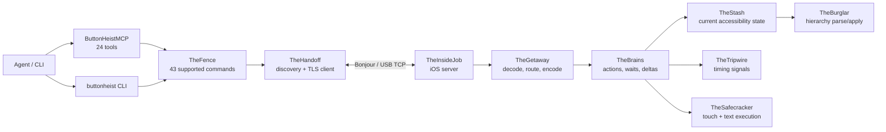

# Button Heist Architecture

Button Heist is a small contract wrapped around a lot of iOS machinery:
agents read an accessibility capture, act through a typed command, and use the
returned delta to decide the next step.

This document names the load-bearing contracts. For exhaustive command shapes,
wire payloads, and per-module implementation notes, use the generated or
reference docs linked at the end.

## Product Contracts

### Strings Only at Edges

There is one product command contract: `TheFence.Command`, currently 43
supported commands. CLI arguments, MCP JSON, session JSON, and heist files
accept canonical command strings such as `activate`, `type_text`, and
`scroll_to_visible`; those strings are parsed once at the boundary and routed as
typed values inside the stack.

Grouped MCP tools are adapters, not a second command model. ButtonHeistMCP
currently exposes 24 tools; tools such as `gesture`, `scroll`, and
`edit_action` use typed selector parameters that route to canonical Fence
commands. Wire message discriminators live one layer lower in TheScore and are
documented separately.

### Captures and Deltas Are the Currency

The durable state is an accessibility capture: a full hierarchy plus a content
hash. Deltas are receipts derived from two captures. Action responses, heist
recording, interaction logs, and background awareness all use that same
capture/delta model instead of parallel before/after interfaces.

Agents should start from `get_interface`, then prefer the action result's delta
over another read. A screen-change delta invalidates old `heistId` handles and
supplies the new interface evidence.

### Tripwire Triggers, Settle Decides Stable

TheTripwire samples UIKit timing signals: presentation-layer movement, pending
layout, animations, top view-controller identity, navigation state, window
ordering, keyboard state, and first responder state. It never classifies the
accessibility tree.

When Tripwire triggers, TheBrains parses the accessibility hierarchy and
`ScreenClassifier` decides whether the settled result is no-change,
element-change, or screen-change. The settle loop can also report unhealthy
snapshots rather than pretending an empty post-navigation parse is stable.

### Scope Has One Public Default

`get_interface` without `scope` returns the normal app accessibility state for
the current screen, including semantic content Button Heist can discover in
scrollable containers. `scope: "visible"` is a diagnostic on-screen parse for
cases such as geometry checks after a scroll or gesture.

Legacy full-scope spellings remain compatibility inputs, not public concepts to
teach. Detail level is separate: `detail: "summary"` keeps responses compact,
while `detail: "full"` adds geometry and heavier accessibility fields.

### One Driver Owns the Session

The server accepts one active driver identity at a time. The identity is
`driverId` when provided, otherwise the auth token. Same-driver reconnects can
join the session; different drivers receive `sessionLocked` until the inactivity
timer releases the session.

Transport supports multiple TCP connections because one-shot CLI/MCP calls may
connect, run, and disconnect repeatedly, but session ownership remains singular.
Runtime watcher/subscription messages are legacy wire cases and are not a public
driver surface.

### Screen Classification Is Typed

Screen changes are not guessed from text, timers, or window events. The parser
builds a typed semantic signature, and `ScreenClassifier` emits the screen
classification used by action results, waiters, and background awareness.

## Component Map

## Core Flows

### Read

1. The client sends `get_interface`.
2. TheInsideJob settles, parses, and returns an accessibility capture.
3. TheFence formats the capture for CLI/MCP using the requested detail level.

### Act

1. TheFence parses a boundary request into `TheFence.Command`.
2. TheGetaway routes the command to TheBrains.
3. TheBrains captures before-state, performs the action, waits for stable UI, and
   parses after-state.
4. `ScreenClassifier` classifies the settled result.
5. The response includes the action receipt, accessibility trace, derived delta,
   and optional expectation result.

### Wait

`wait_for_change` is server-owned. With an expectation, TheInsideJob checks the
current settled state first, then watches later settled captures until the
expectation matches or the timeout expires. `element_disappeared` means current
absence; it is not proof of a prior appearance/removal event.

### Record and Replay

Heist recording stores canonical command names plus portable matchers and
expectations. Replay sends those same public commands through TheFence, so a
failure points at the accessibility contract that changed.

## Reference Docs

- [API Reference](API.md) - public APIs, CLI, MCP tool contract, and command
  catalog notes.
- [Wire Protocol](WIRE-PROTOCOL.md) - TheScore envelopes, transport messages,
  payload schemas, and auth/session details.
- [MCP Agent Guide](MCP-AGENT-GUIDE.md) - practical tool-use patterns for
  agents.
- [Heist Format](HEIST-FORMAT.md) - replayable session file format.
- [Auth](AUTH.md) - authentication, approval, and session locking.
- [Crew Dossiers](dossiers/) - implementation deep dives. These are internal
  notes, not the product contract.
