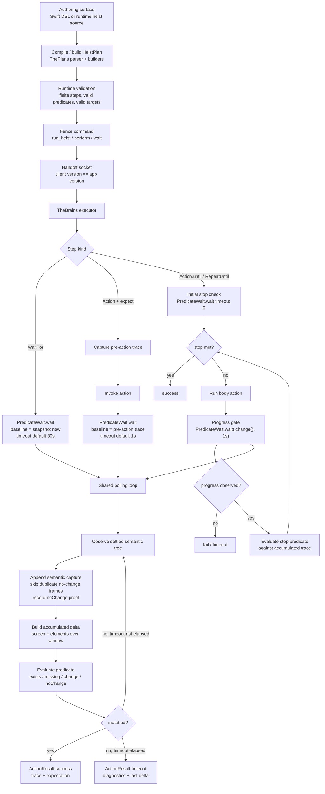

# The Button Heist architecture

The Button Heist lets callers write programs against an app's accessibility
contract. Semantic intent enters the runtime; The Button Heist owns target
resolution, reveal, element inflation, action execution, settling, and
evidence; callers receive settled semantic evidence for validation,
reporting, or the next step.

This document names the load-bearing runtime pieces. The canonical product
contract and conformance cases live in [Accessibility Contract](ACCESSIBILITY-CONTRACT.md).
For exhaustive command shapes, wire payloads, and per-module implementation
notes, use the generated or reference docs linked at the end.

## Product Contracts

### Strings Only at Edges

There is one product command contract: `TheFence.Command`. CLI arguments, MCP
JSON, session JSON, and heist files accept canonical command strings such as
`activate`, `type_text`, and `scroll_to_visible`; those strings are parsed once
at the boundary and routed as typed values inside the stack.

ButtonHeistMCP projects one tool per exposed Fence command from the same
contract. Wire message discriminators live one layer lower in TheScore and are
documented separately.

### Captures and Deltas Are the Currency

The durable state is an accessibility capture: a full hierarchy plus a content
hash. Deltas are receipts derived from two captures. Action responses and heist
contract evidence use that same capture/delta model instead of parallel
before/after interfaces.

Agents should start from `get_interface`, then prefer the action result's delta
over another read. A screen-change delta invalidates prior capture-local
handles and supplies the new interface evidence. Semantic matchers and
predicate fields are the public currency for follow-up actions. See the
[currency types diagram](diagrams/currency-types.md) for the type families and
the internal/wire border.

### Tripwire Triggers, Settle Decides Stable

TheTripwire samples UIKit timing signals: presentation-layer movement, pending
layout, animations, top view-controller identity, navigation state, window
ordering, keyboard state, and first responder state. It never classifies the
accessibility tree.

When Tripwire triggers, TheBrains parses the accessibility hierarchy and waits
for a clean settled snapshot. One pure observation reducer then classifies the
edge: a scoped `screenChanged` notification wins, followed by typed screen
appearance evidence. When the screen identity remains stable, scoped
`layoutChanged` and `valueChanged` notifications become `elementChanged`
signals. Announcement
notifications stay in the evidence stream and never create or wake a semantic
transition. The settle loop can also report unhealthy snapshots rather than
pretending an empty post-navigation parse is stable.
See the [settle loop diagram](diagrams/settle-loop.md) for the state machine
and its constants.

### Observation Has One Owner

`get_interface` returns the app accessibility state for the current screen,
including semantic content The Button Heist can discover in scrollable containers.
`get_screen` returns pixels plus the fresh visible accessibility tree with
geometry. Refresh, exploration, selection, and stale-state decisions live inside
TheInsideJob; clients and adapters send typed observation intent.

Detail level is separate: `detail: "summary"` keeps responses compact, while
`detail: "full"` adds geometry and heavier accessibility fields.

### Element Inflation Is Runtime-Owned

Element inflation is the boundary between a durable semantic target and a fresh
live target that can be acted on now. Callers provide semantic identity. The
runtime owns the bounded viewport and live-geometry work required to execute
that intent.

The pipeline is:

1. Resolve the semantic target against settled accessibility state.
2. Reject missing or ambiguous targets with diagnostics.
3. Reveal the resolved target when viewport movement is required.
4. Refresh semantic and live state after reveal or stale-object detection.
5. Acquire fresh live geometry and activation/action points.
6. Execute the accessibility operation or explicit mechanical gesture.
7. Return settled semantic evidence through `InteractionObservation`.

Predicate evaluation uses semantic observations, not live UIKit geometry. Live
geometry is used for inflation and explicit mechanical or viewport commands; it
is not durable identity. If inflation cannot be proven, the command fails with
diagnostics instead of acting on stale or guessed state. See the
[element inflation diagram](diagrams/element-inflation.md) for the resolution
flowchart.

### State Has One Owner

The Button Heist tracks source-of-truth state only at ownership boundaries.
Everything else is a short-lived index, request correlation, lifecycle phase,
durable artifact, or final output formatting.

The approved long-lived owners are:

- `TheStash`: settled `Screen`, latest disposable `LiveCapture`, and non-clean
  settle diagnostics.
- `TheMuscle`: auth, admission, and session state inside the app.
- `TheHandoff`: external connection phase and discovery state outside the app.
- `PendingRequestTracker`: request ID to continuation correlation, removed on
  resolve, timeout, or cancellation.
- `HeistExecutionResult`: immutable heist execution evidence. Report facts are
  derived from it, not stored beside it.
- Artifact stores: `.heist` package files and screenshot bytes on disk.

`LiveCapture` is an ephemeral index. Its per-path maps exist to disambiguate a
single capture and must not become stable identity. Transport registries and
auth registries may share a client key, but they stay separate: transport does
not own authentication semantics.

### One Driver Owns the Session

The server accepts one active driver identity at a time. The identity is
`driverId` when provided, otherwise the auth token. Same-driver reconnects can
join the session; different drivers receive `sessionLocked` until the inactivity
timer releases the session.

Transport supports multiple TCP connections because one-shot CLI/MCP calls may
connect, run, and disconnect repeatedly, but session ownership remains singular.
Runtime subscriptions are not a public driver surface.

### Screen Classification Is Typed

Screen changes are not guessed from text, timers, or window events. The parser
builds settled captures, `AccessibilityNotificationBus` records scoped
screen/layout/announcement evidence, and `AccessibilityObservationChangeReducer`
owns the one classification decision used by action results and waiters. The
wire transition stores typed fallback reasons rather than a free-form
`screenChangeReason` string. UIKit notification absence is not proof of no
change: silent flows use the settled snapshot and the explicit typed fallback
heuristics.

## Component Map

The full module/dependency graph — every crew member, its responsibility, and
the Codable wire boundary — is drawn in the [crew map diagram](diagrams/crew-map.md).
The [system topology diagram](diagrams/system-topology.md) shows the same
machine at one altitude higher: host tools, the wire, and the `#if DEBUG`
in-app server.

## Execution and Predicate Pipeline

The Button Heist has one source of truth: the accessibility tree, a snapshot of
that tree, or a diff between snapshots. Targets, searches, waits, expectations,
and repeat-loop stop conditions all evaluate through the same predicate model.
For a single action's end-to-end sequence — dispatch, resolution, activation,
settle, delta, receipt — see the [action pipeline diagram](diagrams/action-pipeline.md).

The `WaitFor`, post-action `.expect`, and `RepeatUntil` progress paths all call
`PredicateWait.wait(...)`. The caller chooses the baseline:

- `WaitFor(...)`: baseline is the first snapshot taken inside the wait.
- `Action(...).expect(...)`: baseline is the pre-action snapshot.
- `RunHeist(...).expect(...)`: baseline is the nested heist boundary and stays
  action-like.
- `RepeatUntil(...)` and action `.until(...)`: the stop predicate is checked
  immediately first; after each body, The Button Heist waits up to one second for
  `.change()`, then evaluates the stop predicate against the accumulated trace.

Each baseline is a settled `ObservationCursor` carrying generation, semantic
scope, sequence, capture hash, and notification sequence. The semantic stream
retains bounded per-scope history and builds one `ObservationWindow` from that
baseline through the latest settled capture. Polling extends this window; it
does not maintain a second baseline or notification claim.

A screen appearance ends the current observation generation. The transition
edge remains available as `screenAppearance` evidence, but retained state from
the prior screen is discarded and the destination capture starts collection
for the new generation.

An observation window projects its accumulated trace into distinct transition
facts. `screenAppearance` carries screen-change evidence, `elementsChanged`
carries before/after element evidence and layout notifications, and interaction
or announcement facts remain diagnostic. Generic `.change()` accepts screen or
element facts; element and screen predicates read only their matching fact.
Only a complete window can produce unchanged evidence. If lineage or retained
history is incomplete, the window has no verdict, so `.noChange` cannot pass.

The public predicate layer is intentionally one tree language:

- State predicates: `.exists(...)`, `.missing(...)`,
  `.exists(container: ...)`, `.missing(container: ...)`.
- Change predicates: `.screenChanged(...)`, `.change(.elements(...))`, `.noChange`.
- Element delta assertions: `.appeared(...)`, `.disappeared(...)`,
  `.updated(...)`.

## Core Flows

### Read

1. The client sends `get_interface`.
2. TheInsideJob settles, parses, and returns an accessibility capture.
3. TheFence formats the capture for CLI/MCP using the requested detail level.

### Act

1. TheFence parses a boundary request into `TheFence.Command`.
2. TheFence lowers the request into a one-step or composed `HeistPlan` and sends
   `ClientMessage.heistPlan`.
3. TheGetaway routes the plan to TheBrains' heist runtime.
4. TheBrains captures before-state, performs the action, waits for stable UI, and
   parses after-state.
5. `AccessibilityObservationChangeReducer` classifies the settled edge using
   scoped notifications first and typed fallback facts when notifications are silent.
6. The response includes the heist execution receipt, accessibility trace, derived delta,
   and optional expectation result.

### Wait

`wait` is a one-step heist. TheInsideJob checks the current settled state first,
then watches later settled captures until the requested accessibility predicate
matches or the timeout expires. Snapshot predicates are direct final-state
checks, including semantic container presence through
`.exists(container: ...)`. Element transition waits such as `.appeared(...)`,
`.disappeared(...)`, and
`.updated(...)` first try to observe the transition; if the implied final state
is already true, or becomes true without transition evidence, standalone
`WaitFor(...)` passes with a warning. Action expectations and
`RunHeist(...).expect(...)` stay strict transition assertions.

### Replay

Heist replay executes authored `HeistPlan` artifacts through TheFence, so a
failure points at the accessibility contract that changed.

## Reference Docs

- [Diagrams](diagrams/README.md) - architecture diagrams, one file per
  concern; the [process boundaries diagram](diagrams/process-boundaries.md)
  draws the in-process vs out-of-process argument.
- [Accessibility Contract](ACCESSIBILITY-CONTRACT.md) - canonical product
  contract, boundary map, pipeline, and conformance cases.
- [API Reference](API.md) - public APIs, CLI, MCP tool contract, and command
  catalog notes.
- [Wire Protocol](WIRE-PROTOCOL.md) - TheScore envelopes, transport messages,
  payload schemas, and auth/session details.
- [MCP Agent Guide](MCP-AGENT-GUIDE.md) - practical tool-use patterns for
  agents.
- [Heist Format](HEIST-FORMAT.md) - generated heist artifact and plan IR format.
- [Auth](AUTH.md) - authentication, approval, and session locking.
