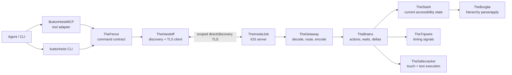

# Button Heist Architecture

Button Heist lets callers write programs against an app's accessibility
contract. Semantic intent enters the runtime; Button Heist owns target
resolution, reveal, element inflation, action execution, settling, and
evidence; callers receive settled semantic evidence for validation, recording,
reporting, or the next step.

This document names the load-bearing runtime pieces. The canonical product
contract and conformance cases live in [Accessibility Contract](ACCESSIBILITY-CONTRACT.md).
For exhaustive command shapes, wire payloads, and per-module implementation
notes, use the generated or reference docs linked at the end.

## Product Contracts

### Strings Only at Edges

There is one product command contract: `TheFence.Command`. CLI arguments, MCP
JSON, session JSON, and heist files accept canonical command strings such as
`activate`, `type_text`, and `scroll_to_visible`; those strings are parsed once
at the boundary and routed as typed values inside the stack.

ButtonHeistMCP projects one tool per exposed Fence command from the same
contract. Wire message discriminators live one layer lower in TheScore and are
documented separately.

### Captures and Deltas Are the Currency

The durable state is an accessibility capture: a full hierarchy plus a content
hash. Deltas are receipts derived from two captures. Action responses and heist
contract evidence use that same capture/delta model instead of parallel
before/after interfaces.

Agents should start from `get_interface`, then prefer the action result's delta
over another read. A screen-change delta invalidates prior capture-local
handles and supplies the new interface evidence. Semantic matchers and
predicate fields are the public currency for follow-up actions.

### Tripwire Triggers, Settle Decides Stable

TheTripwire samples UIKit timing signals: presentation-layer movement, pending
layout, animations, top view-controller identity, navigation state, window
ordering, keyboard state, and first responder state. It never classifies the
accessibility tree.

When Tripwire triggers, TheBrains parses the accessibility hierarchy and
`ScreenClassifier` decides whether the settled result is no-change,
element-change, or screen-change. The settle loop can also report unhealthy
snapshots rather than pretending an empty post-navigation parse is stable.

### Observation Has One Owner

`get_interface` returns the app accessibility state for the current screen,
including semantic content Button Heist can discover in scrollable containers.
`get_screen` returns pixels plus the fresh visible accessibility tree with
geometry. Refresh, exploration, selection, and stale-state decisions live inside
TheInsideJob; clients and adapters send typed observation intent.

Detail level is separate: `detail: "summary"` keeps responses compact, while
`detail: "full"` adds geometry and heavier accessibility fields.

### One Driver Owns the Session

The server accepts one active driver identity at a time. The identity is
`driverId` when provided, otherwise the auth token. Same-driver reconnects can
join the session; different drivers receive `sessionLocked` until the inactivity
timer releases the session.

Transport supports multiple TCP connections because one-shot CLI/MCP calls may
connect, run, and disconnect repeatedly, but session ownership remains singular.
Runtime subscriptions are not a public driver surface.

### Screen Classification Is Typed

Screen changes are not guessed from text, timers, or window events. The parser
builds a typed semantic signature, and `ScreenClassifier` emits the screen
classification used by action results and waiters.

## Component Map

## Core Flows

### Read

1. The client sends `get_interface`.
2. TheInsideJob settles, parses, and returns an accessibility capture.
3. TheFence formats the capture for CLI/MCP using the requested detail level.

### Act

1. TheFence parses a boundary request into `TheFence.Command`.
2. TheFence lowers the request into a one-step or composed `HeistPlan` and sends
   `ClientMessage.heistPlan`.
3. TheGetaway routes the plan to TheBrains' heist runtime.
4. TheBrains captures before-state, performs the action, waits for stable UI, and
   parses after-state.
5. `ScreenClassifier` classifies the settled result.
6. The response includes the heist execution receipt, accessibility trace, derived delta,
   and optional expectation result.

### Wait

`wait` is a one-step heist. TheInsideJob checks the current settled state first,
then watches later settled captures until the requested accessibility predicate
matches or the timeout expires. `element_disappeared` means current absence; it
is not proof of a prior appearance/removal event.

### Record and Replay

Heist recording stores canonical command names plus portable matchers and
expectations. Replay sends those same public commands through TheFence, so a
failure points at the accessibility contract that changed.

## Reference Docs

- [Accessibility Contract](ACCESSIBILITY-CONTRACT.md) - canonical product
  contract, boundary map, pipeline, and conformance cases.
- [API Reference](API.md) - public APIs, CLI, MCP tool contract, and command
  catalog notes.
- [Wire Protocol](WIRE-PROTOCOL.md) - TheScore envelopes, transport messages,
  payload schemas, and auth/session details.
- [MCP Agent Guide](MCP-AGENT-GUIDE.md) - practical tool-use patterns for
  agents.
- [Heist Format](HEIST-FORMAT.md) - generated heist artifact and plan IR format.
- [Recording Contract](RECORDING-CONTRACT.md) - how runtime evidence becomes
  durable semantic heist steps.
- [Element Inflation](ELEMENT-INFLATION.md) - semantic target to inflated live
  target boundary.
- [Auth](AUTH.md) - authentication, approval, and session locking.
