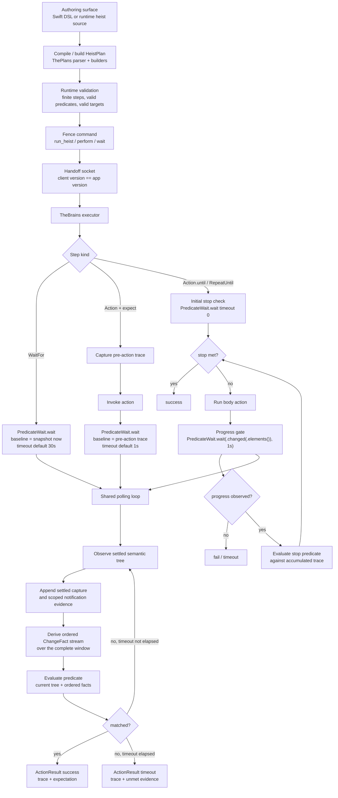

# The Button Heist architecture

The Button Heist lets callers write programs against an app's accessibility
contract. Semantic intent enters the runtime; The Button Heist owns target
resolution, reveal, element inflation, action execution, settling, and
evidence; callers receive settled semantic evidence for validation,
reporting, or the next step.

This document names the load-bearing runtime pieces. The canonical product
contract and conformance cases live in [Accessibility Contract](ACCESSIBILITY-CONTRACT.md).
For exhaustive command shapes, wire payloads, and per-module implementation
notes, use the generated or reference docs linked at the end.

## Product Contracts

### Strings Only at Edges

There is one product command contract: `TheFence.Command`. CLI arguments, MCP
JSON, session JSON, and heist files accept canonical command strings such as
`activate`, `type_text`, and `scroll_to_visible`; those strings are parsed once
at the boundary and routed as typed values inside the stack.

ButtonHeistMCP projects one tool per exposed Fence command from the same
contract. Wire message discriminators live one layer lower in TheScore and are
documented separately.

### Captures and Change Facts Are the Currency

The durable observation truth is an `AccessibilityTrace` of settled captures.
Each capture contains the delivered `Interface` tree and its content hash.
There is no independently stored delta or alternate flat screen model.

The trace derives one ordered `ChangeFact` stream for every temporal consumer.
Predicates, receipts, diagnostics, and repair analysis all use those facts. A
public response may expose a compact `delta`, but that value is a one-way,
lossy fold of the ordered facts: facts are stacked in time and then squashed for
display. It is never fed back into predicate evaluation.

Agents should start from `get_interface`, then inspect an action result's public
delta before issuing another read. After a screen change, build follow-up
targets from the new interface evidence. See the
[currency types diagram](diagrams/currency-types.md) for the type families and
the [observation pipeline diagram](diagrams/observation-pipeline.md) for the
capture, fact, predicate, and public-fold boundaries.

### Tripwire Triggers, Settle Decides Stable

TheTripwire samples UIKit timing signals: presentation-layer movement, pending
layout, animations, top view-controller identity, navigation state, window
ordering, keyboard state, and first responder state. It never classifies the
accessibility tree.

When Tripwire triggers, TheBrains parses the accessibility hierarchy and waits
for a clean settled snapshot. One pure observation reducer combines the
settled capture edge with scoped `screenChanged`, typed `elementChanged`, and
`announcement` notifications. Notifications are edge evidence, not a second
state model. Screen and element notifications classify interface change;
announcements remain separate transition evidence and never synthesize an
interface mutation.

Settling itself has one AX reducer, `SettleLoopMachine`, and one async runner,
`SettleLoopRunner`. `SettlePolicy` selects the stability proof and sampling
cadence for that pair; it does not create another settle pipeline. UIKit and
ObjC signals may trigger or reset sampling, but they never classify the AX tree.

A screen notification starts a new observation generation. The screen boundary
is normalized as old-tree departures, a `screenChanged` marker, then new-tree
arrivals. Layout, value, and announcement notifications trigger same-generation
element facts when there is no screen boundary. The settle loop can also report
unhealthy snapshots rather than pretending an empty post-navigation parse is
stable.

UIKit value changes are not identified by an `elementChanged(.value)` signal
alone. UIKit controls may signal through either element-change subtype or an
announcement, so all three trigger a recapture; the before/after
`accessibilityValue` diff confirms the change. SwiftUI's uniform value
notification follows the same recapture path.
See the [settle loop diagram](diagrams/settle-loop.md) for the state machine
and its constants.

### Observation Has One Owner

`get_interface` returns the app accessibility state for the current screen,
including semantic content The Button Heist can discover in scrollable containers.
`get_screen` returns pixels plus the fresh visible accessibility tree with
geometry. Refresh, exploration, selection, and stale-state decisions live inside
TheInsideJob; clients and adapters send typed observation intent.

Detail level is separate: `detail: "summary"` keeps responses compact, while
`detail: "full"` adds geometry and heavier accessibility fields.

### Element Inflation Is Runtime-Owned

Element inflation is the boundary between a durable semantic target and a fresh
live target that can be acted on now. Callers provide semantic identity. The
runtime owns the bounded viewport and live-geometry work required to execute
that intent.

The pipeline is:

1. Resolve the semantic target against settled accessibility state.
2. Reject missing or ambiguous targets with diagnostics.
3. Reveal the resolved target when viewport movement is required.
4. Refresh semantic and live state after reveal or stale-object detection.
5. Acquire fresh live geometry and activation/action points.
6. Execute the accessibility operation or explicit mechanical gesture.
7. Return settled semantic evidence through `InteractionObservation`.

Predicate evaluation uses semantic observations, not live UIKit geometry. Live
geometry is used for inflation and explicit mechanical or viewport commands; it
is not durable identity. If inflation cannot be proven, the command fails with
diagnostics instead of acting on stale or guessed state. See the
[element inflation diagram](diagrams/element-inflation.md) for the resolution
flowchart.

### State Has One Owner

The Button Heist tracks source-of-truth state only at ownership boundaries.
Everything else is a short-lived index, request correlation, lifecycle phase,
durable artifact, or final output formatting.

The approved long-lived owners are:

- `TheStash`: settled `Screen`, latest disposable `LiveCapture`, and non-clean
  settle diagnostics.
- `TheMuscle`: auth, admission, and session state inside the app.
- `TheHandoff`: external connection phase and discovery state outside the app.
- `PendingRequestTracker`: request ID to continuation correlation, removed on
  resolve, timeout, or cancellation.
- `HeistExecutionResult`: immutable heist execution evidence. Report facts are
  derived from it, not stored beside it.
- Artifact stores: `.heist` package files and screenshot bytes on disk.

`LiveCapture` is an ephemeral index. Its per-path maps exist to disambiguate a
single capture and must not become stable identity. Transport registries and
auth registries may share a client key, but they stay separate: transport does
not own authentication semantics.

### Report and Action Evidence Have One Owner

`HeistExecutionStepReportFacts` is the canonical typed projection of report
facts from `HeistExecutionResult`. Formatters, diagnostics, and repair tooling
consume that projection; they do not rebuild report facts from plan siblings or
parallel result fields.

`ActionResult` owns one `ActionResultEvidence` envelope for post-action
evidence. `PostActionObservation` coordinates capture and settle proof, then
supplies that envelope; it does not publish a second post-action evidence shape.

UIKit/ObjC `@unchecked Sendable` is a platform-boundary escape hatch only. Such
uses stay in TheInsideJob, require an exact source-shape allowlist entry and a
justification, and must not cross into the typed core or wire/report layers.

### One Driver Owns the Session

The server accepts one active driver identity at a time. The identity is
`driverId` when provided, otherwise the auth token. Same-driver reconnects can
join the session; different drivers receive `sessionLocked` until the inactivity
timer releases the session.

Transport supports multiple TCP connections because one-shot CLI/MCP calls may
connect, run, and disconnect repeatedly, but session ownership remains singular.
Runtime subscriptions are not a public driver surface.

### Screen Classification Is Typed

Screen changes are not guessed from text, timers, or window events. The parser
builds settled captures, `AccessibilityNotificationBus` records scoped screen,
layout, value, and announcement evidence, and
`AccessibilityObservationChangeReducer` determines the capture-edge kind used
to derive facts. A screen notification is authoritative and starts a new
generation. Notification absence is not proof of no change: silent flows still
derive facts from settled capture differences and typed screen-appearance
evidence.

## Component Map

The full module/dependency graph — every crew member, its responsibility, and
the Codable wire boundary — is drawn in the [crew map diagram](diagrams/crew-map.md).
The [system topology diagram](diagrams/system-topology.md) shows the same
machine at one altitude higher: host tools, the wire, and the `#if DEBUG`
in-app server.

## Execution and Predicate Pipeline

The Button Heist has one current-tree projection and one temporal projection:
the delivered `Interface` tree and the ordered facts derived from its capture
trace. Targets, `get_interface` subtree queries, waits, expectations, and
repeat-loop stop conditions use one `AccessibilityTarget` language and one
`AccessibilityPredicate<Context>` tree. For a single action's end-to-end
sequence, see the [action pipeline diagram](diagrams/action-pipeline.md).

The `WaitFor`, post-action `.expect`, and `RepeatUntil` progress paths all call
`PredicateWait.wait(...)`. The caller chooses the baseline:

- `WaitFor(...)`: baseline is the first snapshot taken inside the wait.
- `Action(...).expect(...)`: baseline is the pre-action snapshot.
- `RunHeist(...).expect(...)`: baseline is the nested heist boundary and stays
  action-like.
- `RepeatUntil(...)` and action `.until(...)`: the stop predicate is checked
  immediately first; after each body, The Button Heist waits up to one second for
  `.changed(.elements())`, then evaluates the stop predicate against the
  accumulated trace. Screen boundaries also emit element lifecycle facts, so
  they satisfy this progress gate.

Each baseline is a settled `ObservationCursor` carrying generation, semantic
scope, sequence, capture hash, and notification sequence. The semantic stream
retains bounded per-scope history and builds one `ObservationWindow` from that
baseline through the latest settled capture. Polling extends this window; it
does not maintain a second baseline or notification claim.

A screen notification ends the current observation generation and starts the
next. The boundary is retained in the same ordered fact stream as three facts:

1. `elementsChanged` with every node in the old delivered tree disappeared.
2. `screenChanged` as the generation boundary marker.
3. `elementsChanged` with every node in the new delivered tree appeared.

This makes a screen change an element lifecycle change without pretending that
nodes were updated across generations. Only same-generation capture edges can
construct `updated` facts. A target that has the same semantics on both screens
still disappears and appears because its generation changed.

An observation window contains raw settled captures and completeness. Its
ordered `ChangeFact` stream is derived from those captures plus scoped
notification evidence. There is no standalone transition-warning fallback and
no endpoint delta used by the evaluator. Only a complete, fact-free window can
satisfy `.noChange`.

The public predicate layer is one context-typed tree language:

- Root predicates: `.exists(target)`, `.missing(target)`,
  `.changed(...)`, `.noChange`, and `.announcement(...)`.
- Screen declaration: `.changed(.screen([.exists(target), .missing(target)]))`.
- Elements declaration: `.changed(.elements([.exists(target),
  .missing(target), .appeared(target), .disappeared(target),
  .updated(target, change)]))`.

`exists` and `missing` always evaluate against the current delivered tree,
including containers. `appeared`, `disappeared`, and `updated` consume ordered
element facts. Swift's generic contexts make invalid combinations such as an
`updated` screen assertion unconstructible.

## Core Flows

### Read

1. The client sends `get_interface`.
2. TheInsideJob settles, parses, and returns an accessibility capture.
3. TheFence formats the capture for CLI/MCP using the requested detail level.

### Act

1. TheFence parses a boundary request into `TheFence.Command`.
2. TheFence lowers the request into a one-step or composed `HeistPlan` and sends
   `ClientMessage.heistPlan`.
3. TheGetaway routes the plan to TheBrains' heist runtime.
4. TheBrains captures before-state, performs the action, waits for stable UI, and
   parses after-state.
5. The trace derives ordered `ChangeFact` values from settled capture edges and
   scoped notification evidence.
6. Predicates evaluate directly from the current tree and those facts.
7. The response includes the heist execution receipt, accessibility trace,
   optional expectation result, and a public delta folded from the facts.

### Wait

`wait` is a one-step heist. TheInsideJob checks current-tree predicates first,
then extends one observation window until the requested predicate matches or
the timeout expires. `.exists(target)` and `.missing(target)` are current-tree
checks. `.changed(.elements(...))` and `.changed(.screen(...))` require their
declared fact evidence. A lifecycle assertion never passes from final state
alone and there is no warning-based fallback.

### Replay

Heist replay executes authored `HeistPlan` artifacts through TheFence, so a
failure points at the accessibility contract that changed.

## Reference Docs

- [Diagrams](diagrams/README.md) - architecture diagrams, one file per
  concern; the [process boundaries diagram](diagrams/process-boundaries.md)
  draws the in-process vs out-of-process argument.
- [Accessibility Contract](ACCESSIBILITY-CONTRACT.md) - canonical product
  contract, boundary map, pipeline, and conformance cases.
- [API Reference](API.md) - public APIs, CLI, MCP tool contract, and command
  catalog notes.
- [Wire Protocol](WIRE-PROTOCOL.md) - TheScore envelopes, transport messages,
  payload schemas, and auth/session details.
- [MCP Agent Guide](MCP-AGENT-GUIDE.md) - practical tool-use patterns for
  agents.
- [Heist Format](HEIST-FORMAT.md) - generated heist artifact and plan IR format.
- [Auth](AUTH.md) - authentication, approval, and session locking.
