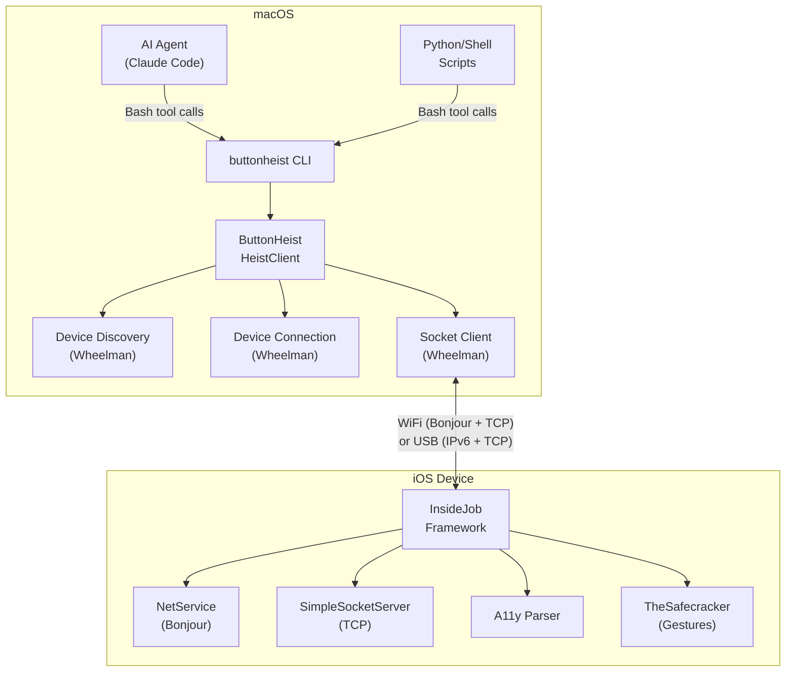
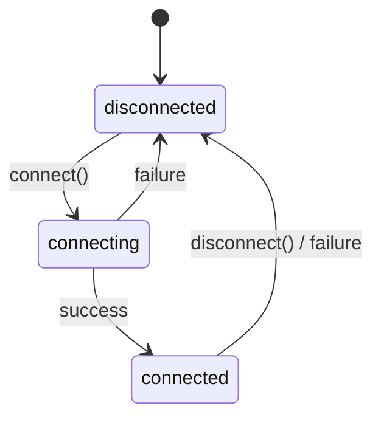
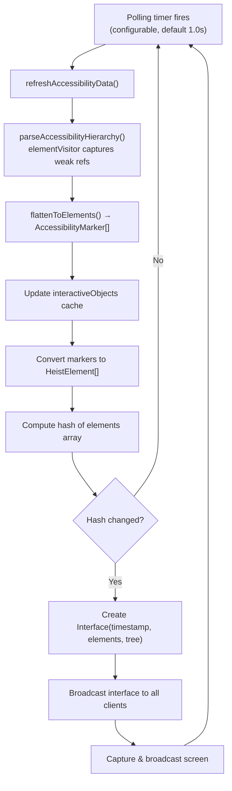
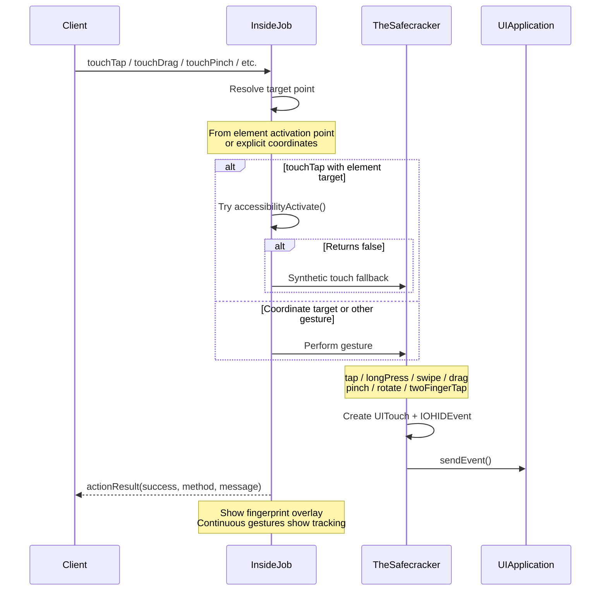

# ButtonHeist Architecture

This document describes the internal architecture of ButtonHeist and how its components interact.

## System Overview

ButtonHeist is a distributed system that lets AI agents (and humans) inspect and control iOS apps. Its main components are:

1. **TheGoods** - Cross-platform shared types (messages, models)
2. **Wheelman** - Cross-platform networking library (TCP server/client, Bonjour discovery)
3. **InsideJob** - iOS framework embedded in the app being inspected
4. **ButtonHeist** - macOS client framework (single import for Mac consumers)
5. **buttonheist CLI** - Command-line tool for driving iOS apps (used by AI agents via Bash)



## Component Details

### TheGoods

**Purpose**: Shared types and protocol definitions for cross-platform communication.

**Key Types**:
- `ClientMessage` - Messages from client to server (25 cases including 9 touch gestures, text input, edit actions, idle waiting, and recording control)
- `ServerMessage` - Messages from server to client (13 cases including auth challenge/failure/approval, recording events)
- `HeistElement` - Flat UI element representation (with traits, hint, activation point, custom content)
- `ElementNode` - Recursive tree structure with containers
- `Group` - Container metadata (type, label, frame)
- `Interface` - Container for UI element interface data (flat list + optional tree)
- `ServerInfo` - Device and app metadata (incl. instanceId, listeningPort, simulatorUDID, vendorIdentifier)
- `ActionResult` - Action outcome with method, optional message, interface delta, and animation state
- `ScreenPayload` - Base64-encoded PNG with dimensions
- `RecordingConfig` - Recording configuration (fps, scale, inactivity timeout, max duration)
- `RecordingPayload` - Completed recording with base64 H.264/MP4 video and metadata

**Design Decisions**:
- All types are `Codable` and `Sendable` for JSON serialization and concurrency safety
- No platform-specific imports (UIKit/AppKit)
- Protocol version 3.1 with token-based authentication and session locking

### InsideJob

**Purpose**: iOS server that captures and broadcasts UI element interface and handles remote interaction.

**Architecture**:
```
InsideJob (singleton, @MainActor) — coordinator split across extension files:
│   InsideJob.swift              — core server lifecycle, client dispatch
│   InsideJob+Accessibility.swift — hierarchy parsing, element conversion, delta computation
│   InsideJob+Animation.swift    — animation detection, waitForIdle, actionResultWithDelta
│   InsideJob+AutoStart.swift    — ObjC +load auto-start bridge
│   InsideJob+Polling.swift      — polling loop, interface broadcasting
│   InsideJob+Screen.swift       — screen capture, broadcasting, recording management
│
├── SimpleSocketServer (from Wheelman; NWListener TCP server, IPv6 dual-stack)
│   └── Client connections (file descriptors)
├── NetService (Bonjour advertisement)
├── AccessibilityHierarchyParser (from AccessibilitySnapshot submodule)
│   └── elementVisitor closure (captures live NSObject references during parse)
├── ElementStore protocol (exposes cachedElements + interactiveObjects to TheSafecracker)
├── TheSafecracker (all interaction dispatch: actions, gestures, text entry)
│   │   TheSafecracker.swift             — touch primitives, keyboard helpers
│   │   TheSafecracker+Actions.swift     — execute* methods for actions and gestures
│   │   TheSafecracker+Elements.swift    — element resolution, point resolution
│   │   TheSafecracker+TextEntry.swift   — text typing and deletion
│   ├── SyntheticTouchFactory (UITouch creation via private APIs)
│   ├── SyntheticEventFactory (UIEvent manipulation)
│   ├── IOHIDEventBuilder (multi-finger HID event creation via IOKit)
│   └── UIKeyboardImpl (text injection via ObjC runtime, same approach as KIF)
├── Stakeout (screen recording engine)
│   ├── AVAssetWriter (H.264/MP4 encoding)
│   ├── Frame capture via drawHierarchy + CGContext fingerprint compositing
│   ├── Inactivity monitor (screen hash + command tracking)
│   └── File size guard (7MB cap for wire protocol)
├── TheMuscle (authentication, token persistence, connection approval UI)
├── Fingerprints (FingerprintWindow overlay + TheSafecracker gesture tracking)
├── Polling Timer (interface change detection via hash comparison)
└── Debounce Timer (300ms debounce for UI notifications)
```

**Auto-Start Mechanism**:

InsideJob uses ObjC `+load` for automatic initialization:

```
InsideJobLoader/
├── InsideJobAutoStart.h  (public header)
└── InsideJobAutoStart.m  (+load implementation → InsideJob_autoStartFromLoad)
```

When the framework loads:
1. `+load` is called automatically by the runtime
2. Reads configuration from environment variables or Info.plist:
   - `INSIDEJOB_DISABLE` / `InsideJobDisableAutoStart` - skip startup
   - `INSIDEJOB_POLLING_INTERVAL` / `InsideJobPollingInterval` - update interval (default: 1.0s, min: 0.5s)
3. Creates a Task on MainActor to configure and start InsideJob singleton
4. Begins polling for interface changes

**Threading Model**:
- Entire class marked `@MainActor`
- All UIKit operations on main thread
- Network callbacks dispatch to main actor
- Socket accept/read on dedicated GCD queues

**TCP Server (SimpleSocketServer)**:
- Network framework implementation using `NWListener` and `NWConnection`
- IPv6 dual-stack (accepts both IPv4 and IPv6)
- Binds to all interfaces (`::`) for Bonjour compatibility
- OS-assigned port (advertised via Bonjour)
- Newline-delimited JSON protocol (0x0A separator)
- Max 5 concurrent connections, 30 messages/second rate limit, 10 MB buffer limit
- Token-based authentication with session locking (v3.1)

### TheSafecracker (Touch Gesture & Text Input System)

**Purpose**: Synthesize touch gestures and inject text on the iOS device to allow remote interaction. Supports single-finger gestures (tap, long press, swipe, drag), multi-touch gestures (pinch, rotate, two-finger tap), and text input via UIKeyboardImpl.

**Architecture**:
```
TheSafecracker (stateful, @MainActor)
│
├── Single-Finger Gestures
│   ├── tap(at:)           → touchDown + touchUp
│   ├── longPress(at:)     → touchDown + delay + touchUp
│   ├── swipe(from:to:)    → touchDown + interpolated moves + touchUp
│   └── drag(from:to:)     → touchDown + interpolated moves + touchUp (slower)
│
├── Multi-Touch Gestures
│   ├── pinch(center:scale:)    → 2-finger spread/squeeze
│   ├── rotate(center:angle:)   → 2-finger rotation
│   └── twoFingerTap(at:)       → 2-finger simultaneous tap
│
├── Text Input (via UIKeyboardImpl)
│   ├── typeText(_:)             → addInputString: per character
│   ├── deleteText(count:)       → deleteFromInput per character
│   └── isKeyboardVisible()      → UIInputSetHostView detection
│
├── N-Finger Primitives
│   ├── touchesDown(at: [CGPoint])  → Create N touches + HID event + sendEvent
│   ├── moveTouches(to: [CGPoint])  → Update all active touches
│   └── touchesUp()                 → End all active touches
│
└── Touch Stack
    ├── SyntheticTouchFactory     → UITouch creation via direct IMP invocation
    │   ├── performIntSelector    → setPhase:, setTapCount: (raw Int)
    │   ├── performBoolSelector   → _setIsFirstTouchForView:, setIsTap: (raw Bool)
    │   ├── performDoubleSelector → setTimestamp: (raw Double)
    │   └── setHIDEvent           → _setHidEvent: (raw pointer)
    ├── IOHIDEventBuilder         → Hand event with per-finger child events
    │   ├── @convention(c) typed function pointers via dlsym
    │   └── Finger identity/index for multi-touch tracking
    └── SyntheticEventFactory     → Fresh UIEvent per touch phase
```

**Text Input Design**:
- The iOS software keyboard is rendered by a separate remote process. Individual key views are not in the app's view hierarchy — only a `_UIRemoteKeyboardPlaceholderView` placeholder exists.
- TheSafecracker uses `UIKeyboardImpl.activeInstance` (via ObjC runtime) to get the keyboard controller, then calls `addInputString:` to inject text and `deleteFromInput` to delete — the same approach used by KIF (Keep It Functional).
- Keyboard visibility is detected by finding `UIInputSetHostView` (height > 100pt) in the window hierarchy.

**Key Design Decisions**:
- **Direct IMP invocation**: `perform(_:with:)` boxes non-object types (Int, Bool, Double, UnsafeMutableRawPointer) as NSNumber objects, corrupting values passed to private ObjC methods. All private API calls use `method(for:)` + `unsafeBitCast` to `@convention(c)` typed function pointers.
- **`@convention(c)` for dlsym**: C function pointers from `dlsym` are 8 bytes; Swift closures are 16 bytes. All IOKit function pointer variables use `@convention(c)` for `unsafeBitCast` compatibility.
- **Fresh UIEvent per phase**: iOS 26's stricter validation rejects reused event objects. Each touch phase (began, moved, ended) creates a new UIEvent.
- **Overlay window filtering**: `windowForPoint()` filters out `FingerprintWindow` instances by type to prevent touch injection into the overlay window.

### TheMuscle (Authentication & Connection Approval)

**Purpose**: Manages client authentication, token persistence, and UI-based connection approval. Extracted from InsideJob to isolate auth concerns.

**Token Persistence**: Auto-generated tokens are stored in UserDefaults (`InsideJobAuthToken` key) so they survive app relaunches. Previously approved clients can reconnect without re-approval. When an explicit token is provided via `INSIDEJOB_TOKEN` or `InsideJobToken` plist key, UserDefaults is not used.

**Token Invalidation**: `invalidateToken()` generates a new token and stores it in UserDefaults. All previously approved clients lose access and must re-authenticate.

**Responsibilities**:
- Token resolution: explicit → persisted (UserDefaults) → generate new
- Token-based authentication (validate incoming tokens)
- UI approval flow (present UIAlertController, handle allow/deny)
- Track authenticated client count and IDs
- Manage pending approval state
- Session locking: single-driver exclusivity with dual-timer release
  - **Disconnect timer** (`INSIDEJOB_SESSION_TIMEOUT`, default 30s): starts when all TCP connections drop
  - **Lease timer** (`INSIDEJOB_SESSION_LEASE`, default 30s): resets on each client ping, releases session and invalidates token if no pings received (handles hung connections)
- Track active session driver identity and connections
- Force-takeover handling (evict existing session on `forceSession`)

**Integration**: TheMuscle communicates back to InsideJob via closures for socket operations (send, disconnect, markAuthenticated) and post-auth handling (onClientAuthenticated).

### Screen Capture

InsideJob captures the screen using `UIGraphicsImageRenderer`:
1. Finds the foreground window scene
2. Uses `drawHierarchy(in:afterScreenUpdates:)` to capture the full visual hierarchy (including SwiftUI)
3. Encodes as PNG, then base64
4. Returns `ScreenPayload` with dimensions and timestamp
5. Screen captures are automatically broadcast alongside interface changes during polling

### Screen Recording (Stakeout)

The `Stakeout` class provides on-device screen recording as H.264/MP4:

1. Client sends `startRecording` with optional configuration (fps, scale, timeouts)
2. InsideJob creates a `Stakeout` instance with a frame capture closure
3. Stakeout uses `AVAssetWriter` with H.264 codec, encoding frames from `drawHierarchy` compositing
4. Unlike screenshots, recording captures **include** the `FingerprintWindow` so interaction indicators are visible in the video. Additionally, `Stakeout` composites fingerprint circles directly into frames via CGContext for interactions that complete between frame captures.
5. Frames are captured at the configured FPS (default 8, range 1-15) using `afterScreenUpdates: false` to reduce main thread impact
6. Action-triggered bonus frames are captured after each successful action completes
7. An inactivity monitor checks every second — recording auto-stops when no screen changes and no real interactions (actions, touches, typing) are received for the configured timeout. Pings and keepalive messages do not reset the inactivity timer.
8. File size is capped at 7MB to stay within the wire protocol's 10MB buffer limit after base64 encoding
9. Default resolution is 1x point size (native pixels / screen scale), configurable from 0.25x to 1.0x native
10. On completion, the video is base64-encoded and sent as a `recording(RecordingPayload)` message

### Wheelman

**Purpose**: Cross-platform (iOS+macOS) networking library. Provides TCP server, client connections, and Bonjour discovery.

**Key Types**:
- `SimpleSocketServer` - Network framework TCP server (NWListener, IPv6 dual-stack), used by InsideJob on iOS
- `DeviceConnection` - TCP client with NWConnection service resolution and data transport
- `DeviceDiscovery` - NWBrowser-based Bonjour browsing for `_buttonheist._tcp`, extracts TXT records
- `DiscoveredDevice` - Discovered device metadata (id, name, endpoint, simulatorUDID, vendorIdentifier, tokenHash, instanceId)

### ButtonHeist (macOS Client Framework)

**Purpose**: Single-import macOS framework. Re-exports TheGoods and Wheelman, provides the high-level `HeistClient` class.

**Usage**: `import ButtonHeist` gives access to all types (HeistClient, HeistElement, Interface, DiscoveredDevice, etc.)

**Architecture**:
```
HeistClient (ObservableObject, @MainActor)
├── DeviceDiscovery (from Wheelman)
│   └── NWBrowser (Bonjour browsing for "_buttonheist._tcp")
├── DeviceConnection (from Wheelman)
│   └── NWConnection (service resolution + data transport)
└── Published Properties
    ├── discoveredDevices: [DiscoveredDevice]
    ├── connectedDevice: DiscoveredDevice?
    ├── connectionState: ConnectionState
    ├── currentInterface: Interface?
    ├── currentScreen: ScreenPayload?
    └── serverInfo: ServerInfo?
```

**Dual API Design**:

1. **SwiftUI (Reactive)**: `@Published` properties trigger view updates
2. **Callbacks (Imperative)**: Closures for CLI and non-SwiftUI usage
3. **Async/Await**: `waitForActionResult(timeout:)` and `waitForScreen(timeout:)` for scripting

**Auto-Subscribe on Connect**: When a connection is established, HeistClient automatically sends `subscribe`, `requestInterface`, and `requestScreen` messages.

**Connection State Machine**:


## Data Flow

### CLI Agent Flow

The CLI is the primary interface for AI agents. Agents use the Bash tool to run `buttonheist` commands directly. Device discovery is handled via Bonjour.

```
1. Agent reads the UI hierarchy
   └── Bash: buttonheist watch --once --format json
   └── CLI: Bonjour discover → TCP connect → requestInterface → print JSON → exit

2. Agent captures a screenshot
   └── Bash: buttonheist screenshot --output /tmp/screen.png
   └── CLI: Bonjour discover → TCP connect → requestScreen → save PNG → exit

3. Agent taps a button
   └── Bash: buttonheist touch tap --identifier loginButton --format json
   └── CLI: Bonjour discover → TCP connect → touchTap → print ActionResult JSON → exit
   └── JSON includes delta (noChange, valuesChanged, elementsChanged, screenChanged)

4. Agent types text
   └── Bash: buttonheist type --text "hello" --identifier emailField --format json
   └── CLI: Bonjour discover → TCP connect → typeText → print result JSON → exit

5. Agent verifies the result
   └── Bash: buttonheist watch --once --format json
   └── Agent compares new hierarchy to previous state
```

Each CLI invocation is stateless — it discovers via Bonjour, connects, performs the operation, and exits.

### Discovery Flow


### Multi-Instance Discovery

When running multiple instances (e.g., multiple simulators), each instance has a unique identity:

- **Instance ID**: Configurable via `INSIDEJOB_ID` env var, or defaults to first 8 chars of a per-launch UUID. Appears in the Bonjour service name (e.g., `MyApp#a1b2c3d4`) and TXT record.
- **Simulator UDID**: The `SIMULATOR_UDID` environment variable, automatically set by the iOS Simulator. Published in the Bonjour TXT record under key `simudid`.
- **Token Hash**: SHA256 hash prefix of the auth token. Published in the TXT record under key `tokenhash` for pre-connection filtering.

Clients (CLI, GUI, scripts) can filter devices by any of these identifiers. The matching logic is case-insensitive and supports prefix matching for IDs, allowing partial UDID matching (e.g., `--device DEADBEEF`).

### Connection Flow


### Interface Update Flow



### Action Flow (accessibility actions)


### Action Flow (touch gestures)



## Network Protocol

See [WIRE-PROTOCOL.md](WIRE-PROTOCOL.md) for complete protocol specification.

**Summary**:
- Protocol version: 3.1
- Transport: TCP socket (Network framework NWListener/NWConnection)
- Authentication: Token-based (required for all connections), with optional on-device UI approval for auto-generated tokens
- Session locking: Single-driver exclusivity with dual-timer release (disconnect + heartbeat lease) and force-takeover
- Discovery: Bonjour/mDNS (`_buttonheist._tcp`)
- Encoding: Newline-delimited JSON (UTF-8)
- Port: OS-assigned (advertised via Bonjour)

## Connection Methods

### WiFi (Bonjour)
- Service advertised via mDNS
- Client discovers via NWBrowser
- TCP connection to advertised endpoint

## Threading Considerations

### InsideJob (iOS)
- `@MainActor` for UIKit compatibility
- Parser must run on main thread
- Socket accept/read on GCD queues
- Message handling dispatched to main
- Interface updates debounced by 300ms

### HeistClient (macOS)
- `@MainActor` for SwiftUI `@Published` properties
- NWBrowser for discovery on main queue
- NWConnection for data transport
- Message processing dispatched to main actor

## Error Handling

### Connection Errors
- Network unavailable → `.failed("Network error")`
- Host unreachable → `.failed("Connection refused")`
- Unexpected disconnect → `onDisconnected?(error)`

### Protocol Errors
- Invalid JSON → Logged, message dropped
- Unknown message type → Logged, message dropped
- Missing required field → Error response sent

### Action Errors
- Element not found → `ActionResult(success: false, method: .elementNotFound)`
- Element not interactive → `ActionResult(success: false, message: "reason")`
- View not interactive → `TapResult.viewNotInteractive(reason:)`
- Injection failed → Falls back to high-level methods

## Configuration

### Environment Variables (highest priority)
| Variable | Description | Default |
|----------|-------------|---------|
| `INSIDEJOB_DISABLE` | "true"/"1"/"yes" to disable auto-start | not set |
| `INSIDEJOB_PORT` | Fixed port number, 0 = auto | 0 |
| `INSIDEJOB_POLLING_INTERVAL` | Polling interval in seconds | 1.0 |
| `INSIDEJOB_TOKEN` | Auth token for client authentication | auto-generated UUID |
| `INSIDEJOB_ID` | Human-readable instance identifier | first 8 chars of session UUID |
| `INSIDEJOB_SESSION_TIMEOUT` | Session release timeout in seconds after all connections drop (min: 1) | 30 |
| `INSIDEJOB_SESSION_LEASE` | Session lease timeout in seconds — releases session and invalidates token if no pings received (min: 10) | 30 |

### Info.plist Keys (fallback)
```xml
<key>InsideJobPollingInterval</key>
<real>1.0</real>
<key>InsideJobDisableAutoStart</key>
<false/>
<key>InsideJobToken</key>
<string>my-secret-token</string>
<key>InsideJobInstanceId</key>
<string>my-instance</string>
<key>NSLocalNetworkUsageDescription</key>
<string>element inspector connection.</string>
<key>NSBonjourServices</key>
<array>
    <string>_buttonheist._tcp</string>
</array>
```
