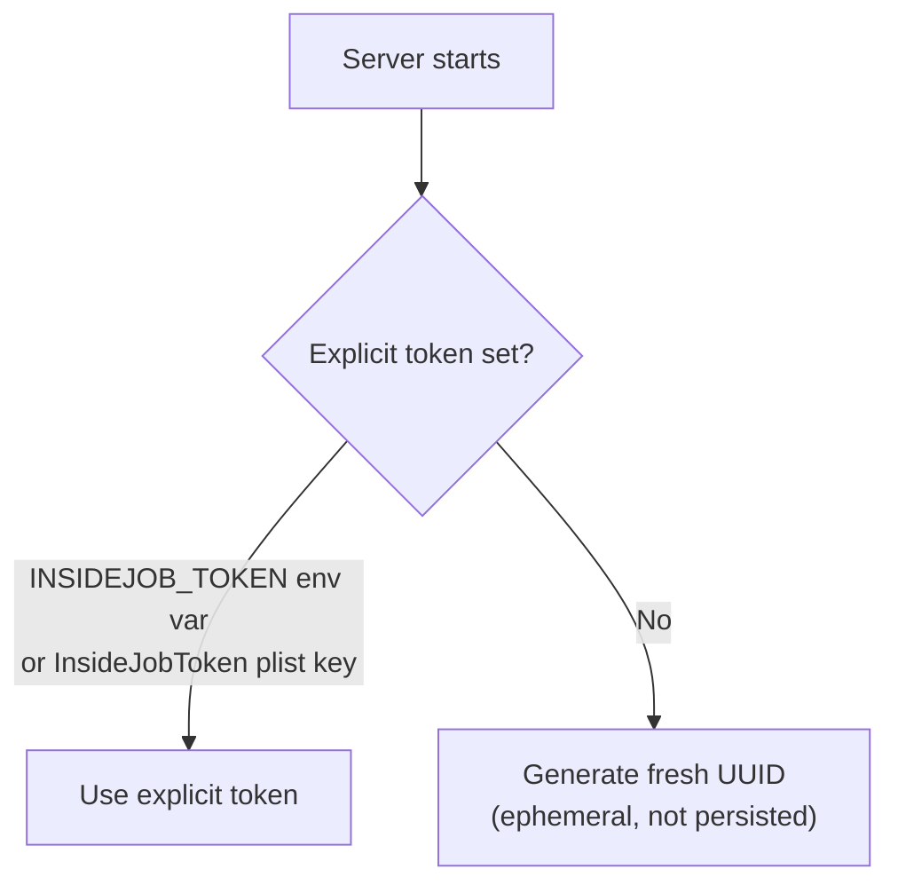
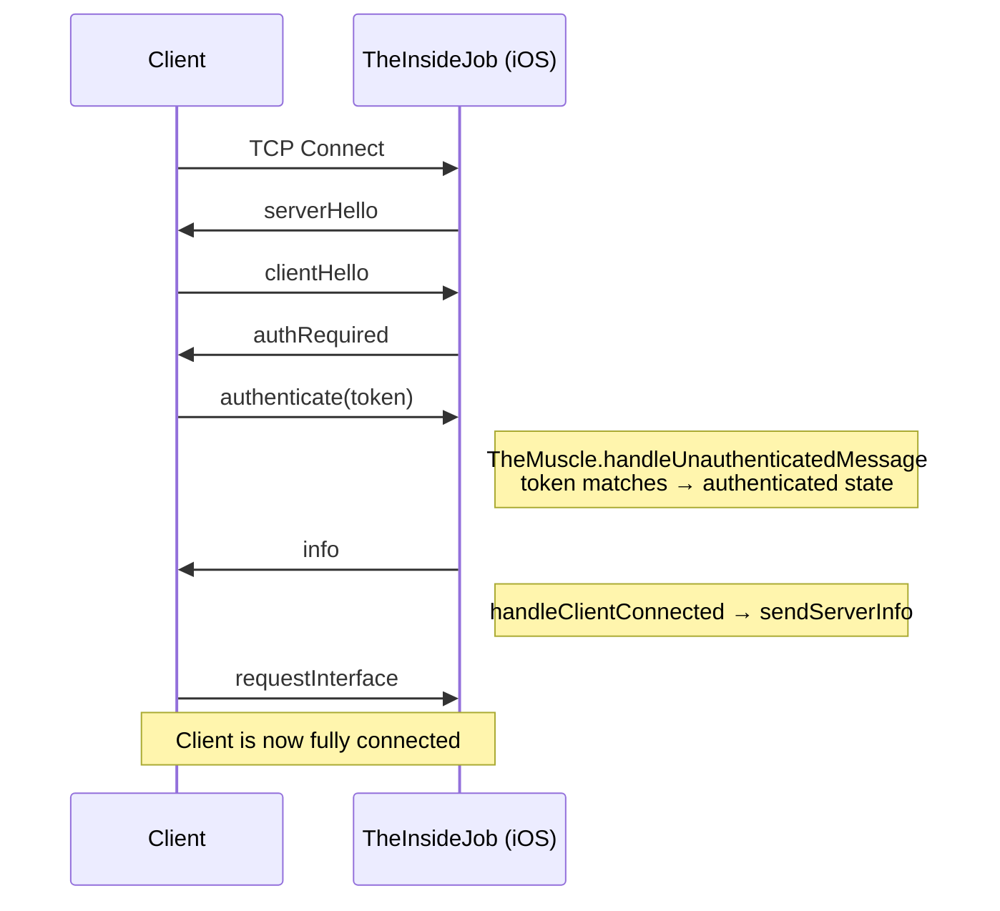
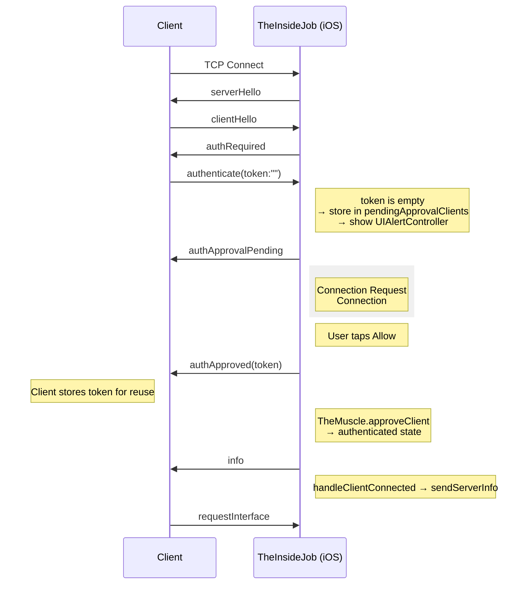
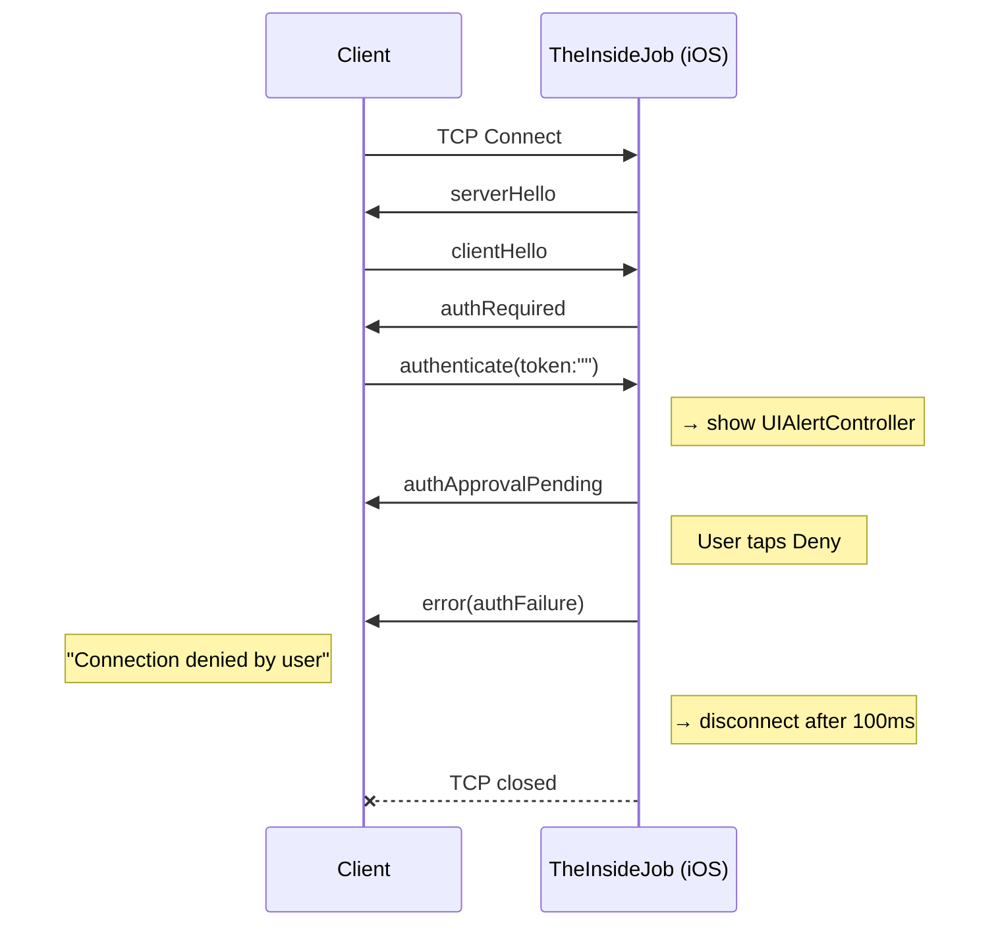
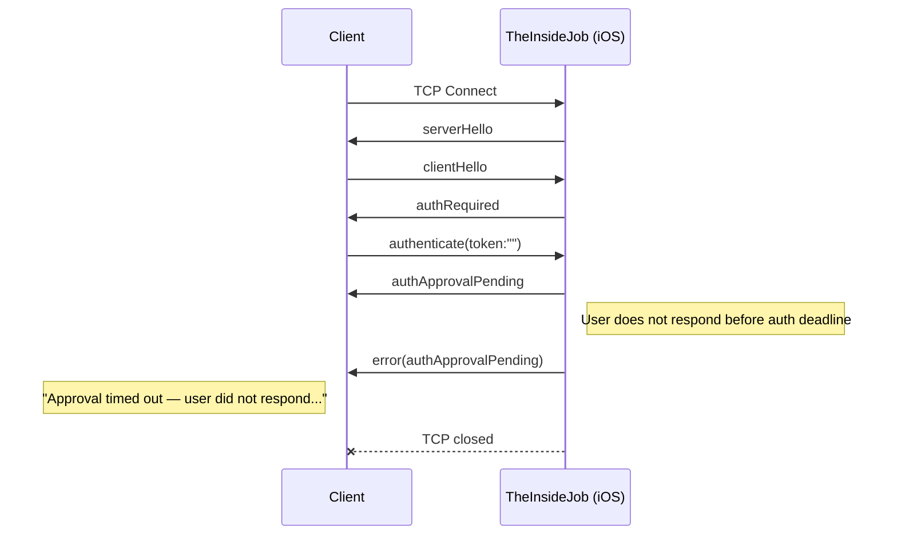
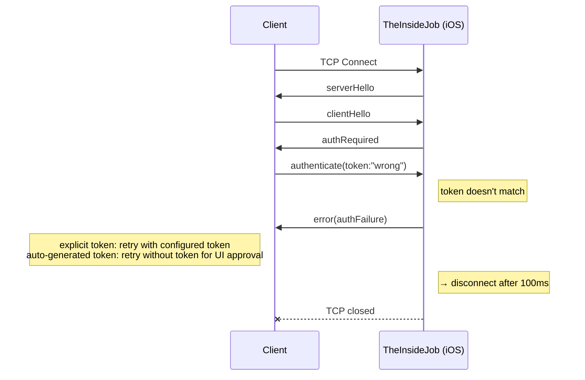
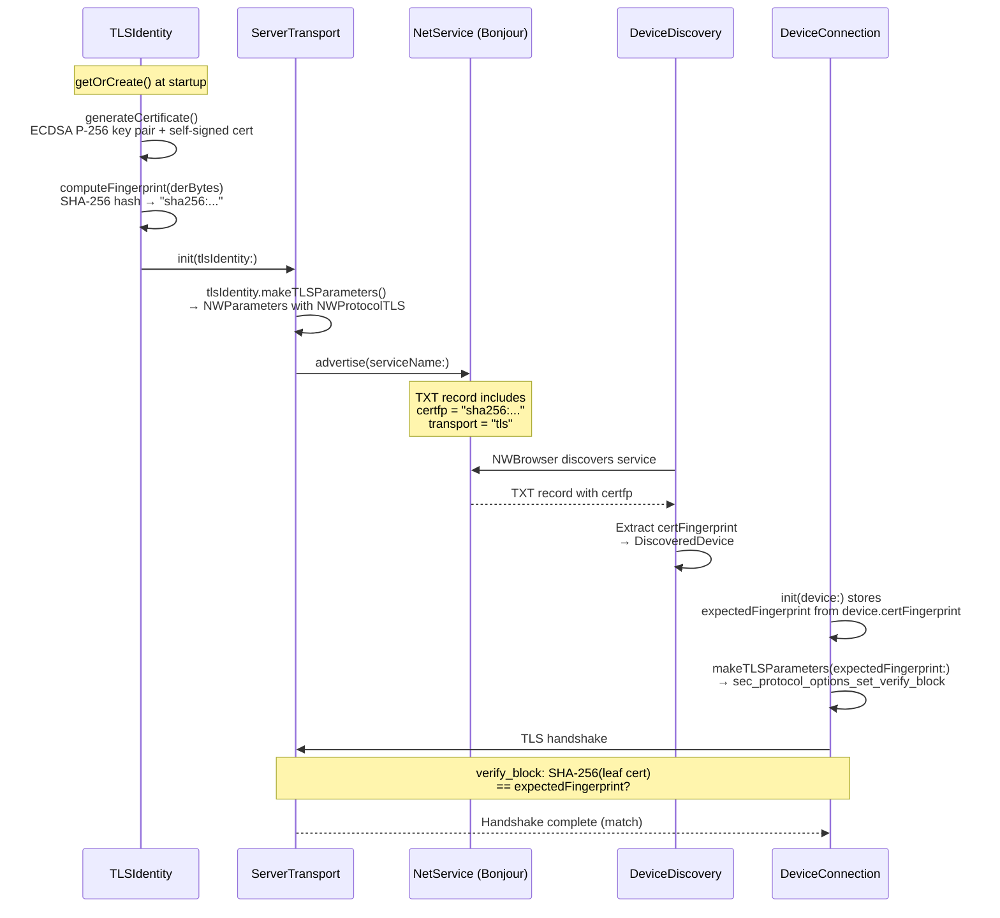

# Button Heist Authentication

Every TCP connection must authenticate before it can send commands. This document describes how authentication works end-to-end.

## Overview

Authentication is mandatory for driver connections. When a client connects, the server first sends `serverHello`. The client must respond with `clientHello` using the exact same `buttonHeistVersion`, then wait for `authRequired`. After that, it responds with `authenticate`. Any other message before the handshake completes causes immediate disconnection.

There are two connection modes:

1. **Token auth** — The client sends a known token via `authenticate`. If it matches, the client is authenticated as a driver.
2. **UI approval** — The client sends an empty token via `authenticate`. If the server is in UI approval mode, an on-device prompt asks the user to Allow or Deny the connection. On Allow, the server sends the token back so the client can reuse it.

Auth outcomes are intentionally distinct:
- Wrong non-empty token: `error(kind: "authFailure")`, then disconnect. With an explicit server token, retry with that configured token. With an auto-generated token, retry without a token only if you want to request UI approval.
- Approval pending: `authApprovalPending`, non-terminal. The client should wait for the user to respond on the device.
- Approval denied: `error(kind: "authFailure", message: "Connection denied by user")`, then disconnect.
- Approval timeout: `error(kind: "authApprovalPending")`, then disconnect.

## Agent Isolation

When multiple agents run in parallel, each agent must use its own simulator, port, and token to prevent cross-talk. The token doubles as a human-readable label scoped to the agent's work item.

**Convention:** simulator name = token = instance ID = `{workspace}-{task-slug}`. See `.context/bh-infra/docs/MULTI_AGENT_SIMULATORS.md` (if available — clone via `/setup-context bh-infra`) for the full convention, pool architecture, and troubleshooting.

```bash
TASK_SLUG="accra-scroll-detection"
SIM_UDID=$(xcrun simctl create "$TASK_SLUG" "iPhone 16 Pro")
xcrun simctl boot "$SIM_UDID"

SIMCTL_CHILD_INSIDEJOB_PORT="$((RANDOM % 10000 + 20000))" \
SIMCTL_CHILD_INSIDEJOB_TOKEN="$TASK_SLUG" \
SIMCTL_CHILD_INSIDEJOB_ID="$TASK_SLUG" \
xcrun simctl launch "$SIM_UDID" com.buttonheist.testapp
```

**Why human-readable tokens?** When an agent gets an auth mismatch, the error
does not disclose the expected token. A human-readable explicit token such as
`accra-scroll-detection` still helps operators and logs identify which
simulator/work item owns the session without treating a random UUID as a
durable secret.

**Why per-task simulators?** Shared simulators lead to port collisions, stale app state, and agents killing each other's sessions. A dedicated simulator per task is cheap (`simctl create` takes milliseconds) and eliminates the entire class of interference bugs.

## Token Resolution

The server resolves its auth token at startup using this priority:



When no explicit token is set, a fresh UUID is generated each launch. Previously approved clients must re-authenticate after an app restart.

## Configuration

### Server-side (iOS app)

| Method | Key | Example |
|--------|-----|---------|
| Environment variable | `INSIDEJOB_TOKEN` | `INSIDEJOB_TOKEN=my-secret-token` |
| Info.plist | `InsideJobToken` | `<string>my-secret-token</string>` |
| Auto-generated | (none) | Ephemeral token redacted in startup logs; request UI approval to receive a reusable token |

When no explicit token is configured, startup logs show that the token exists
but redact its value:
```
[TheInsideJob] token=<redacted>
```

### Client-side (macOS / CLI)

| Method | Key | Example |
|--------|-----|---------|
| CLI flag | `--token` | `buttonheist session` (or pass token via `BUTTONHEIST_TOKEN` / `--token` where supported) |
| Environment variable | `BUTTONHEIST_TOKEN` | `export BUTTONHEIST_TOKEN=my-secret-token` |
| UI approval | (omit token) | Client sends empty token; user approves on device |

Priority: `--token` flag > `BUTTONHEIST_TOKEN` env var > empty string (UI approval).

When a client is approved via UI, the server sends the token in the `authApproved` message. The CLI prints it:
```
BUTTONHEIST_TOKEN=<token>
```

## Connection Flows

### Standard Token Auth

Client has the correct token (explicit or previously received via UI approval).



### UI Approval — Allowed

Client has no token. Server is in UI approval mode (auto-generated token).



The `authApproved` message includes the server's token. The client stores it and sends it on future connections, skipping the UI prompt.

### UI Approval — Denied



### UI Approval — Timeout



### Invalid Token

Client sends a wrong token (typo, rotated token, etc.).



## Wire Format

Auth messages use the standard newline-delimited JSON format wrapped in envelopes. See [WIRE-PROTOCOL.md](WIRE-PROTOCOL.md) for full details.

### Server → Client (ResponseEnvelope)

```json
{"buttonHeistVersion":"<semver>","requestId":null,"type":"serverHello"}
{"buttonHeistVersion":"<semver>","requestId":null,"type":"authRequired"}
{"buttonHeistVersion":"<semver>","requestId":null,"type":"authApprovalPending","payload":{"message":"Waiting for approval on the device.","hint":"Tap Allow on the iOS device to continue."}}
{"buttonHeistVersion":"<semver>","requestId":null,"type":"authApproved","payload":{"token":"A1B2C3D4-E5F6-..."}}
{"buttonHeistVersion":"<semver>","requestId":null,"type":"error","payload":{"kind":"authFailure","message":"Invalid token. Retry with the configured token."}}
{"buttonHeistVersion":"<semver>","requestId":null,"type":"error","payload":{"kind":"authApprovalPending","message":"Approval timed out — user did not respond to the approval prompt on the device."}}
```

### Client → Server (RequestEnvelope)

```json
{"buttonHeistVersion":"<semver>","requestId":null,"type":"clientHello"}
{"buttonHeistVersion":"<semver>","requestId":"req-1","type":"authenticate","payload":{"token":"my-secret-token"}}
{"buttonHeistVersion":"<semver>","requestId":"req-2","type":"authenticate","payload":{"token":""}}
```

An empty token string in `authenticate` requests UI approval when the server token was auto-generated. A non-empty token attempts direct authentication.

## Security Limits

These limits are enforced by `SimpleSocketServer` and apply to both authenticated and unauthenticated connections:

| Limit | Value | Notes |
|-------|-------|-------|
| Max connections | 5 | Additional connections are rejected |
| Rate limit | 30 msg/sec | Per-client, sliding 1-second window |
| Receive buffer | 10 MB | Per-client; exceeded → disconnect |
| Auth failure delay | 100 ms | Allows the terminal auth error to arrive before TCP close |
| TLS listener | Required | Production listener startup fails closed if TLS identity/parameters are unavailable |
| Bind address (simulator-only scope) | `::1` (loopback) | Automatic when `allowedScopes == [.simulator]` |
| Bind address (USB or network scope) | `::` (all interfaces) | Required for CoreDevice USB; scope filtering rejects disallowed sources before auth |
| Bonjour advertisement | Network scope only | Default `simulator,usb` scope is not LAN-visible via Bonjour |

## Threat Model

Button Heist is a debug-only development tool. By default it accepts simulator loopback and CoreDevice USB traffic, does not advertise Bonjour on the LAN, and rejects WiFi/LAN connections before authentication. Enabling `INSIDEJOB_SCOPE=network` is an explicit trust decision that makes the listener discoverable and reachable from the local network.

### Bonjour Fingerprint Exposure

When network scope is enabled, the TLS certificate SHA-256 fingerprint is published in a plaintext Bonjour TXT record (`TXTRecordKey.certFingerprint` in `Messages.swift`, published via `ServerTransport.swift`). Any device on the LAN can read it. This is by design — clients need the fingerprint for trust-on-first-discovery pinning.

**Risk**: A LAN-local attacker can read the fingerprint. However, SHA-256 is collision-resistant, so knowledge of the fingerprint does not enable certificate forgery. The fingerprint is a verifier, not a secret.

**Mitigation**: Keep the default `simulator,usb` scope when LAN visibility is a concern. Use loopback or USB/direct targets instead of enabling network scope.

### Loopback TLS Bypass

When connecting to loopback (simulator-to-same-Mac path) without a fingerprint, TLS certificate verification is skipped (`DeviceConnection.swift` `makeLoopbackTLSParameters`). The connection still uses TLS encryption, but any certificate is accepted.

**Risk**: Any process on the same host can MITM the loopback connection.

**Mitigation**: This path is simulator-only. The simulator and client run on the same machine where process isolation is the trust boundary. The bypass is logged at `.warning` level. Non-loopback USB/WiFi connections require an explicit fingerprint and fail closed without one.

### Token as Coordination, Not Security

The session token prevents agent collisions, not unauthorized access. It is logged with `.public` privacy so that agents can self-diagnose auth mismatches by reading logs. The token appears in:

- Console logs at server startup
- `authApproved` wire messages (sent to the connecting client)
- Environment variables (`INSIDEJOB_TOKEN`, `BUTTONHEIST_TOKEN`)

The stronger access controls are TLS trust plus the `ConnectionScope` filter that restricts which network interfaces can connect (simulator, USB, or network). By default, only simulator and USB connections are accepted, and Bonjour is not published.

## Component Responsibilities

| Component | Role |
|-----------|------|
| **TheMuscle** | Token resolution, validation, UI approval, and session locking. Presents `UIAlertController` for Allow/Deny approval. Owns `authToken`, `pendingApprovalClients`, and authenticated client/session state. |
| **SimpleSocketServer** | Owns TCP/TLS framing, rate limiting, send buffers, and connection lifecycle. It emits raw framed data and does not own auth state. |
| **TheInsideJob** | Wires TheMuscle delivery callbacks to the socket server. Owns the server lifecycle. |
| **DeviceConnection** | Client-side handshake and auth handling. Verifies `buttonHeistVersion`, sends `clientHello` after `serverHello`, sends token on `authRequired`, stores token from `authApproved`, and emits the connected event only after receiving `info` (post-auth). |
| **TheHandoff** | Passes `token` to DeviceConnection. Stores approved tokens via `onAuthApproved` callback. Tracks `connectionPhase` including auth failures, approval-pending failures, and session-lock failures via `ConnectionError`. |

## TLS Certificate Lifecycle



## Related Documentation

- [WIRE-PROTOCOL.md](WIRE-PROTOCOL.md) — Full message specification
- [API.md](API.md) — Configuration keys and public API
- [ARCHITECTURE.md](ARCHITECTURE.md) — Component overview and TheMuscle details
