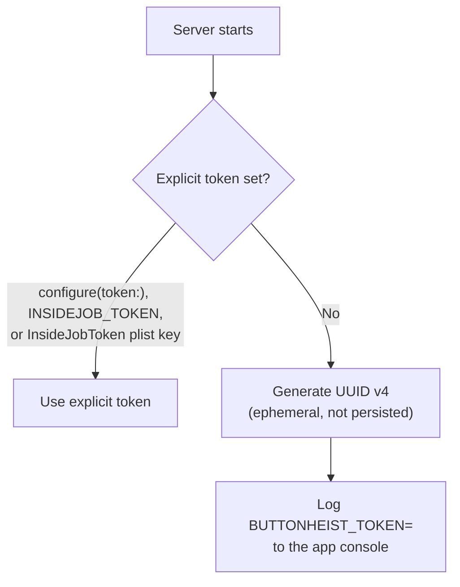
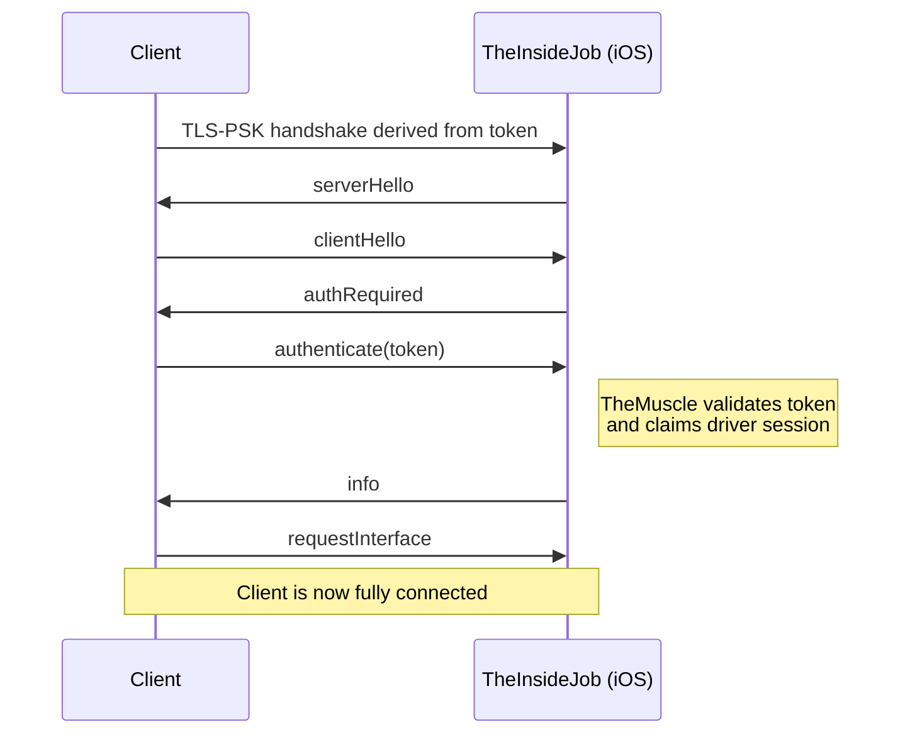
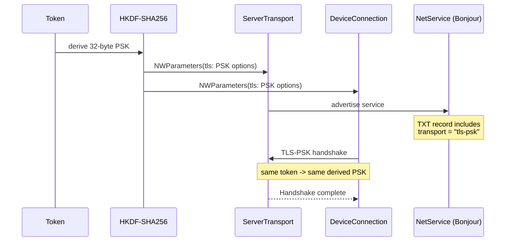

# Button Heist Authentication

Every TCP connection must authenticate before it can send commands. The same
token is used for both transport protection and application auth:

1. The client and server derive TLS pre-shared key material from the token.
2. Network.framework completes the TLS-PSK handshake.
3. The server sends `serverHello`, the client replies with `clientHello`, and
   the server sends `authRequired`.
4. The client sends `authenticate(token)`.
5. If the token matches, the server sends `info` and the client is a driver.

There is no current on-device approval fallback. Missing, empty, or wrong
tokens fail closed.

## Agent Isolation

When multiple agents run in parallel, each agent should use its own simulator,
port, and token to prevent cross-talk. The token doubles as a human-readable
label scoped to the agent's work item.

**Convention:** simulator name = token = instance ID = `{workspace}-{task-slug}`.
See `.context/bh-infra/docs/MULTI_AGENT_SIMULATORS.md` if available for the
full convention, pool architecture, and troubleshooting.

```bash
TASK_SLUG="accra-scroll-detection"
SIM_UDID=$(xcrun simctl create "$TASK_SLUG" "iPhone 16 Pro")
xcrun simctl boot "$SIM_UDID"

SIMCTL_CHILD_INSIDEJOB_PORT="$((RANDOM % 10000 + 20000))" \
SIMCTL_CHILD_INSIDEJOB_TOKEN="$TASK_SLUG" \
SIMCTL_CHILD_INSIDEJOB_ID="$TASK_SLUG" \
xcrun simctl launch "$SIM_UDID" com.buttonheist.testapp
```

**Why human-readable tokens?** When an agent gets an auth mismatch, the error
does not disclose the expected token. A human-readable explicit token such as
`accra-scroll-detection` still helps operators and logs identify which
simulator/work item owns the session without treating a random UUID as a
durable secret.

**Why per-task simulators?** Shared simulators lead to port collisions, stale
app state, and agents killing each other's sessions. A dedicated simulator per
task is cheap (`simctl create` takes milliseconds) and eliminates the entire
class of interference bugs.

## Token Resolution

The server resolves its token at startup using this priority:



When no explicit token is configured, a fresh UUID v4 is generated each launch
and printed to the app console as:

```text
BUTTONHEIST_TOKEN=<uuid>
```

That is intentional for this debug tool: console access is the authority
boundary. A full-width random secret would be stronger, but UUID v4 is
sufficient for this model and is easier to recognize, copy, and pass around.

## Configuration

### Server-side iOS app

| Method | Key | Example |
|--------|-----|---------|
| Runtime API | `TheInsideJob.configure(token:)` | `TheInsideJob.configure(token: "agent-token")` |
| Environment variable | `INSIDEJOB_TOKEN` | `INSIDEJOB_TOKEN=agent-token` |
| Info.plist | `InsideJobToken` | `<string>agent-token</string>` |
| Generated | none | UUID v4 logged as `BUTTONHEIST_TOKEN=<uuid>` |

### Client-side macOS / CLI

| Method | Key | Example |
|--------|-----|---------|
| CLI flag | `--token` | `buttonheist connect host:port --token agent-token` |
| Environment variable | `BUTTONHEIST_TOKEN` | `export BUTTONHEIST_TOKEN=agent-token` |
| Target config | target token field | named target carries endpoint and token |

Priority is command/target-specific, but explicit CLI/config values should win
over `BUTTONHEIST_TOKEN`. If no token is available, the client refuses to start
the TLS connection.

## Connection Flow



### Invalid Token

A missing or empty client token fails before TLS. A wrong non-empty token
normally fails during TLS-PSK negotiation. If a client reaches the JSON
authentication phase with the wrong token, the server responds with
`error(kind: "authFailure")` and then disconnects.

## Wire Format

Auth messages use the standard newline-delimited JSON format wrapped in
envelopes. See [WIRE-PROTOCOL.md](WIRE-PROTOCOL.md) for full details.

### Server -> Client

```json
{"buttonHeistVersion":"<semver>","requestId":null,"type":"serverHello"}
{"buttonHeistVersion":"<semver>","requestId":null,"type":"authRequired"}
{"buttonHeistVersion":"<semver>","requestId":null,"type":"info","payload":{"identity":{}}}
{"buttonHeistVersion":"<semver>","requestId":null,"type":"error","payload":{"kind":"authFailure","message":"Invalid token. Retry with the configured token."}}
```

### Client -> Server

```json
{"buttonHeistVersion":"<semver>","requestId":null,"type":"clientHello"}
{"buttonHeistVersion":"<semver>","requestId":"req-1","type":"authenticate","payload":{"token":"agent-token"}}
```

`authApprovalPending` and `authApproved` are not valid current auth responses.
If a client sees either legacy tag, it rejects the response and tells the user to
rebuild or reinstall the app, then retry with the configured token.

## Security Limits

These limits are enforced by `SimpleSocketServer` and apply to both
authenticated and unauthenticated connections:

| Limit | Value | Notes |
|-------|-------|-------|
| Max connections | 5 | Additional connections are rejected |
| Rate limit | 30 msg/sec | Per-client, sliding 1-second window |
| Receive buffer | 10 MB | Per-client; exceeded -> disconnect |
| Auth failure delay | 100 ms | Allows the terminal auth error to arrive before TCP close |
| TLS listener | Required | Listener startup fails closed without token-derived PSK material |
| Bind address (simulator-only scope) | `::1` (loopback) | Automatic when `allowedScopes == [.simulator]` |
| Bind address (USB or network scope) | `::` (all interfaces) | Required for CoreDevice USB; scope filtering rejects disallowed sources before auth |
| Bonjour advertisement | Network scope only | Default `simulator,usb` scope is not LAN-visible via Bonjour |

## Threat Model

Button Heist is a debug-only development tool. By default it accepts simulator
loopback and CoreDevice USB traffic, does not advertise Bonjour on the LAN, and
rejects WiFi/LAN connections before authentication. Enabling
`INSIDEJOB_SCOPE=network` is an explicit trust decision that makes the listener
discoverable and reachable from the local network.

### Token as Shared Material

The session token is the shared secret for TLS-PSK and the application auth
token. Anyone who can read the app console can read the generated token and
connect; that is the intended barrier for this tool.

The token appears in:

- Console logs at server startup when generated
- Environment variables (`INSIDEJOB_TOKEN`, `BUTTONHEIST_TOKEN`)
- Target configuration or CLI arguments supplied by the operator

Keep the default `simulator,usb` scope when LAN visibility is a concern. Use
loopback or USB/direct targets instead of enabling network scope.

## Component Responsibilities

| Component | Role |
|-----------|------|
| **TheMuscle** | Token validation, driver admission, and session locking. |
| **SimpleSocketServer** | Owns TCP/TLS framing, rate limiting, send buffers, and connection lifecycle. It emits raw framed data and does not own auth state. |
| **TheInsideJob** | Resolves startup token configuration, builds token-derived transport, and wires TheMuscle delivery callbacks to the socket server. |
| **DeviceConnection** | Client-side TLS-PSK setup, hello handshake, auth message, and connected-state transition after receiving `info`. |
| **TheHandoff** | Passes target token to `DeviceConnection` and tracks connection phase/failures. |

## TLS-PSK Lifecycle



## Related Documentation

- [WIRE-PROTOCOL.md](WIRE-PROTOCOL.md) — Full message specification
- [API.md](API.md) — Configuration keys and public API
- [ARCHITECTURE.md](ARCHITECTURE.md) — Component overview
