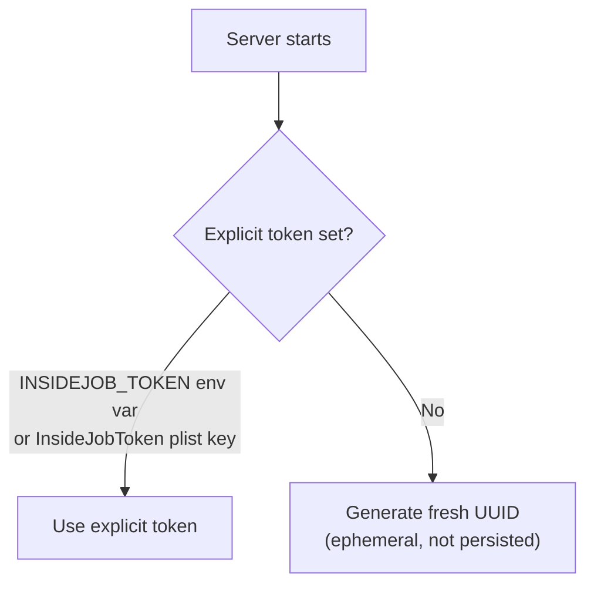
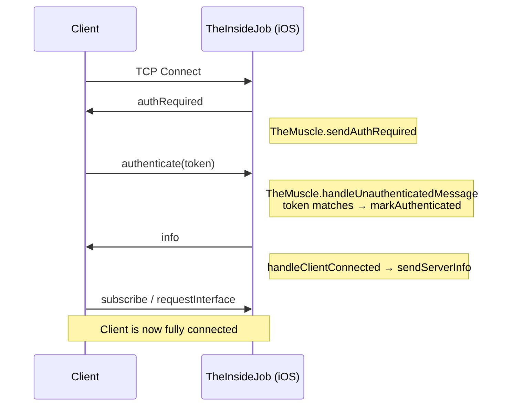
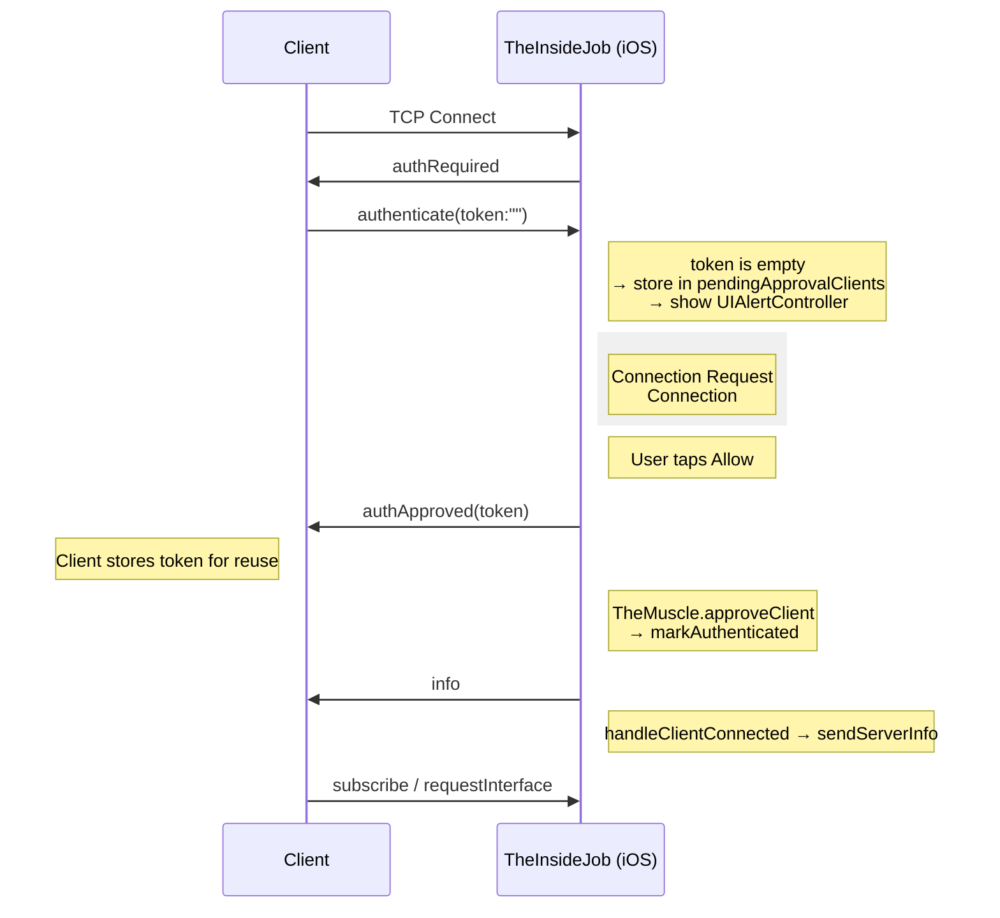
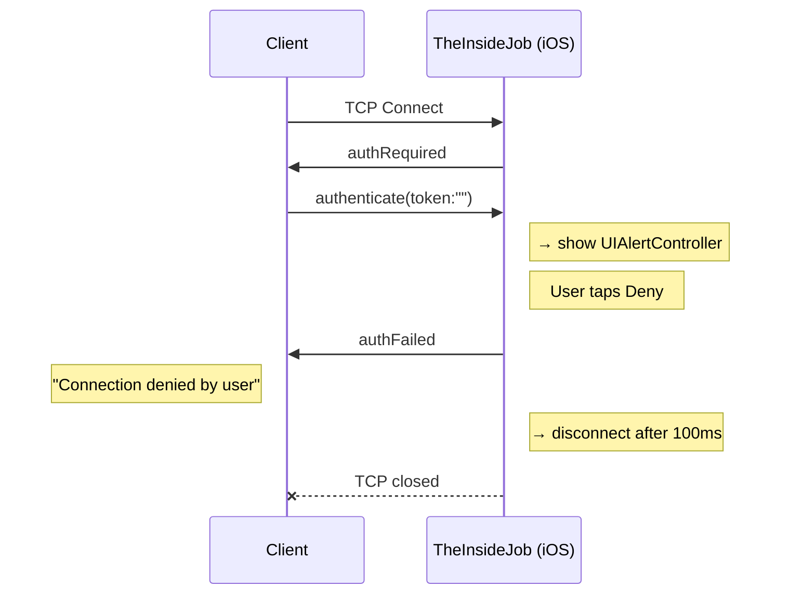
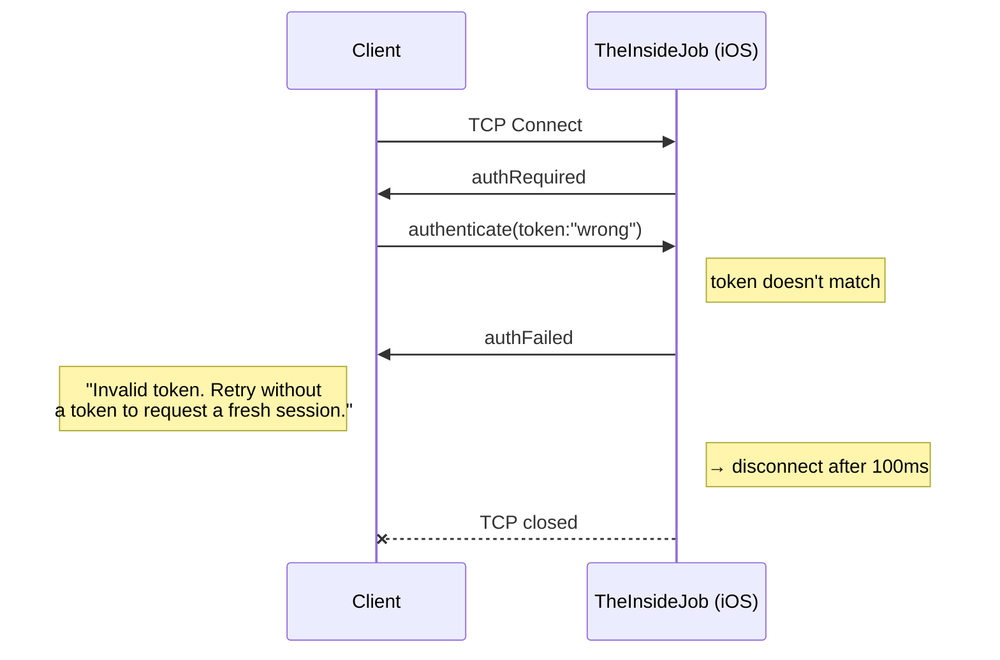

# ButtonHeist Authentication

Every TCP connection must authenticate before it can send commands. This document describes how authentication works end-to-end.

## Overview

Authentication is mandatory. When a client connects, the server sends an `authRequired` challenge. The client must respond with an `authenticate` message containing a valid token. Any other message before authenticating causes immediate disconnection.

There are two authentication modes:

1. **Token auth** — The client sends a known token. If it matches, the client is authenticated.
2. **UI approval** — The client sends an empty token. If the server is in UI approval mode, an on-device prompt asks the user to Allow or Deny the connection. On Allow, the server sends the token back so the client can reuse it.

## Token Resolution

The server resolves its auth token at startup using this priority:



When no explicit token is set, a fresh UUID is generated each launch. Previously approved clients must re-authenticate after an app restart.

### Token Invalidation

Call `invalidateToken()` on TheMuscle to rotate the token. This generates a new UUID in memory. All previously approved clients lose access and must re-authenticate on their next connection.

## Configuration

### Server-side (iOS app)

| Method | Key | Example |
|--------|-----|---------|
| Environment variable | `INSIDEJOB_TOKEN` | `INSIDEJOB_TOKEN=my-secret-token` |
| Info.plist | `InsideJobToken` | `<string>my-secret-token</string>` |
| Auto-generated | (none) | Token logged to console at startup |

When no explicit token is configured, the token is logged to the console:
```
[TheInsideJob] Auth token: A1B2C3D4-E5F6-...
```

### Client-side (macOS / CLI)

| Method | Key | Example |
|--------|-----|---------|
| CLI flag | `--token` | `buttonheist session` (or pass token via `BUTTONHEIST_TOKEN` / `--token` where supported) |
| Environment variable | `BUTTONHEIST_TOKEN` | `export BUTTONHEIST_TOKEN=my-secret-token` |
| UI approval | (omit token) | Client sends empty token; user approves on device |

Priority: `--token` flag > `BUTTONHEIST_TOKEN` env var > empty string (UI approval).

When a client is approved via UI, the server sends the token in the `authApproved` message. The CLI prints it:
```
BUTTONHEIST_TOKEN=<token>
```

## Connection Flows

### Standard Token Auth

Client has the correct token (explicit or previously received via UI approval).



### UI Approval — Allowed

Client has no token. Server is in UI approval mode (auto-generated token).



The `authApproved` message includes the server's token. The client stores it and sends it on future connections, skipping the UI prompt.

### UI Approval — Denied



### Invalid Token

Client sends a wrong token (typo, rotated token, etc.).



## Wire Format

Auth messages use the standard newline-delimited JSON format. See [WIRE-PROTOCOL.md](WIRE-PROTOCOL.md) for full details.

### Server → Client

```json
{"authRequired":{}}
{"authApproved":{"_0":{"token":"A1B2C3D4-E5F6-..."}}}
{"authFailed":{"_0":"Invalid token. Retry without a token to request a fresh session."}}
```

### Client → Server

```json
{"authenticate":{"_0":{"token":"my-secret-token"}}}
{"authenticate":{"_0":{"token":""}}}
```

An empty token string requests UI approval. A non-empty token attempts direct authentication.

## Bonjour Token Hash

The server publishes a SHA256 hash prefix of its token in the Bonjour TXT record:

```
tokenhash = SHA256(token).prefix(8 bytes).hexEncoded   // 16 hex chars
```

Clients can use this to identify the correct server instance before connecting — useful when multiple apps are running. The hash prevents exposing the actual token over mDNS.

## Security Limits

These limits are enforced by `SimpleSocketServer` and apply to both authenticated and unauthenticated connections:

| Limit | Value | Notes |
|-------|-------|-------|
| Max connections | 5 | Additional connections are rejected |
| Rate limit | 30 msg/sec | Per-client, sliding 1-second window |
| Receive buffer | 10 MB | Per-client; exceeded → disconnect |
| Auth failure delay | 100 ms | Allows `authFailed` to arrive before TCP close |
| Bind address (simulator) | `::1` (loopback) | Controlled by `bindToLoopback` parameter |
| Bind address (device) | `::` (all interfaces) | Accepts WiFi and USB connections |

## Component Responsibilities

| Component | Role |
|-----------|------|
| **TheMuscle** | Token resolution, validation, UI approval, session locking, `invalidateToken()`. Presents `UIAlertController` for Allow/Deny approval. Owns `authToken`, `pendingApprovalClients`, `authenticatedClientIDs`. |
| **SimpleSocketServer** | Tracks `authenticatedClients` set. Routes messages to `onDataReceived` (authenticated) or `onUnauthenticatedData` (not yet authenticated). |
| **TheInsideJob** | Wires TheMuscle callbacks to the socket server. Owns the server lifecycle. |
| **DeviceConnection** | Client-side auth handling. Sends token on `authRequired`, stores token from `authApproved`, fires `onConnected` only after receiving `info` (post-auth). |
| **TheMastermind** | Passes `token` to DeviceConnection. Stores approved tokens via `onTokenReceived` callback. |

## Related Documentation

- [WIRE-PROTOCOL.md](WIRE-PROTOCOL.md) — Full message specification
- [API.md](API.md) — Configuration keys and public API
- [ARCHITECTURE.md](ARCHITECTURE.md) — Component overview and TheMuscle details
