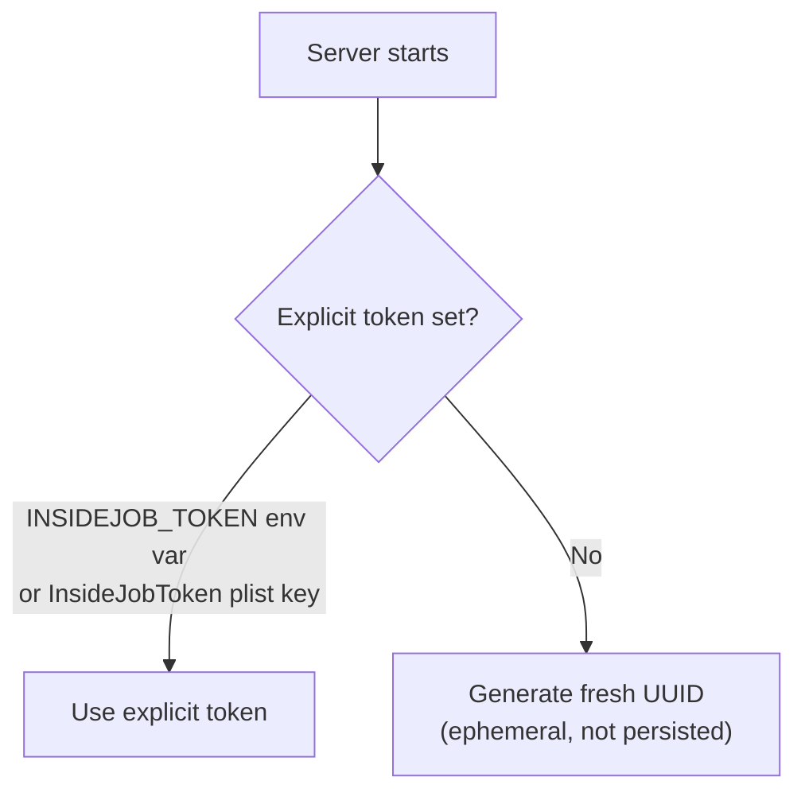
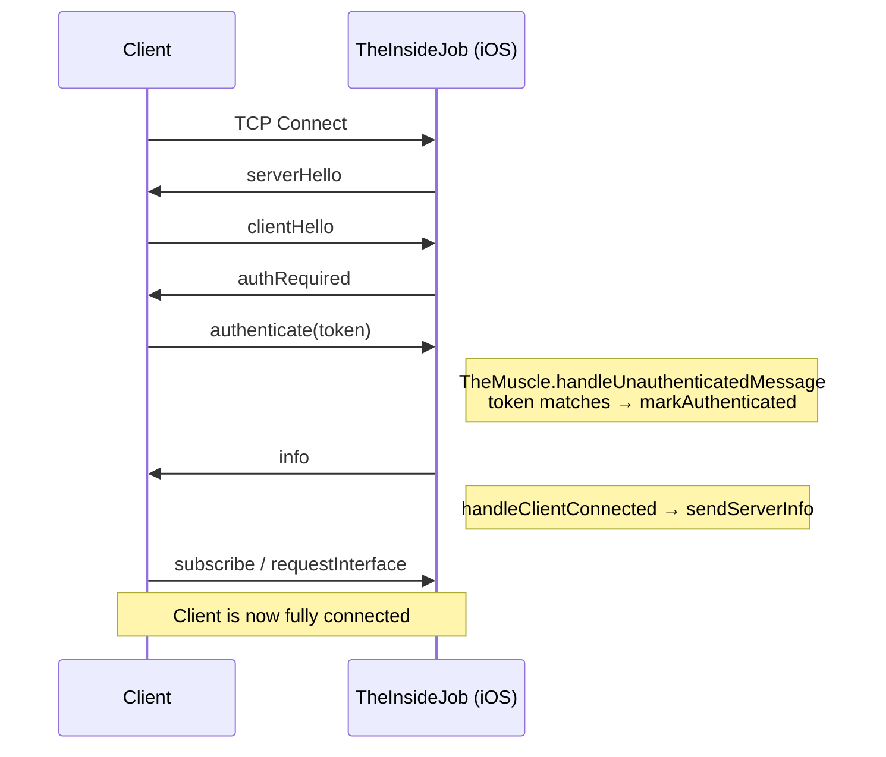
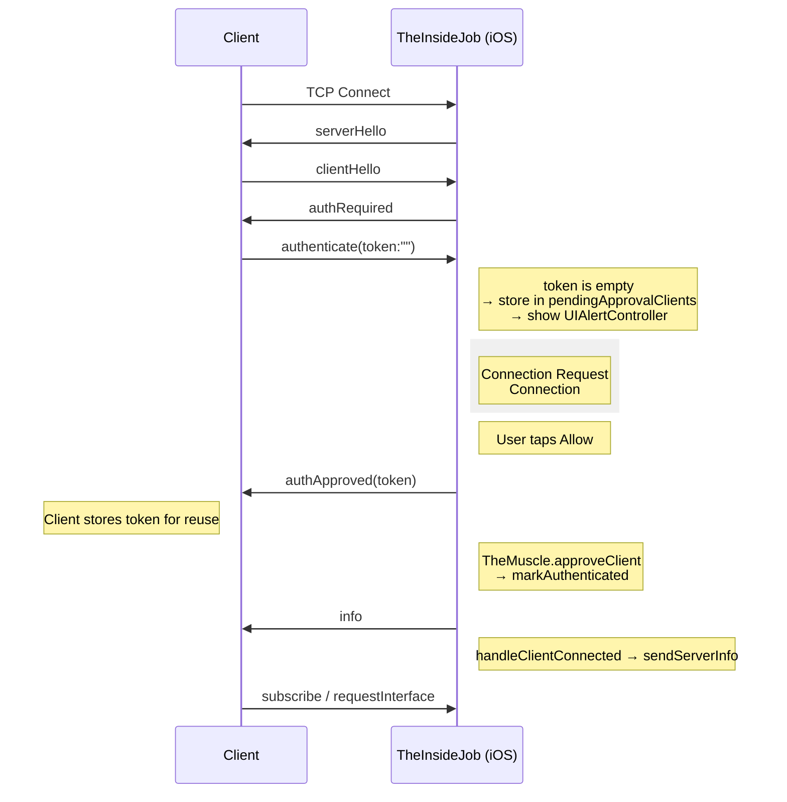
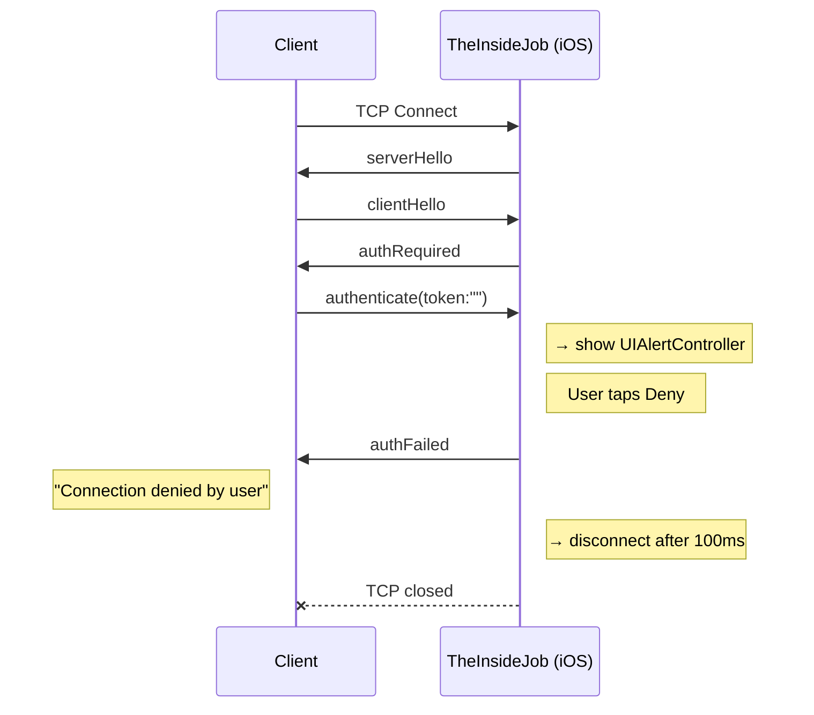
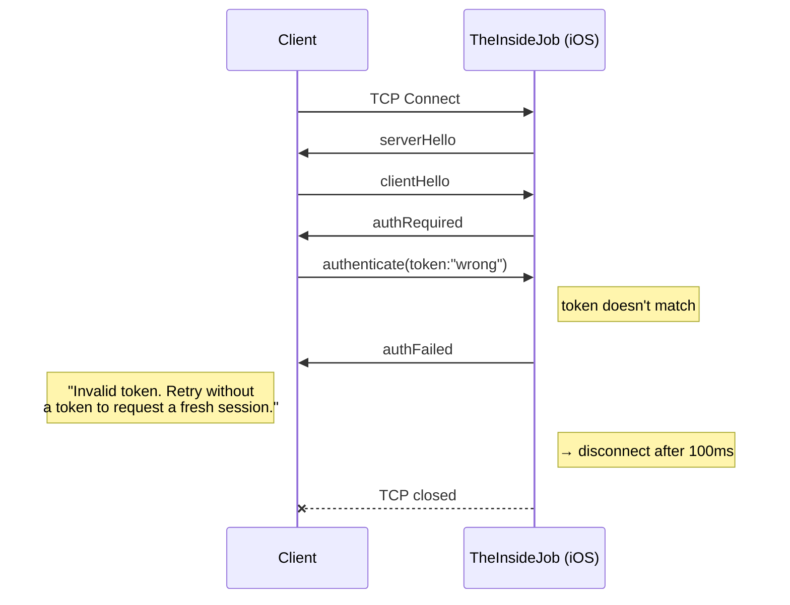
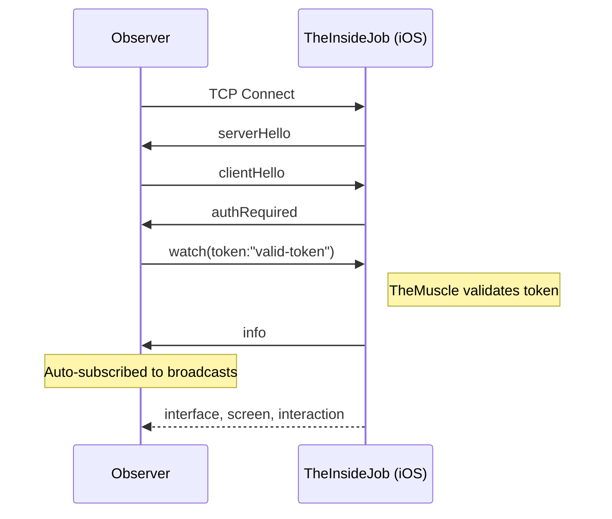
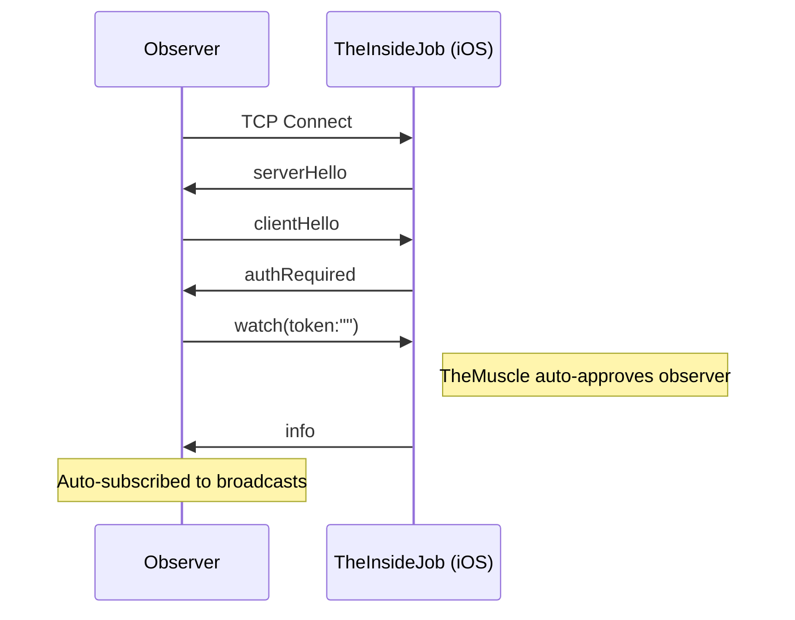
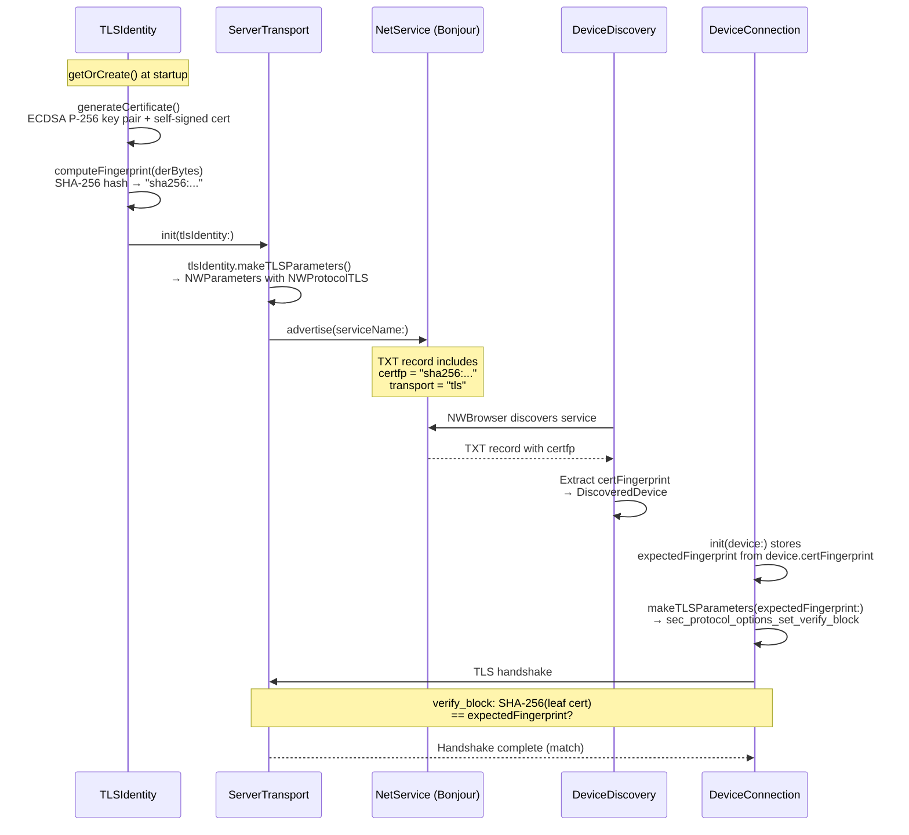

# Button Heist Authentication

Every TCP connection must authenticate before it can send commands. This document describes how authentication works end-to-end.

## Overview

Authentication is mandatory for driver connections. When a client connects, the server first sends `serverHello`. The client must respond with `clientHello` using the exact same `protocolVersion`, then wait for `authRequired`. After that, it responds with either `authenticate` (for drivers) or `watch` (for observers). Any other message before the handshake completes causes immediate disconnection.

There are three connection modes:

1. **Token auth** — The client sends a known token via `authenticate`. If it matches, the client is authenticated as a driver.
2. **UI approval** — The client sends an empty token via `authenticate`. If the server is in UI approval mode, an on-device prompt asks the user to Allow or Deny the connection. On Allow, the server sends the token back so the client can reuse it.
3. **Watch (observer)** — The client sends `watch` instead of `authenticate`. By default, observers require a valid token (same as drivers). Set `INSIDEJOB_RESTRICT_WATCHERS=0` to auto-approve observers without a token. Observers receive all broadcasts but cannot send commands or claim a session. See [Watch (Observer) Connections](#watch-observer-connections) below.

## Agent Isolation

When multiple agents run in parallel, each agent must use its own simulator, port, and token to prevent cross-talk. The token doubles as a human-readable label scoped to the agent's work item.

**Convention:** simulator name = token = instance ID = `{workspace}-{task-slug}`. See `.context/bh-infra/docs/MULTI_AGENT_SIMULATORS.md` (if available — clone via `/setup-context bh-infra`) for the full convention, pool architecture, and troubleshooting.

```bash
TASK_SLUG="accra-scroll-detection"
SIM_UDID=$(xcrun simctl create "$TASK_SLUG" "iPhone 16 Pro")
xcrun simctl boot "$SIM_UDID"

SIMCTL_CHILD_INSIDEJOB_PORT="$((RANDOM % 10000 + 20000))" \
SIMCTL_CHILD_INSIDEJOB_TOKEN="$TASK_SLUG" \
SIMCTL_CHILD_INSIDEJOB_ID="$TASK_SLUG" \
xcrun simctl launch "$SIM_UDID" com.buttonheist.testapp
```

**Why human-readable tokens?** When an agent gets an auth mismatch, the error includes the expected token. `accra-scroll-detection` tells the agent it hit the wrong simulator and whose it is. A UUID tells it nothing. Agents can reason about token ownership and self-correct.

**Why per-task simulators?** Shared simulators lead to port collisions, stale app state, and agents killing each other's sessions. A dedicated simulator per task is cheap (`simctl create` takes milliseconds) and eliminates the entire class of interference bugs.

## Token Resolution

The server resolves its auth token at startup using this priority:



When no explicit token is set, a fresh UUID is generated each launch. Previously approved clients must re-authenticate after an app restart.

### Token Invalidation

Call `invalidateToken()` on TheMuscle to rotate the token. This generates a new UUID in memory. All previously approved clients lose access and must re-authenticate on their next connection.

## Configuration

### Server-side (iOS app)

| Method | Key | Example |
|--------|-----|---------|
| Environment variable | `INSIDEJOB_TOKEN` | `INSIDEJOB_TOKEN=my-secret-token` |
| Info.plist | `InsideJobToken` | `<string>my-secret-token</string>` |
| Auto-generated | (none) | Token logged to console at startup |

When no explicit token is configured, the token is logged to the console:
```
[TheInsideJob] Auth token: A1B2C3D4-E5F6-...
```

### Client-side (macOS / CLI)

| Method | Key | Example |
|--------|-----|---------|
| CLI flag | `--token` | `buttonheist session` (or pass token via `BUTTONHEIST_TOKEN` / `--token` where supported) |
| Environment variable | `BUTTONHEIST_TOKEN` | `export BUTTONHEIST_TOKEN=my-secret-token` |
| UI approval | (omit token) | Client sends empty token; user approves on device |

Priority: `--token` flag > `BUTTONHEIST_TOKEN` env var > empty string (UI approval).

When a client is approved via UI, the server sends the token in the `authApproved` message. The CLI prints it:
```
BUTTONHEIST_TOKEN=<token>
```

## Connection Flows

### Standard Token Auth

Client has the correct token (explicit or previously received via UI approval).



### UI Approval — Allowed

Client has no token. Server is in UI approval mode (auto-generated token).



The `authApproved` message includes the server's token. The client stores it and sends it on future connections, skipping the UI prompt.

### UI Approval — Denied



### Invalid Token

Client sends a wrong token (typo, rotated token, etc.).



## Wire Format

Auth messages use the standard newline-delimited JSON format wrapped in envelopes. See [WIRE-PROTOCOL.md](WIRE-PROTOCOL.md) for full details.

### Server → Client (ResponseEnvelope)

```json
{"protocolVersion":"6.8","requestId":null,"type":"serverHello"}
{"protocolVersion":"6.8","requestId":null,"type":"authRequired"}
{"protocolVersion":"6.8","requestId":null,"type":"authApproved","payload":{"token":"A1B2C3D4-E5F6-..."}}
{"protocolVersion":"6.8","requestId":null,"type":"authFailed","payload":"Invalid token. Retry without a token to request a fresh session."}
```

### Client → Server (RequestEnvelope)

```json
{"protocolVersion":"6.8","requestId":null,"type":"clientHello"}
{"protocolVersion":"6.8","requestId":"req-1","type":"authenticate","payload":{"token":"my-secret-token"}}
{"protocolVersion":"6.8","requestId":"req-2","type":"authenticate","payload":{"token":""}}
{"protocolVersion":"6.8","requestId":null,"type":"watch","payload":{"token":""}}
```

An empty token string in `authenticate` requests UI approval. A non-empty token attempts direct authentication. The `watch` message establishes a read-only observer connection.

## Watch (Observer) Connections

Watch connections use a separate auth flow from driver connections. After `serverHello` / `clientHello` / `authRequired`, the client sends `watch` instead of `authenticate`.

### Default (Restricted)

By default, watch connections require a valid token (same as driver connections):



### Open Access (Unrestricted)

Set `INSIDEJOB_RESTRICT_WATCHERS=0` (env) or `InsideJobRestrictWatchers=false` (Info.plist) on the server to allow unauthenticated watch connections:



### Key Differences from Driver Auth

| Aspect | Driver (`authenticate`) | Observer (`watch`) |
|--------|------------------------|-------------------|
| Session lock | Claims exclusive session | No session lock |
| Commands | Full command set | Read-only (no commands) |
| Default auth | Token required | Token required |
| Unrestricted auth | N/A | `INSIDEJOB_RESTRICT_WATCHERS=0` / `InsideJobRestrictWatchers=false` plist |
| UI approval | Supported (empty token) | Not supported |
| Broadcasts | When subscribed | Always (auto-subscribed) |

### Configuration

| Method | Key | Example |
|--------|-----|---------|
| Environment variable (server) | `INSIDEJOB_RESTRICT_WATCHERS` | `INSIDEJOB_RESTRICT_WATCHERS=1` (require token) |
| Info.plist key (server) | `InsideJobRestrictWatchers` | `true` (require token) |
| CLI flag (client) | `--token` | `buttonheist watch --token my-secret-token` |

## Security Limits

These limits are enforced by `SimpleSocketServer` and apply to both authenticated and unauthenticated connections:

| Limit | Value | Notes |
|-------|-------|-------|
| Max connections | 5 | Additional connections are rejected |
| Rate limit | 30 msg/sec | Per-client, sliding 1-second window |
| Receive buffer | 10 MB | Per-client; exceeded → disconnect |
| Auth failure delay | 100 ms | Allows `authFailed` to arrive before TCP close |
| Bind address (simulator) | `::1` (loopback) | Controlled by `bindToLoopback` parameter |
| Bind address (device) | `::` (all interfaces) | Accepts WiFi and USB connections |

## Threat Model

Button Heist is a debug-only development tool. Its security model is designed around the assumption that the attacker is not on the same machine or local network as the developer. The following documents the trust boundaries and known exposures.

### Bonjour Fingerprint Exposure

The TLS certificate SHA-256 fingerprint is published in a plaintext Bonjour TXT record (`certfp` key in `ServerTransport.swift`). Any device on the LAN can read it. This is by design — clients need the fingerprint for trust-on-first-use pinning.

**Risk**: A LAN-local attacker can read the fingerprint. However, SHA-256 is collision-resistant, so knowledge of the fingerprint does not enable certificate forgery. The fingerprint is a verifier, not a secret.

**Mitigation**: For environments where LAN visibility is a concern (e.g., shared office networks), use direct connection via `BUTTONHEIST_DEVICE=host:port` which bypasses Bonjour entirely.

### Loopback TLS Bypass

When connecting to loopback (simulator-to-same-Mac path) without a fingerprint, TLS certificate verification is skipped (`DeviceConnection.swift` `makeLoopbackTLSParameters`). The connection still uses TLS encryption, but any certificate is accepted.

**Risk**: Any process on the same host can MITM the loopback connection.

**Mitigation**: This path is simulator-only. The simulator and client run on the same machine where process isolation is the trust boundary. The bypass is logged at `.warning` level. On-device (USB/WiFi) connections always perform full fingerprint verification.

### Token as Coordination, Not Security

The session token prevents agent collisions, not unauthorized access. It is logged with `.public` privacy so that agents can self-diagnose auth mismatches by reading logs. The token appears in:

- Console logs at server startup
- `authApproved` wire messages (sent to the connecting client)
- Environment variables (`INSIDEJOB_TOKEN`, `BUTTONHEIST_TOKEN`)

The real access control is the `ConnectionScope` filter that restricts which network interfaces can connect (simulator, USB, or network). By default, only simulator and USB connections are accepted.

## Component Responsibilities

| Component | Role |
|-----------|------|
| **TheMuscle** | Token resolution, validation, UI approval, session locking, observer management, `invalidateToken()`. Presents `UIAlertController` for Allow/Deny approval. Owns `authToken`, `pendingApprovalClients`, `authenticatedClientIDs`, `observerClients`. Routes `watch` messages via `handleWatchRequest`. |
| **SimpleSocketServer** | Tracks per-client auth state via `ClientPhase` enum (`.unauthenticated` / `.authenticated`). Routes messages to `onDataReceived` (authenticated) or `onUnauthenticatedData` (not yet authenticated). |
| **TheInsideJob** | Wires TheMuscle callbacks to the socket server. Owns the server lifecycle. |
| **DeviceConnection** | Client-side handshake and auth handling. Verifies `protocolVersion`, sends `clientHello` after `serverHello`, sends token on `authRequired`, stores token from `authApproved`, fires `onConnected` only after receiving `info` (post-auth). |
| **TheHandoff** | Passes `token` to DeviceConnection. Stores approved tokens via `onAuthApproved` callback. Tracks `connectionPhase` (including `.failed(.authFailed)` or `.failed(.sessionLocked)` via `ConnectionFailure`). |

## TLS Certificate Lifecycle



## Related Documentation

- [WIRE-PROTOCOL.md](WIRE-PROTOCOL.md) — Full message specification
- [API.md](API.md) — Configuration keys and public API
- [ARCHITECTURE.md](ARCHITECTURE.md) — Component overview and TheMuscle details
