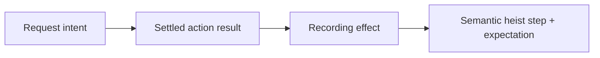

# Recording Contract

Recording turns successful runtime evidence into a durable semantic heist test.
It is not a playback log.

The recorder observes the same dispatched and validated responses as normal
execution. It does not dispatch commands, re-run waits, resolve targets, or
store live runtime handles.

## Artifacts

`stop_heist` always writes the required `.heist` package artifact. That package
is the replay input and contains `manifest.json` plus canonical `plan.json`.

When `swiftOutput` is present, `stop_heist` also writes deterministic Swift DSL
source for author review and editing. The Swift file is additive: replay still
uses the `.heist` artifact unless the source is later edited and compiled by an
authoring tool.

```bash
buttonheist stop_heist \
  --output search-flow.heist \
  --swift-output SearchFlow.swift \
  --sample-parameter query \
  --sample-value milk
```

With a safe exact sample rewrite, the Swift source can lift repeated concrete
values into a root string parameter:

```swift
import ThePlans

let heist = try HeistPlan("searchFlow", parameter: "query") { query in
    TypeText(query, into: .label("Search"))
        .expect(.present(.element(label: "Search", value: query)), timeout: .seconds(2))
}
```

Sample rewrite is intentionally conservative. It only rewrites exact full
matches in recorded typed text and semantic value expectations or updates.
Label-only exact matches may be rewritten when that is the only safe match.
Identifiers, traits, command names, heist names, file paths, warning messages,
failure messages, pasteboard payloads, and partial string matches stay concrete.
When there is no safe exact match, the Swift output remains a concrete canonical
DSL projection. Recording does not infer loops, helper functions, retries,
dynamic registries, or arbitrary Swift structure.

## Recording Rule



Every interaction during recording has one explicit effect:

| Effect | Meaning |
|--------|---------|
| append | Store one or more durable heist steps. |
| drop pending viewport movement | Discard incomplete viewport movement when later semantic intent failed to record. |
| ignore | Leave recording state unchanged, usually for observations or direct viewport/debug commands. |

## What Records

- Successful semantic actions record semantic commands with minimum durable
  targets from settled evidence.
- `wait` records as an assertion primitive.
- Durable spatial actions record only when their payload passes durability
  checks.
- Passed explicit expectations record as action expectations.
- Clear settled evidence can infer expectations such as target absence,
  current value/state, or screen change when no more precise outcome exists.

## What Does Not Record

- Observation and inspection commands.
- Direct viewport/debug commands.
- Failed actions.
- Actions with unmet explicit expectations.
- `scroll_to_visible` as setup for later semantic commands.
- Manual scroll before a semantic action when the semantic action is the
  durable intent.
- Semantic actions whose post-action state never settled — without a settled
  trace there is no durable evidence to record a minimum target from.
- Ambiguous or unrecordable semantic evidence.
- Viewport geometry, capture IDs, runtime IDs, live object references,
  containerNames, or capture-local IDs as semantic identity.

## Matcher Policy

Recorded semantic targets come from before-state evidence. The matcher should be
the minimum durable selector that preserves intent: useful identity first,
state only when needed, and ordinal only when semantic predicates cannot
disambiguate.

Disappearance expectations also use before-state matchers. Current-state
expectations use durable identity plus after-state value or state.
