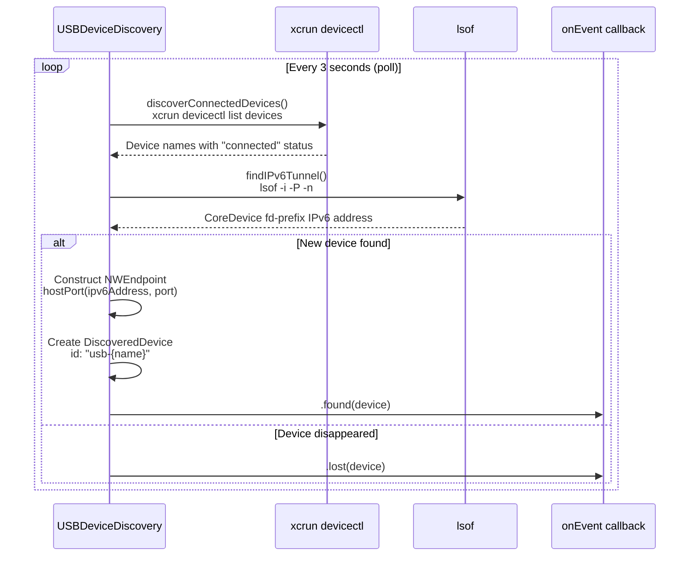

# USB Device Connectivity

Connecting to iOS devices over USB via CoreDevice IPv6 tunnels, bypassing WiFi/mDNS discovery.

## Overview

When WiFi is unreliable (VPN interference, network segmentation, mDNS issues), The Button Heist can connect to physical devices over the CoreDevice USB IPv6 tunnel. USB traffic is allowed by the default `simulator,usb` scope, while WiFi/LAN traffic remains opt-in.

USB uses the same TLS wire protocol as other transports. The difference is how the endpoint is found: direct/named target configuration for USB, Bonjour only when `network` scope is explicitly enabled.

## How It Works

### The CoreDevice IPv6 Tunnel

When an iOS device is connected via USB and recognized by Xcode/CoreDevice:

1. **CoreDevice creates a tunnel** on a `utun` interface (typically `utun5`)
2. **IPv6 addresses are assigned**:
   - Mac: `fd9a:6190:eed7::2` (or similar ULA prefix)
   - Device: `fd9a:6190:eed7::1`
3. **TCP connections can be made** directly to the device's IPv6 address

### USB Discovery

> **Note:** `USBDeviceDiscovery` (in the ButtonHeist framework) is defined but not currently wired into `TheHandoff`. Public discovery starts from Bonjour and named targets. With the default `simulator,usb` scope, Bonjour is not published because LAN visibility is disabled; use a named/direct target or a fixed `INSIDEJOB_PORT` for USB workflows that must avoid network scope.

The `USBDeviceDiscovery` implementation is available for this flow:

1. Polls `xcrun devicectl list devices` to find connected devices
2. Parses `lsof -i -P -n` output to locate the CoreDevice IPv6 tunnel address
3. Constructs an `NWEndpoint` with the IPv6 address and port
4. Produces a `DiscoveredDevice` — identical to Bonjour-discovered devices

### Port Discovery

TheInsideJob uses an OS-assigned port by default, or a fixed port from `INSIDEJOB_PORT` / `InsideJobPort`. When Bonjour is enabled, the same port is advertised and is reachable via the CoreDevice IPv6 tunnel.

### Requirements

1. **Device must be "connected"** in devicectl (USB cable attached, trusted)
2. **TheInsideJob must use IPv6 dual-stack** (enabled by default)
3. **App must be running** on the device with TheInsideJob started
4. **Xcode command line tools** installed (`xcrun` must be available)

## Usage

### CLI

```bash
# List Bonjour-advertised devices and named targets
buttonheist list_devices

# Connect to a USB device by name when advertised or configured as a target
buttonheist --device "iPhone 15 Pro" activate --identifier myButton

# Take a screenshot over USB; writes an artifact by default
buttonheist --device "iPhone 15 Pro" get_screen --output screen.png
```

### MCP Server

Target a USB device in `.mcp.json`:

```json
{
  "mcpServers": {
    "buttonheist": {
      "command": "./ButtonHeistMCP/.build/release/buttonheist-mcp",
      "args": ["--device", "iPhone 15 Pro"]
    }
  }
}
```

## Building and Deploying to Device

### Command Line Build

```bash
xcodebuild -workspace ButtonHeist.xcworkspace \
  -scheme BH Demo \
  -destination 'platform=iOS,name=Your Device Name' \
  -allowProvisioningUpdates \
  CODE_SIGN_STYLE=Automatic \
  DEVELOPMENT_TEAM=YOUR_TEAM_ID \
  build
```

### Install to Device

```bash
xcrun devicectl device install app \
  --device "Your Device Name" \
  ~/Library/Developer/Xcode/DerivedData/ButtonHeist-*/Build/Products/Debug-iphoneos/BHDemo.app

xcrun devicectl device process launch \
  --device "Your Device Name" \
  --terminate-existing --activate \
  com.buttonheist.testapp
```

## Discovering the Tunnel Manually

### Check Device Status

```bash
xcrun devicectl list devices
```

Look for `connected` status:
```
Test Phone 15 Pro     Test-Phone-15-Pro.coredevice.local    ...   connected   iPhone 15 Pro
```

### Find the IPv6 Tunnel Address

```bash
lsof -i -P -n | grep CoreDev | grep -oE '\[fd[0-9a-f:]+::[12]\]' | head -1
```

## USB Discovery Flow



### Manual Connection (for debugging)

The protocol requires TLS before any JSON messages and token authentication before commands. Plain `nc` is not a valid production client. For manual debugging, prefer `buttonheist connect host:port` or an MCP named target that carries the endpoint and token.

## Message Protocol

USB connections use the same TLS wire protocol as other transports. See the [Wire Protocol Specification](WIRE-PROTOCOL.md) for message format, authentication flow, and command reference.

## Implementation Details

### Configurable Address-Family Server

The production `ServerTransport` uses Network framework (`NWListener`) with
TLS parameters. Plain TCP startup exists only through explicitly named test
helpers.

```swift
let parameters = ButtonHeistTLSPreSharedKey.makeNetworkParameters(token: token)
let hosts: [NWEndpoint.Host] = [
    bindToLoopback ? .ipv4(.loopback) : .ipv4(.any),
    bindToLoopback ? .ipv6(.loopback) : .ipv6(.any),
]
var requestedPort = port
var listeners: [NWListener] = []
for host in hosts {
    let listenerParameters = parameters.copy()
    listenerParameters.requiredLocalEndpoint = .hostPort(
        host: host,
        port: NWEndpoint.Port(rawValue: requestedPort) ?? .any
    )
    let listener = try NWListener(using: listenerParameters)
    let actualPort = try await startAndWaitForReady(listener)
    requestedPort = requestedPort == 0 ? actualPort : requestedPort
    listeners.append(listener)
}
```

Simulator-only scope binds to loopback (`127.0.0.1` and `::1` by default).
USB or network scopes bind to all interfaces for the configured address family
so CoreDevice USB can reach the listener. The bind address is controlled by
`ServerExposure`, and connection scope classification still rejects disallowed
sources before authentication.

This allows:
- Simulator connections via `127.0.0.1` (loopback)
- USB device connections via the CoreDevice IPv6 tunnel
- WiFi connections via local network IPv4/IPv6 only when `INSIDEJOB_SCOPE` includes `network`

### Why WiFi Might Fail

Common issues that USB bypasses:
- **VPN routing**: VPN may route local traffic through tunnel
- **mDNS blocking**: Bonjour discovery blocked or filtered
- **Network segmentation**: Device on different subnet
- **Firewall rules**: Port blocked on WiFi interface

## Troubleshooting

### "Connection refused"
- App not running or TheInsideJob not started
- Wrong port (verify Info.plist has correct port)
- Device went to sleep/background

### "No route to host"
- Device not connected or not trusted
- CoreDevice tunnel not established
- Check `xcrun devicectl list devices` for "connected" status

### "Network is unreachable"
- Wrong IPv6 prefix (check `lsof -i -P -n | grep CoreDev`)
- Tunnel interface not up (reconnect USB cable)

### USB device not appearing in `buttonheist list_devices`
- Verify device shows as "connected" in `xcrun devicectl list devices`
- Ensure app is running on the device
- Remember that default `simulator,usb` scope does not publish Bonjour; use a named/direct target or enable `network` scope only when LAN discovery is acceptable

## Connection Scopes

By default, TheInsideJob only accepts connections from simulators (loopback) and USB devices. Network/WiFi connections are rejected unless explicitly allowed via the `INSIDEJOB_SCOPE` environment variable:

```bash
# Default: simulator and USB only
INSIDEJOB_SCOPE=simulator,usb

# Also allow WiFi/LAN connections
INSIDEJOB_SCOPE=simulator,usb,network

# USB only (reject simulator and WiFi)
INSIDEJOB_SCOPE=usb
```

The scope filter classifies connections once they reach the `.ready` state, using typed `NWEndpoint.Host` values and interface detection:
- **simulator**: Loopback (`::1`, `127.0.0.1`)
- **usb**: `anpi` interface (Apple Network Private Interface — CoreDevice USB tunnel)
- **network**: Everything else (WiFi, LAN, public)

Connections from disallowed scopes are rejected at the `.ready` state, before authentication.

## See Also

- [Wire Protocol](WIRE-PROTOCOL.md) — Message format (identical over WiFi and USB)
- [Project Overview](../README.md) — Architecture and quick start
- [CLI Reference](../ButtonHeistCLI/) — All commands work over USB
