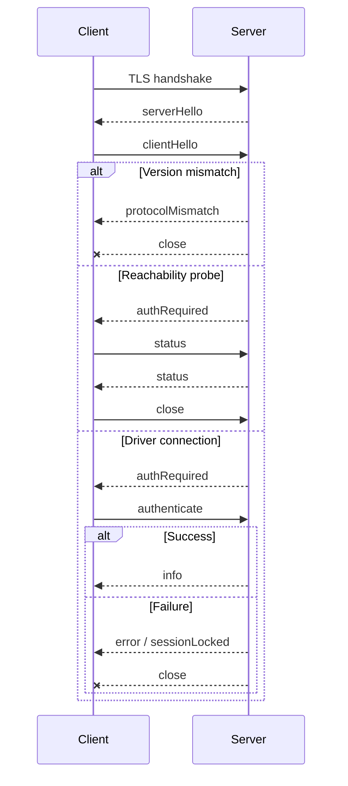

# The Button Heist wire protocol

This document describes the raw TheScore transport between clients and the iOS
host. It is not the CLI, MCP, or heist command catalog.

Use live adapter surfaces for product command catalogs:

- CLI commands: run `buttonheist --help` or `buttonheist <command> --help`.
- MCP tools: call MCP `tools/list` and read each tool's input schema.

## Versioning

There is no separate wire-protocol version. The wire contract is versioned by
The Button Heist product SemVer carried in `buttonHeistVersion`.

Compatibility is exact product-version lockstep:

- the embedded iOS server, macOS framework, CLI, and MCP server must come from
  the same product release
- `buttonHeistVersion` must match exactly during the hello handshake
- malformed semantic versions are rejected while decoding the envelope
- major, minor, and patch differences are all incompatible on the wire
- there is no downgrade, feature negotiation, or best-effort compatibility mode

On mismatch, the server returns `protocolMismatch` with both observed product
versions, then closes the connection before authentication or command dispatch.
Clients should surface this as an install/build mismatch and ask the caller to
rebuild or reinstall both sides from the same release. Wire-format changes ship
with a product version bump, not a parallel protocol version.

## Command Layers

The Button Heist has one product command contract: `TheFence.Command`. CLI,
session JSON, MCP tools, and heist execution adapt to command names
such as `get_interface`, `activate`, and `scroll_to_visible`.

The wire protocol is lower-level transport. Its `type` values are TheScore
message discriminators such as `requestInterface`, `requestScreen`, `status`,
and `heistPlan`. Use Fence command names at public adapter boundaries and wire
discriminators only when speaking raw TCP.

Side-effecting app interactions are not raw command dictionaries on the wire.
Durable mutations such as `activate`, `type_text`, `wait`, and `set_pasteboard`
cross as one-step or composed `heistPlan` messages. Non-durable viewport/debug
commands cross as typed `runtimeAction` messages. In both cases, Fence admission
has already parsed the canonical name into `TheFence.Command`, validated the
descriptor-owned parameter schema, and converted `FenceCommandInput` into the
typed `FenceOperationRequest` consumed by execution.

Fence command names are snake case. Inside `HeistActionCommand`, the canonical
`type` values are the Swift raw values from `HeistActionCommandType`, including
`performCustomAction`, `oneFingerTap`, `typeText`, `scrollToVisible`,
`scrollToEdge`, and `resignFirstResponder`. Raw clients must not substitute
Fence spellings such as `type_text` inside a heist action payload.

## Transport

- TLS over TCP using Network.framework
- Newline-delimited UTF-8 JSON
- Service type `_buttonheist._tcp`
- OS-assigned port by default
- IPv6 dual-stack listener
- TLS with token-derived pre-shared key material

Default connection scope is `simulator,usb`. Bonjour/LAN discovery is opt-in
with `network` scope.

Clients must provide the same token as the server before connecting. The token
derives the TLS pre-shared key and is also sent in the JSON `authenticate`
payload after the hello handshake.

## Discovery

### Bonjour

Bonjour is published only when `INSIDEJOB_SCOPE` includes `network`.

TXT metadata includes app/device identity and transport mode:

```text
simudid=<simulator UDID when available>
installationid=<stable app installation identifier>
instanceid=<human-readable instance id>
devicename=<device name>
transport=tls-psk
```

The token is not advertised over Bonjour. mDNS itself does not provide
integrity protection.

### USB

USB uses the CoreDevice IPv6 tunnel. It is classified as `usb` scope and uses
the same TLS wire protocol as other non-loopback transports.

## Handshake



`status` is the only post-hello message allowed before authentication. It
reports identity and session availability without claiming a driver session.

The client-side view of the same exchange — the `HandoffConnectionPhase` state
machine and every documented failure edge — is drawn in the
[connection lifecycle diagram](diagrams/connection-lifecycle.md).

## Envelopes

Every message is a JSON object terminated by `\n`.

Client request:

```json
{"buttonHeistVersion":"<semver>","requestId":"abc-123","type":"requestInterface","payload":{}}
```

Server response:

```json
{"buttonHeistVersion":"<semver>","requestId":"abc-123","type":"interface","payload":{"timestamp":791807445.123,"tree":[],"annotations":{"elements":[],"containers":[]}}}
```

| Field | Description |
|-------|-------------|
| `buttonHeistVersion` | `ButtonHeistVersion` encoded as a `MAJOR.MINOR.PATCH` string. Must match exactly across client and server. |
| `requestId` | Optional `RequestID` encoded as a nonblank string. Echoed by the matching response. |
| `type` | Explicit TheScore message discriminator. |
| `payload` | Optional payload object. |

## Public Wire Examples

These examples show edge contracts that raw clients may need. Command and
parameter inventories belong in the generated references.

### Hello

```json
{"buttonHeistVersion":"<semver>","type":"serverHello"}
{"buttonHeistVersion":"<semver>","type":"clientHello"}
{"buttonHeistVersion":"<semver>","type":"authRequired"}
```

### Authentication

```json
{"buttonHeistVersion":"<semver>","type":"authenticate","payload":{"token":"your-secret-token","driverId":"agent-1"}}
```

`token` is a `SessionAuthToken` and `driverId` is an optional `DriverID`. Both
encode as exact, nonblank strings; whitespace is not trimmed. `SessionOwner`
retains whether ownership came from the driver ID or, when absent, the token.

### Rejected Auth Tags

`authApprovalPending` and `authApproved` are not valid current server messages.
Current clients reject either tag as an unsupported auth response and instruct the
user to rebuild or reinstall the app, then retry with the configured token.
Clients without a token fail before starting the TLS connection.

### Protocol Mismatch

```json
{"buttonHeistVersion":"<server-semver>","type":"protocolMismatch","payload":{"serverButtonHeistVersion":"<server-semver>","clientButtonHeistVersion":"<client-semver>"}}
```

### Session Locked

```json
{"buttonHeistVersion":"<semver>","type":"sessionLocked","payload":{"message":"Session is locked by another driver","activeConnections":1}}
```

### Status Probe

```json
{"buttonHeistVersion":"<semver>","type":"status"}
```

```json
{"buttonHeistVersion":"<semver>","type":"status","payload":{"identity":{"appName":"MyApp","bundleIdentifier":"com.example.myapp","appBuild":"42","deviceName":"iPhone 15 Pro","systemVersion":"18.0","buttonHeistVersion":"<semver>"},"session":{"active":false,"watchersAllowed":false,"activeConnections":0}}}
```

### Interface

```json
{"buttonHeistVersion":"<semver>","type":"requestInterface","payload":{}}
```

The interface payload carries the canonical hierarchy tree plus ButtonHeist
annotations. There is no parallel wire `elements` array in the public wire
contract. `timestamp` uses Foundation `Date`'s default Codable representation:
seconds since 2001-01-01 00:00:00 UTC.

```json
{
  "buttonHeistVersion": "<semver>",
  "type": "interface",
  "payload": {
    "timestamp": 791807445.123,
    "tree": [
      {
        "element": {
          "description": "Button",
          "label": "Sign In",
          "identifier": "signInButton",
          "traits": ["button"],
          "shape": { "type": "frame", "frame": [[16, 140], [361, 44]] },
          "activationPoint": [196.5, 162],
          "usesDefaultActivationPoint": true,
          "customActions": [],
          "customContent": [],
          "customRotors": [],
          "respondsToUserInteraction": true,
          "visibility": "onscreen",
          "traversalIndex": 0
        }
      }
    ],
    "annotations": {
      "elements": [
        { "path": { "indices": [0] }, "actions": ["activate"] }
      ],
      "containers": []
    }
  }
}
```

The raw interface tree carries parser values plus path-indexed Button Heist
annotations. Capture-local `HeistId` values remain inside TheInsideJob and are
not selectors on this transport. `AccessibilityTarget` is the canonical target
object for actions, waits, expectations, CLI/MCP projections, and
`requestInterface.payload.subtree`. An element
target carries an ordered predicate `checks` chain and optional `ordinal`; a
container target carries `container` and optional `ordinal`; `container` plus
`target` expresses a descendant-scoped target; `ref` refers to a scoped heist
target parameter.
Public target nesting is bounded by the shared public JSON input depth limit.
Checks include `label`, `identifier`, `value`, `hint`, `traits`, `actions`,
`customContent`, and `rotors`. Durable replay uses the same target shape.

Container identifiers are matched on every delivered container type that
carries the identifier. They are not restricted to semantic-group containers.
Canonical container roles are `none`, `semanticGroup`, `list`, `landmark`,
`dataTable`, `tabBar`, and `series`. Identifier and scrollability are orthogonal
checks; a roleless parser scroll container has role `none` and `scrollable=true`.
Target resolution always walks the canonical delivered tree, including for
`exists`, `missing`, and subtree queries.
`InterfaceQuery` contains only optional `subtree`, `maxScrollsPerContainer`,
and `maxScrollsPerDiscovery` fields. Filtering is expressed only by the
canonical `AccessibilityTarget` in `subtree`; there is no separate interface
matcher or top-level `checks` adapter.
The string predicate fields may carry one StringMatch value or an array of
StringMatch values; arrays require every check against that property to match.
Prefer ordered `checks` when string checks and trait checks belong in one
predicate chain. Inclusion uses the positive check (`.traits([...])`,
`.actions([...])`, etc.); exclusion wraps that same check as
`.exclude(.traits([...]))`.

### One-Step Semantic Action

```json
{
  "buttonHeistVersion": "<semver>",
  "requestId": "act-1",
  "type": "heistPlan",
  "payload": {
    "plan": {
      "version": 2,
      "parameter": { "type": "none" },
      "body": [
        {
          "type": "action",
          "action": {
            "command": {
              "type": "activate",
              "payload": {
                "target": {
                  "checks": [
                    { "kind": "label", "match": { "mode": "exact", "value": "Sign In" } },
                    { "kind": "traits", "values": ["button"] }
                  ]
                }
              }
            }
          }
        }
      ]
    },
    "argument": { "type": "none" }
  }
}
```

Semantic action steps identify elements semantically. The host resolves the
target against settled state once, pins the resolved capture-local `HeistId`,
and derives one deadline from its scroll-membership ancestor graph. Nested
ancestors reveal outermost-first. Refresh, geometry stabilization, and dispatch
must continue to resolve that exact id; a different element that matches the
original selector cannot take over the action. Cached coordinates from a prior
capture are not the authority.

Explicit viewport commands such as `scroll`, `scroll_to_edge`, and
`scroll_to_visible` remain public Fence commands because moving the viewport is
the requested behavior. They are non-durable debug operations and cross the
device wire as typed `runtimeAction` requests, not as `heistPlan` steps.

### Screen Capture

```json
{"buttonHeistVersion":"<semver>","type":"requestScreen"}
```

The raw wire response carries base64 PNG data plus a fresh visible interface.
Public CLI/MCP adapters return artifact paths by default and include inline
media only through explicit, size-bounded opt-ins.

### Wait

```json
{"buttonHeistVersion":"<semver>","type":"heistPlan","payload":{"plan":{"version":2,"parameter":{"type":"none"},"body":[{"type":"wait","wait":{"predicate":{"type":"changed","scope":"screen","assertions":[]},"timeout":30}}]},"argument":{"type":"none"}}}
```

The host evaluates current-tree predicates against the current delivered
interface first, then extends one observation window until the predicate is met
or the timeout expires. `exists` and `missing` read current state. Lifecycle
assertions require observed facts and never pass from an implied final state.
The response is a heist execution receipt, even for a single wait.

To assert current settled container presence without requiring a transition,
put the container in the canonical target slot:
`{"type":"exists","target":{"container":{"checks":[{"kind":"identifier","match":{"mode":"exact","value":"Checkout"}}]}}}`.
Scoped targets use `{"container":{"checks":[...]},"target":{...}}` so
resolution is limited to descendants of the matching container.

The strict predicate wire grammar is:

```json
{"type":"changed","scope":"screen","assertions":[]}
{"type":"changed","scope":"elements","assertions":[{"type":"appeared","target":{"checks":[{"kind":"label","match":{"mode":"exact","value":"Toast"}}]}}]}
```

`screen` assertions accept `exists` and `missing`; `elements` assertions also
accept `appeared`, `disappeared`, and `updated`. `change`, `scopes`,
`screenChanged`, and flat target wrappers are invalid.

Raw heist receipt steps contain only `path`, `durationMs`, and one semantic
`node`. The node's `type` selects its authored fields and legal completion:

```json
{"path":"$.body[0]","durationMs":1,"node":{"type":"warning","outcome":"passed","message":"notice","children":[]}}
```

Inside `node`, `outcome` determines whether that node may carry evidence,
failure, and which child shape is legal. Typed completion and evidence wrappers
enforce those combinations before encoding; `kind`, `intent`, `status`, and a
top-level receipt outcome are not part of the contract. Run status and the abort
path are derived from the semantic node tree.

## Action Results

Action responses use `actionResult`:

```json
{"buttonHeistVersion":"<semver>","type":"actionResult","payload":{"outcome":{"kind":"success"},"method":"activate","evidence":{"observation":{"kind":"none"}}}}
```

App-side dispatch first produces one `ActionDispatchOutcome`; observation adds
evidence to that result without another intermediate result shape. Action
evidence is required and bound to the wire result outcome. Its `observation`
is exactly one tagged case: `none`, `announcement`, `trace`, or `settledTrace`.
Only `settledTrace` owns the tagged settlement shape
`{"kind":"settled|timedOut","durationMs":...}`.
The `trace` case cannot include `settlement`.
`settledTrace` with `timedOut` may carry receipt-local diagnostic captures, but
those captures are not admitted to settled semantic state.
Captured announcements derive from the trace; standalone announcements use the
`announcement` case. Settlement duration does not also appear in stored timing.
Warnings are valid only in successful evidence and are not duplicated on a
containing heist action receipt. Missing evidence, optional evidence bags, flat
evidence fields, and sibling receipt warnings are invalid input.
Fence projections surface that warning inside the projected action result, not
beside the result on report evidence.

`ActionResult.payload` is a tagged union when command-specific data is needed,
for example:

```json
{"kind":"value","data":"Hello"}
```

Returned elements expose semantic accessibility fields. Compose follow-up
commands from those fields; internal capture-local `HeistId` values are not
public selectors.

Action failures use `{"outcome":{"kind":"failure","errorKind":"..."}}`
when the error belongs to the action. Server-level failures use the `error`
message with `kind` and `message`. Where each receipt field is produced during
an action is drawn in the [action pipeline diagram](diagrams/action-pipeline.md).

## Traces, Facts, and Public Deltas

`SemanticObservationStore` is the in-app semantic owner. It commits the current
tree and retained entries with typed lineage and serves replayable cursor-backed sequences. A
temporal predicate builds one `ObservationWindow` from its immutable baseline
through the current retained entry; it does not merge a private trace or claim
notification ownership. Presence predicates read the current tree directly.

`AccessibilityTrace` is the durable wire/receipt evidence materialized from
that lineage, and the runtime derives ordered `ChangeFact` values from its
adjacent captures. A timed-out action may return a diagnostic trace in its
receipt, but that trace is not committed or usable as a settled observation
baseline. No separate stored or endpoint temporal model exists.

Only proof-backed observations are committed and appended to retained semantic
history. A raw `InterfaceObservation` is live parser evidence
and cannot be committed directly. Visible commits require a clean-settle
`InterfaceObservationProof`; discovery commits require the proof made from the
finished exploration graph after its settled pages have been reduced.

Facts have two kinds: `elementsChanged` and `screenChanged`. A screen boundary
always derives three ordered facts: old-tree departures, the screen marker,
then new-tree arrivals. `updated` entries can only be derived from captures in
the same screen generation. Only a complete observation window with no facts
proves `noChange`; no `noChange` fact is emitted.

Scoped notification evidence has one semantic shape: `screenChanged`,
`elementChanged` with a `layout` or `value` subtype, `announcement`, or
`unknown` with its raw code. A scoped screen notification authoritatively
classifies replacement even when tree hashes are equal. Element and
announcement notifications remain same-generation evidence. Unknown kinds
retain their raw code and never become screen evidence by themselves.
UIKit does not guarantee delivery of a useful notification for every change;
absence permits explicit snapshot classification but is not itself evidence of
either replacement or stability.

A clean post-action commit contributes one checkpointed notification batch.
`AccessibilityNotificationBus` retains the ingress events; checkpointing never
clears or transfers ownership of them. The selected events are strictly after
the action window's opening cursor and no later than the batch's exact
through-cursor. That through-cursor becomes the observation's notification
cursor. A failed settle closes the attribution window and does not attach its
events to that diagnostic trace. The ingress log remains non-destructive:
because no settled cursor advanced, an eligible scoped event can still be
claimed by the next clean commit. Ambient events remain outside scoped heist
evidence. If the bounded notification stream discarded relevant events, the
destination capture carries
`transition.accessibilityNotificationGap.droppedThroughSequence`; a gapped edge
does not claim complete notification evidence. A scoped `screenChanged` after
batch capture is outside that cursor and still invalidates the committed
observation.

Notification object payloads never carry UIKit identity. A resolved element
payload contains an `AccessibilityNotificationElementReference` with the
destination interface's canonical semantic graph `path`, `traversalIndex`, and
resolution method. The path and traversal index identify one record in that
graph's traversal order. Failed correlation remains explicit as an unresolved
payload.

First-responder state is captured internally as a capture-local `HeistId` and
retained in the value-only capture snapshot, never as a UIKit object identity.
When trace context exposes `firstResponder`, the host projects that captured id
once to an `AccessibilityTarget`; internal ids do not cross the wire. A
first-responder action pins the captured id and fails if inflation finishes on a
different id or the current first responder changed during inflation.

Observed notification evidence and inferred screen classification occupy
different transition fields. `transition.accessibilityNotifications` retains
the notification records. `transition.fallbackReason` separately retains the
typed reason inferred by `ScreenClassifier` from settled snapshots.
`ScreenClassifier` owns precedence: scoped `screenChanged` is authoritative.
Without that notification, every settled pair is still classified from its
snapshots; `elementChanged` and `announcement` remain notification facts but do
not veto a replacement proved by the snapshots. Every inferred replacement
records one of `modalBoundaryChanged`, `selectedTabChanged`,
`navigationMarkerChanged`, `primaryHeaderChanged`, or `rootShapeChanged` in
`transition.fallbackReason`. Parsed screen IDs, first-responder state, geometry,
and observation-generation counters never originate a screen classification;
the generation records the classifier's result.

For UIKit value controls, both `elementChanged` subtypes and `announcement` are
recapture triggers. The notification kind does not assert the new value;
Button Heist re-reads the delivered node and derives any value update from the
before/after captures. SwiftUI value notifications use that same path.

Fence JSON projections of action and receipt evidence add a compact `delta`
field; the raw `actionResult` message carries the source trace evidence instead.
The delta is a one-way lossy fold over ordered facts. It is discriminated as
`noChange`, `elementsChanged`, or `screenChanged` and is never used to evaluate
a predicate. A screen marker dominates the final public delta kind even when
element facts also occurred. Empty edit and notification collections are
omitted from the projection.

## Authentication and Sessions

Driver connections require authentication. `SessionLease` holds one typed
`SessionOwner` (`DriverID` or `SessionAuthToken`) at a time:

1. First authenticated driver claims the session.
2. Same driver identity can reconnect or issue separate direct CLI commands.
3. Different driver identities receive `sessionLocked`.
4. When the last connection closes, the inactivity timer starts.
5. After timeout, the session is released.

The token is not invalidated when the session expires.

## Security Limits

- TLS is required for production listener startup.
- Default scope is `simulator,usb`; LAN exposure requires explicit `network`
  scope.
- Bonjour is published only in `network` scope.
- Non-loopback targets require explicit or persisted TLS trust.
- The server applies connection, rate, and receive-buffer limits.

## Keepalive and Recovery

Clients should send `ping` periodically and tolerate a few delayed responses
before declaring failure. App main-thread stalls can delay pong handling.

After reconnecting, clients should request fresh interface state before acting.

## Current Shape

The current wire shape is whatever the matching `buttonHeistVersion` ships.
Older clients are not supported. Clients should update in lockstep with the
server.
