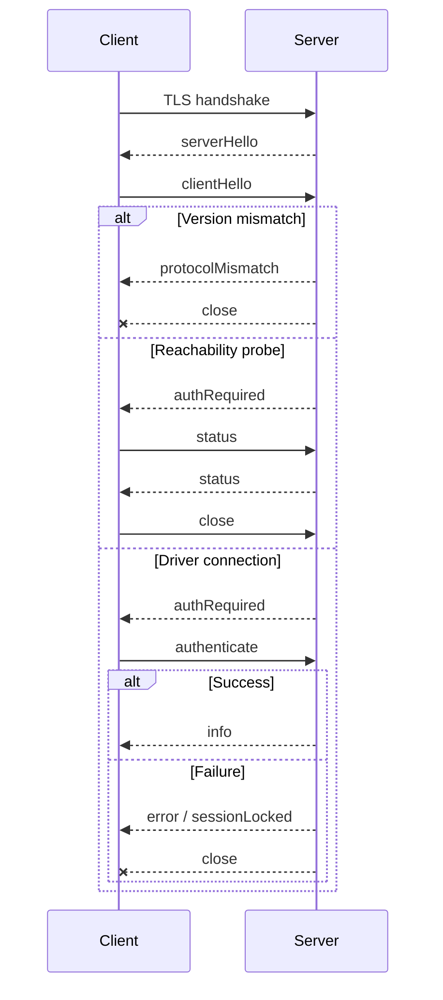

# The Button Heist wire protocol

This document describes the raw TheScore transport between clients and the iOS
host. It is not the CLI, MCP, or heist command catalog.

Use live adapter surfaces for product command catalogs:

- CLI commands: run `buttonheist --help` or `buttonheist <command> --help`.
- MCP tools: call MCP `tools/list` and read each tool's input schema.

## Versioning

There is no separate wire-protocol version. The wire contract is versioned by
The Button Heist product SemVer carried in `buttonHeistVersion`.

Compatibility is exact product-version lockstep:

- the embedded iOS server, macOS framework, CLI, and MCP server must come from
  the same product release
- `buttonHeistVersion` must match exactly during the hello handshake
- major, minor, and patch differences are all incompatible on the wire
- there is no downgrade, feature negotiation, or best-effort compatibility mode

On mismatch, the server returns `protocolMismatch` with both observed product
versions, then closes the connection before authentication or command dispatch.
Clients should surface this as an install/build mismatch and ask the caller to
rebuild or reinstall both sides from the same release. Wire-format changes ship
with a product version bump, not a parallel protocol version.

## Command Layers

The Button Heist has one product command contract: `TheFence.Command`. CLI,
session JSON, MCP tools, and heist execution adapt to command names
such as `get_interface`, `activate`, and `scroll_to_visible`.

The wire protocol is lower-level transport. Its `type` values are TheScore
message discriminators such as `requestInterface`, `requestScreen`, `status`,
and `heistPlan`. Use Fence command names at public adapter boundaries and wire
discriminators only when speaking raw TCP.

Side-effecting app interactions are not public primitive wire messages. A
single `activate`, `type_text`, `wait`, `set_pasteboard`, or viewport command is
a one-step `HeistPlan`; composed flows are multi-step plans. The public
mutating wire path is always `heistPlan`.

## Transport

- TLS over TCP using Network.framework
- Newline-delimited UTF-8 JSON
- Service type `_buttonheist._tcp`
- OS-assigned port by default
- IPv6 dual-stack listener
- TLS with token-derived pre-shared key material

Default connection scope is `simulator,usb`. Bonjour/LAN discovery is opt-in
with `network` scope.

Clients must provide the same token as the server before connecting. The token
derives the TLS pre-shared key and is also sent in the JSON `authenticate`
payload after the hello handshake.

## Discovery

### Bonjour

Bonjour is published only when `INSIDEJOB_SCOPE` includes `network`.

TXT metadata includes app/device identity and transport mode:

```text
simudid=<simulator UDID when available>
installationid=<stable app installation identifier>
instanceid=<human-readable instance id>
devicename=<device name>
transport=tls-psk
```

The token is not advertised over Bonjour. mDNS itself does not provide
integrity protection.

### USB

USB uses the CoreDevice IPv6 tunnel. It is classified as `usb` scope and uses
the same TLS wire protocol as other non-loopback transports.

## Handshake



`status` is the only post-hello message allowed before authentication. It
reports identity and session availability without claiming a driver session.

The client-side view of the same exchange — the `HandoffConnectionPhase` state
machine and every documented failure edge — is drawn in the
[connection lifecycle diagram](diagrams/connection-lifecycle.md).

## Envelopes

Every message is a JSON object terminated by `\n`.

Client request:

```json
{"buttonHeistVersion":"<semver>","requestId":"abc-123","type":"requestInterface","payload":{}}
```

Server response:

```json
{"buttonHeistVersion":"<semver>","requestId":"abc-123","type":"interface","payload":{"timestamp":"2026-02-03T10:30:45.123Z","tree":[],"annotations":{"elements":[],"containers":[]}}}
```

| Field | Description |
|-------|-------------|
| `buttonHeistVersion` | Product SemVer. Must match exactly across client and server. |
| `requestId` | Optional correlation id. Echoed by the matching response. |
| `type` | Explicit TheScore message discriminator. |
| `payload` | Optional payload object. |

## Public Wire Examples

These examples show edge contracts that raw clients may need. Command and
parameter inventories belong in the generated references.

### Hello

```json
{"buttonHeistVersion":"<semver>","type":"serverHello"}
{"buttonHeistVersion":"<semver>","type":"clientHello"}
{"buttonHeistVersion":"<semver>","type":"authRequired"}
```

### Authentication

```json
{"buttonHeistVersion":"<semver>","type":"authenticate","payload":{"token":"your-secret-token","driverId":"agent-1"}}
```

`driverId` is optional. When present, it is the session-locking identity. When
absent, the token is used as the driver identity.

### Unsupported Legacy Auth Messages

`authApprovalPending` and `authApproved` are not valid current server messages.
Current clients reject either tag as an unsupported auth response and instruct the
user to rebuild or reinstall the app, then retry with the configured token.
Clients without a token fail before starting the TLS connection.

### Protocol Mismatch

```json
{"buttonHeistVersion":"<server-semver>","type":"protocolMismatch","payload":{"serverButtonHeistVersion":"<server-semver>","clientButtonHeistVersion":"<client-semver>"}}
```

### Session Locked

```json
{"buttonHeistVersion":"<semver>","type":"sessionLocked","payload":{"message":"Session is locked by another driver","activeConnections":1}}
```

### Status Probe

```json
{"buttonHeistVersion":"<semver>","type":"status"}
```

```json
{"buttonHeistVersion":"<semver>","type":"status","payload":{"identity":{"appName":"MyApp","bundleIdentifier":"com.example.myapp","appBuild":"42","deviceName":"iPhone 15 Pro","systemVersion":"18.0","buttonHeistVersion":"<semver>"},"session":{"active":false,"watchersAllowed":false,"activeConnections":0}}}
```

### Interface

```json
{"buttonHeistVersion":"<semver>","type":"requestInterface","payload":{}}
```

The interface payload carries the canonical hierarchy tree plus ButtonHeist
annotations. There is no parallel wire `elements` array in the public wire
contract.

```json
{
  "buttonHeistVersion": "<semver>",
  "type": "interface",
  "payload": {
    "screenDescription": "Sign In - 1 text field, 1 button",
    "timestamp": "2026-02-03T10:30:45.123Z",
    "tree": [
      {
        "element": {
          "heistId": "button_sign_in",
          "label": "Sign In",
          "identifier": "signInButton",
          "traits": ["button"],
          "frameX": 16,
          "frameY": 140,
          "frameWidth": 361,
          "frameHeight": 44,
          "activationPointX": 196.5,
          "activationPointY": 162
        }
      }
    ],
    "annotations": {
      "elements": [],
      "containers": []
    }
  }
}
```

`heistId` is a current-capture annotation for correlation and diagnostics.
Public action messages identify elements with the canonical `ElementTarget`
shape: `target` carries an ordered predicate `checks` chain, and `target_ref`
refers to a scoped heist parameter. Checks include `label`, `identifier`,
`value`, `hint`, `traits`, `actions`, `customContent`, and `rotors`; predicate
targets may also carry an optional `ordinal`. Durable replay uses the same
semantic target shape.
The string predicate fields may carry one StringMatch value or an array of
StringMatch values; arrays require every check against that property to match.
Prefer ordered `checks` when string checks and trait checks belong in one
predicate chain. Inclusion uses the positive check (`.traits([...])`,
`.actions([...])`, etc.); exclusion wraps that same check as
`.exclude(.traits([...]))`.

### One-Step Semantic Action

```json
{
  "buttonHeistVersion": "<semver>",
  "requestId": "act-1",
  "type": "heistPlan",
  "payload": {
    "plan": {
      "version": 1,
      "parameter": { "type": "none" },
      "body": [
        {
          "type": "action",
          "action": {
            "command": {
              "type": "activate",
              "payload": {
                "target": {
                  "checks": [
                    { "kind": "label", "match": { "mode": "exact", "value": "Sign In" } },
                    { "kind": "traits", "values": ["button"] }
                  ]
                }
              }
            }
          }
        }
      ]
    },
    "argument": { "type": "none" }
  }
}
```

Semantic action steps identify elements semantically. The host resolves the
target against current state, moves the viewport if needed, refreshes, acquires
fresh live geometry, and then dispatches through the heist runtime. Cached
coordinates from a prior capture are not the authority.

Explicit viewport messages such as `scroll`, `scrollToEdge`, and
`scrollToVisible` remain public Fence commands because moving the viewport is
the requested behavior, but they also cross the device wire as one-step
`heistPlan` requests.

### Screen Capture

```json
{"buttonHeistVersion":"<semver>","type":"requestScreen"}
```

The raw wire response carries base64 PNG data plus a fresh visible interface.
Public CLI/MCP adapters return artifact paths by default and include inline
media only through explicit, size-bounded opt-ins.

### Wait

```json
{"buttonHeistVersion":"<semver>","type":"heistPlan","payload":{"plan":{"version":1,"parameter":{"type":"none"},"body":[{"type":"wait","wait":{"predicate":{"type":"change","scopes":[{"type":"screen"}]},"timeout":30}}]},"argument":{"type":"none"}}}
```

The host evaluates the predicate against the current settled accessibility
state first, then waits for later settled accessibility state until the
predicate's final state is true or the timeout expires. Absence predicates are
satisfied by current absence. Standalone waits using element transition
predicates can pass with a warning when the implied final state is true but the
transition was not observed. The response is a heist execution receipt, even for
a single wait.

To assert current settled container presence without requiring a transition,
use the container state predicate in the wait plan:
`{"type":"exists","container":{"checks":[{"kind":"semantic","semantic":{"kind":"label","match":{"mode":"exact","value":"Checkout"}}}]}}`.
Scoped element targets use `{"container":{"checks":[...]},"target":{...}}` so
resolution is limited to descendants of the matching container. `change` with
a `screen` scope remains the screen-change predicate and requires before/after
settled evidence.

## Action Results

Action responses use `actionResult`:

```json
{"buttonHeistVersion":"<semver>","type":"actionResult","payload":{"success":true,"method":"activate"}}
```

`ActionResult.payload` is a tagged union when command-specific data is needed,
for example:

```json
{"kind":"value","data":"Hello"}
```

Returned elements may include capture-local annotations. Compose follow-up
commands from their semantic fields, not from `heistId`.

Errors use typed `errorKind` on action results when the error belongs to the
action. Server-level failures use the `error` message with `kind` and
`message`. Where each receipt field is produced during an action is drawn in
the [action pipeline diagram](diagrams/action-pipeline.md).

## Traces and Deltas

The trace stores captures. Segments and deltas are derived projections used for
formatting, expectations, and diagnostics; they are not the authoritative
storage truth.

`AccessibilityTrace.Delta` is discriminated by `kind`:

| `kind` | Meaning |
|--------|---------|
| `noChange` | The settled hierarchy did not change. |
| `elementsChanged` | Same screen, element-level additions/removals/updates. |
| `screenChanged` | Screen identity changed; the post-change interface is included. |

Empty edit collections are omitted on the wire.

## Authentication and Sessions

Driver connections require authentication. A session is held by one driver
identity at a time:

1. First authenticated driver claims the session.
2. Same driver identity can reconnect or issue separate direct CLI commands.
3. Different driver identities receive `sessionLocked`.
4. When the last connection closes, the inactivity timer starts.
5. After timeout, the session is released.

The token is not invalidated when the session expires.

## Security Limits

- TLS is required for production listener startup.
- Default scope is `simulator,usb`; LAN exposure requires explicit `network`
  scope.
- Bonjour is published only in `network` scope.
- Non-loopback targets require explicit or persisted TLS trust.
- The server applies connection, rate, and receive-buffer limits.

## Keepalive and Recovery

Clients should send `ping` periodically and tolerate a few delayed responses
before declaring failure. App main-thread stalls can delay pong handling.

After reconnecting, clients should request fresh interface state before acting.

## Current Shape

The current wire shape is whatever the matching `buttonHeistVersion` ships.
Older clients are not supported. Clients should update in lockstep with the
server.
