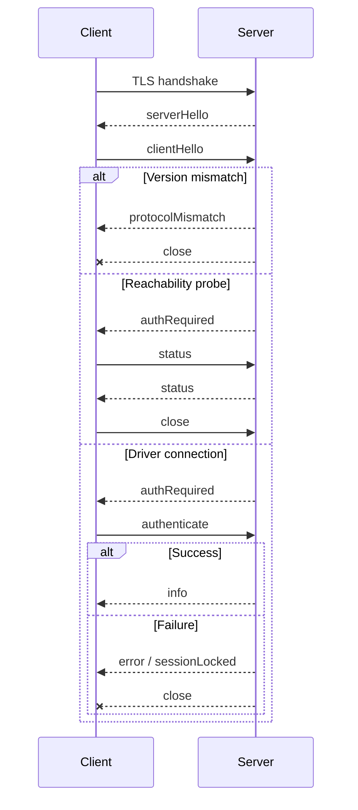

# The Button Heist wire protocol

This document describes the raw TheScore transport between clients and the iOS
host. It is not the CLI, MCP, or heist command catalog.

Use live adapter surfaces for product command catalogs:

- CLI commands: run `buttonheist --help` or `buttonheist <command> --help`.
- MCP tools: call MCP `tools/list` and read each tool's input schema.

## Versioning

There is no separate wire-protocol version. The wire contract is versioned by
The Button Heist product SemVer carried in `buttonHeistVersion`.

Compatibility is exact product-version lockstep:

- the embedded iOS server, macOS framework, CLI, and MCP server must come from
  the same product release
- `buttonHeistVersion` must match exactly during the hello handshake
- major, minor, and patch differences are all incompatible on the wire
- there is no downgrade, feature negotiation, or best-effort compatibility mode

On mismatch, the server returns `protocolMismatch` with both observed product
versions, then closes the connection before authentication or command dispatch.
Clients should surface this as an install/build mismatch and ask the caller to
rebuild or reinstall both sides from the same release. Wire-format changes ship
with a product version bump, not a parallel protocol version.

## Command Layers

The Button Heist has one product command contract: `TheFence.Command`. CLI,
session JSON, MCP tools, and heist execution adapt to command names
such as `get_interface`, `activate`, and `scroll_to_visible`.

The wire protocol is lower-level transport. Its `type` values are TheScore
message discriminators such as `requestInterface`, `requestScreen`, `status`,
and `heistPlan`. Use Fence command names at public adapter boundaries and wire
discriminators only when speaking raw TCP.

Side-effecting app interactions are not public primitive wire messages. A
single `activate`, `type_text`, `wait`, `set_pasteboard`, or viewport command is
a one-step `HeistPlan`; composed flows are multi-step plans. The public
mutating wire path is always `heistPlan`.

## Transport

- TLS over TCP using Network.framework
- Newline-delimited UTF-8 JSON
- Service type `_buttonheist._tcp`
- OS-assigned port by default
- IPv6 dual-stack listener
- TLS with token-derived pre-shared key material

Default connection scope is `simulator,usb`. Bonjour/LAN discovery is opt-in
with `network` scope.

Clients must provide the same token as the server before connecting. The token
derives the TLS pre-shared key and is also sent in the JSON `authenticate`
payload after the hello handshake.

## Discovery

### Bonjour

Bonjour is published only when `INSIDEJOB_SCOPE` includes `network`.

TXT metadata includes app/device identity and transport mode:

```text
simudid=<simulator UDID when available>
installationid=<stable app installation identifier>
instanceid=<human-readable instance id>
devicename=<device name>
transport=tls-psk
```

The token is not advertised over Bonjour. mDNS itself does not provide
integrity protection.

### USB

USB uses the CoreDevice IPv6 tunnel. It is classified as `usb` scope and uses
the same TLS wire protocol as other non-loopback transports.

## Handshake



`status` is the only post-hello message allowed before authentication. It
reports identity and session availability without claiming a driver session.

The client-side view of the same exchange — the `HandoffConnectionPhase` state
machine and every documented failure edge — is drawn in the
[connection lifecycle diagram](diagrams/connection-lifecycle.md).

## Envelopes

Every message is a JSON object terminated by `\n`.

Client request:

```json
{"buttonHeistVersion":"<semver>","requestId":"abc-123","type":"requestInterface","payload":{}}
```

Server response:

```json
{"buttonHeistVersion":"<semver>","requestId":"abc-123","type":"interface","payload":{"timestamp":"2026-02-03T10:30:45.123Z","tree":[],"annotations":{"elements":[],"containers":[]}}}
```

| Field | Description |
|-------|-------------|
| `buttonHeistVersion` | Product SemVer. Must match exactly across client and server. |
| `requestId` | Optional correlation id. Echoed by the matching response. |
| `type` | Explicit TheScore message discriminator. |
| `payload` | Optional payload object. |

## Public Wire Examples

These examples show edge contracts that raw clients may need. Command and
parameter inventories belong in the generated references.

### Hello

```json
{"buttonHeistVersion":"<semver>","type":"serverHello"}
{"buttonHeistVersion":"<semver>","type":"clientHello"}
{"buttonHeistVersion":"<semver>","type":"authRequired"}
```

### Authentication

```json
{"buttonHeistVersion":"<semver>","type":"authenticate","payload":{"token":"your-secret-token","driverId":"agent-1"}}
```

`driverId` is optional. When present, it is the session-locking identity. When
absent, the token is used as the driver identity.

### Unsupported Legacy Auth Messages

`authApprovalPending` and `authApproved` are not valid current server messages.
Current clients reject either tag as an unsupported auth response and instruct the
user to rebuild or reinstall the app, then retry with the configured token.
Clients without a token fail before starting the TLS connection.

### Protocol Mismatch

```json
{"buttonHeistVersion":"<server-semver>","type":"protocolMismatch","payload":{"serverButtonHeistVersion":"<server-semver>","clientButtonHeistVersion":"<client-semver>"}}
```

### Session Locked

```json
{"buttonHeistVersion":"<semver>","type":"sessionLocked","payload":{"message":"Session is locked by another driver","activeConnections":1}}
```

### Status Probe

```json
{"buttonHeistVersion":"<semver>","type":"status"}
```

```json
{"buttonHeistVersion":"<semver>","type":"status","payload":{"identity":{"appName":"MyApp","bundleIdentifier":"com.example.myapp","appBuild":"42","deviceName":"iPhone 15 Pro","systemVersion":"18.0","buttonHeistVersion":"<semver>"},"session":{"active":false,"watchersAllowed":false,"activeConnections":0}}}
```

### Interface

```json
{"buttonHeistVersion":"<semver>","type":"requestInterface","payload":{}}
```

The interface payload carries the canonical hierarchy tree plus ButtonHeist
annotations. There is no parallel wire `elements` array in the public wire
contract.

```json
{
  "buttonHeistVersion": "<semver>",
  "type": "interface",
  "payload": {
    "screenDescription": "Sign In - 1 text field, 1 button",
    "timestamp": "2026-02-03T10:30:45.123Z",
    "tree": [
      {
        "element": {
          "heistId": "button_sign_in",
          "label": "Sign In",
          "identifier": "signInButton",
          "traits": ["button"],
          "frameX": 16,
          "frameY": 140,
          "frameWidth": 361,
          "frameHeight": 44,
          "activationPointEvidence": {
            "source": "defaultCenter",
            "point": { "x": 196.5, "y": 162 }
          }
        }
      }
    ],
    "annotations": {
      "elements": [],
      "containers": []
    }
  }
}
```

`heistId` is a current-capture annotation for correlation and diagnostics.
`AccessibilityTarget` is the canonical target object for actions, predicates,
and `get_interface.query.subtree`. An element target carries an ordered
predicate `checks` chain and optional `ordinal`; a container target carries
`container` and optional `ordinal`; `container` plus `target` expresses a
descendant-scoped target; `ref` refers to a scoped heist target parameter.
Public target nesting is bounded by the shared public JSON input depth limit.
Checks include `label`, `identifier`, `value`, `hint`, `traits`, `actions`,
`customContent`, and `rotors`. Durable replay uses the same target shape.

Container identifiers are matched on every delivered container type that
carries the identifier. They are not restricted to semantic-group containers.
Canonical container roles are `none`, `semanticGroup`, `list`, `landmark`,
`dataTable`, `tabBar`, and `series`. Identifier and scrollability are orthogonal
checks; a roleless parser scroll container has role `none` and `scrollable=true`.
Target resolution always walks the canonical delivered tree, including for
`exists`, `missing`, and subtree queries.
`InterfaceQuery` contains only optional `subtree`, `maxScrollsPerContainer`,
and `maxScrollsPerDiscovery` fields. Filtering is expressed only by the
canonical `AccessibilityTarget` in `subtree`; there is no separate interface
matcher or top-level `checks` adapter.
The string predicate fields may carry one StringMatch value or an array of
StringMatch values; arrays require every check against that property to match.
Prefer ordered `checks` when string checks and trait checks belong in one
predicate chain. Inclusion uses the positive check (`.traits([...])`,
`.actions([...])`, etc.); exclusion wraps that same check as
`.exclude(.traits([...]))`.

### One-Step Semantic Action

```json
{
  "buttonHeistVersion": "<semver>",
  "requestId": "act-1",
  "type": "heistPlan",
  "payload": {
    "plan": {
      "version": 1,
      "parameter": { "type": "none" },
      "body": [
        {
          "type": "action",
          "action": {
            "command": {
              "type": "activate",
              "payload": {
                "target": {
                  "checks": [
                    { "kind": "label", "match": { "mode": "exact", "value": "Sign In" } },
                    { "kind": "traits", "values": ["button"] }
                  ]
                }
              }
            }
          }
        }
      ]
    },
    "argument": { "type": "none" }
  }
}
```

Semantic action steps identify elements semantically. The host resolves the
target against current state, moves the viewport if needed, refreshes, acquires
fresh live geometry, and then dispatches through the heist runtime. Cached
coordinates from a prior capture are not the authority.

Explicit viewport messages such as `scroll`, `scrollToEdge`, and
`scrollToVisible` remain public Fence commands because moving the viewport is
the requested behavior, but they also cross the device wire as one-step
`heistPlan` requests.

### Screen Capture

```json
{"buttonHeistVersion":"<semver>","type":"requestScreen"}
```

The raw wire response carries base64 PNG data plus a fresh visible interface.
Public CLI/MCP adapters return artifact paths by default and include inline
media only through explicit, size-bounded opt-ins.

### Wait

```json
{"buttonHeistVersion":"<semver>","type":"heistPlan","payload":{"plan":{"version":1,"parameter":{"type":"none"},"body":[{"type":"wait","wait":{"predicate":{"type":"changed","scope":"screen","assertions":[]},"timeout":30}}]},"argument":{"type":"none"}}}
```

The host evaluates current-tree predicates against the current delivered
interface first, then extends one observation window until the predicate is met
or the timeout expires. `exists` and `missing` read current state. Lifecycle
assertions require observed facts; they never pass from an implied final state
or a warning fallback. The response is a heist execution receipt, even for a
single wait.

To assert current settled container presence without requiring a transition,
put the container in the canonical target slot:
`{"type":"exists","target":{"container":{"checks":[{"kind":"identifier","match":{"mode":"exact","value":"Checkout"}}]}}}`.
Scoped targets use `{"container":{"checks":[...]},"target":{...}}` so
resolution is limited to descendants of the matching container.

The strict predicate wire grammar is:

```json
{"type":"changed","scope":"screen","assertions":[]}
{"type":"changed","scope":"elements","assertions":[{"type":"appeared","target":{"checks":[{"kind":"label","match":{"mode":"exact","value":"Toast"}}]}}]}
```

`screen` assertions accept `exists` and `missing`; `elements` assertions also
accept `appeared`, `disappeared`, and `updated`. `change`, `scopes`,
`screenChanged`, alternate spellings, and flat target wrappers are invalid.

## Action Results

Action responses use `actionResult`:

```json
{"buttonHeistVersion":"<semver>","type":"actionResult","payload":{"outcome":{"kind":"success"},"method":"activate"}}
```

Optional action evidence is nested under one `evidence` object. Settlement is
the tagged shape `{"kind":"settled|timedOut","durationMs":...}`; traces,
subject evidence, activation traces, timing, and announcements are siblings in
that object. The removed flat evidence fields are invalid input.

`ActionResult.payload` is a tagged union when command-specific data is needed,
for example:

```json
{"kind":"value","data":"Hello"}
```

Returned elements may include capture-local annotations. Compose follow-up
commands from their semantic fields, not from `heistId`.

Action failures use `{"outcome":{"kind":"failure","errorKind":"..."}}`
when the error belongs to the action. Server-level failures use the `error`
message with `kind` and `message`. Where each receipt field is produced during
an action is drawn in the [action pipeline diagram](diagrams/action-pipeline.md).

## Traces, Facts, and Public Deltas

`AccessibilityTrace` stores ordered settled captures. The runtime derives one
ordered `ChangeFact` stream from adjacent capture edges. Predicate evaluation,
diagnostics, and repair analysis consume that stream directly; no separate
stored or endpoint temporal model exists.

Only proof-backed observations become committed captures in the settled
semantic stream. A raw `InterfaceObservation` is live parser evidence and
cannot be committed directly. Visible commits require a clean-settle
`InterfaceObservationProof`; discovery commits require the proof made from the
finished exploration graph after its settled pages have been reduced.

Facts have two kinds: `elementsChanged` and `screenChanged`. A screen boundary
always derives three ordered facts: old-tree departures, the screen marker,
then new-tree arrivals. `updated` entries can only be derived from captures in
the same screen generation. A complete trace with no facts is proof of
`noChange`; no `noChange` fact is emitted.

Scoped notification evidence has one semantic shape: `screenChanged`,
`elementChanged` with a `layout` or `value` subtype, `announcement`, or
`unknown` with its raw code. Screen and element notifications classify
interface change even when tree hashes are equal. Announcements remain ordered
transition evidence without synthesizing an interface mutation.

One action contributes one captured notification batch. Its retained events
are strictly after the action window's opening cursor and no later than the
batch's exact through-cursor. That through-cursor becomes the observation's
notification cursor. If the bounded notification stream discarded relevant
events, the destination capture carries
`transition.accessibilityNotificationGap.droppedThroughSequence`; a gapped edge
does not claim complete notification evidence. A scoped `screenChanged` after
batch capture is outside that cursor and still invalidates the committed
observation.

Notification object payloads never carry UIKit identity. A resolved element
payload contains an `AccessibilityNotificationElementReference` with the
destination interface's canonical semantic graph `path`, `traversalIndex`, and
resolution method. The path and traversal index identify one record in that
graph's traversal order. Failed correlation remains explicit as an unresolved
payload.

First-responder state is captured internally as a capture-local `HeistId` and
retained in the value-only capture snapshot, never as a UIKit object identity.
When trace context exposes `firstResponder`, the host projects that captured id
to an `AccessibilityTarget`; internal ids do not cross the wire.

Observed notification evidence and inferred screen classification occupy
different transition fields. `transition.accessibilityNotifications` retains
the notification records. `transition.fallbackReason` separately retains the
typed reason inferred by `ScreenClassifier` from settled snapshots.
`AccessibilityObservationChangeReducer` is the sole owner of precedence
between those inputs and gives an observed `screenChanged` notification
priority over inference.

For UIKit value controls, both `elementChanged` subtypes and `announcement` are
recapture triggers. The notification kind does not assert the new value;
Button Heist re-reads the delivered node and derives any value update from the
before/after captures. SwiftUI value notifications use that same path.

Public action JSON retains a compact `delta` field. It is a one-way lossy fold
over the ordered facts for display and transport. A folded public delta is
discriminated as `noChange`, `elementsChanged`, or `screenChanged`; it is never
used to evaluate a predicate. Empty edit and notification collections are
omitted on the wire.

## Authentication and Sessions

Driver connections require authentication. A session is held by one driver
identity at a time:

1. First authenticated driver claims the session.
2. Same driver identity can reconnect or issue separate direct CLI commands.
3. Different driver identities receive `sessionLocked`.
4. When the last connection closes, the inactivity timer starts.
5. After timeout, the session is released.

The token is not invalidated when the session expires.

## Security Limits

- TLS is required for production listener startup.
- Default scope is `simulator,usb`; LAN exposure requires explicit `network`
  scope.
- Bonjour is published only in `network` scope.
- Non-loopback targets require explicit or persisted TLS trust.
- The server applies connection, rate, and receive-buffer limits.

## Keepalive and Recovery

Clients should send `ping` periodically and tolerate a few delayed responses
before declaring failure. App main-thread stalls can delay pong handling.

After reconnecting, clients should request fresh interface state before acting.

## Current Shape

The current wire shape is whatever the matching `buttonHeistVersion` ships.
Older clients are not supported. Clients should update in lockstep with the
server.
