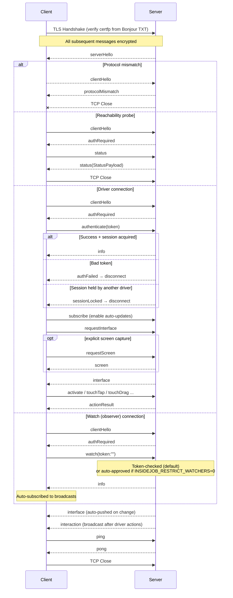
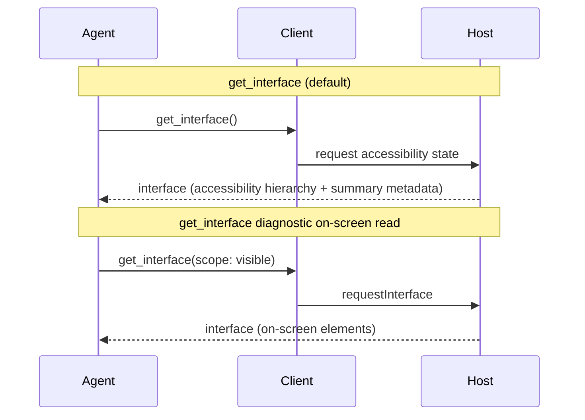
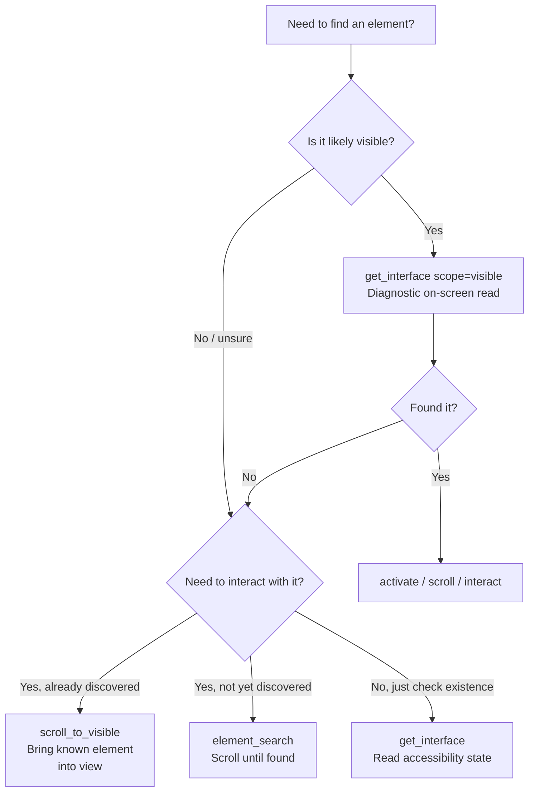
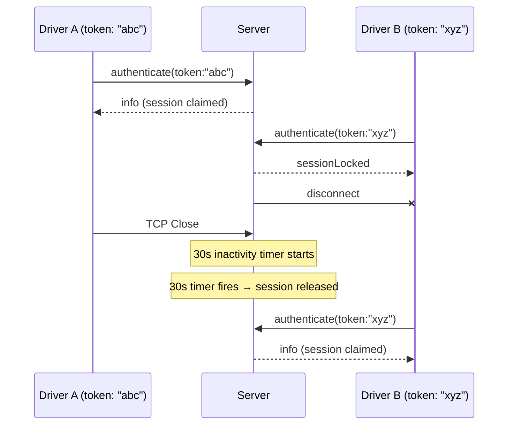
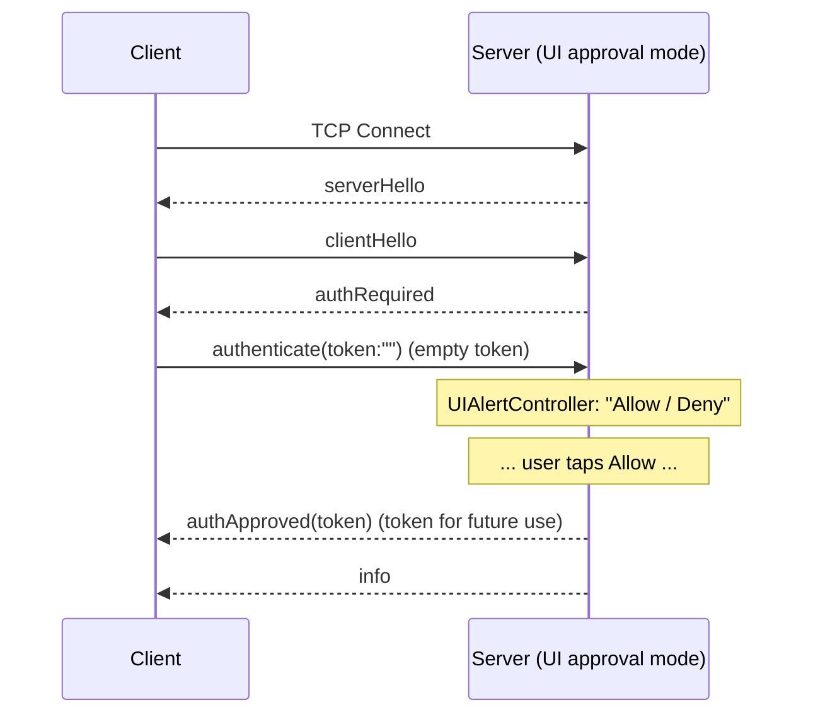

# Button Heist Wire Protocol Specification

This document specifies the communication protocol between the Button Heist iOS host and clients (ButtonHeist framework, CLI, Python scripts).

There is no separate wire protocol version. The handshake compares the server's and the client's `buttonHeistVersion` (CalVer, defined in `ButtonHeist/Sources/TheScore/Messages.swift`) for exact equality; any mismatch closes the connection with `protocolMismatch`. Wire-format changes are tied to a release bump via `scripts/release.sh`.

## Command Contract Layers

Button Heist has one product command contract: `TheFence.Command`. The CLI, session JSON, batches, and MCP tools adapt to those command names, for example `type_text`, `get_screen`, and `scroll_to_visible`.

This document describes the lower transport layer. Its envelope `type` values are wire message discriminators from TheScore, for example `typeText`, `requestScreen`, and `scrollToVisible`. They are stable wire names, but they are not the CLI/MCP command namespace. When the two differ, use TheFence command names at adapter boundaries and wire names only for raw transport messages.

## Transport

- **Layer**: TLS over TCP (Network.framework `NWProtocolTLS`)
- **Discovery**: Bonjour/mDNS (WiFi) or CoreDevice IPv6 tunnel (USB)
- **Service Type**: `_buttonheist._tcp`
- **Port**: OS-assigned (advertised via Bonjour)
- **Encoding**: Newline-delimited JSON (UTF-8)
- **Socket**: IPv6 dual-stack (accepts both IPv4 and IPv6)
- **Encryption**: TLS 1.2+ with self-signed ECDSA (P-256) certificates, verified via SHA-256 fingerprint pinning

## Discovery Methods

### WiFi (Bonjour)
The Button Heist iOS host advertises itself using Bonjour:
- **Domain**: `local.`
- **Type**: `_buttonheist._tcp`
- **Name**: `{AppName}#{instanceId}` (instanceId from `INSIDEJOB_ID` env var, or first 8 chars of a per-launch UUID)
- **TXT Record**:
  - `simudid` — Simulator UDID (only present when running in iOS Simulator, from `SIMULATOR_UDID` env var)
  - `installationid` — Stable per-installation identifier for device discovery and filtering
  - `instanceid` — Human-readable instance identifier
  - `devicename` — Human-readable device name
  - `sessionactive` — `"1"` when an active session exists, `"0"` otherwise. Used by clients to show session state pre-connection.
  - `certfp` — TLS certificate SHA-256 fingerprint, format: `sha256:<64 hex chars>`
  - `transport` — `"tls"`

The TXT record enables pre-connection device identification. Clients can match devices by simulator UDID, instance ID, or session state without establishing a TCP connection first. The `certfp` field enables trust-on-first-discovery (TOFU): clients verify the server's TLS certificate against this fingerprint during the TLS handshake. TLS is required — clients must refuse connections to servers that do not advertise a `certfp`.

> **Security note**: The `certfp` value is delivered via mDNS, which provides no integrity protection. An attacker on the same network segment could spoof Bonjour responses with a different fingerprint. This is acceptable for a local development tool but does not provide the same guarantees as a PKI-based certificate chain. The fingerprint prevents passive eavesdropping and verifies the server identity hasn't changed between discovery and connection.

### USB (CoreDevice IPv6 Tunnel)
When connected via USB, macOS creates an IPv6 tunnel:
- **Device address**: `fd{prefix}::1` (e.g., `fd9a:6190:eed7::1`)
- **Port**: OS-assigned (same port as WiFi, advertised via Bonjour)
- **Discovery**: `lsof -i -P -n | grep CoreDev`

## Connection Lifecycle



## Message Format

All messages are JSON objects terminated by a newline (`\n`). Envelopes use an explicit `type` discriminator and optional `payload`, rather than relying on Swift enum synthesis. The `Interface` payload follows the same rule — its `tree` uses a discriminator-keyed shape (`{"element": {...}}` / `{"container": {...}}`) with explicit field names, never the synthesized `_0` form.

### Request/Response Envelopes

All messages are wrapped in envelope types for request-response correlation. Examples below omit `requestId` unless the correlation behavior is relevant. Examples below use `<calver>` as a placeholder for the current `buttonHeistVersion` (e.g. `2026.05.09`); the literal string is whatever `scripts/release.sh` last bumped.

**Client → Server** (`RequestEnvelope`):
```json
{"buttonHeistVersion":"<calver>","requestId":"abc-123","type":"activate","payload":{"identifier":"loginButton"}}
```

**Server → Client** (`ResponseEnvelope`):
```json
{"buttonHeistVersion":"<calver>","requestId":"abc-123","type":"actionResult","payload":{"success":true,"method":"syntheticTap"}}
```

When `requestId` is present, the server echoes it in the corresponding response so the client can match request-response pairs. Push broadcasts such as interface updates and interaction events have `requestId: null`. Screenshots are never broadcast; `screen` is only returned for explicit `requestScreen` requests.

| Field | Type | Description |
|-------|------|-------------|
| `buttonHeistVersion` | `String` | Server's and client's `buttonHeistVersion`. Compared for exact equality at handshake; mismatch closes the connection with `protocolMismatch`. |
| `requestId` | `String?` | Optional correlation ID; echoed in the response |
| `type` | `String` | Explicit message discriminator |
| `payload` | `Object / String / null` | Optional message payload |
| `backgroundAccessibilityDelta` | `AccessibilityTrace.Delta?` | (Response only) Changes that occurred while the agent was thinking between requests. Present when the accessibility tree changed since the last response was sent. Nil when nothing changed. |

## Client → Server Messages

### clientHello

Version handshake sent immediately after `serverHello`.

```json
{"buttonHeistVersion":"<calver>","type":"clientHello"}
```

### authenticate

Authenticate with the server. Must be sent after a successful `clientHello` / `authRequired` handshake. Sending any other command before the handshake completes will result in immediate disconnection.

```json
{"buttonHeistVersion":"<calver>","type":"authenticate","payload":{"token":"your-secret-token"}}
```

**With driver identity:**
```json
{"buttonHeistVersion":"<calver>","type":"authenticate","payload":{"token":"your-secret-token","driverId":"agent-1"}}
```

The optional `driverId` field provides a unique driver identity for session locking — when set, it takes precedence over the token for distinguishing drivers. See [Session Locking](#session-locking) for details.

### requestInterface

Request current UI element interface. Returns only elements currently visible on screen.

```json
{"buttonHeistVersion":"<calver>","type":"requestInterface"}
```

### subscribe

Subscribe to automatic interface and interaction updates. Screenshots are never broadcast; request them explicitly with `requestScreen`.

```json
{"buttonHeistVersion":"<calver>","type":"subscribe"}
```

### unsubscribe

Unsubscribe from automatic updates.

```json
{"buttonHeistVersion":"<calver>","type":"unsubscribe"}
```

### activate

Activate an element (equivalent to VoiceOver double-tap). Uses the TouchInjector system with synthetic event fallback chain.

**By identifier:**
```json
{"buttonHeistVersion":"<calver>","type":"activate","payload":{"identifier":"loginButton"}}
```

**By matcher ordinal:**
```json
{"buttonHeistVersion":"<calver>","type":"activate","payload":{"label":"Save","traits":["button"],"ordinal":1}}
```

### touchTap

Tap at coordinates or on an element using Button Heist's synthetic touch engine.

**At coordinates:**
```json
{"buttonHeistVersion":"<calver>","type":"touchTap","payload":{"pointX":196.5,"pointY":659.0}}
```

**On element by identifier:**
```json
{"buttonHeistVersion":"<calver>","type":"touchTap","payload":{"elementTarget":{"identifier":"submitButton"}}}
```

### touchLongPress

Long press at coordinates or on an element.

```json
{"buttonHeistVersion":"<calver>","type":"touchLongPress","payload":{"pointX":100,"pointY":200,"duration":1.0}}
```

**On element (default 0.5s):**
```json
{"buttonHeistVersion":"<calver>","type":"touchLongPress","payload":{"elementTarget":{"identifier":"myButton"},"duration":0.5}}
```

### touchSwipe

Swipe between two points or in a direction from an element.

**With explicit coordinates:**
```json
{"buttonHeistVersion":"<calver>","type":"touchSwipe","payload":{"startX":200,"startY":400,"endX":200,"endY":100,"duration":0.15}}
```

**From element in direction:**
```json
{"buttonHeistVersion":"<calver>","type":"touchSwipe","payload":{"elementTarget":{"identifier":"list"},"direction":"up"}}
```

### touchDrag

Drag from one point to another (slower than swipe, for sliders/reordering).

**With explicit coordinates:**
```json
{"buttonHeistVersion":"<calver>","type":"touchDrag","payload":{"startX":100,"startY":200,"endX":300,"endY":200,"duration":0.5}}
```

**From element:**
```json
{"buttonHeistVersion":"<calver>","type":"touchDrag","payload":{"elementTarget":{"identifier":"slider"},"endX":300,"endY":200}}
```

### touchPinch

Pinch/zoom gesture centered at a point. Scale >1.0 zooms in, <1.0 zooms out.

```json
{"buttonHeistVersion":"<calver>","type":"touchPinch","payload":{"centerX":200,"centerY":300,"scale":2.0,"spread":100,"duration":0.5}}
```

**On element:**
```json
{"buttonHeistVersion":"<calver>","type":"touchPinch","payload":{"elementTarget":{"identifier":"mapView"},"scale":0.5}}
```

### touchRotate

Rotation gesture centered at a point. Angle in radians.

```json
{"buttonHeistVersion":"<calver>","type":"touchRotate","payload":{"centerX":200,"centerY":300,"angle":1.57,"radius":100,"duration":0.5}}
```

### touchTwoFingerTap

Two-finger tap at a point or element.

```json
{"buttonHeistVersion":"<calver>","type":"touchTwoFingerTap","payload":{"centerX":200,"centerY":300,"spread":40}}
```

### touchDrawPath

Draw along a path by tracing through a sequence of waypoints. Supports duration (seconds) or velocity (points/second) for timing.

```json
{"buttonHeistVersion":"<calver>","type":"touchDrawPath","payload":{"points":[{"x":100,"y":400},{"x":200,"y":300},{"x":300,"y":400}],"duration":1.0}}
```

**With velocity:**
```json
{"buttonHeistVersion":"<calver>","type":"touchDrawPath","payload":{"points":[{"x":100,"y":400},{"x":200,"y":300},{"x":300,"y":400}],"velocity":500}}
```

### touchDrawBezier

Draw along cubic bezier curves. The server samples the curves to a polyline, then traces using the drawPath engine.

```json
{"buttonHeistVersion":"<calver>","type":"touchDrawBezier","payload":{"startX":100,"startY":400,"segments":[{"cp1X":100,"cp1Y":200,"cp2X":300,"cp2Y":200,"endX":300,"endY":400}],"duration":1.0}}
```

**With samples and velocity:**
```json
{"buttonHeistVersion":"<calver>","type":"touchDrawBezier","payload":{"startX":100,"startY":400,"segments":[{"cp1X":100,"cp1Y":200,"cp2X":300,"cp2Y":200,"endX":300,"endY":400}],"samplesPerSegment":40,"velocity":300}}
```

### increment

Increment an adjustable element (e.g., slider, stepper). Calls `increment()` on the element's view.

**By identifier:**
```json
{"buttonHeistVersion":"<calver>","type":"increment","payload":{"identifier":"volumeSlider"}}
```

**By matcher ordinal:**
```json
{"buttonHeistVersion":"<calver>","type":"increment","payload":{"label":"Volume","traits":["adjustable"],"ordinal":0}}
```

### decrement

Decrement an adjustable element. Calls `decrement()` on the element's view.

**By identifier:**
```json
{"buttonHeistVersion":"<calver>","type":"decrement","payload":{"identifier":"volumeSlider"}}
```

### performCustomAction

Invoke a named custom action on an element. The action name must match one of the element's `actions`.

```json
{"buttonHeistVersion":"<calver>","type":"performCustomAction","payload":{"elementTarget":{"identifier":"myCell"},"actionName":"Delete"}}
```

### typeText

Type text character-by-character by injecting into the keyboard input system (via UIKeyboardImpl.sharedInstance), and/or delete characters. Returns the current text field value in the `actionResult`. Works in both software and hardware keyboard modes.

**Type text into a field (taps element to focus first):**
```json
{"buttonHeistVersion":"<calver>","type":"typeText","payload":{"text":"Hello","elementTarget":{"identifier":"nameField"}}}
```

**Delete 3 characters:**
```json
{"buttonHeistVersion":"<calver>","type":"typeText","payload":{"deleteCount":3,"elementTarget":{"identifier":"nameField"}}}
```

**Delete then retype (correction):**
```json
{"buttonHeistVersion":"<calver>","type":"typeText","payload":{"deleteCount":4,"text":"orld","elementTarget":{"identifier":"nameField"}}}
```

**Clear existing text then type new text:**
```json
{"buttonHeistVersion":"<calver>","type":"typeText","payload":{"clearFirst":true,"text":"replacement","elementTarget":{"identifier":"nameField"}}}
```

| Field | Type | Description |
|-------|------|-------------|
| `text` | `String?` | Text to type character-by-character |
| `deleteCount` | `Int?` | Number of delete key taps before typing |
| `clearFirst` | `Bool?` | Clear all existing text before typing (select-all + delete) |
| `elementTarget` | `ActionTarget?` | Element to tap for focus (also reads value back) |

### requestScreen

Request a PNG capture of the current screen.

```json
{"buttonHeistVersion":"<calver>","type":"requestScreen"}
```

### startRecording

Start recording the screen as H.264/MP4 video. Frames are captured at the configured FPS using `drawHierarchy` compositing (includes fingerprint overlays for taps and continuous gestures). `maxDuration` is the hard cap. `inactivityTimeout` is an optional early-stop hint: when provided, recording auto-stops after that many seconds with no screen changes and no real interactions (actions, touches, typing). When omitted, the inactivity timeout follows `maxDuration`. Pings and keepalive messages do not reset the inactivity timer.

```json
{"buttonHeistVersion":"<calver>","type":"startRecording","payload":{"fps":8,"scale":0.5,"maxDuration":60.0}}
```

All fields are optional — defaults are applied server-side.

| Field | Type | Description |
|-------|------|-------------|
| `fps` | `Int?` | Frames per second (1-15, default: 8) |
| `scale` | `Double?` | Resolution scale of native pixels (0.25-1.0, default: 1x point size) |
| `maxDuration` | `Double?` | Maximum recording duration in seconds (default: 60.0) |
| `inactivityTimeout` | `Double?` | Optional early-stop seconds of no activity; omitted follows `maxDuration` |

### stopRecording

Stop an active recording or retrieve a cached auto-finished recording. The server finalizes the video when needed and sends a `recording` message, or returns its own `No recording in progress` error when neither active nor cached recording data exists.

```json
{"buttonHeistVersion":"<calver>","type":"stopRecording"}
```

### scroll

Scroll near the resolved element by approximately one page in the given direction. Use `elementSearch` when the goal is to scan the screen for an unseen target.

**By identifier:**
```json
{"buttonHeistVersion":"<calver>","type":"scroll","payload":{"elementTarget":{"identifier":"buttonheist.longList.item-5"},"direction":"up"}}
```

**By matcher ordinal:**
```json
{"buttonHeistVersion":"<calver>","type":"scroll","payload":{"elementTarget":{"label":"Messages","ordinal":1},"direction":"down"}}
```

Directions: `"up"`, `"down"`, `"left"`, `"right"`, `"next"`, `"previous"`.

### scrollToVisible

Scroll a known element into view. Use this for elements returned by the current hierarchy or a recent action delta. For iterative discovery of an unseen or stale element, use `element_search`.

**Target fields:** `heistId`, or flat matcher fields `label`, `identifier`, `value`, `traits`, `excludeTraits`. Use `heistId` for known current-hierarchy elements. Matcher fields are decoded at the payload root and only resolve elements already present in the current hierarchy; there is no nested `match` object.

**By heistId:**
```json
{"buttonHeistVersion":"<calver>","type":"scrollToVisible","payload":{"heistId":"buttonheist.longList.colorPicker"}}
```

**By visible label:**
```json
{"buttonHeistVersion":"<calver>","type":"scrollToVisible","payload":{"label":"Color Picker"}}
```

**Visible compound matcher:**
```json
{"buttonHeistVersion":"<calver>","type":"scrollToVisible","payload":{"label":"Settings","traits":["header"]}}
```

**Response** is an `actionResult` with `method: "scrollToVisible"`:
```json
{"type":"actionResult","payload":{"success":true,"method":"scrollToVisible"}}
```

### elementSearch

Search for an element by scrolling the current screen. Uses an `ElementTarget` predicate — all specified matcher fields must match (AND semantics). Returns a `ScrollSearchResult` with diagnostics.

**Target fields:** `heistId`, or flat matcher fields `label`, `identifier`, `value`, `traits`, `excludeTraits`.

**Search options:** `direction` (`"down"`, `"up"`, `"left"`, `"right"`, default: `"down"`).

**By label:**
```json
{"buttonHeistVersion":"<calver>","type":"elementSearch","payload":{"label":"Color Picker"}}
```

**Compound matcher with direction:**
```json
{"buttonHeistVersion":"<calver>","type":"elementSearch","payload":{"label":"Settings","traits":["header"],"direction":"up"}}
```

**Response** carries the search result under `actionResult.payload`:
```json
{"type":"actionResult","payload":{"success":true,"method":"elementSearch","payload":{"kind":"scrollSearch","data":{"scrollCount":3,"uniqueElementsSeen":25,"totalItems":80,"exhaustive":false,"foundElement":{...}}}}}
```

### scrollToEdge

Scroll near the resolved element to an edge (top, bottom, left, right). The target must be in scrollable content that supports the requested axis.

**By identifier:**
```json
{"buttonHeistVersion":"<calver>","type":"scrollToEdge","payload":{"elementTarget":{"identifier":"buttonheist.longList.item-0"},"edge":"bottom"}}
```

Edges: `"top"`, `"bottom"`, `"left"`, `"right"`.

### explore

Accessibility-state discovery. Returns the accessible hierarchy Button Heist can discover for the current screen, including content discovered through scrollable containers.

No payload required.

```json
{"buttonHeistVersion":"<calver>","type":"explore"}
```

Returns an `actionResult` with `method: "explore"` and a `payload` of `{"kind": "explore", "data": {...}}` containing the element list and summary discovery statistics.

> **Note**: `explore` is not exposed as a standalone CLI/MCP command. It is dispatched internally by the default `get_interface` read. See [Element Discovery](#element-discovery) for usage guidance.

### editAction

Perform a standard edit action via the responder chain.

```json
{"buttonHeistVersion":"<calver>","type":"editAction","payload":{"action":"copy"}}
```

Valid actions: `"copy"`, `"paste"`, `"cut"`, `"select"`, `"selectAll"`.

### setPasteboard

Write text to the general pasteboard from within the app. Content written by the app itself does not trigger the iOS "Allow Paste" dialog when subsequently read.

```json
{"buttonHeistVersion":"<calver>","type":"setPasteboard","payload":{"text":"clipboard content"}}
```

| Field | Type | Description |
|-------|------|-------------|
| `text` | `String` | Text to write to the pasteboard (required) |

### getPasteboard

Read text from the general pasteboard.

```json
{"buttonHeistVersion":"<calver>","type":"getPasteboard"}
```

No payload. Returns an `actionResult` with `method: "getPasteboard"` and the pasteboard text in `value`.

### resignFirstResponder

Dismiss the keyboard by resigning first responder.

```json
{"buttonHeistVersion":"<calver>","type":"resignFirstResponder"}
```

### waitForChange

Wait for the UI to change in a way that matches an expectation. With `expect`, the server checks the current settled state first, then watches settled changes until the expectation is true. With no expectation, returns on any post-baseline tree change.

```json
{"buttonHeistVersion":"<calver>","type":"waitForChange","payload":{"expect":{"type":"screen_changed"},"timeout":10}}
```

| Field | Type | Description |
|-------|------|-------------|
| `expect` | `ActionExpectation?` | The change to wait for — object form only, e.g. `{"type":"screen_changed"}`. When nil, any tree change satisfies. |
| `timeout` | `Double?` | Max wait time in seconds (default: 10, max: 30) |

Returns an `actionResult` with `method: "waitForChange"` and an `accessibilityDelta` describing what changed. If the current state already satisfies a state predicate such as `element_appeared`, `element_disappeared`, or `element_updated` with `newValue`, the result can succeed with `noChange`. On timeout, returns `success: false` with `errorKind: "timeout"`.

For `waitForChange`, `element_disappeared` is a current-state predicate: it is met when no current settled element matches the predicate. It does not require proving that the element existed earlier and was removed.

**Fast paths**: if the current state already satisfies the expectation, returns immediately. If the tree already changed since the last response (while the agent was thinking), returns immediately with the accumulated delta.

**Example flow**: `activate pay_now_button expect="screen_changed"` → delta shows spinner, expectation not met → `waitForChange expect="screen_changed" timeout=10` → receipt screen arrives, expectation met.

### waitFor

Wait for an element matching a predicate to appear (or disappear). Uses settle-event polling, not busy-waiting.

```json
{"buttonHeistVersion":"<calver>","type":"waitFor","payload":{"label":"Loading","absent":true,"timeout":5.0}}
```

| Field | Type | Description |
|-------|------|-------------|
| `heistId` | `String?` | Current-hierarchy element handle returned by `get_interface` or an action delta |
| `label` / `identifier` / `value` / `traits` / `excludeTraits` | matcher fields | Predicate describing the element to wait for, decoded flat at the payload root |
| `absent` | `Bool?` | When `true`, wait for element to NOT exist (default: `false`) |
| `timeout` | `Double?` | Max wait time in seconds (default: 10, max: 30) |

Returns an `actionResult` with `method: "waitFor"` and an `accessibilityDelta` containing the settled interface.

### ping

Keepalive ping.

```json
{"buttonHeistVersion":"<calver>","type":"ping"}
```

### status

Lightweight status probe. Unlike normal driver commands, this message may be sent before authentication and does not claim a session. It is intended for reachability checks and identity discovery.

```json
{"buttonHeistVersion":"<calver>","type":"status"}
```

### watch

Connect as a read-only observer. Sent instead of `authenticate` after receiving `authRequired`. Observers receive interface and interaction broadcasts but cannot send commands or claim a session.

```json
{"buttonHeistVersion":"<calver>","type":"watch","payload":{"token":""}}
```

By default, watch connections require a valid token (same as drivers). Set `INSIDEJOB_RESTRICT_WATCHERS=0` to allow unauthenticated observers.

| Field | Type | Description |
|-------|------|-------------|
| `token` | `String` | Auth token (required by default; empty string allowed when `INSIDEJOB_RESTRICT_WATCHERS=0`) |

## Server → Client Messages

### serverHello

Sent immediately on connection. The client must verify `buttonHeistVersion` and respond with `clientHello` carrying its own `buttonHeistVersion`.

```json
{"buttonHeistVersion":"<calver>","requestId":null,"type":"serverHello"}
```

### protocolMismatch

Sent when the peer's `buttonHeistVersion` does not exactly match the server's. The server closes the connection immediately after sending this message.

```json
{"buttonHeistVersion":"2026.05.09","requestId":null,"type":"protocolMismatch","payload":{"serverButtonHeistVersion":"2026.05.09","clientButtonHeistVersion":"2026.05.08"}}
```

### authRequired

Sent after a successful hello/version handshake. Indicates the client must authenticate before any other interaction.

```json
{"buttonHeistVersion":"<calver>","requestId":null,"type":"authRequired"}
```

### error (auth failure)

Auth failures use the same `error` wire type as everything else; `kind: "authFailure"` distinguishes them. The server disconnects shortly after.

```json
{"buttonHeistVersion":"<calver>","type":"error","payload":{"kind":"authFailure","message":"Invalid token"}}
```

### authApproved

Sent when a connection is approved via the on-device UI (see [UI Approval Flow](#ui-approval-flow)). Contains the auth token for future reconnections.

```json
{"buttonHeistVersion":"<calver>","type":"authApproved","payload":{"token":"auto-generated-uuid-token"}}
```

After receiving `authApproved`, the client should store the token and use it for future `authenticate` messages to skip the approval flow.

### sessionLocked

Sent when the server's session is held by a different driver. The server disconnects the client shortly after sending this message. See [Session Locking](#session-locking).

```json
{"buttonHeistVersion":"<calver>","type":"sessionLocked","payload":{"message":"Session is locked by another driver","activeConnections":1}}
```

| Field | Type | Description |
|-------|------|-------------|
| `message` | `String` | Human-readable description of why the session is locked |
| `activeConnections` | `Int` | Number of active connections in the current session |

### info

Sent after successful authentication. Contains device and app metadata.

```json
{"buttonHeistVersion":"<calver>","type":"info","payload":{
  "appName":"MyApp",
  "bundleIdentifier":"com.example.myapp",
  "deviceName":"iPhone 15 Pro",
  "systemVersion":"17.0",
  "screenWidth":393.0,
  "screenHeight":852.0,
  "instanceId":"A1B2C3D4-E5F6-7890-ABCD-EF1234567890",
  "instanceIdentifier":"my-instance",
  "listeningPort":52341,
  "simulatorUDID":"DEADBEEF-1234-5678-9ABC-DEF012345678",
  "vendorIdentifier":null,
  "tlsActive":true
}}
```

### status

Sent in response to a `status` probe. This response is valid before authentication and returns app identity plus session availability without claiming the session.

```json
{"buttonHeistVersion":"<calver>","type":"status","payload":{
  "identity":{
    "appName":"MyApp",
    "bundleIdentifier":"com.example.myapp",
    "appBuild":"42",
    "deviceName":"iPhone 15 Pro",
    "systemVersion":"18.0",
    "buttonHeistVersion":"0.0.1"
  },
  "session":{
    "active":false,
    "watchersAllowed":false,
    "activeConnections":0
  }
}}
```

### interface

UI element interface. Public JSON output uses a tree structure. Summary detail emits the identity fields per element (`heistId`, `label`, `value`, `identifier`, `traits`, meaningful `actions`); full detail adds VoiceOver `hint`, `customContent`, frames, and activation points.

```json
{"buttonHeistVersion":"<calver>","type":"interface","payload":{
  "screenDescription":"Welcome — 1 button",
  "timestamp":"2026-02-03T10:30:45.123Z",
  "tree":[
    {"element":{
      "heistId":"staticText_welcome",
      "label":"Welcome",
      "traits":["staticText"],
      "frameX":16.0,
      "frameY":100.0,
      "frameWidth":361.0,
      "frameHeight":24.0,
      "activationPointX":196.5,
      "activationPointY":112.0
    }},
    {"container":{
      "type":"semanticGroup",
      "label":"Form",
      "frameX":0.0,
      "frameY":88.0,
      "frameWidth":393.0,
      "frameHeight":600.0,
      "children":[{"element":{
        "heistId":"button_sign_in",
        "label":"Sign In",
        "identifier":"signInButton",
        "traits":["button"],
        "frameX":16.0,
        "frameY":140.0,
        "frameWidth":361.0,
        "frameHeight":44.0,
        "activationPointX":196.5,
        "activationPointY":162.0
      }}]
    }}
  ]
}}
```

The `tree` is the canonical wire shape — every element appears exactly once at its tree position; there is no parallel flat array. Leaves carry the full `HeistElement` payload directly under the `element` key (no `order` field, no `_0` wrapper).

### actionResult

Response to `activate`, `one_finger_tap`, `increment`, `decrement`, `typeText`, `performCustomAction`, `handleAlert`, `setPasteboard`, `getPasteboard`, `scroll`, `scrollToVisible`, `elementSearch`, or `scrollToEdge` commands. Also returned by the default `get_interface` accessibility-state read.

```json
{"buttonHeistVersion":"<calver>","type":"actionResult","payload":{
  "success":true,
  "method":"syntheticTap",
  "message":null
}}
```

For `typeText`, the response includes the current text field value:
```json
{"buttonHeistVersion":"<calver>","type":"actionResult","payload":{
  "success":true,
  "method":"typeText",
  "value":"Hello World"
}}
```

Possible methods:
- `syntheticTap` - Tap synthesized by Button Heist
- `syntheticLongPress` - Long press synthesized by Button Heist
- `syntheticSwipe` - Swipe synthesized by Button Heist
- `syntheticDrag` - Drag synthesized by Button Heist
- `syntheticPinch` - Pinch gesture synthesized by Button Heist
- `syntheticRotate` - Rotation gesture synthesized by Button Heist
- `syntheticTwoFingerTap` - Two-finger tap synthesized by Button Heist
- `syntheticDrawPath` - Path drawing synthesized by Button Heist
- `activate` - Element's `activate()` was used
- `increment` - Element's `increment()` was called
- `decrement` - Element's `decrement()` was called
- `typeText` - Text injected via UIKeyboardImpl
- `customAction` - Named custom action was invoked
- `editAction` - Edit action performed via responder chain
- `handleAlert` - System alert handled via IOHIDEventSystemClient
- `setPasteboard` - Text written to general pasteboard
- `getPasteboard` - Text read from general pasteboard
- `resignFirstResponder` - First responder resigned (keyboard dismissed)
- `waitForIdle` - Wait-for-idle completed
- `waitForChange` - Wait-for-change completed (expectation met or timeout)
- `waitFor` - Wait-for element completed
- `scroll` - Scroll view scrolled by one page
- `scrollToVisible` - Known element was scrolled into view
- `elementSearch` - Iterative scroll search found (or failed to find) element matching predicate
- `scrollToEdge` - Scroll view scrolled to an edge
- `explore` - Accessibility-state discovery completed
- `elementNotFound` - Target element could not be found
- `elementDeallocated` - Element's underlying view was deallocated

The optional `message` field provides additional context, especially for failures:
```json
{"buttonHeistVersion":"<calver>","type":"actionResult","payload":{
  "success":false,
  "method":"elementNotFound",
  "message":"Element is disabled (has 'notEnabled' trait)"
}}
```

### screen

PNG capture of the current screen.

```json
{"buttonHeistVersion":"<calver>","type":"screen","payload":{
  "pngData":"iVBORw0KGgo...",
  "width":393.0,
  "height":852.0,
  "timestamp":"2026-02-03T10:30:45.123Z"
}}
```

The `pngData` field is base64-encoded PNG image data.

### pong

Response to `ping`.

```json
{"buttonHeistVersion":"<calver>","type":"pong"}
```

### recordingStarted

Acknowledgement that recording has begun.

```json
{"buttonHeistVersion":"<calver>","type":"recordingStarted"}
```

### recordingStopped

Lightweight notification that recording stopped without including the video payload. This is sent for automatic stops such as inactivity, max duration, or file size limit. The completed video is cached server-side and returned by the next `stopRecording` request.

```json
{"buttonHeistVersion":"<calver>","type":"recordingStopped"}
```

### recording

Completed screen recording. Contains the H.264/MP4 video as base64-encoded data. Sent as the response to `stopRecording`, not as an unsolicited broadcast.

```json
{"buttonHeistVersion":"<calver>","type":"recording","payload":{
  "videoData":"AAAAIGZ0eXBpc29t...",
  "width":390,
  "height":844,
  "duration":5.2,
  "frameCount":42,
  "fps":8,
  "startTime":"2026-02-24T10:30:00.000Z",
  "endTime":"2026-02-24T10:30:05.200Z",
  "stopReason":"inactivity",
  "interactionLog":[
    {
      "timestamp":1.2,
      "command":{"type":"activate","payload":{"identifier":"loginButton"}},
      "result":{"success":true,"method":"syntheticTap","accessibilityDelta":{"kind":"elementsChanged","elementCount":12,"edits":{"updated":[{"heistId":"button·loginButton","changes":[{"property":"value","old":null,"new":"Loading..."}]}]}}}
    }
  ]
}}
```

The `videoData` field is base64-encoded MP4 video data. The raw file size is capped at 7MB to stay within the 10MB wire protocol buffer limit after base64 encoding. The optional `interactionLog` field contains an ordered array of `InteractionEvent` objects capturing each command, result, and interface delta during the recording. It is `null` or absent when no interactions occurred.

Stop reasons: `"manual"`, `"inactivity"`, `"maxDuration"`, `"fileSizeLimit"`.

### error (recording failure)

Recording-pipeline failures use the same `error` wire type with `kind: "recording"`.

```json
{"buttonHeistVersion":"<calver>","type":"error","payload":{"kind":"recording","message":"AVAssetWriter failed to start"}}
```

### interaction

Broadcast to all subscribed clients (including observers) after a driver performs an action. Contains the command, result, and interface delta.

```json
{"buttonHeistVersion":"<calver>","type":"interaction","payload":{"timestamp":1709472045.123,"command":{"type":"activate","payload":{"identifier":"loginButton"}},"result":{"success":true,"method":"syntheticTap","accessibilityDelta":{"kind":"elementsChanged","elementCount":12,"edits":{"updated":[{"heistId":"button·loginButton","changes":[{"property":"value","old":null,"new":"Loading..."}]}]}}}}}
```

| Field | Type | Description |
|-------|------|-------------|
| `timestamp` | `Double` | Unix timestamp of the interaction |
| `command` | `ClientMessage` | The command that triggered the interaction |
| `result` | `ActionResult` | The result of the action (includes `accessibilityDelta` when the UI hierarchy changed) |

### error

Server-broadcast error. The payload is a `ServerError { kind, message }` so callers can route on `kind` instead of pattern-matching message text. Auth failures use `kind: "authFailure"`, recording failures use `kind: "recording"`, everything else is `"general"`.

```json
{"buttonHeistVersion":"<calver>","type":"error","payload":{"kind":"general","message":"Root view not available"}}
```

## Element Discovery



Three ways to find elements, each suited to a different situation:

| Command | What it returns | When to use |
|---------|----------------|-------------|
| `get_interface` | Current app accessibility state | You need to know what exists on the current screen before acting. Returns the `interface` response with discovered elements populated. |
| `get_interface` with `scope: "visible"` | On-screen elements only | Diagnostic reads. You need to verify what is currently drawn or inspect geometry after an execution step. |
| `scroll_to_visible` | Brings a known element into view | You have a visible target or a `heistId` still valid in the current hierarchy. Changes the scroll position. |
| `element_search` | Scrolls until the target element is found, leaves it visible | You have not discovered the element yet and need to search scrollable content. |

### Choosing between get_interface, element_search, and scroll_to_visible

- **`get_interface`** is a read operation. Use it when you need the current screen's accessibility state before committing to an interaction.

- **`scroll_to_visible`** scrolls to a known target and leaves it visible so you can interact with the element. Use it when the target is visible now or when a `heistId` is still valid in the current hierarchy.

- **`element_search`** scrolls while looking for a matcher and stops when the target is found. Use it when the element has not been seen yet.



### When you don't need either

Most agent workflows start from the semantic interface and use diagnostic on-screen reads sparingly. The typical pattern is:

1. `get_interface` — read the current app accessibility state
2. `activate` / `scroll` / `swipe` — interact with returned elements
3. `element_search` — find a specific unseen element when needed
4. `scroll_to_visible` — return to a known `heistId` while it is still valid in the current hierarchy

Use `get_interface` with `scope: "visible"` only when you explicitly need the current on-screen parse, such as checking geometry after a scroll or gesture.

## Data Types

### ServerInfo

The product version is carried by `ResponseEnvelope.buttonHeistVersion` and is
not duplicated on `ServerInfo`.

| Field | Type | Description |
|-------|------|-------------|
| `appName` | `String` | App display name |
| `bundleIdentifier` | `String` | App bundle identifier |
| `deviceName` | `String` | Device name (e.g., "iPhone 15 Pro") |
| `systemVersion` | `String` | iOS version (e.g., "17.0") |
| `screenWidth` | `Double` | Screen width in points |
| `screenHeight` | `Double` | Screen height in points |
| `instanceId` | `String?` | Per-launch session UUID |
| `instanceIdentifier` | `String?` | Human-readable instance identifier from `INSIDEJOB_ID` env var (falls back to shortId) |
| `listeningPort` | `UInt16?` | Port the server is listening on |
| `simulatorUDID` | `String?` | Simulator UDID when running in iOS Simulator (nil on physical devices) |
| `vendorIdentifier` | `String?` | `UIDevice.identifierForVendor` UUID string (nil in simulator) |
| `tlsActive` | `Bool?` | Whether TLS transport encryption is active |

### Interface

| Field | Type | Description |
|-------|------|-------------|
| `screenDescription` | `String` | Deterministic one-line screen summary (e.g. `"Sign In — 1 text field, 1 password field, 3 buttons"`) |
| `timestamp` | `ISO8601 Date` | When interface was captured |
| `tree` | `[InterfaceNode]` | Canonical tree of leaf elements and grouping containers. Every element appears exactly once at its tree position; there is no parallel flat array on the wire. |

### HeistElement

| Field | Type | Description |
|-------|------|-------------|
| `heistId` | `String` | Current-hierarchy element handle returned by Button Heist. Use it for immediate follow-up actions; use matcher fields for durable flows and recordings. |
| `label` | `String?` | Label |
| `value` | `String?` | Current value (for controls) |
| `identifier` | `String?` | Identifier |
| `hint` | `String?` | Accessibility hint (full detail only) |
| `traits` | `[String]` | Trait names (e.g., `"button"`, `"adjustable"`, `"staticText"`, `"backButton"`) |
| `frameX` | `Double` | Frame origin X in points (full detail only) |
| `frameY` | `Double` | Frame origin Y in points (full detail only) |
| `frameWidth` | `Double` | Frame width in points (full detail only) |
| `frameHeight` | `Double` | Frame height in points (full detail only) |
| `activationPointX` | `Double` | Activation point X (full detail only) |
| `activationPointY` | `Double` | Activation point Y (full detail only) |
| `customContent` | `[HeistCustomContent]?` | Custom accessibility content (full detail only) |
| `actions` | `[ElementAction]?` | Non-obvious actions only. Omitted when all actions are implied by traits (`activate` for buttons, `increment`/`decrement` for adjustable). Custom actions always included. |

### InterfaceNode

Recursive node in the canonical interface tree. Each node is a singleton object whose key discriminates the case:

- `{"element":{...HeistElement}}` — Leaf node carrying a full `HeistElement` payload (no `order`, no parallel flat array — the leaf's tree position is its order).
- `{"container":{type, …ContainerInfo, "children":[InterfaceNode]}}` — Container node carrying `ContainerInfo` fields (type discriminator + payload + frame) inline alongside `children`.

### ContainerInfo

The container payload is a flat object keyed by the discriminator `type`. Type-specific fields live at the same level alongside the frame:

| Field | Type | Always present | Description |
|-------|------|----------------|-------------|
| `type` | `String` | Yes | Discriminator; one of the container types listed below |
| `stableId` | `String?` | When available | Stable container identity used by tree deltas |
| `isModalBoundary` | `Bool` | Only when `true` | Parser-reported accessibility modal boundary marker |
| `frameX` | `Double` | Yes | Frame origin X in points |
| `frameY` | `Double` | Yes | Frame origin Y in points |
| `frameWidth` | `Double` | Yes | Frame width in points |
| `frameHeight` | `Double` | Yes | Frame height in points |
| `children` | `[InterfaceNode]` | Yes (inside `InterfaceNode.container`) | Child nodes |
| `label` | `String?` | `semanticGroup` only | Container label |
| `value` | `String?` | `semanticGroup` only | Container value |
| `identifier` | `String?` | `semanticGroup` only | Container identifier |
| `contentWidth` | `Double` | `scrollable` only | Scroll content size width |
| `contentHeight` | `Double` | `scrollable` only | Scroll content size height |
| `rowCount` | `Int` | `dataTable` only | Number of rows |
| `columnCount` | `Int` | `dataTable` only | Number of columns |

Container types:
- `"semanticGroup"` — Semantic grouping (with optional `label`/`value`/`identifier`)
- `"list"` — List container (affects rotor navigation)
- `"landmark"` — Landmark container (affects rotor navigation)
- `"dataTable"` — Data table container; carries `rowCount` and `columnCount`
- `"tabBar"` — Tab bar container
- `"scrollable"` — Scrollable region; carries `contentWidth` and `contentHeight`

### ElementTarget

| Field | Type | Description |
|-------|------|-------------|
| `heistId` | `String?` | Current-hierarchy element handle returned by `get_interface` or an action delta |
| `label` / `identifier` / `value` / `traits` / `excludeTraits` | matcher fields | Predicate matcher fields for accessibility-based resolution, decoded flat at the target root |
| `ordinal` | `Int?` | 0-based index to select among multiple matcher results. Without ordinal, multiple matches return an ambiguity error. |

Two resolution strategies. Resolution priority: `heistId` > matcher fields. Use handles for the current hierarchy; use matcher fields for durable flows. At least one identity field should be provided.

### TouchTapTarget

| Field | Type | Description |
|-------|------|-------------|
| `elementTarget` | `ActionTarget?` | Target element (taps at activation point) |
| `pointX` | `Double?` | Explicit X coordinate |
| `pointY` | `Double?` | Explicit Y coordinate |

### LongPressTarget

| Field | Type | Description |
|-------|------|-------------|
| `elementTarget` | `ActionTarget?` | Target element |
| `pointX` | `Double?` | Explicit X coordinate |
| `pointY` | `Double?` | Explicit Y coordinate |
| `duration` | `Double` | Press duration in seconds (default: 0.5) |

### SwipeTarget

| Field | Type | Description |
|-------|------|-------------|
| `elementTarget` | `ActionTarget?` | Start from element's activation point |
| `startX` | `Double?` | Start X coordinate |
| `startY` | `Double?` | Start Y coordinate |
| `endX` | `Double?` | End X coordinate |
| `endY` | `Double?` | End Y coordinate |
| `direction` | `String?` | Swipe direction: "up", "down", "left", "right" |
| `duration` | `Double?` | Duration in seconds (default: 0.15) |
| `start` | `UnitPoint?` | Unit-point start relative to element frame (0–1) |
| `end` | `UnitPoint?` | Unit-point end relative to element frame (0–1) |

### DragTarget

| Field | Type | Description |
|-------|------|-------------|
| `elementTarget` | `ActionTarget?` | Start from element's activation point |
| `startX` | `Double?` | Start X coordinate |
| `startY` | `Double?` | Start Y coordinate |
| `endX` | `Double` | End X coordinate |
| `endY` | `Double` | End Y coordinate |
| `duration` | `Double?` | Duration in seconds (default: 0.5) |

### PinchTarget

| Field | Type | Description |
|-------|------|-------------|
| `elementTarget` | `ActionTarget?` | Center on element's activation point |
| `centerX` | `Double?` | Center X coordinate |
| `centerY` | `Double?` | Center Y coordinate |
| `scale` | `Double` | Scale factor (>1.0 zoom in, <1.0 zoom out) |
| `spread` | `Double?` | Initial finger spread from center (default: 100pt) |
| `duration` | `Double?` | Duration in seconds (default: 0.5) |

### RotateTarget

| Field | Type | Description |
|-------|------|-------------|
| `elementTarget` | `ActionTarget?` | Center on element's activation point |
| `centerX` | `Double?` | Center X coordinate |
| `centerY` | `Double?` | Center Y coordinate |
| `angle` | `Double` | Rotation angle in radians |
| `radius` | `Double?` | Distance from center to each finger (default: 100pt) |
| `duration` | `Double?` | Duration in seconds (default: 0.5) |

### TwoFingerTapTarget

| Field | Type | Description |
|-------|------|-------------|
| `elementTarget` | `ActionTarget?` | Center on element's activation point |
| `centerX` | `Double?` | Center X coordinate |
| `centerY` | `Double?` | Center Y coordinate |
| `spread` | `Double?` | Distance between fingers (default: 40pt) |

### DrawPathTarget

| Field | Type | Description |
|-------|------|-------------|
| `points` | `[PathPoint]` | Array of waypoints to trace through (minimum 2) |
| `duration` | `Double?` | Total duration in seconds (mutually exclusive with velocity) |
| `velocity` | `Double?` | Speed in points per second (mutually exclusive with duration) |

### PathPoint

| Field | Type | Description |
|-------|------|-------------|
| `x` | `Double` | X coordinate in screen points |
| `y` | `Double` | Y coordinate in screen points |

### DrawBezierTarget

| Field | Type | Description |
|-------|------|-------------|
| `startX` | `Double` | Starting X coordinate |
| `startY` | `Double` | Starting Y coordinate |
| `segments` | `[BezierSegment]` | Array of cubic bezier segments |
| `samplesPerSegment` | `Int?` | Points to sample per segment (default: 20) |
| `duration` | `Double?` | Total duration in seconds (mutually exclusive with velocity) |
| `velocity` | `Double?` | Speed in points per second (mutually exclusive with duration) |

### BezierSegment

| Field | Type | Description |
|-------|------|-------------|
| `cp1X` | `Double` | First control point X |
| `cp1Y` | `Double` | First control point Y |
| `cp2X` | `Double` | Second control point X |
| `cp2Y` | `Double` | Second control point Y |
| `endX` | `Double` | Endpoint X |
| `endY` | `Double` | Endpoint Y |

### TypeTextTarget

| Field | Type | Description |
|-------|------|-------------|
| `text` | `String?` | Text to type character-by-character |
| `deleteCount` | `Int?` | Number of delete key taps before typing |
| `elementTarget` | `ActionTarget?` | Element to tap for focus and value readback |

At least `text` or `deleteCount` must be provided. If `elementTarget` is provided, it is tapped first to bring up the keyboard, and its value is read back after the operation.

### CustomActionTarget

| Field | Type | Description |
|-------|------|-------------|
| `elementTarget` | `ActionTarget` | Target element |
| `actionName` | `String` | Name of the custom action |

### EditActionTarget

| Field | Type | Description |
|-------|------|-------------|
| `action` | `String` | Edit action: `"copy"`, `"paste"`, `"cut"`, `"select"`, `"selectAll"` |

### ScrollDirection

Enum values: `"up"`, `"down"`, `"left"`, `"right"`, `"next"`, `"previous"`.

- `up` — Scroll up to reveal content above the visible area
- `down` — Scroll down to reveal content below the visible area
- `left` — Scroll left to reveal content to the left
- `right` — Scroll right to reveal content to the right
- `next` — Scroll to next page (equivalent to down for vertical content)
- `previous` — Scroll to previous page (equivalent to up for vertical content)

### ScrollTarget

| Field | Type | Description |
|-------|------|-------------|
| `elementTarget` | `ActionTarget?` | Element that anchors the scroll action |
| `direction` | `ScrollDirection` | Scroll direction |

### ScrollEdge

Enum values: `"top"`, `"bottom"`, `"left"`, `"right"`.

### ScrollToEdgeTarget

| Field | Type | Description |
|-------|------|-------------|
| `elementTarget` | `ActionTarget?` | Element that anchors the edge scroll action |
| `edge` | `ScrollEdge` | Which edge to scroll to |

### ElementMatcher

Predicate for matching elements in the accessibility tree. All specified fields must match (AND semantics). Used by `elementSearch`, `waitFor`, `get_interface` filtering, and action commands through flat `ElementTarget` matcher fields.

| Field | Type | Description |
|-------|------|-------------|
| `label` | `String?` | Exact match on accessibility label |
| `identifier` | `String?` | Exact match on accessibility identifier |
| `value` | `String?` | Exact match on accessibility value |
| `traits` | `[String]?` | All listed traits must be present on the element |
| `excludeTraits` | `[String]?` | None of the listed traits may be present |

### ScrollToVisibleTarget

| Field | Type | Description |
|-------|------|-------------|
| `heistId` | `String?` | Known current-hierarchy handle to scroll into view |
| `label` / `identifier` / `value` / `traits` / `excludeTraits` | matcher fields | Flat matcher fields for elements already present in the current hierarchy |

### ScrollSearchDirection

| Value | Description |
|-------|-------------|
| `"down"` | Scroll down (default) |
| `"up"` | Scroll up |
| `"left"` | Scroll left |
| `"right"` | Scroll right |

### ScrollSearchResult

Diagnostic output from `elementSearch`, included on every `actionResult` for that command.

| Field | Type | Description |
|-------|------|-------------|
| `scrollCount` | `Int` | Number of scroll steps performed |
| `uniqueElementsSeen` | `Int` | Number of distinct elements seen across all scroll positions (tracked via `StableKey`) |
| `totalItems` | `Int?` | Total item count from UITableView/UICollectionView data source (nil if not a collection) |
| `exhaustive` | `Bool` | `true` if `uniqueElementsSeen >= totalItems` — all items in the collection were visited |
| `foundElement` | `HeistElement?` | The matched element (nil on failure) |

### WaitForIdleTarget

| Field | Type | Description |
|-------|------|-------------|
| `timeout` | `Double?` | Maximum wait time in seconds (default: 5.0, max: 60.0) |

### WaitForTarget

| Field | Type | Description |
|-------|------|-------------|
| `heistId` | `String?` | Current-hierarchy element handle, decoded flat at the payload root |
| `label` / `identifier` / `value` / `traits` / `excludeTraits` | matcher fields | Predicate fields for accessibility-based resolution, decoded flat at the payload root |
| `ordinal` | `Int?` | 0-based index to select among multiple matcher results |
| `absent` | `Bool?` | When `true`, wait for element to NOT exist (default: `false`) |
| `timeout` | `Double?` | Max wait time in seconds (default: 10, max: 30) |

### UnitPoint

A point in unit coordinates (0–1) relative to an element's accessibility frame. `(0, 0)` is top-left, `(1, 1)` is bottom-right.

| Field | Type | Description |
|-------|------|-------------|
| `x` | `Double` | Horizontal position (0 = left, 1 = right) |
| `y` | `Double` | Vertical position (0 = top, 1 = bottom) |

### ActionResult

| Field | Type | Description |
|-------|------|-------------|
| `success` | `Bool` | Whether action succeeded |
| `method` | `String` | How action was performed (see method values above) |
| `message` | `String?` | Additional context or error description |
| `errorKind` | `String?` | Typed error classification: `"elementNotFound"`, `"timeout"`, `"unsupported"`, `"inputError"`, `"validationError"`, `"actionFailed"`, `"authFailure"`, `"recording"`, `"general"`. Nil on success. |
| `payload` | `ResultPayload?` | Command-specific payload as a tagged union: `{"kind": "value", "data": "..."}` for `typeText` / `setPasteboard` / `getPasteboard`; `{"kind": "scrollSearch", "data": {...}}` for `elementSearch`; `{"kind": "explore", "data": {...}}` for `explore`. Omitted when no command-specific payload applies. |
| `accessibilityDelta` | `AccessibilityTrace.Delta?` | Compact delta describing what changed after the action |
| `animating` | `Bool?` | `true` if UI was still animating when result was produced; `nil` means idle |
| `screenName` | `String?` | Label of the first header element in the post-action snapshot (screen name hint) |
| `screenId` | `String?` | Slugified screen name for machine use (e.g. `"controls_demo"`) |

### ActionExpectation (Fence-level)

Outcome signal classifiers attached to Fence requests via the `expect` field. `ActionExpectation` is a wire-protocol value with a stable, documented JSON shape as of protocol `7.0`.

Every action implicitly checks delivery (`success == true`). If delivery fails, the response includes an `expectation` object with `met: false` and `status: "expectation_failed"` — no `expect` field needed.

The `expect` field classifies what kind of outcome the caller was going for. Expectations follow a **"say what you know"** design: provide only the fields you care about, omit what you don't. Omitted fields are wildcards. The framework scans the result for any match.

#### Object form

Every `ActionExpectation` serializes to a JSON object with a `type` discriminator. The schema advertises and TheFence accepts object expectations only; CLI shorthand strings are normalized before dispatch. Compound sub-expectations are also object-only.

| `type` | Payload | Description |
|--------|---------|-------------|
| `"screen_changed"` | *(no fields)* | VC identity changed |
| `"elements_changed"` | *(no fields)* | Element-level add/remove/update (superset-met by screen_changed) |
| `"element_updated"` | `heistId?`, `property?`, `oldValue?`, `newValue?` | A matching entry appears in `accessibilityDelta.edits.updated` |
| `"element_appeared"` | `matcher` (ElementMatcher) | An element matching the matcher appears in `accessibilityDelta.edits.added` |
| `"element_disappeared"` | `matcher` (ElementMatcher) | An element matching the matcher was removed |
| `"compound"` | `expectations` (`[ActionExpectation]`) | Every sub-expectation must be met |

Examples:
```json
{"expect": {"type": "element_updated", "newValue": "5"}}
{"expect": {"type": "element_updated", "heistId": "counter", "property": "value", "newValue": "5"}}
{"expect": {"type": "element_appeared", "matcher": {"label": "Success"}}}
{"expect": {"type": "element_disappeared", "matcher": {"identifier": "loading-spinner"}}}
{"expect": {"type": "compound", "expectations": [
  {"type": "screen_changed"},
  {"type": "element_appeared", "matcher": {"label": "Welcome"}}
]}}
```

For `element_updated`, all four payload fields (`heistId`, `property`, `oldValue`, `newValue`) are optional — provide more to tighten the check, fewer to loosen it. When both `oldValue` and `newValue` are provided they must match the same `PropertyChange` entry.

The `property` field accepts these values: `"label"`, `"value"`, `"traits"`, `"hint"`, `"actions"`, `"frame"`, `"activationPoint"`, `"customContent"`.

For `compound`, nesting is allowed — a `compound` may contain other `compound` entries.

**Breaking change in protocol 7.0**: prior versions used Swift's compiler-synthesized Codable shape for `ActionExpectation`, which wrapped `elementUpdated` / `elementAppeared` / `elementDisappeared` / `compound` in legacy container keys rather than using the `type` discriminator. Callers sending typed expectations must update to the new shape.

When an expectation is checked, the Fence response includes an `expectation` object:

| Field | Type | Description |
|-------|------|-------------|
| `met` | `Bool` | Whether the expectation was satisfied |
| `expected` | `ActionExpectation?` | The expectation that was checked (JSON-encoded). `null` for implicit delivery check. |
| `actual` | `String?` | What was actually observed (for diagnostics when `met` is false) |

If `met` is false, the response `status` is set to `"expectation_failed"`.

### Batch Expectations Summary

When a `run_batch` response includes steps with expectations, the response includes an `expectations` summary:

| Field | Type | Description |
|-------|------|-------------|
| `checked` | `Int` | Number of steps that had expectations checked |
| `met` | `Int` | Number of expectations that were satisfied |
| `allMet` | `Bool` | `true` if all checked expectations were met |

Under `stop_on_error` policy, a failed expectation (`status: "expectation_failed"`) stops the batch.

### AccessibilityTrace.Delta

`AccessibilityTrace.Delta` is a discriminated union — the `kind` field selects which other fields are valid. Empty edit collections are omitted on the wire; missing keys decode as empty arrays.

Common fields (every case):

| Field | Type | Description |
|-------|------|-------------|
| `kind` | `String` | `"noChange"`, `"elementsChanged"`, or `"screenChanged"` |
| `elementCount` | `Int` | Total element count after the action |
| `transient` | `[HeistElement]?` | Elements that appeared and disappeared during settle while baseline and final were otherwise identical. Omitted when empty. |

Case-specific fields:

| `kind` | Additional fields | Notes |
|--------|-------------------|-------|
| `noChange` | (none) | The hierarchy did not change. May still carry `transient`. |
| `elementsChanged` | `edits?` | Element-level edits within the same screen, nested as an `ElementEdits` sub-object. Omitted when empty; a missing key decodes as an empty `ElementEdits`. |
| `screenChanged` | `newInterface`, `postEdits?` | View controller identity changed. `postEdits` is an optional `ElementEdits` sub-object for producers that explicitly carry post-screen-change edit detail. Omitted when empty. |

`ElementEdits` shape (used by both `elementsChanged.edits` and `screenChanged.postEdits`):

| Field | Type | Description |
|-------|------|-------------|
| `added` | `[HeistElement]?` | Elements added |
| `removed` | `[String]?` | HeistIds of elements removed |
| `updated` | `[ElementUpdate]?` | Element property changes |
| `treeInserted` | `[TreeInsertion]?` | Tree insertions |
| `treeRemoved` | `[TreeRemoval]?` | Tree removals |
| `treeMoved` | `[TreeMove]?` | Tree moves |

Each collection is omitted when empty.

### ElementUpdate

| Field | Type | Description |
|-------|------|-------------|
| `heistId` | `String` | Element heistId |
| `changes` | `[PropertyChange]` | Properties that changed on this element |

### PropertyChange

| Field | Type | Description |
|-------|------|-------------|
| `property` | `String` | Which property changed: `"label"`, `"value"`, `"traits"`, `"hint"`, `"actions"`, `"frame"`, `"activationPoint"` |
| `old` | `String?` | Previous value |
| `new` | `String?` | New value |

### HeistCustomContent

| Field | Type | Description |
|-------|------|-------------|
| `label` | `String` | Content label |
| `value` | `String` | Content value |
| `isImportant` | `Bool` | Whether this content is marked important |

### ScreenPayload

| Field | Type | Description |
|-------|------|-------------|
| `pngData` | `String` | Base64-encoded PNG image data |
| `width` | `Double` | Screen width in points |
| `height` | `Double` | Screen height in points |
| `timestamp` | `ISO8601 Date` | When screen was captured |

### RecordingConfig

| Field | Type | Description |
|-------|------|-------------|
| `fps` | `Int?` | Frames per second (1-15, default: 8) |
| `scale` | `Double?` | Resolution scale of native pixels (0.25-1.0, default: 1x point size) |
| `maxDuration` | `Double?` | Maximum recording duration in seconds (default: 60.0) |
| `inactivityTimeout` | `Double?` | Optional early-stop seconds of inactivity; omitted follows `maxDuration` |

### RecordingPayload

| Field | Type | Description |
|-------|------|-------------|
| `videoData` | `String` | Base64-encoded H.264/MP4 video data |
| `width` | `Int` | Video width in pixels |
| `height` | `Int` | Video height in pixels |
| `duration` | `Double` | Recording duration in seconds |
| `frameCount` | `Int` | Number of frames captured |
| `fps` | `Int` | Frames per second used during recording |
| `startTime` | `ISO8601 Date` | When recording started |
| `endTime` | `ISO8601 Date` | When recording ended |
| `stopReason` | `String` | `"manual"`, `"inactivity"`, `"maxDuration"`, or `"fileSizeLimit"` |
| `interactionLog` | `[InteractionEvent]?` | Ordered log of interactions recorded during the session (nil if no interactions occurred) |

### InteractionEvent

A single recorded interaction event captured during a Stakeout recording.

| Field | Type | Description |
|-------|------|-------------|
| `timestamp` | `Double` | Time offset from recording start in seconds |
| `command` | `ClientMessage` | The command that triggered this interaction |
| `result` | `ActionResult` | The result returned to the client (includes `accessibilityDelta` when the UI hierarchy changed) |

## Example Session

```
# Client connects to fd9a:6190:eed7::1 on the Bonjour-advertised port

# Server sends hello immediately after connect
{"buttonHeistVersion":"<calver>","requestId":null,"type":"serverHello"}

# Client acknowledges exact protocol match
{"buttonHeistVersion":"<calver>","requestId":null,"type":"clientHello"}

# Server sends auth challenge
{"buttonHeistVersion":"<calver>","requestId":null,"type":"authRequired"}

# Client authenticates
{"buttonHeistVersion":"<calver>","requestId":null,"type":"authenticate","payload":{"token":"my-secret-token"}}

# Server sends info after successful auth
{"buttonHeistVersion":"<calver>","requestId":null,"type":"info","payload":{"appName":"TestApp","bundleIdentifier":"com.buttonheist.testapp","deviceName":"iPhone","systemVersion":"26.2.1","screenWidth":393.0,"screenHeight":852.0,"instanceId":"A1B2C3D4-E5F6-7890-ABCD-EF1234567890","instanceIdentifier":"my-instance","listeningPort":52341,"simulatorUDID":"DEADBEEF-1234-5678-9ABC-DEF012345678","vendorIdentifier":null,"tlsActive":true}}

# Client subscribes to updates
{"buttonHeistVersion":"<calver>","type":"subscribe"}

# Client requests interface
{"buttonHeistVersion":"<calver>","type":"requestInterface"}

# Server responds with interface tree
{"buttonHeistVersion":"<calver>","type":"interface","payload":{"timestamp":"2026-02-03T14:08:14.123Z","tree":[...]}}

# Client requests screen capture
{"buttonHeistVersion":"<calver>","type":"requestScreen"}

# Server responds with screen capture
{"buttonHeistVersion":"<calver>","type":"screen","payload":{"pngData":"iVBORw0KGgo...","width":393.0,"height":852.0,"timestamp":"2026-02-03T14:08:14.200Z"}}

# Client activates a button
{"buttonHeistVersion":"<calver>","type":"activate","payload":{"identifier":"loginButton"}}

# Server confirms action
{"buttonHeistVersion":"<calver>","type":"actionResult","payload":{"success":true,"method":"syntheticTap","message":null}}

# Client increments a slider
{"buttonHeistVersion":"<calver>","type":"increment","payload":{"identifier":"volumeSlider"}}

# Server confirms
{"buttonHeistVersion":"<calver>","type":"actionResult","payload":{"success":true,"method":"increment","message":null}}

# Client performs custom action
{"buttonHeistVersion":"<calver>","type":"performCustomAction","payload":{"elementTarget":{"identifier":"messageCell"},"actionName":"Delete"}}

# Server confirms
{"buttonHeistVersion":"<calver>","type":"actionResult","payload":{"success":true,"method":"customAction","message":null}}

# Client types text into a field
{"buttonHeistVersion":"<calver>","type":"typeText","payload":{"text":"Hello World","elementTarget":{"identifier":"nameField"}}}

# Server confirms with current field value
{"buttonHeistVersion":"<calver>","type":"actionResult","payload":{"success":true,"method":"typeText","payload":{"kind":"value","data":"Hello World"}}}

# Client corrects a typo (delete 5 chars, retype)
{"buttonHeistVersion":"<calver>","type":"typeText","payload":{"deleteCount":5,"text":"World","elementTarget":{"identifier":"nameField"}}}

# Server confirms correction
{"buttonHeistVersion":"<calver>","type":"actionResult","payload":{"success":true,"method":"typeText","payload":{"kind":"value","data":"Hello World"}}}

# Client starts recording
{"buttonHeistVersion":"<calver>","type":"startRecording","payload":{"fps":8}}

# Server acknowledges
{"buttonHeistVersion":"<calver>","type":"recordingStarted"}

# Client interacts while recording...
{"buttonHeistVersion":"<calver>","type":"activate","payload":{"identifier":"loginButton"}}
{"buttonHeistVersion":"<calver>","type":"actionResult","payload":{"success":true,"method":"syntheticTap"}}

# Client stops recording
{"buttonHeistVersion":"<calver>","type":"stopRecording"}

# Server acknowledges stop command
{"buttonHeistVersion":"<calver>","type":"recordingStopped"}

# Server responds with completed recording
{"buttonHeistVersion":"<calver>","type":"recording","payload":{"videoData":"AAAAIGZ0eXBpc29t...","width":390,"height":844,"duration":5.2,"frameCount":42,"fps":8,"startTime":"2026-02-24T10:30:00.000Z","endTime":"2026-02-24T10:30:05.200Z","stopReason":"manual"}}

# Client sends keepalive
{"buttonHeistVersion":"<calver>","type":"ping"}

# Server responds
{"buttonHeistVersion":"<calver>","type":"pong"}

# Server auto-pushes interface change
{"buttonHeistVersion":"<calver>","type":"interface","payload":{"timestamp":"2026-02-03T14:08:15.500Z","tree":[...]}}
{"buttonHeistVersion":"<calver>","type":"screen","payload":{"pngData":"...","width":393.0,"height":852.0,"timestamp":"2026-02-03T14:08:15.550Z"}}
```

### AuthenticatePayload

| Field | Type | Description |
|-------|------|-------------|
| `token` | `String` | Auth token for driver identification |
| `driverId` | `String?` | Unique driver identity for session locking. When set, used instead of token for session identity. Set via `BUTTONHEIST_DRIVER_ID` env var. |

### SessionLockedPayload

| Field | Type | Description |
|-------|------|-------------|
| `message` | `String` | Human-readable description |
| `activeConnections` | `Int` | Number of active connections in the current session |

### StatusPayload

| Field | Type | Description |
|-------|------|-------------|
| `identity` | `StatusIdentity` | App/device identity for the reachable Inside Job instance |
| `session` | `StatusSession` | Current session availability and connection counts |

### StatusIdentity

| Field | Type | Description |
|-------|------|-------------|
| `appName` | `String` | App name from the target bundle |
| `bundleIdentifier` | `String` | Bundle identifier of the running app |
| `appBuild` | `String` | Build number from `CFBundleVersion` |
| `deviceName` | `String` | Device name reported by UIKit |
| `systemVersion` | `String` | iOS version string |
| `buttonHeistVersion` | `String` | Protocol version exposed by Inside Job |

### StatusSession

| Field | Type | Description |
|-------|------|-------------|
| `active` | `Bool` | Whether a driver session is active |
| `watchersAllowed` | `Bool` | Whether observer connections are allowed for the active session |
| `activeConnections` | `Int` | Number of connections in the current session |

### WatchPayload

| Field | Type | Description |
|-------|------|-------------|
| `token` | `String` | Auth token required by default. Empty string is accepted only when `INSIDEJOB_RESTRICT_WATCHERS=0` is set on the server. |

## Implementation Notes

### Authentication

Token-based authentication is required for driver connections:

1. Server sends `serverHello` immediately on TCP connect
2. Client must respond with `clientHello` carrying its own `buttonHeistVersion` (must equal the server's exactly)
3. Server sends `authRequired`
4. Client must respond with `authenticate` (for drivers) or `watch` (for observers). The one exception is `status`, which is allowed after the hello handshake but before auth for reachability probes and returns `ServerMessage.status` without claiming a session.
5. For drivers: on success and session acquired, server sends `info` and the session proceeds normally
6. On auth failure, server sends `error` with `kind: "authFailure"` and disconnects after a brief delay
7. On session conflict, server sends `sessionLocked` and disconnects
8. For observers: token required by default (same as drivers). Set `INSIDEJOB_RESTRICT_WATCHERS=0` to allow unauthenticated observers.

The token is configured via `INSIDEJOB_TOKEN` env var or `InsideJobToken` Info.plist key. If not set, a random UUID is auto-generated each launch (ephemeral — not persisted). The token is logged to the console at startup. Clients set the token via the `BUTTONHEIST_TOKEN` environment variable.

### Session Locking

Session locking prevents multiple drivers from interfering with each other. Only one driver can control a Button Heist host at a time.

**Why sessions?** A single "driver" isn't a single TCP connection. Each CLI command (`buttonheist activate`, `buttonheist get_screen`, etc.) creates a fresh connection, authenticates, executes, and disconnects. Only `session` maintains a persistent connection. The session concept spans multiple sequential connections from the same driver.

**Driver Identity**: The server identifies drivers using a two-tier approach:
1. `driverId` from the authenticate payload (when present) — set via `BUTTONHEIST_DRIVER_ID` env var
2. `token` as fallback (when `driverId` is absent) — all same-token connections are one "driver"

If `driverId` is absent, the auth token is used as the driver identity. Setting `BUTTONHEIST_DRIVER_ID` enables multiple drivers sharing the same auth token to be distinguished.

#### Session Lifecycle

1. **Claim** — The first authenticated client's driver identity becomes the active session
2. **Join** — Subsequent connections with the **same driver identity** are allowed (same driver, different commands)
3. **Reject** — Connections with a **different driver identity** receive `sessionLocked` and are disconnected. The busy signal includes the inactivity timeout so the client knows how long to wait.
4. **Inactivity timer** — When the last connection from the session holder disconnects, a single inactivity timer starts (default: 30 seconds)
5. **Release** — Timer fires → session clears → next driver can claim
6. **Cancel timer** — Same-driver reconnect within the timeout window cancels the timer

There is only one timer (inactivity). There is no separate "lease" timer. The token is **not** invalidated when the session expires — it remains valid for future connections.



#### Configuration

The session inactivity timeout (time after last connection disconnects before the session is released) is configurable:

- **Environment variable**: `INSIDEJOB_SESSION_TIMEOUT` (in seconds)
- **Default**: 30 seconds

### UI Approval Flow

When the token is auto-generated (not explicitly set), Button Heist supports an interactive approval flow that allows the iOS user to approve or deny connections from the device:

1. Server starts with auto-generated token
2. Client connects and sends `authenticate` with an empty token (`""`)
3. Server presents a `UIAlertController` with "Allow" and "Deny" buttons
4. **If approved**: Server sends `authApproved` with the token, then `info` — the session proceeds normally
5. **If denied**: Server sends `error` with `kind: "authFailure"` and message `"Connection denied by user"`, then disconnects



The client stores the received token and uses it for subsequent connections, which will authenticate normally without requiring approval.

This flow is **only active** when the token is auto-generated. If `INSIDEJOB_TOKEN` or `InsideJobToken` is explicitly set, the standard token-based flow is used and no approval alert is shown.

### Security Limits

- **Max connections**: 5 concurrent TCP connections
- **Rate limiting**: 30 messages/second per client (token bucket). Applied to both authenticated and unauthenticated clients.
- **Buffer limit**: 10 MB per-client receive buffer. Clients exceeding this are disconnected.
- **Loopback binding**: The `bindToLoopback` parameter on `ServerTransport.start()` controls whether the server binds to `::1` (loopback only) or `::` (all interfaces). The host decides based on the runtime environment.

### Port Configuration

The server uses OS-assigned ports by default. The actual port is advertised via Bonjour and included in the `info` message (`listeningPort` field) after connection.

### IPv6 Dual-Stack

The server binds to `::` (IPv6 any) on physical devices or `::1` (loopback) on simulators, accepting:
- IPv4 connections (mapped to `::ffff:x.x.x.x`)
- IPv6 connections (USB tunnel, WiFi)

### Keepalive

Clients should send `ping` messages periodically (recommended: every 5 seconds) to detect connection loss. Treat several missed pongs as a failure rather than closing on the first delayed response; app main-thread stalls can delay pong handling.

### Error Recovery

If the TCP connection is lost, clients should:
1. Close the socket
2. Optionally attempt reconnection
3. Re-request interface after reconnecting

### Hierarchy Change Detection

Button Heist uses hash-based change detection during polling:
1. Parse hierarchy at configurable interval (default: 1.0s)
2. Compute hash of the flat elements array
3. Only broadcast if hash differs from last broadcast
4. Screen captures are automatically captured and broadcast alongside interface changes

## Current Wire Format

There is no separate wire-protocol version. The handshake compares
`buttonHeistVersion` for exact equality between server and client and rejects
on any mismatch. The current shape is whatever the latest `buttonHeistVersion`
ships; older clients are not supported. Clients should always bump in lockstep
with the server.

The current shape, beyond what is described in the message reference above:

- Both envelopes carry `buttonHeistVersion` (CalVer). `protocolVersion` is
  gone everywhere.
- `ProtocolMismatchPayload` reports `serverButtonHeistVersion` and
  `clientButtonHeistVersion` — naming the two sides explicitly.
- `ActionResult.payload` is a tagged union under one key. Encoded as
  `{"kind": "value" | "scrollSearch" | "explore", "data": ...}` instead of
  the previous three flat keys. Synthesized Codable on `ActionResult`.
- Server-broadcast errors collapse to one `error` wire type carrying
  `ServerError { kind, message }`. The previous separate `authFailed` and
  `recordingError` wire types are gone; their categories live in
  `ErrorKind` (`authFailure`, `recording`, `general`, plus the existing
  action-result kinds).
- `Interface` ships a single canonical `tree: [InterfaceNode]` with
  `HeistElement` payloads at the leaves. `Interface.elements` is a computed
  flatten for source compat but does not appear on the wire.
- `ActionExpectation` uses an explicit `type` discriminator
  (`{"type": "element_updated", …}`) rather than Swift-synthesized Codable.
  The `expect` field accepts the object form only.
- `AccessibilityTrace.Delta` is a discriminated union with cases `noChange` /
  `elementsChanged` / `screenChanged`. `elementsChanged.edits` and
  `screenChanged.postEdits` both nest the same `ElementEdits` object;
  empty edits/postEdits are omitted and missing keys decode as empty.
