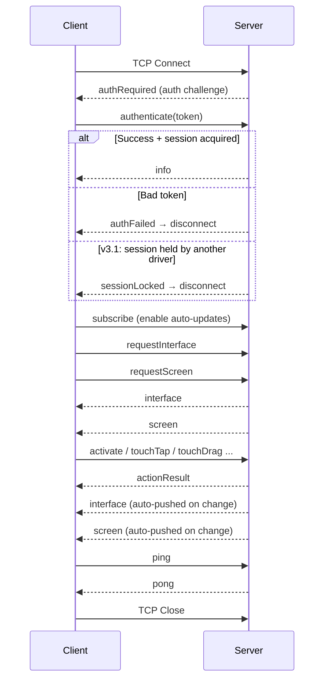
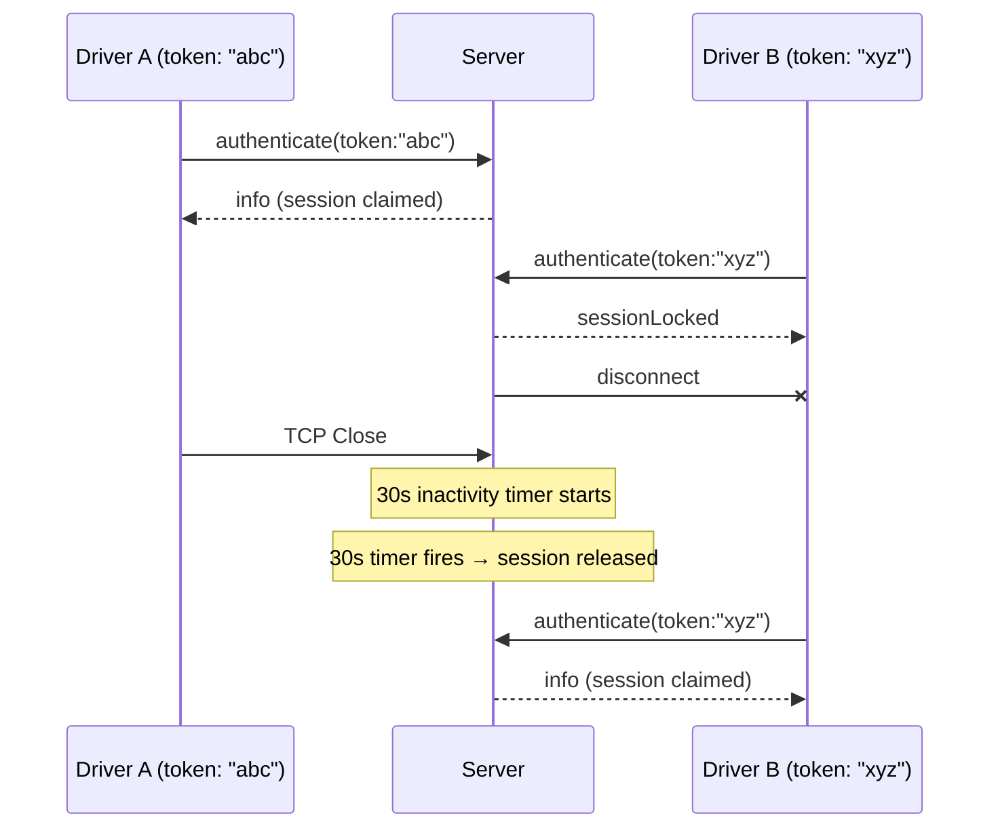
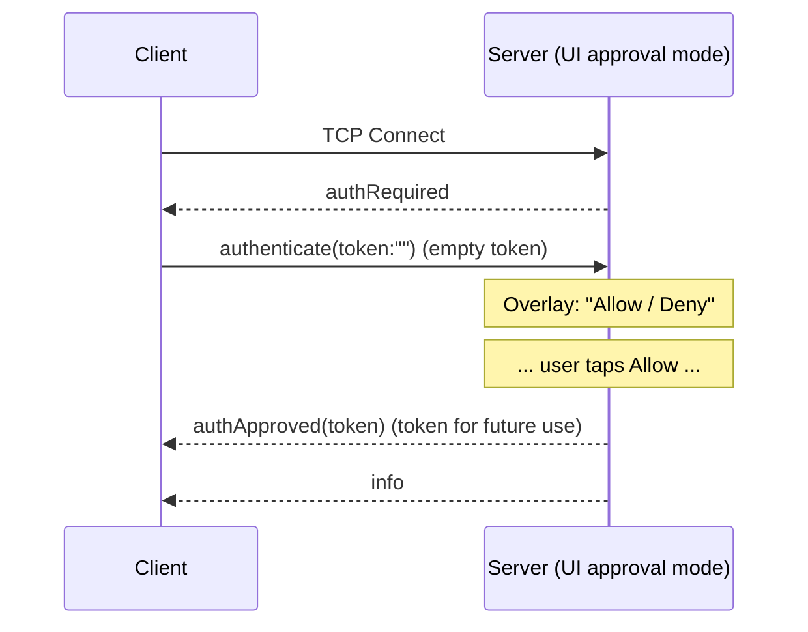

# ButtonHeist Wire Protocol Specification

**Version**: 3.1

This document specifies the communication protocol between InsideJob (iOS) and clients (Wheelman, CLI, Python scripts).

## Transport

- **Layer**: TCP socket (BSD sockets)
- **Discovery**: Bonjour/mDNS (WiFi) or CoreDevice IPv6 tunnel (USB)
- **Service Type**: `_buttonheist._tcp`
- **Port**: OS-assigned (advertised via Bonjour)
- **Encoding**: Newline-delimited JSON (UTF-8)
- **Socket**: IPv6 dual-stack (accepts both IPv4 and IPv6)

## Discovery Methods

### WiFi (Bonjour)
InsideJob advertises itself using Bonjour:
- **Domain**: `local.`
- **Type**: `_buttonheist._tcp`
- **Name**: `{AppName}#{instanceId}` (instanceId from `INSIDEJOB_ID` env var, or first 8 chars of a per-launch UUID)
- **TXT Record**:
  - `simudid` — Simulator UDID (only present when running in iOS Simulator, from `SIMULATOR_UDID` env var)
  - `tokenhash` — SHA256 hash prefix of the auth token (first 8 bytes, hex-encoded). Used for pre-connection filtering.
  - `instanceid` — Human-readable instance identifier

The TXT record enables pre-connection device identification. Clients can match devices by simulator UDID, token hash, or instance ID without establishing a TCP connection first.

### USB (CoreDevice IPv6 Tunnel)
When connected via USB, macOS creates an IPv6 tunnel:
- **Device address**: `fd{prefix}::1` (e.g., `fd9a:6190:eed7::1`)
- **Port**: OS-assigned (same port as WiFi, advertised via Bonjour)
- **Discovery**: `lsof -i -P -n | grep CoreDev`

## Connection Lifecycle



## Message Format

All messages are JSON objects terminated by a newline (`\n`). Swift enums with associated values encode with `_0` wrapper.

## Client → Server Messages

### authenticate

Authenticate with the server. Must be the first message sent after receiving `authRequired`. Sending any other message before authenticating will result in immediate disconnection.

```json
{"authenticate":{"_0":{"token":"your-secret-token"}}}
```

**With driver identity** (v3.1):
```json
{"authenticate":{"_0":{"token":"your-secret-token","driverId":"agent-1"}}}
```

The optional `driverId` field provides a unique driver identity for session locking — when set, it takes precedence over the token for distinguishing drivers. See [Session Locking](#session-locking) for details.

### requestInterface

Request current UI element interface.

```json
{"requestInterface":{}}
```

### subscribe

Subscribe to automatic interface and screen updates.

```json
{"subscribe":{}}
```

### unsubscribe

Unsubscribe from automatic updates.

```json
{"unsubscribe":{}}
```

### activate

Activate an element (equivalent to VoiceOver double-tap). Uses the TouchInjector system with synthetic event fallback chain.

**By identifier:**
```json
{"activate":{"_0":{"identifier":"loginButton"}}}
```

**By traversal index:**
```json
{"activate":{"_0":{"order":5}}}
```

### touchTap

Tap at coordinates or on an element using synthetic touch injection via TheSafecracker.

**At coordinates:**
```json
{"touchTap":{"_0":{"pointX":196.5,"pointY":659.0}}}
```

**On element by identifier:**
```json
{"touchTap":{"_0":{"elementTarget":{"identifier":"submitButton"}}}}
```

### touchLongPress

Long press at coordinates or on an element.

```json
{"touchLongPress":{"_0":{"pointX":100,"pointY":200,"duration":1.0}}}
```

**On element (default 0.5s):**
```json
{"touchLongPress":{"_0":{"elementTarget":{"identifier":"myButton"},"duration":0.5}}}
```

### touchSwipe

Swipe between two points or in a direction from an element.

**With explicit coordinates:**
```json
{"touchSwipe":{"_0":{"startX":200,"startY":400,"endX":200,"endY":100,"duration":0.15}}}
```

**From element in direction:**
```json
{"touchSwipe":{"_0":{"elementTarget":{"identifier":"list"},"direction":"up","distance":300}}}
```

### touchDrag

Drag from one point to another (slower than swipe, for sliders/reordering).

**With explicit coordinates:**
```json
{"touchDrag":{"_0":{"startX":100,"startY":200,"endX":300,"endY":200,"duration":0.5}}}
```

**From element:**
```json
{"touchDrag":{"_0":{"elementTarget":{"identifier":"slider"},"endX":300,"endY":200}}}
```

### touchPinch

Pinch/zoom gesture centered at a point. Scale >1.0 zooms in, <1.0 zooms out.

```json
{"touchPinch":{"_0":{"centerX":200,"centerY":300,"scale":2.0,"spread":100,"duration":0.5}}}
```

**On element:**
```json
{"touchPinch":{"_0":{"elementTarget":{"identifier":"mapView"},"scale":0.5}}}
```

### touchRotate

Rotation gesture centered at a point. Angle in radians.

```json
{"touchRotate":{"_0":{"centerX":200,"centerY":300,"angle":1.57,"radius":100,"duration":0.5}}}
```

### touchTwoFingerTap

Two-finger tap at a point or element.

```json
{"touchTwoFingerTap":{"_0":{"centerX":200,"centerY":300,"spread":40}}}
```

### touchDrawPath

Draw along a path by tracing through a sequence of waypoints. Supports duration (seconds) or velocity (points/second) for timing.

```json
{"touchDrawPath":{"_0":{"points":[{"x":100,"y":400},{"x":200,"y":300},{"x":300,"y":400}],"duration":1.0}}}
```

**With velocity:**
```json
{"touchDrawPath":{"_0":{"points":[{"x":100,"y":400},{"x":200,"y":300},{"x":300,"y":400}],"velocity":500}}}
```

### touchDrawBezier

Draw along cubic bezier curves. The server samples the curves to a polyline, then traces using the drawPath engine.

```json
{"touchDrawBezier":{"_0":{"startX":100,"startY":400,"segments":[{"cp1X":100,"cp1Y":200,"cp2X":300,"cp2Y":200,"endX":300,"endY":400}],"duration":1.0}}}
```

**With samples and velocity:**
```json
{"touchDrawBezier":{"_0":{"startX":100,"startY":400,"segments":[{"cp1X":100,"cp1Y":200,"cp2X":300,"cp2Y":200,"endX":300,"endY":400}],"samplesPerSegment":40,"velocity":300}}}
```

### increment

Increment an adjustable element (e.g., slider, stepper). Calls `increment()` on the element's view.

**By identifier:**
```json
{"increment":{"_0":{"identifier":"volumeSlider"}}}
```

**By traversal index:**
```json
{"increment":{"_0":{"order":8}}}
```

### decrement

Decrement an adjustable element. Calls `decrement()` on the element's view.

**By identifier:**
```json
{"decrement":{"_0":{"identifier":"volumeSlider"}}}
```

### performCustomAction

Invoke a named custom action on an element. The action name must match one of the element's `actions`.

```json
{"performCustomAction":{"_0":{"elementTarget":{"identifier":"myCell"},"actionName":"Delete"}}}
```

### typeText

Type text character-by-character by injecting into the keyboard input system (via UIKeyboardImpl), and/or delete characters. Returns the current text field value in the `actionResult`. The software keyboard must be visible.

**Type text into a field (taps element to focus first):**
```json
{"typeText":{"_0":{"text":"Hello","elementTarget":{"identifier":"nameField"}}}}
```

**Delete 3 characters:**
```json
{"typeText":{"_0":{"deleteCount":3,"elementTarget":{"identifier":"nameField"}}}}
```

**Delete then retype (correction):**
```json
{"typeText":{"_0":{"deleteCount":4,"text":"orld","elementTarget":{"identifier":"nameField"}}}}
```

### requestScreen

Request a PNG capture of the current screen.

```json
{"requestScreen":{}}
```

### startRecording

Start recording the screen as H.264/MP4 video. Frames are captured at the configured FPS using `drawHierarchy` compositing (includes fingerprint overlays for taps and continuous gestures). Recording auto-stops when no screen changes and no real interactions (actions, touches, typing) are received for the inactivity timeout. Pings and keepalive messages do not reset the inactivity timer.

```json
{"startRecording":{"_0":{"fps":8,"scale":0.5,"inactivityTimeout":5.0,"maxDuration":60.0}}}
```

All fields are optional — defaults are applied server-side.

| Field | Type | Description |
|-------|------|-------------|
| `fps` | `Int?` | Frames per second (1-15, default: 8) |
| `scale` | `Double?` | Resolution scale of native pixels (0.25-1.0, default: 1x point size) |
| `inactivityTimeout` | `Double?` | Seconds of no activity before auto-stop (default: 5.0) |
| `maxDuration` | `Double?` | Maximum recording duration in seconds (default: 60.0) |

### stopRecording

Stop an active recording. The server finalizes the video and sends a `recording` message.

```json
{"stopRecording":{}}
```

### editAction

Perform a standard edit action via the responder chain.

```json
{"editAction":{"_0":{"action":"copy"}}}
```

Valid actions: `"copy"`, `"paste"`, `"cut"`, `"select"`, `"selectAll"`.

### resignFirstResponder

Dismiss the keyboard by resigning first responder.

```json
{"resignFirstResponder":{}}
```

### waitForIdle

Wait for all animations to complete, then return the settled interface.

```json
{"waitForIdle":{"_0":{"timeout":5.0}}}
```

| Field | Type | Description |
|-------|------|-------------|
| `timeout` | `Double?` | Max wait time in seconds (default: 5.0, max: 60.0) |

Returns an `actionResult` with `method: "waitForIdle"`, an `interfaceDelta` containing the full interface, and `animating: true` if the timeout expired before animations settled.

### ping

Keepalive ping.

```json
{"ping":{}}
```

## Server → Client Messages

### authRequired

Sent immediately on connection. Indicates the client must authenticate before any other interaction.

```json
{"authRequired":{}}
```

### authFailed

Sent when the client provides an invalid token or when a UI approval request is denied. The server disconnects shortly after.

```json
{"authFailed":{"_0":"Invalid token"}}
```

### authApproved

Sent when a connection is approved via the on-device UI (see [UI Approval Flow](#ui-approval-flow)). Contains the auth token for future reconnections.

```json
{"authApproved":{"_0":{"token":"auto-generated-uuid-token"}}}
```

After receiving `authApproved`, the client should store the token and use it for future `authenticate` messages to skip the approval flow.

### sessionLocked

Sent when the server's session is held by a different driver. The server disconnects the client shortly after sending this message. See [Session Locking](#session-locking).

```json
{"sessionLocked":{"_0":{"message":"Session is locked by another driver","activeConnections":1}}}
```

| Field | Type | Description |
|-------|------|-------------|
| `message` | `String` | Human-readable description of why the session is locked |
| `activeConnections` | `Int` | Number of active connections in the current session |

### info

Sent after successful authentication. Contains device and app metadata.

```json
{"info":{"_0":{
  "protocolVersion":"3.1",
  "appName":"MyApp",
  "bundleIdentifier":"com.example.myapp",
  "deviceName":"iPhone 15 Pro",
  "systemVersion":"17.0",
  "screenWidth":393.0,
  "screenHeight":852.0,
  "instanceId":"A1B2C3D4-E5F6-7890-ABCD-EF1234567890",
  "instanceIdentifier":"my-instance",
  "listeningPort":52341,
  "simulatorUDID":"DEADBEEF-1234-5678-9ABC-DEF012345678",
  "vendorIdentifier":null
}}}
```

### interface

UI element interface. Contains a flat element list and an optional tree structure.

```json
{"interface":{"_0":{
  "timestamp":"2026-02-03T10:30:45.123Z",
  "elements":[
    {
      "order":0,
      "description":"Welcome",
      "label":"Welcome",
      "value":null,
      "identifier":"welcomeLabel",
      "frameX":16.0,
      "frameY":100.0,
      "frameWidth":361.0,
      "frameHeight":24.0,
      "actions":[]
    },
    {
      "order":1,
      "description":"Sign In",
      "label":"Sign In",
      "value":null,
      "identifier":"signInButton",
      "frameX":16.0,
      "frameY":140.0,
      "frameWidth":361.0,
      "frameHeight":44.0,
      "actions":["activate"]
    }
  ],
  "tree":[
    {"element":{"_0":0}},
    {"container":{"_0":[
      {"type":"semanticGroup","label":"Form","value":null,"identifier":null,
       "frameX":0.0,"frameY":88.0,"frameWidth":393.0,"frameHeight":600.0},
      [{"element":{"_0":1}}]
    ]}}
  ]
}}}
```

The `tree` field is optional. When present, it provides the hierarchical container structure that the flat `elements` list does not capture.

### actionResult

Response to `activate`, `tap`, `increment`, `decrement`, `typeText`, or `performCustomAction` commands.

```json
{"actionResult":{"_0":{
  "success":true,
  "method":"syntheticTap",
  "message":null
}}}
```

For `typeText`, the response includes the current text field value:
```json
{"actionResult":{"_0":{
  "success":true,
  "method":"typeText",
  "value":"Hello World"
}}}
```

Possible methods:
- `syntheticTap` - Tap synthesized via TheSafecracker
- `syntheticLongPress` - Long press synthesized via TheSafecracker
- `syntheticSwipe` - Swipe synthesized via TheSafecracker
- `syntheticDrag` - Drag synthesized via TheSafecracker
- `syntheticPinch` - Pinch gesture synthesized via TheSafecracker
- `syntheticRotate` - Rotation gesture synthesized via TheSafecracker
- `syntheticTwoFingerTap` - Two-finger tap synthesized via TheSafecracker
- `syntheticDrawPath` - Path drawing synthesized via TheSafecracker
- `activate` - Element's `activate()` was used
- `increment` - Element's `increment()` was called
- `decrement` - Element's `decrement()` was called
- `typeText` - Text injected via UIKeyboardImpl
- `customAction` - Named custom action was invoked
- `editAction` - Edit action performed via responder chain
- `resignFirstResponder` - First responder resigned (keyboard dismissed)
- `waitForIdle` - Wait-for-idle completed
- `elementNotFound` - Target element could not be found
- `elementDeallocated` - Element's underlying view was deallocated

The optional `message` field provides additional context, especially for failures:
```json
{"actionResult":{"_0":{
  "success":false,
  "method":"elementNotFound",
  "message":"Element is disabled (has 'notEnabled' trait)"
}}}
```

### screen

PNG capture of the current screen.

```json
{"screen":{"_0":{
  "pngData":"iVBORw0KGgo...",
  "width":393.0,
  "height":852.0,
  "timestamp":"2026-02-03T10:30:45.123Z"
}}}
```

The `pngData` field is base64-encoded PNG image data.

### pong

Response to `ping`.

```json
{"pong":{}}
```

### recordingStarted

Acknowledgement that recording has begun.

```json
{"recordingStarted":{}}
```

### recordingStopped

Acknowledgement that the `stopRecording` command was received. The actual video payload will follow as a `recording` broadcast. Also sent if recording was already auto-stopping (inactivity or max duration).

```json
{"recordingStopped":{}}
```

### recording

Completed screen recording. Contains the H.264/MP4 video as base64-encoded data.

```json
{"recording":{"_0":{
  "videoData":"AAAAIGZ0eXBpc29t...",
  "width":390,
  "height":844,
  "duration":5.2,
  "frameCount":42,
  "fps":8,
  "startTime":"2026-02-24T10:30:00.000Z",
  "endTime":"2026-02-24T10:30:05.200Z",
  "stopReason":"inactivity",
  "interactionLog":[
    {
      "timestamp":1.2,
      "command":{"activate":{"_0":{"identifier":"loginButton"}}},
      "result":{"success":true,"method":"syntheticTap"},
      "interfaceBefore":{"timestamp":"2026-02-24T10:30:01.200Z","elements":[...]},
      "interfaceAfter":{"timestamp":"2026-02-24T10:30:02.100Z","elements":[...]}
    }
  ]
}}}
```

The `videoData` field is base64-encoded MP4 video data. The raw file size is capped at 7MB to stay within the 10MB wire protocol buffer limit after base64 encoding. The optional `interactionLog` field contains an ordered array of `InteractionEvent` objects capturing each command, result, and before/after interface state during the recording. It is `null` or absent when no interactions occurred.

Stop reasons: `"manual"`, `"inactivity"`, `"maxDuration"`, `"fileSizeLimit"`.

### recordingError

Recording failed with an error.

```json
{"recordingError":{"_0":"AVAssetWriter failed to start"}}
```

### error

Error message.

```json
{"error":{"_0":"Root view not available"}}
```

## Data Types

### ServerInfo

| Field | Type | Description |
|-------|------|-------------|
| `protocolVersion` | `String` | Protocol version (e.g., "3.1") |
| `appName` | `String` | App display name |
| `bundleIdentifier` | `String` | App bundle identifier |
| `deviceName` | `String` | Device name (e.g., "iPhone 15 Pro") |
| `systemVersion` | `String` | iOS version (e.g., "17.0") |
| `screenWidth` | `Double` | Screen width in points |
| `screenHeight` | `Double` | Screen height in points |
| `instanceId` | `String?` | Per-launch session UUID (nil for servers < v2.1) |
| `instanceIdentifier` | `String?` | Human-readable instance identifier from `INSIDEJOB_ID` env var (falls back to shortId) |
| `listeningPort` | `UInt16?` | Port the server is listening on (nil for servers < v2.1) |
| `simulatorUDID` | `String?` | Simulator UDID when running in iOS Simulator (nil on physical devices) |
| `vendorIdentifier` | `String?` | `UIDevice.identifierForVendor` UUID string (nil in simulator) |

### Interface

| Field | Type | Description |
|-------|------|-------------|
| `timestamp` | `ISO8601 Date` | When interface was captured |
| `elements` | `[HeistElement]` | Flat list of all UI elements |
| `tree` | `[ElementNode]?` | Optional tree structure with containers |

### HeistElement

| Field | Type | Description |
|-------|------|-------------|
| `order` | `Int` | VoiceOver reading order (0-based) |
| `description` | `String` | What VoiceOver reads |
| `label` | `String?` | Label |
| `value` | `String?` | Current value (for controls) |
| `identifier` | `String?` | Identifier |
| `hint` | `String?` | Accessibility hint |
| `traits` | `[String]` | Trait names (e.g., `"button"`, `"adjustable"`, `"staticText"`) |
| `frameX` | `Double` | Frame origin X in points |
| `frameY` | `Double` | Frame origin Y in points |
| `frameWidth` | `Double` | Frame width in points |
| `frameHeight` | `Double` | Frame height in points |
| `activationPointX` | `Double` | Activation point X (where VoiceOver would tap) |
| `activationPointY` | `Double` | Activation point Y |
| `respondsToUserInteraction` | `Bool` | Whether the element is interactive |
| `customContent` | `[HeistCustomContent]?` | Custom accessibility content |
| `actions` | `[String]` | Available actions (`"activate"`, `"increment"`, `"decrement"`, or custom action names) |

### ElementNode

Recursive enum representing the tree structure:

- `element(order: Int)` - Leaf node referencing an element by its index in the flat `elements` array
- `container(Group, children: [ElementNode])` - Container node with metadata and children

### Group

| Field | Type | Description |
|-------|------|-------------|
| `type` | `String` | Container type (see below) |
| `label` | `String?` | Container's label |
| `value` | `String?` | Container's value |
| `identifier` | `String?` | Container's identifier |
| `frameX` | `Double` | Frame origin X in points |
| `frameY` | `Double` | Frame origin Y in points |
| `frameWidth` | `Double` | Frame width in points |
| `frameHeight` | `Double` | Frame height in points |

Container types:
- `"semanticGroup"` - Semantic grouping (with optional label/value/identifier)
- `"list"` - List container (affects rotor navigation)
- `"landmark"` - Landmark container (affects rotor navigation)
- `"dataTable"` - Data table container
- `"tabBar"` - Tab bar container

### ActionTarget

| Field | Type | Description |
|-------|------|-------------|
| `identifier` | `String?` | Element's identifier |
| `order` | `Int?` | Element's traversal index |

At least one field should be provided. When both are provided, identifier is tried first.

### TouchTapTarget

| Field | Type | Description |
|-------|------|-------------|
| `elementTarget` | `ActionTarget?` | Target element (taps at activation point) |
| `pointX` | `Double?` | Explicit X coordinate |
| `pointY` | `Double?` | Explicit Y coordinate |

### LongPressTarget

| Field | Type | Description |
|-------|------|-------------|
| `elementTarget` | `ActionTarget?` | Target element |
| `pointX` | `Double?` | Explicit X coordinate |
| `pointY` | `Double?` | Explicit Y coordinate |
| `duration` | `Double` | Press duration in seconds (default: 0.5) |

### SwipeTarget

| Field | Type | Description |
|-------|------|-------------|
| `elementTarget` | `ActionTarget?` | Start from element's activation point |
| `startX` | `Double?` | Start X coordinate |
| `startY` | `Double?` | Start Y coordinate |
| `endX` | `Double?` | End X coordinate |
| `endY` | `Double?` | End Y coordinate |
| `direction` | `String?` | Swipe direction: "up", "down", "left", "right" |
| `distance` | `Double?` | Swipe distance in points (with direction) |
| `duration` | `Double?` | Duration in seconds (default: 0.15) |

### DragTarget

| Field | Type | Description |
|-------|------|-------------|
| `elementTarget` | `ActionTarget?` | Start from element's activation point |
| `startX` | `Double?` | Start X coordinate |
| `startY` | `Double?` | Start Y coordinate |
| `endX` | `Double` | End X coordinate |
| `endY` | `Double` | End Y coordinate |
| `duration` | `Double?` | Duration in seconds (default: 0.5) |

### PinchTarget

| Field | Type | Description |
|-------|------|-------------|
| `elementTarget` | `ActionTarget?` | Center on element's activation point |
| `centerX` | `Double?` | Center X coordinate |
| `centerY` | `Double?` | Center Y coordinate |
| `scale` | `Double` | Scale factor (>1.0 zoom in, <1.0 zoom out) |
| `spread` | `Double?` | Initial finger spread from center (default: 100pt) |
| `duration` | `Double?` | Duration in seconds (default: 0.5) |

### RotateTarget

| Field | Type | Description |
|-------|------|-------------|
| `elementTarget` | `ActionTarget?` | Center on element's activation point |
| `centerX` | `Double?` | Center X coordinate |
| `centerY` | `Double?` | Center Y coordinate |
| `angle` | `Double` | Rotation angle in radians |
| `radius` | `Double?` | Distance from center to each finger (default: 100pt) |
| `duration` | `Double?` | Duration in seconds (default: 0.5) |

### TwoFingerTapTarget

| Field | Type | Description |
|-------|------|-------------|
| `elementTarget` | `ActionTarget?` | Center on element's activation point |
| `centerX` | `Double?` | Center X coordinate |
| `centerY` | `Double?` | Center Y coordinate |
| `spread` | `Double?` | Distance between fingers (default: 40pt) |

### DrawPathTarget

| Field | Type | Description |
|-------|------|-------------|
| `points` | `[PathPoint]` | Array of waypoints to trace through (minimum 2) |
| `duration` | `Double?` | Total duration in seconds (mutually exclusive with velocity) |
| `velocity` | `Double?` | Speed in points per second (mutually exclusive with duration) |

### PathPoint

| Field | Type | Description |
|-------|------|-------------|
| `x` | `Double` | X coordinate in screen points |
| `y` | `Double` | Y coordinate in screen points |

### DrawBezierTarget

| Field | Type | Description |
|-------|------|-------------|
| `startX` | `Double` | Starting X coordinate |
| `startY` | `Double` | Starting Y coordinate |
| `segments` | `[BezierSegment]` | Array of cubic bezier segments |
| `samplesPerSegment` | `Int?` | Points to sample per segment (default: 20) |
| `duration` | `Double?` | Total duration in seconds (mutually exclusive with velocity) |
| `velocity` | `Double?` | Speed in points per second (mutually exclusive with duration) |

### BezierSegment

| Field | Type | Description |
|-------|------|-------------|
| `cp1X` | `Double` | First control point X |
| `cp1Y` | `Double` | First control point Y |
| `cp2X` | `Double` | Second control point X |
| `cp2Y` | `Double` | Second control point Y |
| `endX` | `Double` | Endpoint X |
| `endY` | `Double` | Endpoint Y |

### TypeTextTarget

| Field | Type | Description |
|-------|------|-------------|
| `text` | `String?` | Text to type character-by-character |
| `deleteCount` | `Int?` | Number of delete key taps before typing |
| `elementTarget` | `ActionTarget?` | Element to tap for focus and value readback |

At least `text` or `deleteCount` must be provided. If `elementTarget` is provided, it is tapped first to bring up the keyboard, and its value is read back after the operation.

### CustomActionTarget

| Field | Type | Description |
|-------|------|-------------|
| `elementTarget` | `ActionTarget` | Target element |
| `actionName` | `String` | Name of the custom action |

### EditActionTarget

| Field | Type | Description |
|-------|------|-------------|
| `action` | `String` | Edit action: `"copy"`, `"paste"`, `"cut"`, `"select"`, `"selectAll"` |

### WaitForIdleTarget

| Field | Type | Description |
|-------|------|-------------|
| `timeout` | `Double?` | Maximum wait time in seconds (default: 5.0, max: 60.0) |

### ActionResult

| Field | Type | Description |
|-------|------|-------------|
| `success` | `Bool` | Whether action succeeded |
| `method` | `String` | How action was performed (see method values above) |
| `message` | `String?` | Additional context or error description |
| `value` | `String?` | Current text field value (populated by `typeText`) |
| `interfaceDelta` | `InterfaceDelta?` | Compact delta describing what changed after the action |
| `animating` | `Bool?` | `true` if UI was still animating when result was produced; `nil` means idle |

### InterfaceDelta

| Field | Type | Description |
|-------|------|-------------|
| `kind` | `String` | `"noChange"`, `"valuesChanged"`, `"elementsChanged"`, or `"screenChanged"` |
| `elementCount` | `Int` | Total element count after the action |
| `added` | `[HeistElement]?` | Elements that were added (for `elementsChanged`) |
| `removedOrders` | `[Int]?` | Orders of removed elements (for `elementsChanged`) |
| `valueChanges` | `[ValueChange]?` | Value changes on existing elements |
| `newInterface` | `Interface?` | Full new interface (for `screenChanged` only) |

### ValueChange

| Field | Type | Description |
|-------|------|-------------|
| `order` | `Int` | Element order |
| `identifier` | `String?` | Element identifier |
| `oldValue` | `String?` | Previous value |
| `newValue` | `String?` | New value |

### HeistCustomContent

| Field | Type | Description |
|-------|------|-------------|
| `label` | `String` | Content label |
| `value` | `String` | Content value |
| `isImportant` | `Bool` | Whether this content is marked important |

### ScreenPayload

| Field | Type | Description |
|-------|------|-------------|
| `pngData` | `String` | Base64-encoded PNG image data |
| `width` | `Double` | Screen width in points |
| `height` | `Double` | Screen height in points |
| `timestamp` | `ISO8601 Date` | When screen was captured |

### RecordingConfig

| Field | Type | Description |
|-------|------|-------------|
| `fps` | `Int?` | Frames per second (1-15, default: 8) |
| `scale` | `Double?` | Resolution scale of native pixels (0.25-1.0, default: 1x point size) |
| `inactivityTimeout` | `Double?` | Seconds of inactivity before auto-stop (default: 5.0) |
| `maxDuration` | `Double?` | Maximum recording duration in seconds (default: 60.0) |

### RecordingPayload

| Field | Type | Description |
|-------|------|-------------|
| `videoData` | `String` | Base64-encoded H.264/MP4 video data |
| `width` | `Int` | Video width in pixels |
| `height` | `Int` | Video height in pixels |
| `duration` | `Double` | Recording duration in seconds |
| `frameCount` | `Int` | Number of frames captured |
| `fps` | `Int` | Frames per second used during recording |
| `startTime` | `ISO8601 Date` | When recording started |
| `endTime` | `ISO8601 Date` | When recording ended |
| `stopReason` | `String` | `"manual"`, `"inactivity"`, `"maxDuration"`, or `"fileSizeLimit"` |
| `interactionLog` | `[InteractionEvent]?` | Ordered log of interactions recorded during the session (nil if no interactions occurred) |

### InteractionEvent

A single recorded interaction event captured during a Stakeout recording.

| Field | Type | Description |
|-------|------|-------------|
| `timestamp` | `Double` | Time offset from recording start in seconds |
| `command` | `ClientMessage` | The command that triggered this interaction |
| `result` | `ActionResult` | The result returned to the client |
| `interfaceBefore` | `Interface` | Interface state before the interaction (elements only, no tree) |
| `interfaceAfter` | `Interface` | Interface state after the interaction (elements only, no tree) |

## Example Session

```
# Client connects to fd9a:6190:eed7::1 on the Bonjour-advertised port

# Server sends auth challenge
{"authRequired":{}}

# Client authenticates
{"authenticate":{"_0":{"token":"my-secret-token"}}}

# Server sends info after successful auth
{"info":{"_0":{"protocolVersion":"3.1","appName":"TestApp","bundleIdentifier":"com.buttonheist.testapp","deviceName":"iPhone","systemVersion":"26.2.1","screenWidth":393.0,"screenHeight":852.0,"instanceId":"A1B2C3D4-E5F6-7890-ABCD-EF1234567890","instanceIdentifier":"my-instance","listeningPort":52341,"simulatorUDID":"DEADBEEF-1234-5678-9ABC-DEF012345678","vendorIdentifier":null}}}

# Client subscribes to updates
{"subscribe":{}}

# Client requests interface
{"requestInterface":{}}

# Server responds with interface (flat + tree)
{"interface":{"_0":{"timestamp":"2026-02-03T14:08:14.123Z","elements":[...],"tree":[...]}}}

# Client requests screen capture
{"requestScreen":{}}

# Server responds with screen capture
{"screen":{"_0":{"pngData":"iVBORw0KGgo...","width":393.0,"height":852.0,"timestamp":"2026-02-03T14:08:14.200Z"}}}

# Client activates a button
{"activate":{"_0":{"identifier":"loginButton"}}}

# Server confirms action
{"actionResult":{"_0":{"success":true,"method":"syntheticTap","message":null}}}

# Client increments a slider
{"increment":{"_0":{"identifier":"volumeSlider"}}}

# Server confirms
{"actionResult":{"_0":{"success":true,"method":"increment","message":null}}}

# Client performs custom action
{"performCustomAction":{"_0":{"elementTarget":{"identifier":"messageCell"},"actionName":"Delete"}}}

# Server confirms
{"actionResult":{"_0":{"success":true,"method":"customAction","message":null}}}

# Client types text into a field
{"typeText":{"_0":{"text":"Hello World","elementTarget":{"identifier":"nameField"}}}}

# Server confirms with current field value
{"actionResult":{"_0":{"success":true,"method":"typeText","value":"Hello World"}}}

# Client corrects a typo (delete 5 chars, retype)
{"typeText":{"_0":{"deleteCount":5,"text":"World","elementTarget":{"identifier":"nameField"}}}}

# Server confirms correction
{"actionResult":{"_0":{"success":true,"method":"typeText","value":"Hello World"}}}

# Client starts recording
{"startRecording":{"_0":{"fps":8}}}

# Server acknowledges
{"recordingStarted":{}}

# Client interacts while recording...
{"activate":{"_0":{"identifier":"loginButton"}}}
{"actionResult":{"_0":{"success":true,"method":"syntheticTap"}}}

# Client stops recording
{"stopRecording":{}}

# Server acknowledges stop command
{"recordingStopped":{}}

# Server sends completed recording
{"recording":{"_0":{"videoData":"AAAAIGZ0eXBpc29t...","width":390,"height":844,"duration":5.2,"frameCount":42,"fps":8,"startTime":"2026-02-24T10:30:00.000Z","endTime":"2026-02-24T10:30:05.200Z","stopReason":"manual"}}}

# Client sends keepalive
{"ping":{}}

# Server responds
{"pong":{}}

# Server auto-pushes interface change
{"interface":{"_0":{"timestamp":"2026-02-03T14:08:15.500Z","elements":[...],"tree":[...]}}}
{"screen":{"_0":{"pngData":"...","width":393.0,"height":852.0,"timestamp":"2026-02-03T14:08:15.550Z"}}}
```

### AuthenticatePayload

| Field | Type | Description |
|-------|------|-------------|
| `token` | `String` | Auth token for driver identification |
| `driverId` | `String?` | Unique driver identity for session locking (v3.1). When set, used instead of token for session identity. Set via `BUTTONHEIST_DRIVER_ID` env var. |

### SessionLockedPayload

| Field | Type | Description |
|-------|------|-------------|
| `message` | `String` | Human-readable description |
| `activeConnections` | `Int` | Number of active connections in the current session |

## Implementation Notes

### Authentication

Token-based authentication is required for all connections:

1. Server sends `authRequired` immediately on TCP connect
2. Client must respond with `authenticate` containing the correct token
3. On success and session acquired, server sends `info` and the session proceeds normally
4. On auth failure, server sends `authFailed` and disconnects after a brief delay
5. On session conflict (v3.1), server sends `sessionLocked` and disconnects

The token is configured via `INSIDEJOB_TOKEN` env var or `InsideJobToken` Info.plist key. If not set, a random UUID is auto-generated each launch (ephemeral — not persisted). The token is logged to the console at startup. Clients set the token via the `BUTTONHEIST_TOKEN` environment variable.

### Session Locking

Protocol v3.1 introduces session locking to prevent multiple drivers from interfering with each other. Only one driver can control an InsideJob host at a time.

**Why sessions?** A single "driver" isn't a single TCP connection. Each CLI command (`buttonheist action`, `buttonheist screenshot`, etc.) creates a fresh connection, authenticates, executes, and disconnects. Only `session` and `watch` maintain persistent connections. The session concept spans multiple sequential connections from the same driver.

**Driver Identity**: The server identifies drivers using a two-tier approach:
1. `driverId` from the authenticate payload (when present) — set via `BUTTONHEIST_DRIVER_ID` env var
2. `token` as fallback (when `driverId` is absent) — all same-token connections are one "driver"

This maintains backward compatibility: existing clients without `driverId` use token-based identity. Setting `BUTTONHEIST_DRIVER_ID` enables multiple drivers sharing the same auth token to be distinguished.

#### Session Lifecycle

1. **Claim** — The first authenticated client's driver identity becomes the active session
2. **Join** — Subsequent connections with the **same driver identity** are allowed (same driver, different commands)
3. **Reject** — Connections with a **different driver identity** receive `sessionLocked` and are disconnected. The busy signal includes the inactivity timeout so the client knows how long to wait.
4. **Inactivity timer** — When the last connection from the session holder disconnects, a single inactivity timer starts (default: 30 seconds)
5. **Release** — Timer fires → session clears → next driver can claim
6. **Cancel timer** — Same-driver reconnect within the timeout window cancels the timer

There is only one timer (inactivity). There is no separate "lease" timer. The token is **not** invalidated when the session expires — it remains valid for future connections.



#### Configuration

The session inactivity timeout (time after last connection disconnects before the session is released) is configurable:

- **Environment variable**: `INSIDEJOB_SESSION_TIMEOUT` (in seconds)
- **Default**: 30 seconds

### UI Approval Flow

When the token is auto-generated (not explicitly set), InsideJob supports an interactive approval flow that allows the iOS user to approve or deny connections from the device:

1. Server starts with auto-generated token — a floating overlay appears showing "Waiting for connection"
2. Client connects and sends `authenticate` with an empty token (`""`)
3. Server shows an approval prompt overlay with Allow/Deny buttons
4. **If approved**: Server sends `authApproved` with the token, then `info` — the session proceeds normally
5. **If denied**: Server sends `authFailed("Connection denied by user")` and disconnects



The client stores the received token and uses it for subsequent connections, which will authenticate normally without requiring approval.

This flow is **only active** when the token is auto-generated. If `INSIDEJOB_TOKEN` or `InsideJobToken` is explicitly set, the standard token-based flow is used and no overlay is shown.

### Security Limits

- **Max connections**: 5 concurrent TCP connections
- **Rate limiting**: 30 messages/second per client (token bucket). Applied to both authenticated and unauthenticated clients.
- **Buffer limit**: 10 MB per-client receive buffer. Clients exceeding this are disconnected.
- **Loopback binding**: On iOS Simulator, the server binds to `::1` (loopback only) by default. Override with `INSIDEJOB_BIND_ALL=true`.

### Port Configuration

The server uses OS-assigned ports by default. The actual port is advertised via Bonjour and included in the `info` message (`listeningPort` field) after connection.

### IPv6 Dual-Stack

The server binds to `::` (IPv6 any) on physical devices or `::1` (loopback) on simulators, accepting:
- IPv4 connections (mapped to `::ffff:x.x.x.x`)
- IPv6 connections (USB tunnel, WiFi)

### Keepalive

Clients should send `ping` messages periodically (recommended: every 3 seconds) to detect connection loss. The 3-second interval is appropriate given the 30-second session lease timeout.

### Error Recovery

If the TCP connection is lost, clients should:
1. Close the socket
2. Optionally attempt reconnection
3. Re-request interface after reconnecting

### Hierarchy Change Detection

InsideJob uses hash-based change detection during polling:
1. Parse hierarchy at configurable interval (default: 1.0s)
2. Compute hash of the flat elements array
3. Only broadcast if hash differs from last broadcast
4. Screen captures are automatically captured and broadcast alongside interface changes
