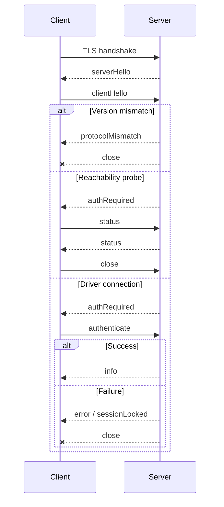
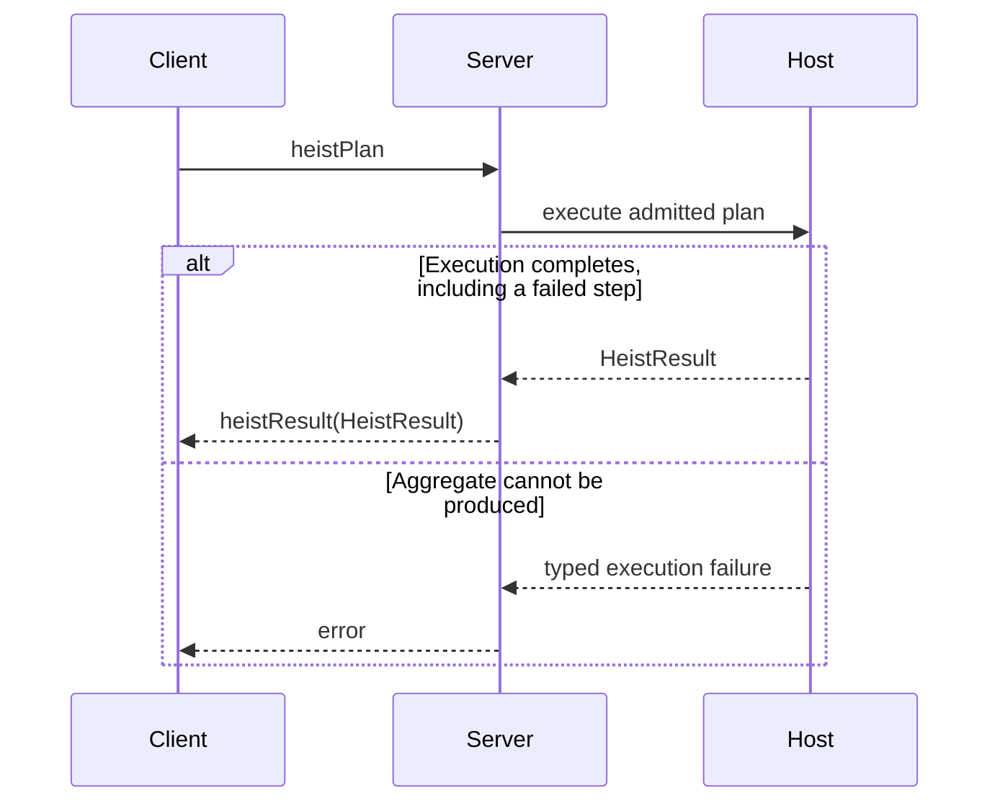

# The Button Heist wire protocol

This document describes the raw TheScore transport between clients and the iOS
host. It is not the CLI, MCP, or heist command catalog.

Use live adapter surfaces for product command catalogs:

- CLI commands: run `buttonheist --help` or `buttonheist <command> --help`.
- MCP tools: call MCP `tools/list` and read each tool's input schema.

## Versioning

There is no separate wire-protocol version. The wire contract is versioned by
The Button Heist product SemVer carried in `buttonHeistVersion`. This document
describes the exact `0.6.32` client, server, CLI, and MCP contract.

Admission is exact product-version lockstep:

- the embedded iOS server, macOS framework, CLI, and MCP server must come from
  product release `0.6.32`
- client and server `buttonHeistVersion` must both equal `0.6.32` during the
  hello handshake
- malformed semantic versions are rejected while decoding the envelope
- major, minor, and patch differences are all incompatible on the wire
- there is no downgrade, feature negotiation, or best-effort compatibility mode

On mismatch, the server returns `protocolMismatch` with both observed product
versions, then closes the connection before authentication or command dispatch.
Wire-format changes ship with a product version bump, not a parallel protocol
version.

## Command Layers

The Button Heist has one product command contract: `TheFence.Command`. CLI,
session JSON, MCP tools, and heist execution adapt to command names
such as `get_interface`, `activate`, and `scroll_to_visible`.

The wire protocol is lower-level transport. Its `type` values are TheScore
message discriminators such as `requestInterface`, `requestScreen`, `status`,
`mainThreadProbe`, and `heistPlan`. Use Fence command names at public adapter
boundaries and wire discriminators only when speaking raw TCP.

Side-effecting app interactions are not raw command dictionaries on the wire.
Durable mutations such as `activate`, `type_text`, `wait`, and `set_pasteboard`
cross as one-step or composed `heistPlan` messages. Non-durable viewport/debug
commands cross as typed `runtimeAction` messages. In both cases, Fence admission
has already parsed the canonical name into `TheFence.Command`, validated the
descriptor-owned parameter schema, and converted `FenceCommandInput` into the
typed `FenceOperationRequest` consumed by execution.

Fence command names are snake case. Inside `HeistActionCommand`, the canonical
`type` values are the Swift raw values from `HeistActionCommandType`, including
`performCustomAction`, `oneFingerTap`, `typeText`, `scrollToVisible`,
`scrollToEdge`, and `dismissKeyboard`. Raw clients must not substitute
Fence spellings such as `type_text` inside a heist action payload.

## Transport

- TLS over TCP using Network.framework
- Newline-delimited UTF-8 JSON
- Service type `_buttonheist._tcp`
- OS-assigned port by default
- IPv6 dual-stack listener
- TLS with token-derived pre-shared key material

Default connection scope is `simulator,usb`. Bonjour/LAN discovery is opt-in
with `network` scope.

Clients must provide the same token as the server before connecting. The token
derives the TLS pre-shared key and is also sent in the JSON `authenticate`
payload after the hello handshake.

## Discovery

### Bonjour

Bonjour is published only when `INSIDEJOB_SCOPE` includes `network`.

TXT metadata includes app/device identity and transport mode:

```text
simudid=<simulator UDID when available>
installationid=<stable app installation identifier>
instanceid=<human-readable instance id>
devicename=<device name>
transport=tls-psk
```

The token is not advertised over Bonjour. mDNS itself does not provide
integrity protection.

### USB

USB uses the CoreDevice IPv6 tunnel. It is classified as `usb` scope and uses
the same TLS wire protocol as other non-loopback transports.

## Handshake


```mermaid
sequenceDiagram
    participant Client
    participant Server

    Client->>Server: TLS handshake
    Server-->>Client: serverHello
    Client->>Server: clientHello

    alt Version mismatch
        Server-->>Client: protocolMismatch
        Server--xClient: close
    else Reachability probe
        Server-->>Client: authRequired
        Client->>Server: status
        Server-->>Client: status
        Client->>Server: close
    else Driver connection
        Server-->>Client: authRequired
        Client->>Server: authenticate
        alt Success
            Server-->>Client: info
        else Failure
            Server-->>Client: error / sessionLocked
            Server--xClient: close
        end
    end
```

`status` is the only post-hello message allowed before authentication. It
reports identity and session availability without claiming a driver session.
After authentication, `ping` and `mainThreadProbe` are transport-control
sideband messages. They do not enter the MainActor UI request stream or the
TheBrains interaction executor.

The client-side view of the same exchange — the `HandoffConnectionPhase` state
machine and every documented failure edge — is drawn in the
[connection lifecycle diagram](diagrams/connection-lifecycle.md).

## Envelopes

Every message is a JSON object terminated by `\n`.

Client request:

```json
{"buttonHeistVersion":"<semver>","requestId":"abc-123","type":"requestInterface","payload":{}}
```

Server response:

```json
{"buttonHeistVersion":"<semver>","requestId":"abc-123","type":"interface","payload":{"timestamp":791807445.123,"tree":[],"annotations":{"elements":[],"containers":[]}}}
```

| Field | Description |
|-------|-------------|
| `buttonHeistVersion` | `ButtonHeistVersion` encoded as a `MAJOR.MINOR.PATCH` string. Must match exactly across client and server. |
| `requestId` | Optional `RequestID` encoded as a nonblank string. Echoed by the matching response. |
| `type` | Explicit TheScore message discriminator. |
| `payload` | Optional payload object. |

## Transport Control and Main-Thread Liveness

`ServerTransport.transportEvents` is consumed only by the off-main
`TransportControlPlane`. Per-client message admission happens there before any
MainActor hop. Admitted message families then have one route:

| Client message | Execution boundary | Matching server message |
| --- | --- | --- |
| `clientHello`, `authenticate` | Off-main handshake and admission | `authRequired`, `info`, `error`, or `sessionLocked` |
| `ping` | Authenticated transport-control sideband | `pong` |
| `mainThreadProbe` | Authenticated transport-control sideband plus a public main-run-loop round trip | `mainThreadProbe` |
| `status` | One capacity-admitted MainActor stream | `status` |
| `requestInterface`, `getPasteboard`, `getNotifications`, `requestScreen`, `runtimeAction`, `heistPlan` | One capacity-admitted MainActor stream, then the single TheBrains interaction executor | Typed response for the admitted request |

The sideband exists so transport control can remain responsive while the UI
executor is occupied or the app's main thread is wedged. It does not create a
second heist or a second UI execution lane.

The server assigns an internal lease to each client connection. Disconnect,
reconnect, and admission overflow invalidate that lease off-main. Buffered app
work checks the lease before MainActor admission and again before execution.
The MainActor handoff is bounded. Ended leases and transport-overflow facts stay
in the control plane and share one coalesced wake-up until MainActor consumes
them, so connection churn cannot create an unbounded event backlog.
Each response handler is separately bound to the concrete socket connection
that supplied its request, and send reservation verifies that connection
atomically. Reusing a transport client ID therefore cannot admit work or receive
a response from its prior connection.

Main-thread probe request:

```json
{"buttonHeistVersion":"<semver>","requestId":"probe-1","type":"mainThreadProbe","payload":{"responsivenessTimeoutMilliseconds":1000,"workTimeoutMilliseconds":1000}}
```

Main-thread probe response:

```json
{"buttonHeistVersion":"<semver>","requestId":"probe-1","type":"mainThreadProbe","payload":{"outcome":"responsive"}}
```

Both timeout fields are positive integer millisecond durations. Unknown fields,
zero, and negative values are rejected during decoding. `outcome` has exactly
three spellings:

| Outcome | Meaning |
| --- | --- |
| `responsive` | The main run loop began the scheduled probe block and its admitted work completed. |
| `mainThreadUnresponsive` | The transport remained able to answer, but the main run loop did not begin the scheduled block before the responsiveness timeout. Late scheduled work is suppressed. |
| `workTimedOut` | The main run loop began the scheduled block, but its admitted work did not complete before the work timeout. Late completion cannot replace the terminal outcome. |

The two stages share one terminal gate. Exactly one of completion,
responsiveness timeout, or work timeout wins. The probe's timeout decision is
made off-main and therefore does not depend on the executor whose liveness it
measures.

## Public Wire Examples

These examples show edge contracts that raw clients may need. Command and
parameter inventories belong in the generated references.

### Hello

```json
{"buttonHeistVersion":"<semver>","type":"serverHello"}
{"buttonHeistVersion":"<semver>","type":"clientHello"}
{"buttonHeistVersion":"<semver>","type":"authRequired"}
```

### Authentication

```json
{"buttonHeistVersion":"<semver>","type":"authenticate","payload":{"token":"your-secret-token","driverId":"agent-1"}}
```

`token` is a `SessionAuthToken` and `driverId` is an optional `DriverID`. Both
encode as exact, nonblank strings; whitespace is not trimmed. `SessionOwner`
retains whether ownership came from the driver ID or, when absent, the token.

### Rejected Auth Tags

`authApprovalPending` and `authApproved` are not valid current server messages.
Current clients reject either tag as an unsupported auth response and instruct the
user to rebuild or reinstall the app, then retry with the configured token.
Clients without a token fail before starting the TLS connection.

### Protocol Mismatch

```json
{"buttonHeistVersion":"<server-semver>","type":"protocolMismatch","payload":{"serverButtonHeistVersion":"<server-semver>","clientButtonHeistVersion":"<client-semver>"}}
```

### Session Locked

```json
{"buttonHeistVersion":"<semver>","type":"sessionLocked","payload":{"message":"Session is locked by another driver","activeConnections":1}}
```

### Status Probe

```json
{"buttonHeistVersion":"<semver>","type":"status"}
```

```json
{"buttonHeistVersion":"<semver>","type":"status","payload":{"identity":{"appName":"MyApp","bundleIdentifier":"com.example.myapp","appBuild":"42","deviceName":"iPhone 15 Pro","systemVersion":"18.0","buttonHeistVersion":"<semver>"},"session":{"active":false,"watchersAllowed":false,"activeConnections":0}}}
```

### Interface

```json
{"buttonHeistVersion":"<semver>","type":"requestInterface","payload":{}}
```

The interface payload carries the canonical hierarchy tree plus ButtonHeist
annotations. There is no parallel wire `elements` array in the public wire
contract. `timestamp` uses Foundation `Date`'s default Codable representation:
seconds since 2001-01-01 00:00:00 UTC.

```json
{
  "buttonHeistVersion": "<semver>",
  "type": "interface",
  "payload": {
    "timestamp": 791807445.123,
    "tree": [
      {
        "element": {
          "description": "Button",
          "label": "Sign In",
          "identifier": "signInButton",
          "traits": ["button"],
          "shape": { "type": "frame", "frame": [[16, 140], [361, 44]] },
          "activationPoint": [196.5, 162],
          "usesDefaultActivationPoint": true,
          "customActions": [],
          "customContent": [],
          "customRotors": [],
          "respondsToUserInteraction": true,
          "visibility": "onscreen",
          "traversalIndex": 0
        }
      }
    ],
    "annotations": {
      "elements": [
        {
          "path": { "indices": [0] },
          "actions": ["activate"],
          "geometry": {
            "screen": {
              "visibility": "onscreen",
              "frame": {
                "source": "available",
                "rect": { "x": 16, "y": 140, "width": 361, "height": 44 }
              },
              "activationPoint": {
                "source": "defaultCenter",
                "point": { "x": 196.5, "y": 162 }
              }
            },
            "view": {
              "ownerPath": { "indices": [] },
              "frame": { "x": 16, "y": 140, "width": 361, "height": 44 },
              "activationPoint": { "x": 196.5, "y": 162 }
            }
          }
        }
      ],
      "containers": []
    }
  }
}
```

The raw interface tree carries parser values plus path-indexed Button Heist
annotations. Capture-local `HeistId` values remain inside TheInsideJob and are
not selectors on this transport. `AccessibilityTarget` is the canonical target
object for actions, waits, expectations, CLI/MCP projections, and
`requestInterface.payload.subtree`. An element
target carries an ordered predicate `checks` chain and optional `ordinal`; a
container target carries `container` and optional `ordinal`; `container` plus
`target` expresses a descendant-scoped target; `ref` refers to a scoped heist
target parameter.
Public target nesting is bounded by the shared public JSON input depth limit.
Checks include `label`, `identifier`, `value`, `hint`, `traits`, `actions`,
`customContent`, and `rotors`. Durable replay uses the same target shape.

Container identifiers are matched on every delivered container type that
carries the identifier. They are not restricted to semantic-group containers.
Canonical container roles are `none`, `semanticGroup`, `list`, `landmark`,
`dataTable`, `tabBar`, and `series`. Identifier and scrollability are orthogonal
checks; a roleless parser scroll container has role `none` and `scrollable=true`.
Target resolution always walks the canonical delivered tree, including for
`exists`, `missing`, and subtree queries.
`InterfaceQuery` contains only optional `subtree`, `maxScrollsPerContainer`,
and `maxScrollsPerDiscovery` fields. Filtering is expressed only by the
canonical `AccessibilityTarget` in `subtree`; there is no separate interface
matcher or top-level `checks` adapter.
The string predicate fields may carry one StringMatch value or an array of
StringMatch values; arrays require every check against that property to match.
Prefer ordered `checks` when string checks and trait checks belong in one
predicate chain. Inclusion uses the positive check (`.traits([...])`,
`.actions([...])`, etc.); exclusion wraps that same check as
`.exclude(.traits([...]))`.

### Notifications

```json
{"buttonHeistVersion":"<semver>","type":"getNotifications"}
```

```json
{"buttonHeistVersion":"<semver>","type":"notifications","payload":[{"text":"Payment complete"},{"element":{"spokenDescription":"Receipt","assertable":{"label":"Receipt","traits":["staticText"],"customContent":[],"rotors":[],"actions":[]},"respondsToUserInteraction":false}}]}
```

The response payload is the ordered `[Observation.Notification]` projection
retained in the Vault's canonical history. A notification carries normalized
`text`, element semantics, or both. It does not carry capture health, raw UIKit
notification kinds, ingress sequence values, timestamps, or unresolved UIKit
objects. An empty array means the retained history contains no notification
events.

### One-Step Semantic Action

```json
{
  "buttonHeistVersion": "<semver>",
  "requestId": "act-1",
  "type": "heistPlan",
  "payload": {
    "plan": {
      "version": 3,
      "parameter": { "type": "none" },
      "body": [
        {
          "type": "action",
          "action": {
            "command": {
              "type": "activate",
              "payload": {
                "target": {
                  "checks": [
                    { "kind": "label", "match": { "mode": "exact", "value": "Sign In" } },
                    { "kind": "traits", "values": ["button"] }
                  ]
                }
              }
            }
          }
        }
      ]
    },
    "argument": { "type": "none" },
    "timeout": 60,
    "action_expectation_timeout_policy": {
      "standard": 1,
      "screen_transition": 10
    }
  }
}
```

Semantic action steps identify elements semantically. The host first resolves
the target against current admitted state and passes the action's already-active
leaf deadline through dispatch, inflation, reveal, refresh, geometry
stabilization, and navigation. If inflation crosses a capture boundary, the host
removes the terminal ordinal and admits the target only when that semantic form
uniquely selects the same element in the complete committed interface. Nested
ancestors reveal outermost-first. After every committed capture, the host
re-resolves the admitted semantic target and adopts only that match's current
capture-local `HeistId` and live reference for refresh, geometry stabilization,
and dispatch. Missing or ambiguous re-resolution fails the action; the host
never retains a stale id or substitutes a sibling. Cached coordinates and
`HeistId` values from a prior capture are not authority.

`heistPlan.payload` is strict: its only keys are `plan`, `argument`, `timeout`,
and `action_expectation_timeout_policy`, and all four are required. `timeout` is
the whole-heist deadline in seconds. It must be finite and greater than zero; it
defaults to 60 seconds at the authoring boundary and has no policy maximum.
`action_expectation_timeout_policy` carries required `standard` and
`screen_transition` budgets. The runtime applies that policy only when it
interprets an action or invocation expectation leaf; the authored plan remains
unchanged. The decoder rejects every unknown key, including proposed
continuity, evidence, or diagnostic controls. Action-linked evidence and
automatic timeout diagnostics remain runtime-internal; no opt-in, token, or
result field crosses the wire.

Explicit viewport commands such as `scroll`, `scroll_to_edge`, and
`scroll_to_visible` remain public Fence commands because moving the viewport is
the requested behavior. They are non-durable debug operations and cross the
device wire as typed `runtimeAction` requests, not as `heistPlan` steps.

### Screen Capture

```json
{"buttonHeistVersion":"<semver>","type":"requestScreen"}
```

The raw wire response carries base64 PNG data plus a fresh visible interface.
Public CLI/MCP adapters return artifact paths by default and include inline
media only through explicit, size-bounded opt-ins.

### Wait

```json
{"buttonHeistVersion":"<semver>","type":"heistPlan","payload":{"plan":{"version":3,"parameter":{"type":"none"},"body":[{"type":"wait","wait":{"predicate":{"type":"changed","scope":"screen"},"timeout":30}}]},"argument":{"type":"none"},"timeout":60,"action_expectation_timeout_policy":{"standard":1,"screen_transition":10}}}
```

The host lowers a standalone wait to a one-step `HeistPlan`; it performs no
action dispatch. The machine opens an invocation-local Vault history boundary,
so the wait cannot consume prior action or heist evidence. `exists` and
`missing` evaluate the current admitted snapshot. Temporal assertions require
ordered post-boundary events and never pass from an implied final state.

The response is a heist execution result, even for a single wait. Public report
JSON includes `netDelta` only when the complete accumulated observation evidence
proves a change; not-applicable, incomplete, and complete unchanged evidence do
not emit a delta.

On timeout, the runtime may append bounded exact-predicate mismatch details from
observations the wait already evaluated to the existing failure message and
report. It performs no extra capture, observation, reveal, discovery, polling,
or predicate evaluation, and adds no wire field.

To assert current container presence without requiring a transition,
put the container in the canonical target slot:
`{"type":"exists","target":{"container":{"checks":[{"kind":"identifier","match":{"mode":"exact","value":"Checkout"}}]}}}`.
Scoped targets use `{"container":{"checks":[...]},"target":{...}}` so
resolution is limited to descendants of the matching container.

The strict predicate wire grammar is:

```json
{"type":"notification","text":{"mode":"contains","value":"Payment complete"},"element":{"checks":[{"kind":"label","match":{"mode":"exact","value":"Receipt"}}]}}
{"type":"changed","scope":"screen","match":{"mode":"exact","value":"Checkout"}}
{"type":"changed","scope":"elements","assertions":[{"type":"appeared","target":{"checks":[{"kind":"label","match":{"mode":"exact","value":"Toast"}}]}}]}
```

`notification` accepts only optional `text` and `element`; `screen` accepts
only an optional `match`; `elements` accepts `exists`, `missing`, `appeared`,
`disappeared`, and `updated` assertions. `change`, `scopes`, `screenChanged`,
and flat target wrappers are invalid.

Raw heist result steps contain only `path` and one semantic
`node`. The node's `type` selects its authored fields and legal completion:

```json
{"path":"$.body[0]","node":{"type":"warning","outcome":"passed","message":"notice","children":[]}}
```

Inside `node`, `outcome` determines whether that node may carry evidence,
failure, and which child shape is legal. Typed completion and evidence wrappers
enforce those combinations before encoding; `kind`, `intent`, `status`, and a
top-level result outcome are not part of the contract. Run status and the abort
path are derived from the semantic node tree.

## Action Results

Action responses use `actionResult`:

```json
{"buttonHeistVersion":"<semver>","type":"actionResult","payload":{"outcome":{"kind":"success"},"method":"activate","evidence":{"observation":{"kind":"none"}}}}
```

Completed heist plans use `heistResult` with the `HeistResult` as the direct
payload. A failure to produce that aggregate uses the canonical `error`
message; it is never encoded as an `actionResult` or a null heist payload.


```mermaid
sequenceDiagram
    participant Client
    participant Server
    participant Host

    Client->>Server: heistPlan
    Server->>Host: execute admitted plan
    alt Execution completes, including a failed step
        Host-->>Server: HeistResult
        Server-->>Client: heistResult(HeistResult)
    else Aggregate cannot be produced
        Host-->>Server: typed execution failure
        Server-->>Client: error
    end
```

The machine records one `ActionDispatchResult` together with predicate and
observation evidence. One projector derives the action result without another
intermediate result shape.
`HeistActionEvidence.completed` contains one required `result` and optional
`expectationEvidence`. The action result owns the overall terminal outcome; the
optional expectation evidence does not create another action or wait result.
Decoders reject unknown keys and any non-current evidence shape.

Action evidence is required and bound to the wire result outcome. Its `observation`
is exactly one tagged case: `none`, `announcement`, or `observed`.
Captured announcements derive from `Observation.Evidence`; standalone
announcements use the `announcement` case.
Warnings are valid only in successful evidence and are not duplicated on a
containing heist action result. Missing evidence, optional evidence bags, flat
evidence fields, and sibling result warnings are invalid input.
Fence projections surface that warning inside the projected action result, not
beside the result on report evidence.

A wait is not an action and never embeds an `ActionResult`. Passed and
child-aborted wait nodes carry one `HeistExpectationEvidence`; a failed wait
carries that evidence or `null` when observation was unavailable. The evidence
object contains exactly `predicate`, `boundPredicate`, `observation`, and
`terminalCause`. `predicate` preserves authored presentation; `boundPredicate`
is the one canonical executable predicate. The evidence stores no verdict or
second expectation result.

The node's `outcome` is the sole owner of pass, failure, and child-abort state.
Report projection replays `boundPredicate` over `observation`, applies the
terminal cause, and attaches the authored `predicate` to the derived
`ExpectationResult`. A coverage gap fails replay as the same typed
`Observation.Gap`; decoding cannot bless incomplete evidence with a stored
verdict. Baseline and final summaries in public report JSON are derived from
the observation snapshots and are not stored separately.

`ActionResult.Payload` is the sole semantic payload. `ActionResult` custom
`Codable` derives `method` from its case and emits `payload` data only when the
command carries a value; `method` is the only discriminator. Decoding
reconstructs the same case and rejects incompatible method/payload pairs. There
is no separate wire-payload model. For example:

```json
{"method":"typeText","payload":"Hello"}
```

Returned elements expose semantic accessibility fields. Compose follow-up
commands from those fields; internal capture-local `HeistId` values are not
public selectors.

Action failures use `{"outcome":{"kind":"failure","failureKind":"..."}}`
when the error belongs to the action. Server-level failures use the `error`
message with `kind` and `message`. Where each result field is produced during
an action is drawn in the [action pipeline diagram](diagrams/action-pipeline.md).

## Observations, Events, and Public Deltas

`TheVault.State` is the in-app semantic owner. It atomically commits the current
snapshot and interface tree, records every event in one retained
`Observation.History`, then publishes the same event through
`Observation.Stream`. A leaf's private observation boundary carries its
baseline snapshot and history index. Temporal predicates fold the ordered
events after that boundary; they do not maintain private history or claim
notification ownership. Current-state predicates read the current admitted
snapshot.

`Observation.Evidence` is the durable result evidence projected from that
lineage. It carries the bounded baseline, current snapshot, ordered events, and
completeness from which public deltas are derived. No separate stored or
endpoint temporal model exists.

Only admitted `Observation.Snapshot` values are committed and represented in
History events. A raw `InterfaceObservation` is live parser evidence and cannot be
published directly. Visible and discovery captures share the same admission,
commit, and publication boundary. Production callers request freshness from
`Observation.Stream`; only its cycle boundary invokes raw live capture.

TheTripwire's single persistent `CADisplayLink` is the observation pulse clock.
`Observation.Stream` reduces all visible and discovery subscriptions to one
demand. Zero demand pauses the link. A pulse starts one cycle, which claims
notification ingress, captures and parses UIKit state, commits snapshot and
history, publishes ordered events to the active evaluator, then acknowledges
the claim. Pulses received during that synchronous work are dropped; a later
display pulse starts the next demanded cycle. Business deadlines can cancel an
operation but do not create another capture clock.

Discovery and inflation move the viewport through a typed
`Navigation.ViewportMovementIntent`. After a successful physical dispatch, the
movement command requests a discovery-scope publication and waits for that
committed result. It never parses or commits the viewport directly, and the
explorer cannot request another movement before consuming the publication.

`Observation.Event` is a closed four-case value:
`elementsChanged(Snapshot)`, `screenChanged(ScreenFacts)`,
`notification(Notification)`, or bare `noChange`. A screen boundary records
three ordered events: old-tree departures, the screen marker, then new-tree
arrivals. `updated` entries can only be derived from snapshots in the same
ordered segment, with no intervening screen marker. Every admitted capture
records at least one event; complete observed equality records `noChange`.

Raw notification kinds are package-internal ingress data. The bus retains
`screenChanged`, `layoutChanged`, `elementUpdate`, `announcement`, and
unknown raw codes long enough to drive screen classification and recapture.
Before publication, the Vault consumes the kind and emits
`Observation.Event.notification` only for normalized text or element semantics.
A raw `elementUpdate` kind is not a predicate case; its normalized content joins
the existing notification stream.
A scoped screen notification can also cause a separate `screenChanged` event.
Unknown raw codes do not escape normalization. UIKit does not guarantee delivery
of a useful notification for every change; absence permits explicit snapshot
classification but is not itself evidence of replacement or stability.

`AccessibilityNotificationBus` retains one bounded ingress sequence. At cycle
start, `Observation.Stream` freezes one exact batch and uses only that batch for
the capture. The Vault normalizes selected payloads into
`Observation.Event.notification`. A successful semantic commit acknowledges
the claim; a failed or cancelled capture leaves it pending and does not invent
an event. If retained ingress is incomplete, the cycle opens a new baseline
instead of encoding `noChange` from partial evidence.

Actions and waits select durable evidence from canonical
`Observation.History` after their machine-owned boundary. They do not own
notification ingress, a private event record, or an independent position type.
A scoped `screenChanged` arriving after one cycle's claim remains pending and
invalidates the committed observation before it can be reused as current.

Notification object payloads never carry UIKit identity. An attached object is
parsed independently into current `HeistElement.Semantics`; it carries no graph
identity, geometry, path, traversal index, or resolution method. If the object
cannot be parsed, the normalized notification has no attached element semantics.

First-responder state is captured internally as a capture-local `HeistId` and
retained in the value-only snapshot, never as a UIKit object identity. When
`Observation.Context` exposes `firstResponder`, the host projects that captured
id once to an `AccessibilityTarget`; internal ids do not cross the wire. A
first-responder action pins the captured id and fails if inflation finishes on a
different id or the current first responder changed during inflation.

Observed notifications and screen classification occupy distinct ordered
events. `.notification` retains normalized notification content, while
`.screenChanged` records the boundary and its `ScreenFacts`. `ScreenClassifier`
owns precedence: scoped `screenChanged` is authoritative.
Without that notification, every admitted pair is still classified from its
snapshots; `layoutChanged`, `elementUpdate`, and `announcement` remain
ingress-only recapture triggers and do not veto a replacement proved by the
snapshots. Every inferred replacement records the resulting boundary as
`.screenChanged`. Parsed screen IDs, first-responder state, geometry, and
snapshot metadata never independently originate a screen classification; the
ordered event records the classifier's result.

For UIKit value controls, `layoutChanged`, `elementUpdate`, and
`announcement` trigger recapture. The ingress kind does not assert the new
value; Button Heist re-reads the delivered node and derives any value update
from successive admitted snapshots. SwiftUI value notifications use that same
path.

Fence JSON projections of action and result evidence add a compact `delta`
field; the raw `actionResult` message carries the source observation evidence.
The delta is a one-way lossy fold over ordered facts. It is discriminated as
`noChange`, `elementsChanged`, or `screenChanged` and is never used to evaluate
a predicate. A screen marker dominates the final public delta kind even when
element facts also occurred. Empty edit and notification collections are
omitted from the projection.

## Authentication and Sessions

Driver connections require authentication. `SessionLease` holds one typed
`SessionOwner` (`DriverID` or `SessionAuthToken`) at a time:

1. First authenticated driver claims the session.
2. Same driver identity can reconnect or issue separate direct CLI commands.
3. Different driver identities receive `sessionLocked`.
4. When the last connection closes, the inactivity timer starts.
5. After timeout, the session is released.

The token is not invalidated when the session expires.

## Security Limits

- TLS is required for production listener startup.
- Default scope is `simulator,usb`; LAN exposure requires explicit `network`
  scope.
- Bonjour is published only in `network` scope.
- Non-loopback targets require explicit or persisted TLS trust.
- The server applies connection, rate, and receive-buffer limits.

## Keepalive and Recovery

Clients should send `ping` periodically and tolerate a few delayed responses
before declaring the transport disconnected. Because `ping` is handled by the
off-main transport control plane, `pong` proves transport-control progress but
does not prove main-thread responsiveness.

Clients may issue `mainThreadProbe` explicitly to diagnose whether the main run
loop can still execute scheduled work. TheFence does not emit probes
automatically before, during, or after another request. Every app request keeps
one normal response deadline; a probe cannot compete with or replace its
terminal result. Heist and leaf deadlines remain in-process execution policies
and do not classify connection or main-thread liveness.

After reconnecting, clients should request fresh interface state before acting.
