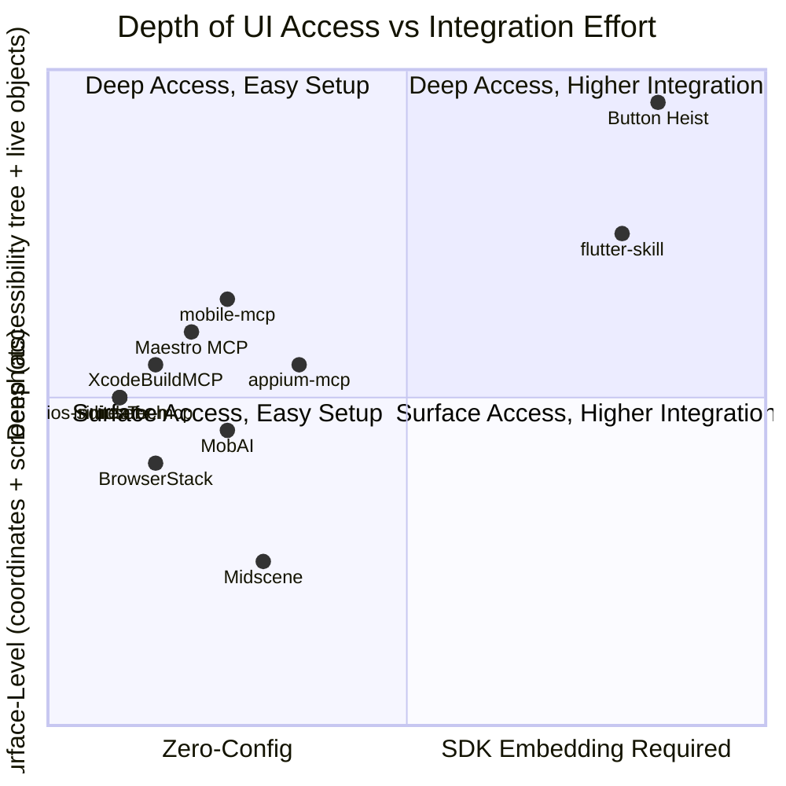

# Competitive Landscape: MCP Servers for Mobile UI Automation

The space of MCP servers that let AI agents control mobile UIs has exploded since late 2024. This document maps the full competitive landscape, categorized by architecture and approach, with Button Heist positioned against each.

## Market Map

## Architecture Taxonomy

Every tool in this space falls into one of five architectural categories. The category determines what data the tool can access and how reliably it can interact with apps.

| Architecture | How it works | Access depth | Examples |
|---|---|---|---|
| **In-process embedded** | Framework linked into the app; runs inside the app's process | Full: live `UIAccessibility` objects, touch synthesis | **Button Heist**, flutter-skill |
| **External via idb/simctl** | Shells out to Apple CLI tools from a Node.js/Python MCP server | Medium: AXPTranslator-bridged accessibility tree, coordinate taps | ios-simulator-mcp, InditexTech, iosef, whitesmith |
| **External via Appium/WDA** | Routes through WebDriverAgent running on the device/simulator | Medium: XCUITest accessibility, W3C gestures | appium-mcp, mobile-mcp, Lakr233/iphone-mcp |
| **Vision-based** | Screenshots → VLM → coordinates; no accessibility tree for actions | Low: whatever the model can see in pixels | Midscene |
| **Cloud device farm** | MCP server proxies to remote real device fleet | Medium: depends on backend (usually Appium) | BrowserStack, LambdaTest |

### What the architecture determines

**In-process** tools (us, flutter-skill) get live object references. This means:
- Call `accessibilityActivate()` directly on elements instead of computing tap coordinates
- Read `activationPoint`, `customContent`, `customRotors`, `respondsToUserInteraction` — properties that don't survive XPC serialization
- Inject real `IOHIDEvent` touches indistinguishable from hardware input
- Detect animation completion and UI idle state

**External** tools lose all of this at the process boundary. They get serialized dictionaries, not live objects.

## Tier 1: Direct Competitors (iOS-focused MCP servers)

These tools compete directly with Button Heist for the same use case: letting AI agents control iOS app UIs.

---

### ios-simulator-mcp (joshuayoes)

[GitHub](https://github.com/joshuayoes/ios-simulator-mcp) | ~1,800 stars | TypeScript/Node.js

The most widely referenced iOS-only MCP tool. Featured in Anthropic's engineering blog. See [ios-simulator-mcp-comparison.md](./ios-simulator-mcp-comparison.md) for the deep-dive.

**Architecture**: Node.js → idb CLI (Python) → gRPC → idb_companion → AXPTranslator → CoreSimulator XPC → Simulator. Five layers of indirection.

**Key limitations vs us**:
- Coordinate-only interactions (no element-level `activate`)
- No interface deltas, animation detection, or idle waiting
- No multi-touch gestures (pinch, rotate, bezier paths)
- No accessibility actions (`increment`, `decrement`, custom actions)
- No physical device support
- Depends on Facebook's idb, which is deprecated/archived

**What they have that we don't**: Zero integration (works with any app), `npx` install, built-in app install/launch, simulator lifecycle management.

---

### XcodeBuildMCP (Sentry)

[GitHub](https://github.com/getsentry/XcodeBuildMCP) | ~4,900 stars | Node.js

The largest iOS-native MCP tool by stars. Created by Cameron Cooke, acquired by Sentry in 2025. Focused on the full Apple development workflow rather than pure UI automation.

**Architecture**: MCP server wrapping `xcodebuild`, `xcrun simctl`, and Xcode tooling. 78+ tools across 10 workflow groups. No embedded SDK.

**Capabilities**: Build, test, debug, deploy, simulator lifecycle, accessibility inspection, gesture simulation, crash analysis, SPM operations, project scaffolding.

**Overlap with us**: Simulator gesture simulation and accessibility inspection overlap, but at a surface level — they go through simctl, not in-process.

**Differentiation**: XcodeBuildMCP is a *development workflow* tool. It builds your project, runs your tests, manages simulators. We are a *runtime inspection and interaction* tool. We see the live accessibility tree, detect animations, inject real touches. These are complementary, not competing — an agent could use XcodeBuildMCP to build and deploy, then Button Heist to interact with the running app.

**Assessment**: Not a direct competitor. Different layer of the stack. Potential integration partner.

---

### mobile-mcp (mobile-next)

[GitHub](https://github.com/mobile-next/mobile-mcp) | ~4,100 stars | TypeScript/Node.js

Cross-platform (iOS + Android). The most serious competitor for agents that need to work across both platforms.

**Architecture**: Three-layer: agent → MCP server → platform layer. iOS: uses WebDriverAgent + `go-ios` for real devices, simctl for simulators. Android: ADB + Android SDK. Prefers accessibility trees over screenshots.

**Capabilities**: Launch/terminate/install apps, screenshot, tap by accessibility element or coordinates, text input, swipe, accessibility snapshots, multi-step automation.

**Key limitations vs us**:
- iOS real device setup is non-trivial (must build and deploy WebDriverAgent, install go-ios)
- Accessibility data goes through XCUITest/WDA serialization — loses activation points, custom content, custom rotors, `respondsToUserInteraction`
- No interface deltas or animation detection
- No multi-touch gestures
- No `scroll_to_visible`, `scroll_to_edge`, or direct `UIScrollView` manipulation
- No accessibility actions (`increment`, `decrement`, custom actions)

**What they have that we don't**: Android support. Zero integration on iOS (no SDK embedding). App lifecycle management. Cross-platform story for teams testing both platforms.

**Assessment**: Strongest cross-platform competitor. Their accessibility-first approach is philosophically similar to ours, but they're limited by operating outside the app process.

---

### iosef (riwsky)

[GitHub](https://github.com/riwsky/iosef) | ~5 stars | Swift-native

The only other Swift-native MCP server in the space. Interesting architectural choice: no idb dependency, no Node.js runtime. Direct use of Xcode simulator frameworks.

**Architecture**: Swift CLI + MCP server. Stateless CLI invocations, state tracked in `.iosef/state.json`. Native simulator framework access.

**Capabilities**: Accessibility tree traversal with element selection by role/name/identifier. Coordinate and selector-based taps. Screenshot. App install/launch. System logs.

**Key limitations vs us**: Very early stage (5 stars, created Feb 2026). No live object access (still outside the process). No multi-touch, no animation detection, no interface deltas.

**What's interesting**: The Swift-native, no-idb approach is the right architectural direction for an external tool. Avoids the idb deprecation risk that affects joshuayoes, InditexTech, and whitesmith. Worth watching.

---

### InditexTech/mcp-server-simulator-ios-idb

[GitHub](https://github.com/InditexTech/mcp-server-simulator-ios-idb) | ~301 stars | Node.js

Corporate-backed (Inditex — Zara parent company). Adds a natural-language parsing layer on top of idb.

**Architecture**: Three components: `IDBManager` (idb wrapper), `NLParser` (natural language → commands), `MCPOrchestrator`. The NLP layer is unique in this space.

**Capabilities**: Full idb surface plus simulator lifecycle, crash logs, location simulation, media injection, keychain operations.

**Assessment**: Same idb limitations as joshuayoes but with richer simulator management. The NLP layer is an interesting differentiator but largely redundant when the MCP client is already an LLM. Development appears to have slowed (last commit Dec 2024).

---

### Lakr233/iphone-mcp

[GitHub](https://github.com/Lakr233/iphone-mcp) | ~122 stars | Python

Focused specifically on physical iPhone control via Appium/WebDriverAgent.

**Architecture**: Python MCP server → Appium → WebDriverAgent on physical device. Streamable HTTP transport (not just stdio).

**Capabilities**: Device info, app listing, screenshot, UI elements, tap, swipe, text input, app launch.

**Assessment**: Niche — physical-device-only. Requires full Appium + WDA setup. We cover physical devices natively via USB tunnel without requiring Appium.

---

## Tier 2: Cross-Platform and Framework Tools

These tools serve a broader market but overlap with parts of our capability set.

---

### appium-mcp (Official)

[GitHub](https://github.com/appium/appium-mcp) | ~258 stars | TypeScript/Node.js

The official Appium MCP integration. 40+ tools. Backed by LambdaTest engineers.

**Architecture**: Wraps Appium's WebDriver protocol. Supports XCUITest (iOS) and UiAutomator2 (Android). AI vision-based element finding via external VLM providers (Qwen3-VL, Gemini).

**Capabilities**: Session management, element discovery, gestures, app management, AI-powered element finding, test code generation, Page Object Model support.

**Key limitations vs us**: High setup overhead (Appium server + drivers + JDK). Typical action latency 2-4 seconds. Accessibility data limited to what XCUITest exposes (no activation points, custom content, custom rotors). No interface deltas, no animation detection.

**Assessment**: The "enterprise standard" approach. If you're already running Appium, this is a natural MCP layer. For teams building new iOS-focused workflows, the setup cost and latency are significant downsides.

---

### Maestro MCP

[Docs](https://docs.maestro.dev/get-started/maestro-mcp) | Built into Maestro CLI

Official MCP support built into the Maestro mobile testing framework. 14 tools. Works with iOS and Android.

**Architecture**: `maestro mcp` command starts an MCP server (stdio, HTTP, WebSocket). All interactions go through Maestro's existing test infrastructure.

**Capabilities**: `list_devices`, `start_device`, `launch_app`, `stop_app`, `tap_on`, `input_text`, `take_screenshot`, `inspect_view_hierarchy`, `run_flow`.

**Key limitations vs us**: Maestro DSL/flow files are the primary abstraction — agents work within Maestro's paradigm, not arbitrary UI control. 14 tools vs our 16. No multi-touch, no interface deltas, no animation detection.

**Assessment**: Strong choice for teams already using Maestro for mobile testing. The flow-based paradigm is a constraint for exploratory UI interaction — agents can't freely navigate the way they can with Button Heist.

---

### Midscene

[GitHub](https://github.com/web-infra-dev/midscene) | ~12,300 stars | TypeScript

The most popular tool in the broader space by star count, but uses a fundamentally different approach: pure vision-based UI interaction.

**Architecture**: Screenshots → VLM (Qwen3-VL, Gemini, etc.) → coordinates. No accessibility tree for actions. Supports web, iOS (via WDA), Android (via ADB + scrcpy), desktop.

**Capabilities**: `aiTap` (click by natural language description), text input, scroll, wait, assert. Truly cross-platform.

**Key limitations vs us**: Every action requires a VLM API call — adds latency and cost. No accessibility tree means no semantic understanding of element types, states, or relationships. Cannot call `accessibilityActivate()`, `increment()`, `decrement()`, or any accessibility actions. Coordinate-only interaction. No interface deltas, no animation detection.

**Assessment**: Different philosophy entirely. Midscene bets on vision models getting good enough to replace structured accessibility data. We bet on structured data being fundamentally more reliable and faster. Both can be right for different use cases — Midscene excels at testing arbitrary third-party apps where you can't embed an SDK; we excel at deep, reliable automation of apps you're building.

---

### flutter-skill

[GitHub](https://github.com/ai-dashboad/flutter-skill) | ~98 stars | Node.js

The only other tool in the space that uses the **in-process embedded** architecture pattern. 253 MCP tools across 10 platforms.

**Architecture**: SDK embedded in the target app (similar to us). Communicates directly with app runtime. Claims 1-2ms tap latency vs 50-100ms for external tools.

**Platforms**: Flutter, React Native, Electron, Tauri, Android (Kotlin), KMP Desktop, .NET MAUI, iOS (Swift/UIKit), Web.

**Assessment**: Architecturally closest to us. Validates the embedded approach. Their breadth (10 platforms, 253 tools) vs our depth (iOS-focused, 16 tools with deep accessibility integration) represents opposite trade-offs. Their iOS/UIKit support appears to be newer and less mature than their Flutter core.

---

### MobAI

[GitHub](https://github.com/MobAI-App/mobai-mcp) | ~48 stars | TypeScript + Desktop App

Desktop app (macOS/Windows/Linux) + MCP server sidecar. MobAI Script DSL for cross-platform test authoring.

**Architecture**: MCP server communicates with local MobAI desktop app on `localhost:8686` via REST. Closed-source desktop app, open-source MCP layer.

**Capabilities**: Device control, web automation (CSS selectors + JS), autonomous agent mode, screenshot, App Store screenshot automation, parallel testing (Pro tier).

**Assessment**: Commercial product with freemium pricing ($0 for 1 device, $9.99/month Pro). The closed-source desktop app dependency is a significant lock-in risk. Not a serious competitive threat for the developer tool market.

---

## Prior Art: Embedded Debug Tools

These tools aren't MCP servers or agent-driven — they're human-operated debug tools. But they share our embedded architecture and validate the approach. iOS developers already accept embedding debug frameworks into their apps.

---

### Reveal

[Website](https://revealapp.com) | Mantel Group (acquired Itty Bitty Apps, 2022) | $179/year per license

The gold standard for iOS runtime UI inspection. Embeds `RevealServer.xcframework` into the app's debug build, connects over Bonjour or USB to a macOS companion app.

**Architecture**: Embedded framework (auto-initializes, no code required) → Bonjour/USB → Reveal.app on Mac. Same in-process access pattern as TheInsideJob.

**Three workspaces**:
- **Layout**: 3D view hierarchy visualization, Auto Layout constraint inspection, live editing of frames/colors/fonts/constraints
- **Accessibility**: VoiceOver labels, traits, hints, `AXCustomContent` (which Xcode's own inspector doesn't show), Voice Control compatibility, traversal order
- **Insights**: Performance and memory diagnostics

**What Reveal proves for our argument**:
- iOS developers pay $179/year for a tool that requires embedding a framework. The integration pattern is accepted.
- Reveal inspects the *same* accessibility data we expose — `AXCustomContent`, traversal order, traits — and considers it valuable enough for a dedicated workspace. This data is exactly what external MCP tools lose at the process boundary.
- Reveal is human-only: no CLI, no API, no scripting, no automation. The rich in-process data it accesses has never been made available to agents. We're the first.

**Key differences from us**: Reveal is a *visual inspection* tool for humans. It shows the view hierarchy in a 3D canvas. It can modify views at runtime. It cannot tap, swipe, scroll, or automate anything. It has no MCP server, no agent interface, no programmatic access at all.

---

### FLEX (Flipboard Explorer)

[GitHub](https://github.com/FLEXTool/FLEX) | 14,600 stars | Free / open-source (BSD)

In-app debug overlay. Unlike Reveal, FLEX has no external companion — everything runs inside the app as a floating toolbar.

**Architecture**: Embedded framework, entirely in-process. Triggered by a debug gesture; presents an overlay UI within the app itself.

**Capabilities**: View hierarchy inspection, heap object scanning, network monitor (hooks URLSession), file system browser, SQLite/Realm browser, NSUserDefaults editor, live console, class explorer (including private APIs), dynamic method invocation.

**What FLEX proves for our argument**:
- 14,600 stars. iOS developers widely adopt embedded debug frameworks.
- FLEX goes deeper than view inspection — heap scanning, database browsing, method invocation. Developers are comfortable with invasive in-process tools in debug builds.
- Like Reveal: human-only. No API, no scripting, no agent interface.

---

### Flipper (Meta) — Archived

[GitHub](https://github.com/facebook/flipper) | Archived September 2025

Desktop debugging platform for iOS, Android, and React Native. Embedded SDK in the app connected to a desktop companion (Electron, later browser-based).

**Architecture**: Same embedded pattern — SDK in the app, external UI on the desktop. Plugin architecture for extensibility.

**Why the archival matters**: Meta concluded that a monolithic cross-platform debug platform was too hard to maintain. They're replacing it with purpose-built per-platform tools. This validates our iOS-focused depth over cross-platform breadth.

---

## Tier 3: Android-Only Tools

These don't compete with us directly (we're iOS-focused) but define the Android side of the landscape.

| Tool | Stars | Architecture | Notes |
|---|---|---|---|
| [minhalvp/android-mcp-server](https://github.com/minhalvp/android-mcp-server) | ~709 | Python, ADB | Highest-starred Android-only. Layout analysis, screenshot, ADB commands. |
| [CursorTouch/Android-MCP](https://github.com/CursorTouch/Android-MCP) | ~470 | Python, ADB + Accessibility API | Uses structured UI tree, no VLM required. 2-4s latency. |
| [hao-cyber/phone-mcp](https://github.com/hao-cyber/phone-mcp) | ~217 | Python, ADB | Broadest Android scope: calling, SMS, contacts, UI, location. |
| [erichung9060/Android-Mobile-MCP](https://github.com/erichung9060/Android-Mobile-MCP) | ~5 | Python, ADB | Validates interactions against current UI state before executing. |
| [landicefu/android-adb-mcp-server](https://github.com/landicefu/android-adb-mcp-server) | ~34 | JavaScript, ADB | Multi-device, clipboard integration. npm package. |
| [droid-mcp](https://pypi.org/project/droid-mcp/) | N/A | Python, FastMCP | Multi-device auto-discovery, logcat streaming. |
| [srmorete/adb-mcp](https://github.com/srmorete/adb-mcp) | ~9 | TypeScript, ADB | Basic wrapper. Had a command injection CVE. |

**Pattern**: Every Android tool is ADB-based. None use an in-process embedded approach. The Android equivalent of Button Heist doesn't exist yet (except flutter-skill's Android support).

---

## Tier 4: Enterprise Cloud

| Tool | Architecture | Key Differentiator |
|---|---|---|
| [BrowserStack MCP](https://www.browserstack.com/docs/browserstack-mcp-server/overview) | MCP → BrowserStack cloud API → real device fleet | Thousands of real devices. Launched June 2025. Paid. |
| [LambdaTest HyperExecute MCP](https://www.lambdatest.com/blog/introducing-lambdatest-mcp-servers/) | MCP → HyperExecute cloud | Appium strategic partner. First Appium 3 Beta support. Paid. |

**Assessment**: Enterprise CI/CD tools. Not competing for the developer-workflow use case. Relevant if agents need to test on dozens of device configurations.

---

## Tier 5: Niche and Emerging

| Tool | Stars | Focus |
|---|---|---|
| [react-native-devtools-mcp](https://github.com/pnarayanaswamy/react-native-devtools-mcp) | ~1 | React Native-specific. Unique Metro bundler integration for JS eval. |
| [atom2ueki/mcp-server-ios-simulator](https://github.com/atom2ueki/mcp-server-ios-simulator) | ~42 | Built on `appium-ios-simulator`. Coordinate-only. |
| [JoshuaRileyDev/simulator-mcp-server](https://github.com/JoshuaRileyDev/simulator-mcp-server) | ~51 | Simulator lifecycle only. No UI automation. |
| [chuk-mcp-ios-simulator](https://github.com/chrishayuk/chuk-mcp-ios-simulator) | ~5 | Python. CLI has bugs; MCP server recommended. Dormant. |
| [whitesmith/ios-simulator-mcp](https://github.com/whitesmith/ios-simulator-mcp) | ~5 | Python hybrid (simctl + idb). Compresses screenshots to JPEG. |
| [iHackSubhodip/mobile-automation-mcp-server](https://github.com/iHackSubhodip/mobile-automation-mcp-server) | ~30 | Python FastMCP. Appium/WDA backend. Cloud deploy on Railway. |
| [jsuarezruiz/mobile-dev-mcp-server](https://github.com/jsuarezruiz/mobile-dev-mcp-server) | ~42 | The only .NET/C# tool in the space. ADB + idb. Dormant. |
| [AppiumTestDistribution/mcp-webdriveragent](https://github.com/AppiumTestDistribution/mcp-webdriveragent) | ~25 | Not UI automation — automates WDA build/sign/deploy. Setup tool. |
| [Rahulec08/appium-mcp](https://github.com/Rahulec08/appium-mcp) | ~60 | Unofficial Appium wrapper. W3C gestures. Dormant. |
| [maestro-mcp (community)](https://github.com/slapglif/maestro-mcp) | ~1 | Community Maestro wrapper (vs official `maestro mcp`). |

---

## Competitive Matrix: Key Capabilities

| Capability | Button Heist | ios-sim-mcp | mobile-mcp | XcodeBuildMCP | appium-mcp | Maestro | Midscene | flutter-skill |
|---|---|---|---|---|---|---|---|---|
| **Interface tree** | In-process, full fidelity | idb/AXPTranslator | WDA/XCUITest | simctl | Appium | Maestro | VLM from screenshot | In-process |
| **Interface deltas** | Yes | No | No | No | No | No | No | No |
| **Animation detection** | Yes | No | No | No | No | No | No | Unknown |
| **Wait for idle** | Yes | No | No | No | No | No | No | Unknown |
| **Element-level tap** | Yes (`activate`) | No (coordinates) | Yes | Limited | Yes | Yes | VLM-inferred | Yes |
| **Multi-touch** | Pinch, rotate, 2-finger, bezier | No | No | No | Limited | No | No | Unknown |
| **Scroll semantics** | `scroll`, `scroll_to_visible`, `scroll_to_edge` | Swipe-based | Swipe-based | Limited | Appium scroll | Maestro scroll | VLM-driven | Unknown |
| **AX actions** | `increment`, `decrement`, custom actions | No | No | No | Limited | No | No | Unknown |
| **Real touch injection** | IOHIDEvent (hardware-identical) | XPC coordinates | WDA touch | simctl | Appium | Maestro | Coordinates | SDK-level |
| **Physical devices** | Yes (USB tunnel) | No | Yes (WDA + go-ios) | With signing | Yes (Appium) | Yes | Yes (WDA) | Yes |
| **Android** | No | No | Yes | No | Yes | Yes | Yes | Yes |
| **Zero integration** | No (SDK embed) | Yes | Yes | Yes | Yes | Yes | Yes | No (SDK embed) |
| **App lifecycle** | No | Yes | Yes | Yes | Yes | Yes | Yes | Yes |
| **Screen recording** | Yes (with event log) | Yes | No | No | No | No | No | Unknown |
| **Stars** | Private | ~1,800 | ~4,100 | ~4,900 | ~258 | Built-in | ~12,300 | ~98 |

---

## Structural Risks and Trends

### idb Deprecation

Facebook has deprecated/archived `idb`. Tools that depend on it (joshuayoes, InditexTech, whitesmith, chuk) face a supply-chain risk. The community is maintaining it but without official Facebook support. `iosef`'s Swift-native approach and `mobile-mcp`'s WDA approach sidestep this entirely.

### WDA Fragility

WebDriverAgent must be built from source for each Xcode version, signed for physical devices, and deployed to the target. Tools that depend on WDA (mobile-mcp, appium-mcp, Midscene iOS, Lakr233) inherit this complexity. Apple can break WDA at any Xcode release. Our in-process approach avoids WDA entirely.

### Vision vs Structure

Midscene (12,300 stars) represents a bet that VLMs will replace structured accessibility data for UI automation. The trade-offs are clear:

| | Vision (Midscene) | Structure (Button Heist) |
|---|---|---|
| Works with any app | Yes | No (SDK embed) |
| Deterministic | No (VLM variability) | Yes |
| Latency per action | VLM API call (~500ms-2s) | Direct (~1-5ms) |
| Cost per action | VLM token cost | Zero |
| Semantic understanding | Whatever the model infers | Exact (labels, traits, states, actions) |
| Custom actions | No | Yes |

For apps you're building (where you can embed the SDK), structured access is strictly better. For testing arbitrary third-party apps, vision is the only option.

### The Embedding Trade-Off

Our biggest perceived disadvantage is the SDK embedding requirement. Every external MCP tool works with any app out of the box. We require linking TheInsideJob into the target app.

However, the prior art section above demonstrates this pattern is already widely accepted: Reveal ($179/year), FLEX (14.6k stars), and the late Flipper all embed frameworks into debug builds. iOS developers do this routinely. The integration cost is not novel — it's the standard debug tool on-ramp.

More importantly, the embedding requirement is also our moat. It is what enables:
- Live object references (no serialization loss)
- Real IOHIDEvent touch injection
- Animation detection and idle waiting
- Interface deltas
- Direct accessibility actions (activate, increment, decrement, custom)
- Custom content and custom rotors
- Activation points

No external tool can replicate these capabilities without running inside the app process.

### Consolidation Signals

Sentry acquiring XcodeBuildMCP (2025) and LambdaTest investing in appium-mcp signal that larger companies see MCP-for-mobile as strategically important. Expect more acquisitions and consolidation. The tools most likely to survive long-term are those backed by companies (XcodeBuildMCP/Sentry, appium-mcp/LambdaTest, BrowserStack, Maestro) or those with unique architectural advantages (us).

---

## Where We Win

1. **Deepest accessibility data in the space.** No other tool captures activation points, custom content, custom rotors, `respondsToUserInteraction`, or traversal order. idb/WDA/Appium can't — the data doesn't survive process boundaries.

2. **Interface deltas.** Unique to us. Every other tool makes the agent re-fetch the full tree after each action to figure out what changed.

3. **Animation detection and idle waiting.** Unique to us. Every other tool either guesses (fixed sleep) or relies on the agent to screenshot and check.

4. **Real touch injection.** IOHIDEvent touches are indistinguishable from hardware. idb sends coordinates over XPC; Appium uses XCUITest's synthetic taps; Midscene sends coordinates derived from vision.

5. **Multi-touch gestures.** Pinch, rotate, two-finger tap, bezier paths, polyline. No other MCP tool in the space offers this.

6. **Physical device support without WDA.** We connect via USB tunnel. No Appium, no WebDriverAgent, no go-ios.

## Where We Lose

1. **SDK embedding requirement.** Every external tool works with any app. We require linking a framework.

2. **No Android.** mobile-mcp, appium-mcp, Maestro, Midscene all cover both platforms.

3. **No app lifecycle management.** No install, launch, terminate. Must be done manually via simctl.

4. **No npx/pip install.** Build from source only.

5. **Star count / discoverability.** Private repo vs tools with 1,800-12,300 stars.

---

## Emerging Threats to Watch

| Company/Tool | Why watch |
|---|---|
| **QualGent** (Y Combinator S24) | Claims to be building an MCP server for mobile. Not yet public. YC-backed = potential fast scaling. |
| **Pie** (Product Hunt) | MCP handoffs for iOS/Android/web QA. Details sparse but product-focused. |
| **TestSprite** | Commercial MCP for iOS/Swift testing. Closed SaaS, no public repo. |
| **iosef** | Swift-native, no idb. Architecturally sound. If it gains traction, could become the "better ios-simulator-mcp." |
| **flutter-skill** | Only other in-process embedded tool. If their iOS/UIKit support matures, closest architectural competitor. |

---

## Links

### Tier 1 (iOS Direct Competitors)
- [ios-simulator-mcp](https://github.com/joshuayoes/ios-simulator-mcp)
- [XcodeBuildMCP](https://github.com/getsentry/XcodeBuildMCP)
- [mobile-mcp](https://github.com/mobile-next/mobile-mcp)
- [iosef](https://github.com/riwsky/iosef)
- [InditexTech](https://github.com/InditexTech/mcp-server-simulator-ios-idb)
- [Lakr233/iphone-mcp](https://github.com/Lakr233/iphone-mcp)

### Tier 2 (Cross-Platform)
- [appium-mcp](https://github.com/appium/appium-mcp)
- [Maestro MCP](https://docs.maestro.dev/get-started/maestro-mcp)
- [Midscene](https://github.com/web-infra-dev/midscene)
- [flutter-skill](https://github.com/ai-dashboad/flutter-skill)
- [MobAI](https://github.com/MobAI-App/mobai-mcp)

### Tier 3 (Android)
- [minhalvp/android-mcp-server](https://github.com/minhalvp/android-mcp-server)
- [CursorTouch/Android-MCP](https://github.com/CursorTouch/Android-MCP)
- [hao-cyber/phone-mcp](https://github.com/hao-cyber/phone-mcp)

### Tier 4 (Enterprise)
- [BrowserStack MCP](https://www.browserstack.com/docs/browserstack-mcp-server/overview)
- [LambdaTest MCP](https://www.lambdatest.com/blog/introducing-lambdatest-mcp-servers/)

### Prior Art (Embedded Debug Tools)
- [Reveal](https://revealapp.com) — runtime UI inspector (Mantel Group, $179/year)
- [FLEX](https://github.com/FLEXTool/FLEX) — in-app debug overlay (14.6k stars, open-source)
- [Flipper](https://github.com/facebook/flipper) — Meta's desktop debugger (archived Sep 2025)

### Other References
- [Sentry acquires XcodeBuildMCP](https://blog.sentry.io/sentry-acquires-xcodebuildmcp/)
- [facebook/idb](https://github.com/facebook/idb) (deprecated)
- [idb accessibility docs](https://fbidb.io/docs/accessibility/)
