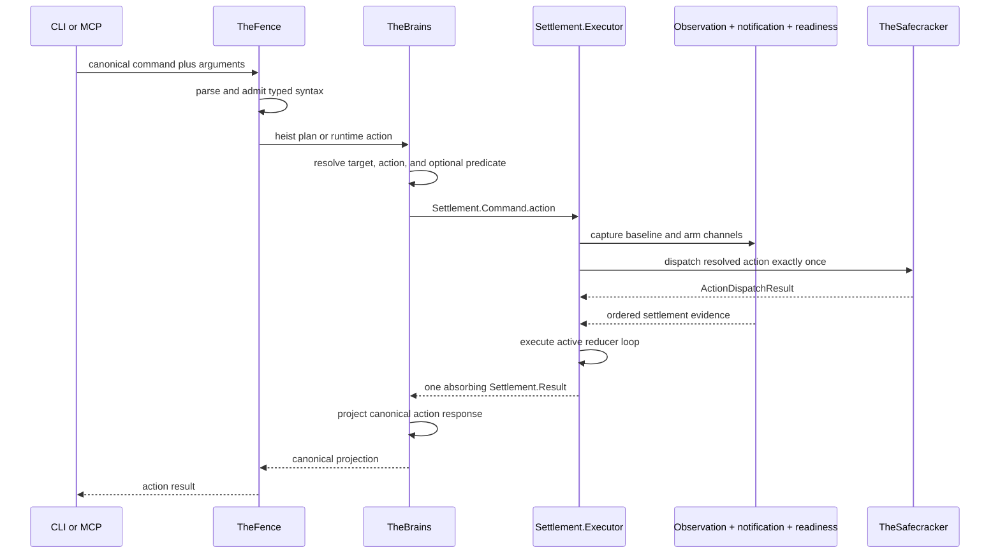

# Action Pipeline

One action end to end: resolve typed syntax, establish an evidence boundary,
arm settlement, dispatch exactly once, and return one projection of the
canonical `Settlement.Result`.
Reducer state, event ordering, phase deadlines, handoff, and cleanup are owned
by the [settlement loop](settle-loop.md).

**Illustrates:** [ARCHITECTURE.md](../ARCHITECTURE.md), [API.md](../API.md),
[WIRE-PROTOCOL.md](../WIRE-PROTOCOL.md)

**Source of truth:**
`ButtonHeist/Sources/TheInsideJob/TheBrains/TheBrains+HeistActionExecution.swift`,
`ButtonHeist/Sources/TheInsideJob/TheBrains/Settlement.swift`,
`ButtonHeist/Sources/TheInsideJob/TheBrains/Settlement+Execution.swift`,
`ButtonHeist/Sources/TheInsideJob/TheBrains/Settlement+Reducer.swift`,
`ButtonHeist/Sources/TheInsideJob/TheBrains/Settlement+ResultProjection.swift`,
`ButtonHeist/Sources/TheInsideJob/TheSafecracker/ActionDispatchResult.swift`,
`ButtonHeist/Sources/TheInsideJob/TheTripwire/AccessibilityNotificationBus.swift`,
`ButtonHeist/Sources/TheScore/Reports/ActionResult.swift`

