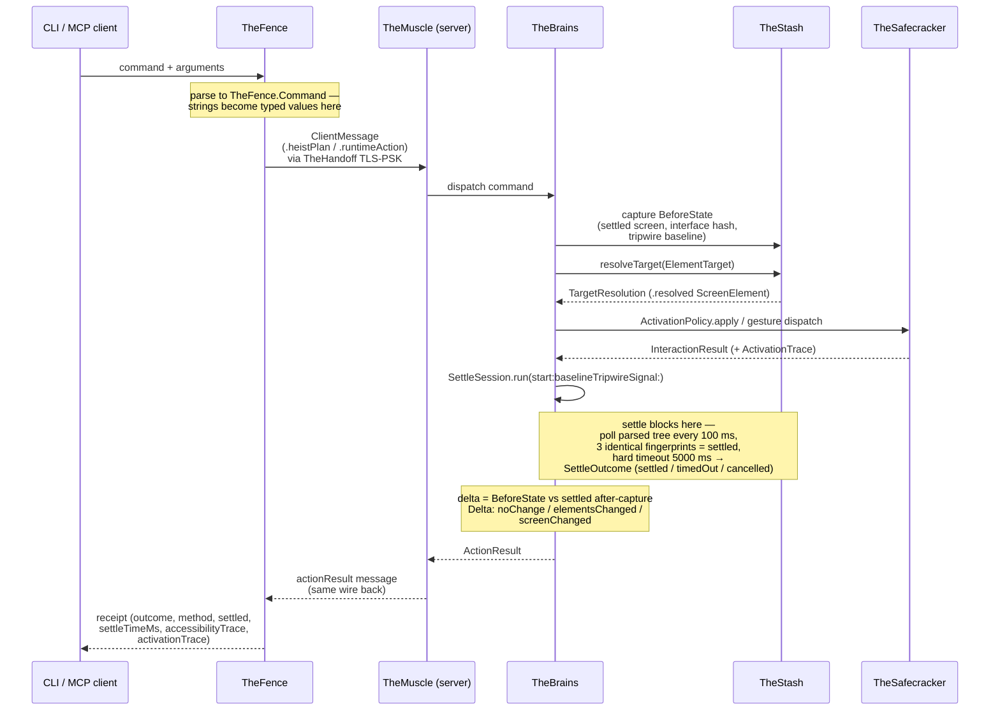

# Action Pipeline

One action end to end: a command enters at TheFence, crosses the wire, resolves to a live element, activates, waits for the accessibility tree to settle, and returns a receipt whose delta is derived from two settled captures. This diagram answers "what happens between `buttonheist action activate ...` and the JSON that comes back?"

**Illustrates:** [ARCHITECTURE.md](../ARCHITECTURE.md), [API.md](../API.md), [WIRE-PROTOCOL.md](../WIRE-PROTOCOL.md)
**Source of truth:** `ButtonHeist/Sources/TheButtonHeist/TheFence/TheFence+ExecutionPipeline.swift`, `ButtonHeist/Sources/TheInsideJob/TheBrains/TheBrains+HeistActionExecution.swift`, `ButtonHeist/Sources/TheInsideJob/TheBrains/PostActionObservation.swift`, `ButtonHeist/Sources/TheInsideJob/TheBrains/SettleSession.swift`, `ButtonHeist/Sources/TheScore/Reports/ActionResultPayloads.swift`, `ButtonHeist/Sources/TheScore/Evidence/AccessibilityTrace+Delta.swift`

Notes:

- The before-state is captured **before** the action is delivered (`PostActionObservation.captureSemanticState`), and the delta is computed from two settled captures — never from raw mid-animation reads.
- Settle blocks the pipeline: the response does not leave the app until `SettleSession` reaches a terminal `SettleOutcome`. A `timedOut` outcome is reported as `settled: false` in the receipt, never passed off as stable.
- The delta classification lives in `AccessibilityTrace.Delta`: `noChange`, `elementsChanged` (same screen, element-level edits), or `screenChanged` (screen identity changed).
