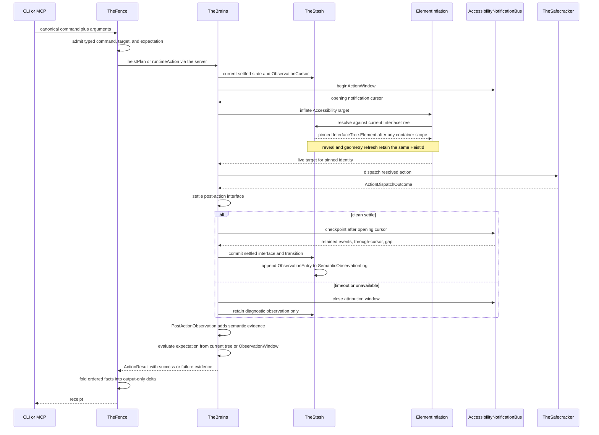

# Action Pipeline

One action end to end: a typed command crosses the wire, resolves one
`AccessibilityTarget`, dispatches into one `ActionDispatchOutcome`, settles,
appends to the retained observation log, and returns state-shaped evidence.

**Illustrates:** [ARCHITECTURE.md](../ARCHITECTURE.md), [API.md](../API.md), [WIRE-PROTOCOL.md](../WIRE-PROTOCOL.md)
**Source of truth:** `ButtonHeist/Sources/TheButtonHeist/TheFence/TheFence+RequestPayload.swift`, `ButtonHeist/Sources/TheInsideJob/TheBrains/TheBrains+HeistActionExecution.swift`, `ButtonHeist/Sources/TheInsideJob/TheBrains/ElementInflation.swift`, `ButtonHeist/Sources/TheInsideJob/TheBrains/InteractionObservation.swift`, `ButtonHeist/Sources/TheInsideJob/TheBrains/PostActionObservation.swift`, `ButtonHeist/Sources/TheInsideJob/TheSafecracker/ActionDispatchOutcome.swift`, `ButtonHeist/Sources/TheInsideJob/TheStash/SemanticObservationLog.swift`, `ButtonHeist/Sources/TheInsideJob/TheTripwire/AccessibilityNotificationBus.swift`, `ButtonHeist/Sources/TheScore/Reports/ActionResult.swift`, `ButtonHeist/Sources/TheScore/Reports/ActionResultEvidence.swift`, `ButtonHeist/Sources/TheButtonHeist/TheFence/DeltaProjection.swift`

Notes:

- `AccessibilityTarget` is the only target currency. Element, container, and
  descendant-scoped targets resolve through the same current tree used by
  waits, expectations, and `get_interface` selection.
- Semantic resolution pins one committed `HeistId`. Reveal, refresh, geometry
  stabilization, and dispatch cannot switch to another semantic match.
- `ActionDispatchOutcome` is the sole pre-observation dispatch result.
  `PostActionObservation` adds settlement and trace evidence directly to that
  outcome to produce `ActionResult`.
- Success and failure evidence share one body, but warning-bearing evidence is
  constructible only for success. Observation is exactly one of `none`,
  `announcement`, `trace`, or `settledTrace`.
- Notification checkpointing is non-destructive. A failed settle does not
  attach the selected events to settled evidence, but it does not erase ingress
  history for another cursor.
- A clean commit appends one typed observation entry. Presence expectations read
  current state; temporal expectations consume a baseline-to-current window.
- Public delta is a lossy output fold. Predicate evaluation never reads it.
