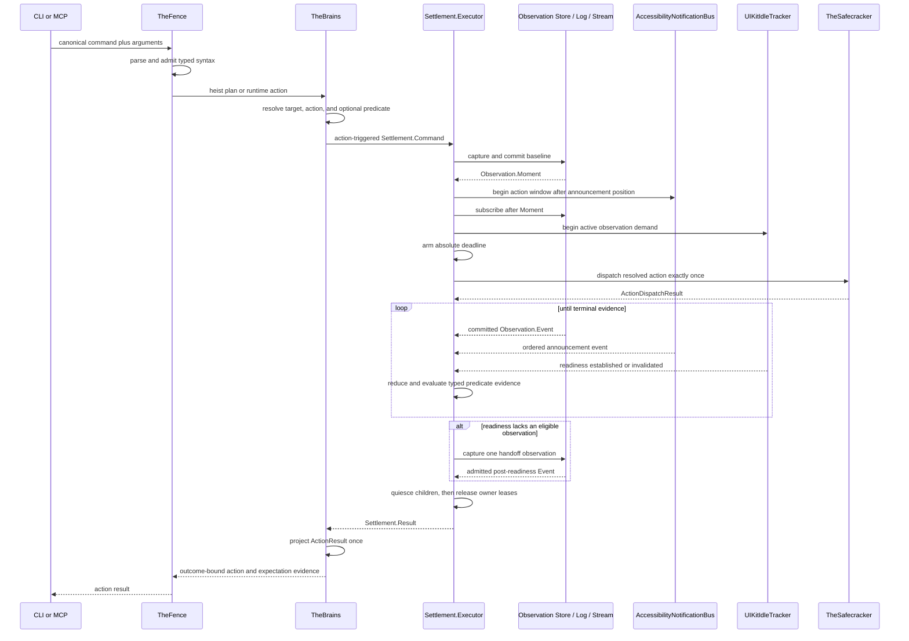

# Action Pipeline

One action end to end: resolve typed syntax, establish an evidence boundary,
arm settlement, dispatch exactly once, and return one projection of the
canonical `Settlement.Result`.

**Illustrates:** [ARCHITECTURE.md](../ARCHITECTURE.md), [API.md](../API.md),
[WIRE-PROTOCOL.md](../WIRE-PROTOCOL.md)

**Source of truth:**
`ButtonHeist/Sources/TheInsideJob/TheBrains/TheBrains+HeistActionExecution.swift`,
`ButtonHeist/Sources/TheInsideJob/TheBrains/Settlement.swift`,
`ButtonHeist/Sources/TheInsideJob/TheBrains/Settlement+Execution.swift`,
`ButtonHeist/Sources/TheInsideJob/TheBrains/Settlement+Reducer.swift`,
`ButtonHeist/Sources/TheInsideJob/TheBrains/Settlement+ResultProjection.swift`,
`ButtonHeist/Sources/TheInsideJob/TheSafecracker/ActionDispatchResult.swift`,
`ButtonHeist/Sources/TheInsideJob/TheTripwire/AccessibilityNotificationBus.swift`,
`ButtonHeist/Sources/TheScore/Reports/ActionResult.swift`

Notes:

- The evidence channels are armed before dispatch, so synchronous hierarchy
  changes and announcements cannot be missed.
- `AccessibilityTarget` is the only target currency. Crossing a capture
  boundary requires semantic re-resolution before a capture-local `HeistId`
  can join to live UIKit evidence.
- An attached expectation is evaluated inside action settlement. There is no
  post-action `waitFor` and no second timeout.
- Current-state predicates must hold in the returned handoff. Positive
  transitions and announcements may latch qualifying post-baseline events.
- Completion requires successful dispatch, optional predicate satisfaction,
  trustworthy readiness, and a handoff admitted for that readiness generation.
- `Settlement.ResultProjector` is the only action-result assembly path. Public
  delta remains a lossy output fold and never becomes evaluator input.
