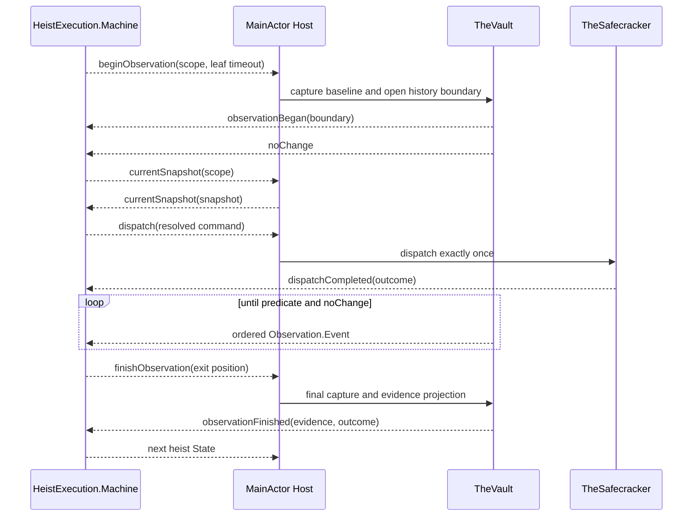

# Action Pipeline

One durable action is a leaf in the complete-heist machine. The machine opens
observation before dispatch, evaluates every admitted event in order, and
returns one typed result.

**Illustrates:** [ARCHITECTURE.md](../ARCHITECTURE.md), [API.md](../API.md),
[WIRE-PROTOCOL.md](../WIRE-PROTOCOL.md)

**Source of truth:**
`ButtonHeist/Sources/TheInsideJob/TheBrains/HeistExecution.swift`,
`ButtonHeist/Sources/TheInsideJob/TheBrains/HeistExecution+Leaf.swift`,
`ButtonHeist/Sources/TheInsideJob/TheBrains/HeistExecution+Host.swift`,
`ButtonHeist/Sources/TheInsideJob/TheSafecracker/ActionDispatchResult.swift`,
`ButtonHeist/Sources/TheScore/Reports/ActionResult.swift`

```mermaid
sequenceDiagram
    participant Machine as HeistExecution.Machine
    participant Host as MainActor Host
    participant Vault as TheVault
    participant Safecracker as TheSafecracker

    Machine-->>Host: beginObservation(scope, leaf timeout)
    Host->>Vault: capture baseline and open history boundary
    Vault-->>Machine: observationBegan(boundary)
    Vault-->>Machine: noChange
    Machine-->>Host: currentSnapshot(scope)
    Host-->>Machine: currentSnapshot(snapshot)
    Machine-->>Host: dispatch(resolved command)
    Host->>Safecracker: dispatch exactly once
    Safecracker-->>Machine: dispatchCompleted(outcome)
    loop until predicate and noChange
        Vault-->>Machine: ordered Observation.Event
    end
    Machine-->>Host: finishObservation(exit position)
    Host->>Vault: final capture and evidence projection
    Vault-->>Machine: observationFinished(evidence, outcome)
    Machine-->>Host: next heist State
```

The action leaf owns predicate progress but performs no effects. The host owns
capture, dispatch, viewport work, cancellation, and deadlines. The Vault owns
current truth and history. `ActionResult` is projected once from dispatch truth
plus immutable observation evidence.
