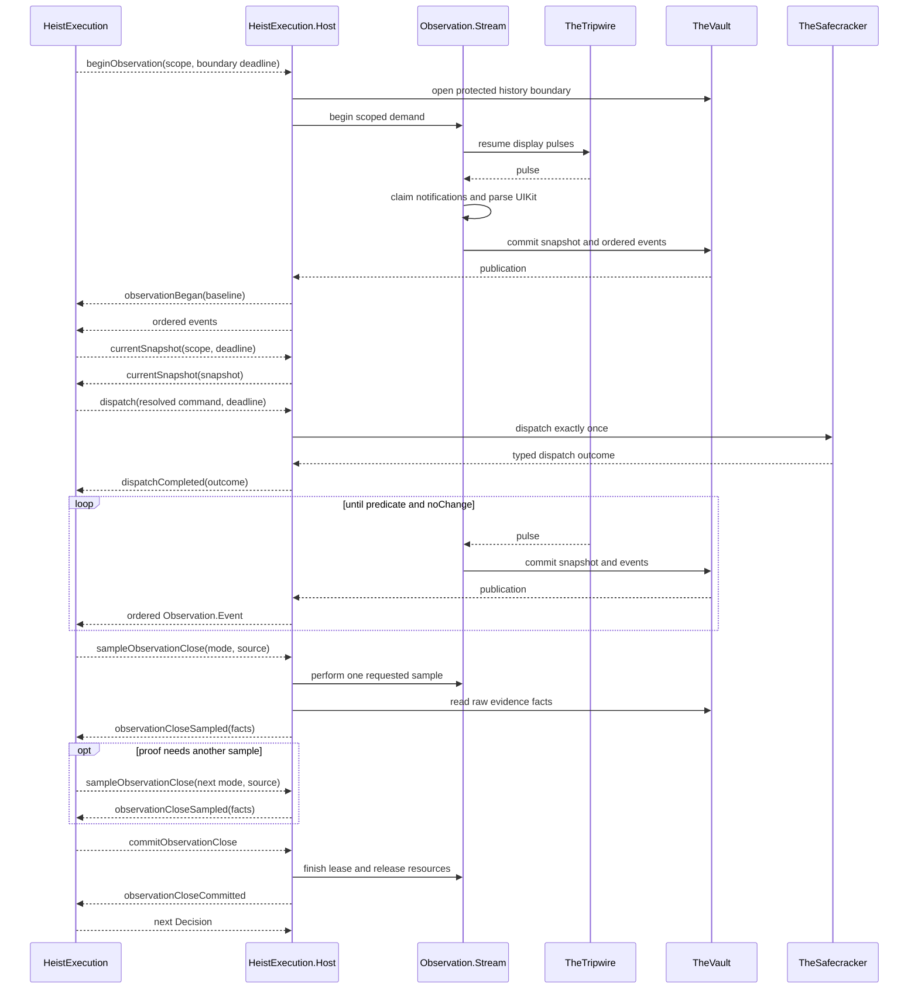

# Action Pipeline

One durable action is a leaf in the complete-heist reducer. The reducer opens
observation before dispatch, evaluates every admitted event in order, and
returns one typed result.

**Illustrates:** [ARCHITECTURE.md](../ARCHITECTURE.md), [API.md](../API.md),
[WIRE-PROTOCOL.md](../WIRE-PROTOCOL.md)

**Source of truth:**
`ButtonHeist/Sources/TheInsideJob/TheBrains/HeistExecution.swift`,
`ButtonHeist/Sources/TheInsideJob/TheBrains/HeistExecution+Leaf.swift`,
`ButtonHeist/Sources/TheInsideJob/TheBrains/HeistExecution+Host.swift`,
`ButtonHeist/Sources/TheInsideJob/TheSafecracker/ActionDispatchResult.swift`,
`ButtonHeist/Sources/TheScore/Reports/ActionResult.swift`

```mermaid
sequenceDiagram
    participant Execution as HeistExecution
    participant Host as HeistExecution.Host
    participant Stream as Observation.Stream
    participant Tripwire as TheTripwire
    participant Vault as TheVault
    participant Safecracker as TheSafecracker

    Execution-->>Host: beginObservation(scope, boundary deadline)
    Host->>Vault: open protected history boundary
    Host->>Stream: begin scoped demand
    Stream->>Tripwire: resume display pulses
    Tripwire-->>Stream: pulse
    Stream->>Stream: claim notifications and parse UIKit
    Stream->>Vault: commit snapshot and ordered events
    Vault-->>Host: publication
    Host-->>Execution: observationBegan(baseline)
    Host-->>Execution: ordered events
    Execution-->>Host: currentSnapshot(scope, deadline)
    Host-->>Execution: currentSnapshot(snapshot)
    Execution-->>Host: dispatch(resolved command, deadline)
    Host->>Safecracker: dispatch exactly once
    Safecracker-->>Host: typed dispatch outcome
    Host-->>Execution: dispatchCompleted(outcome)
    loop until predicate and noChange
        Tripwire-->>Stream: pulse
        Stream->>Vault: commit snapshot and events
        Vault-->>Host: publication
        Host-->>Execution: ordered Observation.Event
    end
    Execution-->>Host: sampleObservationClose(mode, source)
    Host->>Stream: perform one requested sample
    Host->>Vault: read raw evidence facts
    Host-->>Execution: observationCloseSampled(facts)
    opt proof needs another sample
        Execution-->>Host: sampleObservationClose(next mode, source)
        Host-->>Execution: observationCloseSampled(facts)
    end
    Execution-->>Host: commitObservationClose
    Host->>Stream: finish lease and release resources
    Host-->>Execution: observationCloseCommitted
    Execution-->>Host: next Decision
```

The action leaf owns predicate progress but performs no effects. The host owns
dispatch, viewport work, live resources, clock reads, and waits. The reducer
owns deadline and cancellation meaning. The
stream owns pulse-driven capture and notification admission. The Vault owns
current truth and history. Successful steps release history before the next
leaf; their immutable evidence stays in the result. `ActionResult` is projected
once from dispatch truth plus that evidence.
