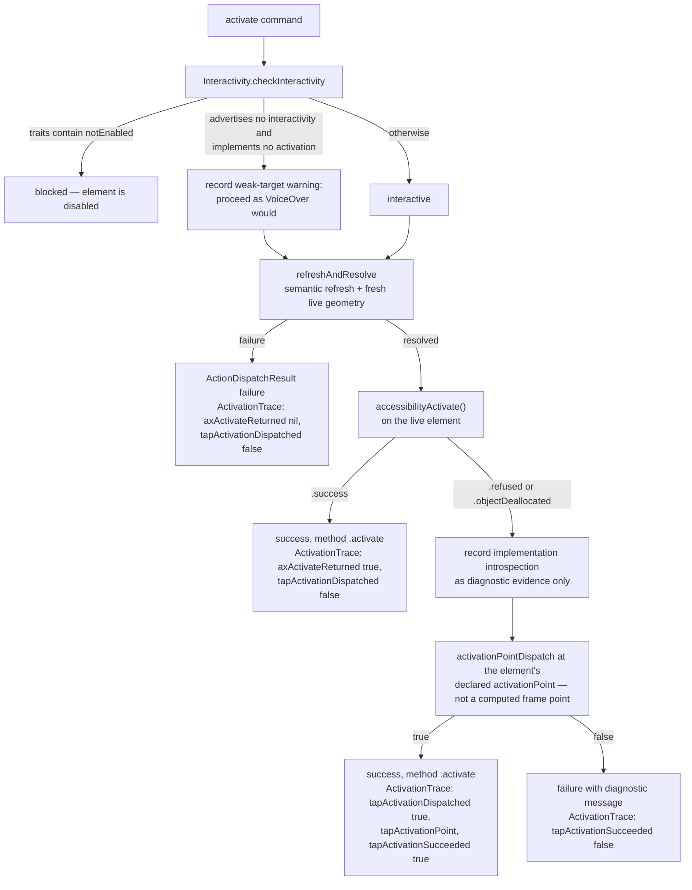

# Activation Policy

The `activate` decision tree in VoiceOver order: refresh semantic resolution and live geometry, ask UIKit to perform the element's primary accessibility activation, and only when UIKit declines deliver a tap at the element's own declared activation point. This diagram answers "which mechanism actually pressed the button, and how do I know?"

**Illustrates:** [ACCESSIBILITY-CONTRACT.md](../ACCESSIBILITY-CONTRACT.md), [API.md](../API.md)
**Source of truth:** `ButtonHeist/Sources/TheInsideJob/TheBrains/ActivationPolicy.swift`, `ButtonHeist/Sources/TheInsideJob/TheBrains/AccessibilityActionDispatcher.swift`, `ButtonHeist/Sources/TheInsideJob/TheVault/Interactivity.swift`, `ButtonHeist/Sources/TheScore/AccessibilityPolicy.swift`

Notes:

- The order is deliberate: `accessibilityActivate()` is what VoiceOver invokes, so it is attempted first against fresh live geometry. The activation-point tap is the same `activate` command delivered through touch injection, not a different command.
- Every enabled target proceeds. `notEnabled` is the single deliberate divergence from VoiceOver: Button Heist treats that advertised accessibility state as an instruction not to dispatch, while VoiceOver permits the double-tap and lets the app ignore it.
- Override/block introspection is diagnostic X-ray evidence, not an accessibility semantic or dispatch gate. After a decline it distinguishes a likely inert target from an implementation whose current state may be conditional.
- A successful activation-point dispatch against a target that advertised no interactivity and implemented no activation carries `activation_weak_affordance_evidence` in the action result so a later expectation failure retains the targeting warning.
- The result records which path ran in `ActivationTrace`: `axActivateReturned` (`true` / `false` / `nil` when the live object deallocated), `implementsAccessibilityActivation` after a decline, `tapActivationDispatched`, `tapActivationPoint`, and `tapActivationSucceeded`.
