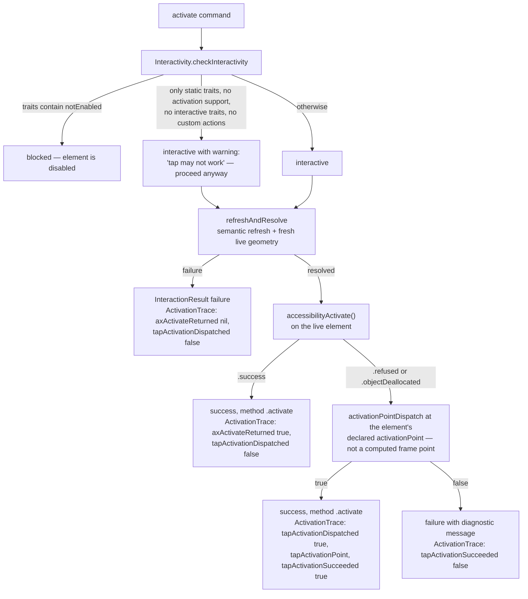

# Activation Policy

The `activate` decision tree in VoiceOver order: refresh semantic resolution and live geometry, ask UIKit to perform the element's primary accessibility activation, and only when UIKit declines deliver a tap at the element's own declared activation point. This diagram answers "which mechanism actually pressed the button, and how do I know?"

**Illustrates:** [ACCESSIBILITY-CONTRACT.md](../ACCESSIBILITY-CONTRACT.md), [API.md](../API.md)
**Source of truth:** `ButtonHeist/Sources/TheInsideJob/TheBrains/ActivationPolicy.swift`, `ButtonHeist/Sources/TheInsideJob/TheBrains/AccessibilityActionDispatcher.swift`, `ButtonHeist/Sources/TheInsideJob/TheStash/Interactivity.swift`, `ButtonHeist/Sources/TheScore/AccessibilityPolicy.swift`

Notes:

- The order is deliberate: `accessibilityActivate()` is what VoiceOver invokes, so it is attempted first against fresh live geometry. The activation-point tap is the same `activate` command delivered mechanically, not a different command.
- The no-activatability-indication path **warns and proceeds** (current behavior — warn, not refuse): `Interactivity.checkInteractivity` attaches the warning to `.interactive` and the caller decides whether to log it. The trait sets consulted (`interactiveTraits`, `staticOnlyTraits`, `activationAffordanceEvidenceTraits`) live in `AccessibilityPolicy`.
- The receipt records which path ran in `ActivationTrace`: `axActivateReturned` (`true` / `false` / `nil` when the live object deallocated), `tapActivationDispatched`, `tapActivationPoint`, and `tapActivationSucceeded`.
